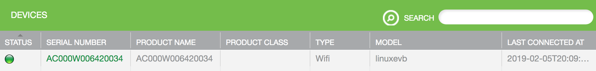
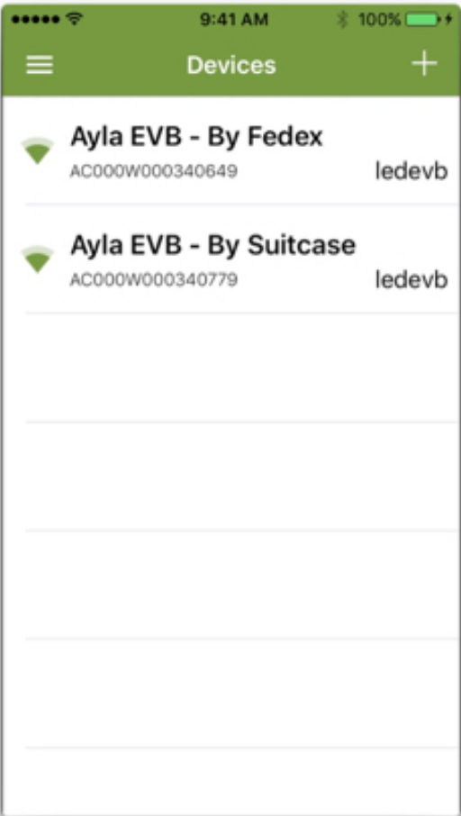
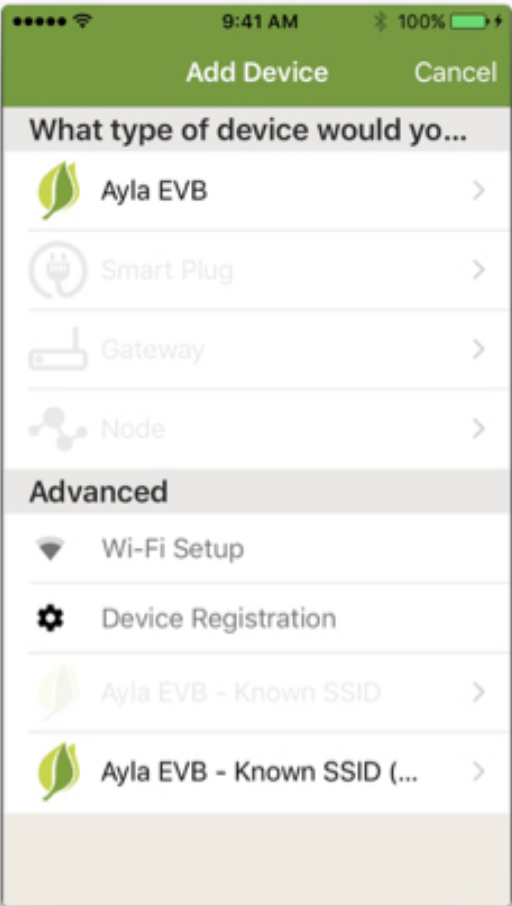
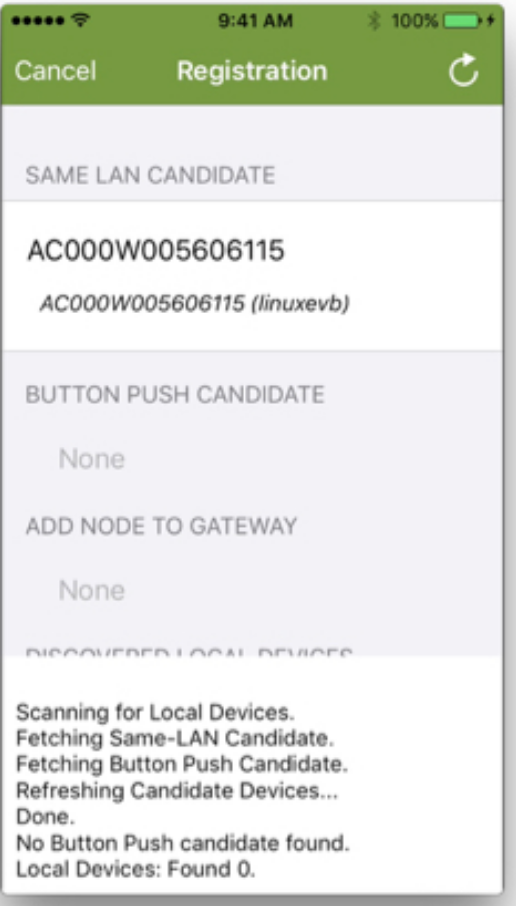
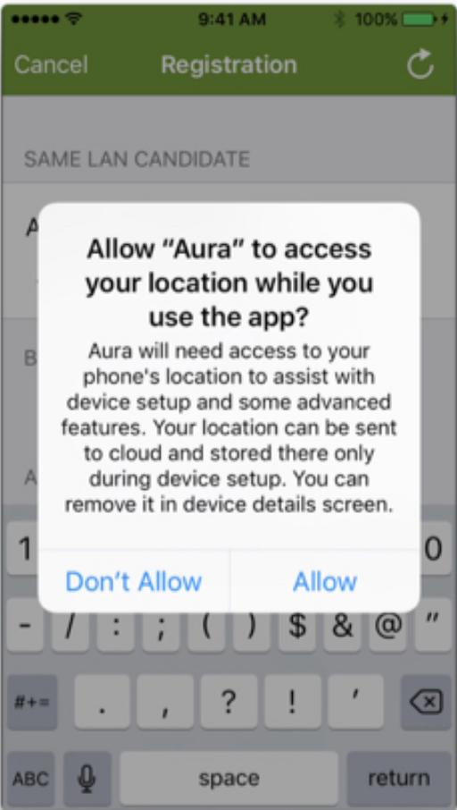
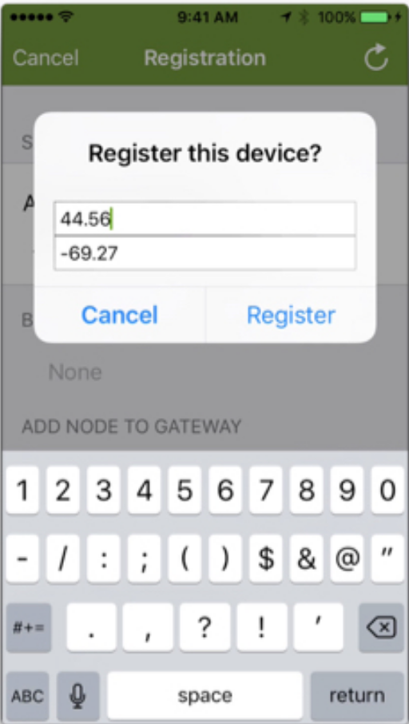
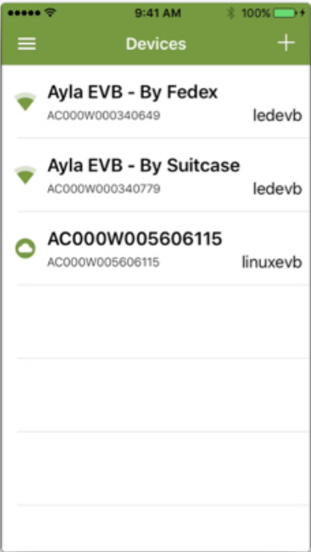

This page provides two sets of instructions for registering your RPi device with the Ayla Cloud. One uses the Ayla Developer Portal, and the other uses the Aura mobile app. Be sure that your computer or mobile app and your Raspberry Pi are on the same local network.

### Reboot your RPi

1. Open a secure connection (ssh) to your Raspberry Pi.
1. Reboot.
<pre>
sudo reboot now
</pre>
1. After a minute or two, reconnect via <code>ssh</code>.
1. Verify that <code>devd</code> and <code>appd</code> are running. You will learn more about these daemons in the [Tutorials](../../tutorials).
<pre>
$ ps -A | grep -w devd
  604 ?        00:00:00 devd
$ ps -A | grep -w appd
  610 ?        00:00:00 appd
</pre>

### Register using the Ayla Developer Portal

1. Browse to the [Ayla Developer Portal](/apps/ayla-developer-portal/), log in, and click Register New Device. The Device Registration page appears:

1. Click the <code>Ayla Module Web Server Registration Page</code> link. A second tab opens with a device registration code (e.g. e224a1).
1. Copy & paste the code into the <code>Registration Code</code> textbox, and click Register.
1. View your newly registered device on the Devices list:

### Register using the Aura mobile app

<ol>
<li>From Aura, log into your Ayla account.</li>
<li>Click the Plus Sign > Device Registration > Same LAN Candidate > Allow > Register:

</li>
<li>Return to the Aura Devices page to see your RPi device on the list.</li>
</ol>