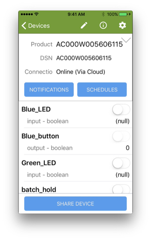
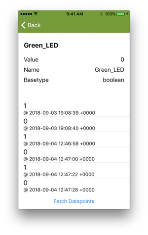
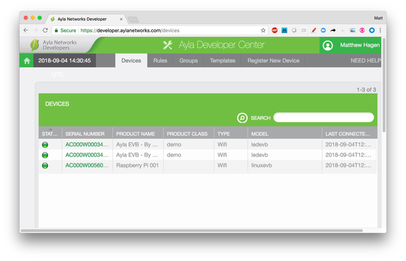
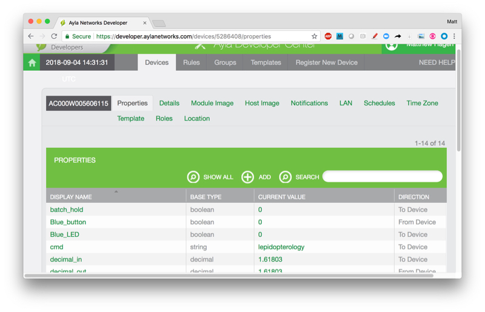
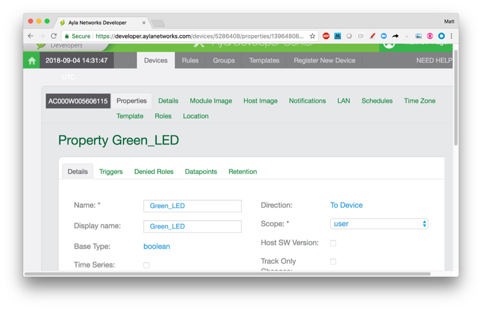
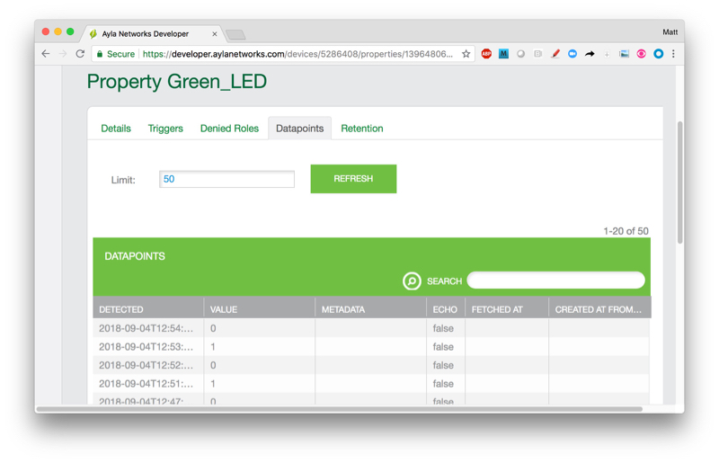

This page provides instructions for registering your RPi device with the Ayla Cloud, and for viewing device properties.

# Register your RPi device

When you register your device with the Ayla Cloud, you pair it with a digital twin that maintains the current value of each device property. To learn more about the various ways to register a device, see [Glossary: Device Registration](/glossary/device-registration).

### Register the RPi device (Aura on iPhone)

<ol>
<li>Download the Aura mobile app onto your mobile device, and run it.</li>

<li>From Aura, log into your Ayla account.</li>

<li>Click + > Device Registration > Same LAN Candidate > Allow > Register:

</li>

<li>Return to the Aura Devices page to see your RPi device on the list.</li>
</ol>

# View your RPi device properties

The host application (appd) running on your RPi defines several properties: Blue_LED, Green_LED, Blue_button, input, output, etc. Although, at present, none of these properties are associated with anything in the real world, still each one has a name, data type, and value, and each one is represented in the Ayla Cloud digital twin. You can view these properties in several ways.

### View your RPi device properties (Aura on iPhone)

To view your RPi properties with Aura on your iPhone, navigate to the Devices page, click your device name, and scroll. You can click any property to see property details. Fetch Datapoints retrieves the value history for the property.

</li>

### View your RPi device properties (Developer Portal)

<ol>
<li>Browse to the <a href="https://developer.aylanetworks.com/">Developer Portal</a>.

</li>
<li>Click View My Devices. A Devices list appears.

</li>
<li>Click your RPi device. A properties list appears.

</li>
<li>Scroll, and click a property. A property Details page appears (bottom horizontal menu).

</li>
<li>Click Datapoints. The property value history appears. 

</li>
</ol>

