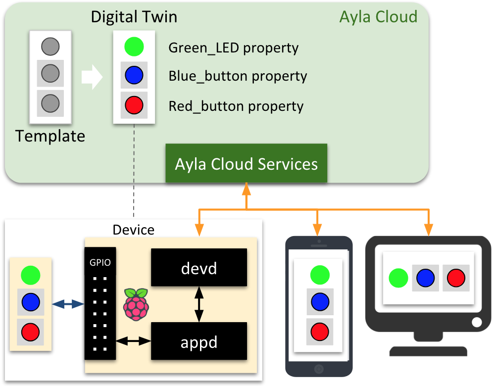
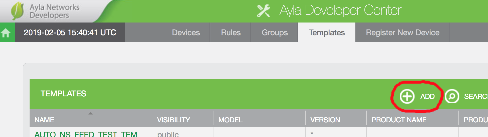
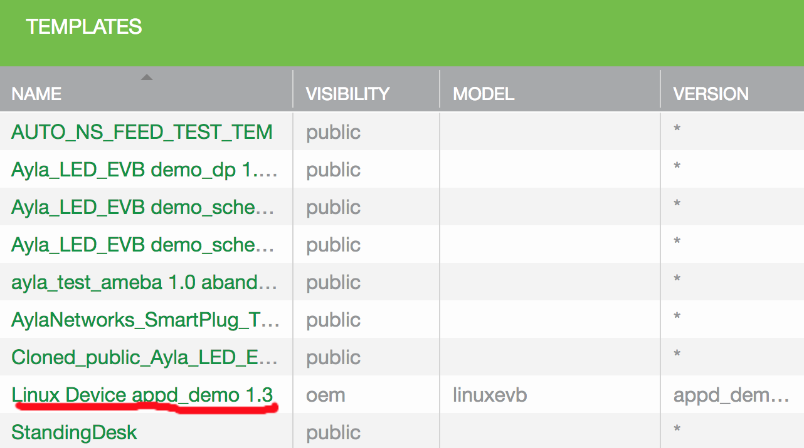

After exploring the concept of Ayla Templates, this page shows you how to create a template in the Ayla Cloud. 

## Templates

Recall this diagram from the [Introduction](../introduction):

Ayla represents physical devices as digital twins in the cloud. Mobile apps and web-based portals interact with digital twins to query and control associated physical devices. A digital twin is a set of properties that represent characteristics or actions of the associated physical device. 

### Where to define properties

Properties are defined in two places:

1. The host application running on the device. The default host application ([appd](https://github.com/AylaNetworks/device_linux_public/tree/master/app/appd)) for the Ayla Device Platform for Linux defines the following properties in a struct called <code>appd_prop_table</code> in [appd.c](https://github.com/AylaNetworks/device_linux_public/blob/master/app/appd/appd.c):
<table>
<tr><th>name</th><th>type</th><th>set</th><th>send</th></tr>
<tr><td>version</td><td>PROP_STRING</td><td>&nbsp;</td><td>appd_send_version</td></tr>
<tr><td>Green_LED</td><td>PROP_BOOLEAN</td><td>appd_led_set</td><td>prop_arg_send</td></tr>
<tr><td>Blue_LED</td><td>PROP_BOOLEAN</td><td>appd_led_set</td><td>prop_arg_send</td></tr>
<tr><td>Blue_button</td><td>PROP_BOOLEAN</td><td>&nbsp;</td><td>prop_arg_send</td></tr>
<tr><td>input</td><td>PROP_INTEGER</td><td>appd_input_set</td><td>prop_arg_send</td></tr>
<tr><td>output</td><td>PROP_INTEGER</td><td>&nbsp;</td><td>prop_arg_send</td></tr>
<tr><td>decimal_in</td><td>PROP_DECIMAL</td><td>appd_decimal_in_set</td><td>prop_arg_send</td></tr>
<tr><td>decimal_out</td><td>PROP_DECIMAL</td><td>&nbsp;</td><td>prop_arg_send</td></tr>
<tr><td>cmd</td><td>PROP_STRING</td><td>appd_cmd_set</td><td>prop_arg_send</td></tr>
<tr><td>log</td><td>PROP_STRING</td><td>&nbsp;</td><td>prop_arg_send</td></tr>
<tr><td>file_down</td><td>PROP_FILE</td><td>prop_arg_set</td><td>&nbsp;</td></tr>
<tr><td>file_up</td><td>PROP_FILE</td><td>&nbsp;</td><td>prop_arg_send</td></tr>
<tr><td>file_up_test</td><td>PROP_BOOLEAN</td><td>appd_file_up_test_set</td><td>prop_arg_send</td></tr>
<tr><td>batch_hold</td><td>PROP_BOOLEAN</td><td>appd_batch_hold_set</td><td>prop_arg_send</td></tr>
</table>
1. The digital twin in the Ayla Cloud. The corresponding digital twin will need to define these properties, too. See "Defining a template" below.

### How to define digital-twin properties

There are two ways to specify properties for a digital twin: 

1. Use the Ayla Developer Portal to manually create properties for an existing digital twin.

1. Use the Ayla Developer Portal to manually create a template (with properties), and tell the Ayla Cloud to use the template when instantiating the digital twin. Templates are like object-oriented classes. The cloud uses templates to instantiate digital twins. Each OEM account maintains a list of custom templates.

### Instantiating a digital twin

A device that wants to be represented as a digital twin in the Ayla Cloud sends to the cloud several pieces of data including the following:

* Region
* OEM ID
* OEM Secret
* OEM Model
* Template Version
* Device Serial Number (DSN)
* Device Mac Address

The Ayla Cloud uses this data and the following logic to verify rights and to create a digital twin in the specified OEM account:

1. It uses Region to determine the target region (US Dev, US Field, EU Field, CN Dev, CN Field).
1. It uses OEM ID to determine if the specified OEM account exists in the target region.
1. It uses OEM Secret to determine if the device has the right to access the OEM account.
1. It uses OEM Model and Template Version to find the appropriate template for the device. See [appd_template_version](https://github.com/AylaNetworks/device_linux_public/blob/master/app/appd/appd.c). 
1. It uses the template to instantiate a digital twin.
1. It uses DSN and Device Mac Address as unique identifiers for the device - digital twin association.

If the Ayla Cloud cannot find the specified template, then it uses the first template it finds with the OEM Model value. Failing this, it chooses a default template with one property: oem_host_version. Admins and developers can manually add properties to digital twins.

## Defining a template

1. Browse to the [Ayla Developer Portal](https://docs.aylanetworks.com/apps/ayla-developer-portal/), and log in.
1. Click Design a Device:

1. Click Add:

1. Enter the following details, and click Ok. For <code>Version</code>, see [appd_template_version](https://github.com/AylaNetworks/device_linux_public/blob/master/app/appd/appd.c).
<table>
<tr><th>Field</th><th>Value</th></tr>
<tr><td>Visibility</td><td>oem</td></tr>
<tr><td>Name</td><td>Ayla Linux Device</td></tr>
<tr><td>Description</td><td>For default host application</td></tr>
<tr><td>Registration Type</td><td>Same-LAN</td></tr>
<tr><td>Model</td><td>linuxevb</td></tr>
<tr><td>Version</td><td>appd_demo 1.3</td></tr>
<tr><td>Type</td><td>Wifi</td></tr>
</table>
1. Click on the template name in the list:

1. Click the Properties tab, and then click Add:

1. Add the following properties:
<table>
<tr><th>Name</th><th>Display Name</th><th>Type</th><th>Direction</th><th>Scope</th></tr>
<tr><td>version</td><td>Version</td><td>String</td><td>From Device</td><td>user</td></tr>
<tr><td>Green_LED</td><td>Green LED</td><td>Boolean</td><td>To Device</td><td>user</td></tr>
<tr><td>Blue_LED</td><td>Blue LED</td><td>Boolean</td><td>To Device</td><td>user</td></tr>
<tr><td>Blue_button</td><td>Blue Button</td><td>Boolean</td><td>From Device</td><td>user</td></tr>
<tr><td>input</td><td>Input</td><td>Integer</td><td>To Device</td><td>user</td></tr>
<tr><td>output</td><td>Output</td><td>Integer</td><td>From Device</td><td>user</td></tr>
<tr><td>decimal_in</td><td>Decimal In</td><td>Decimal</td><td>To Device</td><td>user</td></tr>
<tr><td>decimal_out</td><td>Decimal Out</td><td>Decimal</td><td>From Device</td><td>user</td></tr>
<tr><td>cmd</td><td>Command</td><td>String</td><td>To Device</td><td>user</td></tr>
<tr><td>log</td><td>Log</td><td>String</td><td>From Device</td><td>user</td></tr>
<tr><td>file_down</td><td>File Down</td><td>File</td><td>To Device</td><td>user</td></tr>
<tr><td>file_up</td><td>File Up</td><td>File</td><td>From Device</td><td>user</td></tr>
<tr><td>file_up_test</td><td>File Up Test</td><td>Boolean</td><td>To Device</td><td>user</td></tr>
<tr><td>batch_hold</td><td>Batch Hold</td><td>Boolean</td><td>To Device</td><td>user</td></tr>
</table>
Here is the completed list of properties:

1. To delete a property, click on the appropriate row in the <code>Base Type</code>, <code>Direction</code>, or <code>Scope</code> column, and then click <code>Delete</code>:
