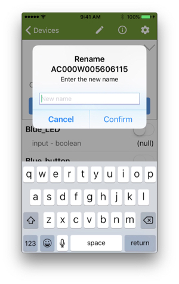
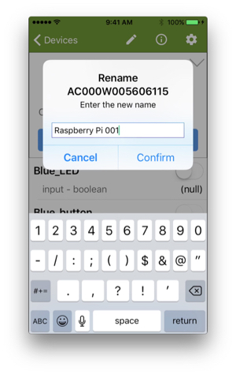
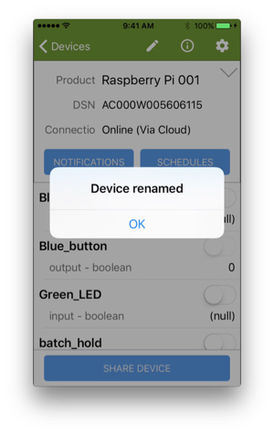
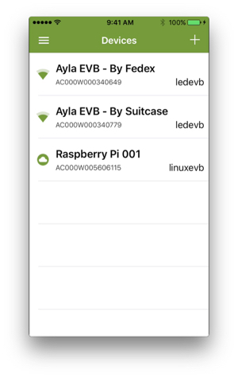

This page provides instructions for customizing and testing your RPi device using the Aura mobile app. You can perform the same customizations and tests using the Developer Portal.

# Change the Product Name (iPhone)

<ol>
<li>In Aura, click your RPi Device. Then, click the Pencil icon, type a new name, and click Confirm.

</li>

<li>Return to the Aura Devices page to see the new name.</li>
</ol>

# Test Boolean Properties

The example customer application (appd) has three boolean properties: Blue_LED, Green_LED, and Blue_button. Blue_LED and Green_LED are treated as input properties while Blue_button is an output property. Values for Blue_LED and Green_LED can be modified in ADS. To exercise the path of a boolean property datapoint sent from the application, Blue_button property is sent to ADS when appd receives an update to Green_LED or Blue_LED. Blue_button is set to true if Green_LED and Blue_LED are both true, otherwise set to false.

<!--

This page describes appd default properties.

# Boolean Properties

# Integer Properties

Integer properties input and output operations are: when service sets property input to a value, demo receives the new value and sets output property to square of that value – then sends output property to service. If value overflows a 32-bit number, output is set to -1.

# String Properties

Similar to integer properties above, string properties cmd and log work together. When service sets cmd to a value, it is copied to log property then sends to the service.

# Decimal Properties

Service sets a pair of decimal properties, decimal_in and decimal_out. When the service sets decimal_in to a value, the demo appd sets decimal_out property to same value – then sends it back to the service.

# File Properties

File properties file_up and file_down demonstrates file properties. File properties can be of any size. Useful for large data blobs (log files, images, etc.). file_up uploads a file datapoint to the service. Argument in file_up prop structure is the file location in the system. To initiate an upload, this demo uses file_up_test. When set to 1, upload is initiated by prop_file_send.

<h1>version</h1>

The version property sends the current appd software version to ADS. The demo application template has the “Host SW Verison” option selected for this property and is used by the Ayla Service to track the software version, and monitor Host OTA update progress.

# batch_hold

To demo the batch mode feature, a demo property batch_hold is used. When set to 1, all property updates from device are added to a batch. When set to 0, accumulated batch is sent.
-->