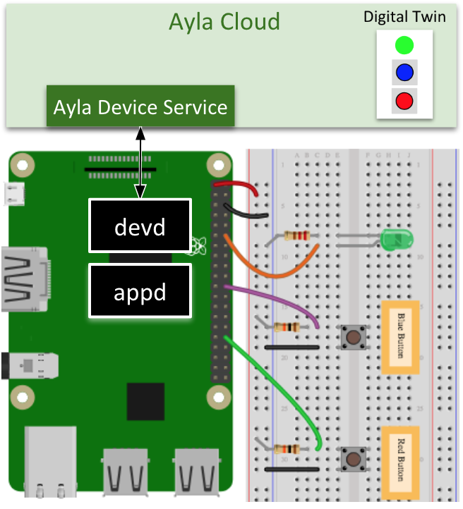

The Ayla Linux Agent (devd) securely connects a Linux-based host application (appd) to the Ayla Cloud. Both can run as daemons:

In the diagram, <code>appd</code> is the sample host application (supplied by Ayla) running on Raspian. Programmers can modify <code>appd</code> to control peripherals represented by the LED and buttons on the breadboard. They can also create, in the Ayla Cloud, a digital twin representing the LED and the buttons as properties. Then, by interfacing with <code>devd</code> via sockets, <code>appd</code> keeps the digital twin and the peripherals in sync, sending and receiving property updates. The Ayla Linux Agent is part of the [Ayla Device Platform for Linux](https://github.com/AylaNetworks/device_linux_public). 

Click [Guide](guide) to get started connecting a Linux device to the Ayla Cloud.