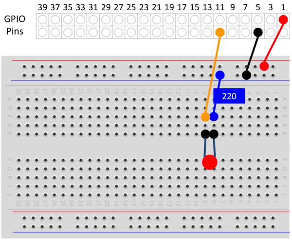

An [Elegoo Super Starter Kit for Arduino](https://www.newegg.com/Product/Product.aspx?Item=9SIABFW5178264&ignorebbr=1) provided the breadboard, jumper wires, LED, and button.

See [Reference: Wiring Pi](/devices/ayla-linux-agent/reference/wiring-pi/).

### blink.c
<pre>
#include &lt;stdio.h&gt;
#include &lt;wiringPi.h&gt;

#define RED_LED 1

int main(void)
{
  printf("Start of blink program\n");
  wiringPiSetup();
  pinMode(RED_LED, OUTPUT);
  for(;;)
  {
    digitalWrite(RED_LED, HIGH);
    delay(500);
    printf("High\n");
    digitalWrite(RED_LED,  LOW);
    delay(500);
    printf("Low\n");
  }
  return 0;
}
</pre>