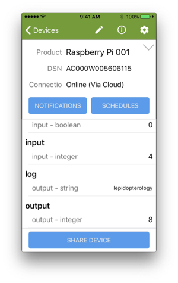

This page shows you how to clone and build the Ayla Device Platform for Linux on your RPi, and then modify and run appd to test your build environment. Subsequent chapters in the Tutorial provide you with a more detailed understanding of appd. 

# Clone and build device_linux_public

<ol>
<li>ssh to your RPi.
<pre>
$ ssh pi@192.168.1.7
</pre>
pwd should be <code>/home/pi</code>.
</li>
<li>Clone [device_linux_public](https://github.com/AylaNetworks/device_linux_public).
<pre>
$ git clone https://github.com/AylaNetworks/device_linux_public.git
</pre>
Github will prompt you for username and password:
<pre>
Cloning into 'device_linux_public'...
Username for 'https://github.com': MattAtAyla
Password for 'https://MattAtAyla@github.com': 
remote: Counting objects: 2282, done.
remote: Total 2282 (delta 0), reused 0 (delta 0), pack-reused 2282
Receiving objects: 100% (2282/2282), 1.84 MiB | 3.34 MiB/s, done.
Resolving deltas: 100% (1509/1509), done.
</pre>
</li>
<li>Build device_linux_public.
<pre>
$ cd device_linux_public/
$ make
</pre>
Output should begin and end like this:
<pre>
make -s -C lib/ayla all
CC ../../ext/hashmap/src/hashmap.c
CC amsg.c
...
...
make -s -C app/appd all
CC appd.c
CC main.c
Linking appd
</pre>
</li>
</ol>

# Modify and run appd

The example host application (appd) is composed of three files (main.c, appd.c, and appd.h) located here:

<pre>
/home/pi/device_linux_public/app/appd
</pre>

To verify that you are able to customize, build, and run your own version of appd, you will modify the behavior of appd slightly, and then stop the current version of the app daemon, run your new version, and verify the new behavior. Recall from [Guide: Tests](/devices/ayla-linux-agent/guide/tests/) that appd includes two integer properties called input and output, and that when you set input to a value, appd sets output to the square of the value.

The appd code for setting output to the square of input resides in appd.c:

<pre>
static int appd_input_set(struct prop *prop, const void *val, size_t len, const struct op_args *args) {
  ...
  output = input * input;
  ...
}
</pre>

Rather than setting output to the square of input, your version of appd will set output to twice input. Here are the steps:

<ol>
<li>Open appd.c for editing:
<pre>
$ nano ~/device_linux_public/app/appd/appd.c
</pre>
</li>
<li>Search for <code>output = input * input;</code>.</li>
<li>Change to <code>output = input + input;</code>, and save the file. Note that you can always find a copy of the original appd files on Github.</li>
<li>Build your new version of appd:
<pre>
$ cd device_linux_public/
$ make
</pre>
Output should look similar to this:
<pre>
make -s -C lib/ayla all
make -s -C lib/platform all
make -s -C lib/app all
make -s -C daemon/devd all
make -s -C daemon/cond all
make -s -C daemon/logd all
make -s -C util/acgi all
make -s -C util/acli all
make -s -C util/devdwatch all
make -s -C util/gw_setup_agent all
make -s -C util/ota all
make -s -C app/appd all
CC appd.c
Linking appd
</pre>
</li>
<li>Stop the devd daemon (which also stops the appd daemon):
<pre>
$ /etc/init.d/devd stop
</pre>
Raspbian will ask for authentication. Note that the devd startup script is in <code>/etc/init.d/devd</code>. You can <code>cat</code> this file to learn more about the options that control devd.
</li>
<li>Make a copy of the original appd:
<pre>
$ sudo cp /home/pi/ayla/bin/appd /home/pi/ayla/bin/appd.original
</pre>
</li>
<li>Copy your new version of appd to the directory where devd expects to find it:
<pre>
$ sudo cp /home/pi/device_linux_public/build/native/obj/app/appd/appd /home/pi/ayla/bin/appd
</pre>
</li>
<li>Start the devd daemon (which also starts the appd daemon):
<pre>
$ /etc/init.d/devd start
</pre>
Raspbian will ask for authentication, again.
</li>
<li>In Aura, set the input property to 4. appd should set the output value to 8:

This new behavior verifies that your version of appd is running.
</li>
</ol>

