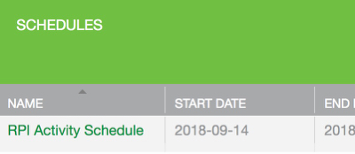

This tutorial shows you how to create a Schedule for your Raspberry Pi device to control the dates, times, durations, and intervals of RPi activity. 

Note the following:

1. Creating a schedule requires <u>no</u> additional coding. Creating a schedule is a user activity.
1. A single schedule can control many actions on the device. For example, a single schedule can turn on/off several LEDs, start up a motor, and turn on/off various sensors. 
1. You create schedules in the Developer Portal. When you save the Schedule, the Ayla Cloud downloads the schedule to the Ayla Linux Agent which is responsible for setting timers, waking up, and executing the scheduled actions.
1. Schedule configurations are saved on the device in <code>~/ayla/config/appd.conf.startup</code>.

### Create a schedule

Here are directions for creating a schedule:

<ol>
<li>Browse to the Developer Portal.</li>
<li>Click View My Devices &gt; Raspberry Pi &gt; Schedules.</li>
<li>Click Add, fill out the form, and click OK. Use this form as a guide:

</li>

The 2-second interval means this schedule will wake up every 2 seconds. The 1-second duration means that actions (as yet unspecified) can take place during a 1 second window.

<li>Click the new schedule:

</li>
<li>Click the Actions tab:

</li>
<li>Create the following two actions:

</li>
<li>Click the Settings tab, and click OK. If devd and appd are running, the Green LED on your RPi should begin to blink on/off every 1 second.</li>
<li>Run appd in debug mode to see on/off messages.</li>
<li>Verify datapoints in Aura, or in the Developer Portal:

</li>
</ol>

### Implement Blue_LED

This optional section shows you how to control both the green and blue LEDs with a single Schedule.

<ol>
<li>Shutdown your RPi</li>
<li>Wire the Blue LED like this:

</li>
<li>Start your RPi</li>
<li>Determine the GPIO pin:
<pre>
$ gpio readall
</pre>
Here is the output:
<pre>
 +-----+-----+---------+------+---+---Pi 3+--+---+------+---------+-----+-----+
 | BCM | wPi |   Name  | Mode | V | Physical | V | Mode | Name    | wPi | BCM |
 +-----+-----+---------+------+---+----++----+---+------+---------+-----+-----+
 |     |     |    3.3v |      |   |  1 || 2  |   |      | 5v      |     |     |
 |   2 |   8 |   SDA.1 |   IN | 1 |  3 || 4  |   |      | 5v      |     |     |
 |   3 |   9 |   SCL.1 |   IN | 1 |  5 || 6  |   |      | 0v      |     |     |
 |   4 |   7 | GPIO. 7 |   IN | 1 |  7 || 8  | 0 | IN   | TxD     | 15  | 14  |
 |     |     |      0v |      |   |  9 || 10 | 1 | IN   | RxD     | 16  | 15  |
 |  17 |   0 | GPIO. 0 |   IN | 0 | 11 || 12 | 1 | OUT  | GPIO. 1 | 1   | 18  |
 |  27 |   2 | GPIO. 2 |   IN | 0 | 13 || 14 |   |      | 0v      |     |     |
 |  22 |   3 | GPIO. 3 |   IN | 0 | 15 || 16 | 0 | IN   | GPIO. 4 | 4   | 23  |
 |     |     |    3.3v |      |   | 17 || 18 | 0 | IN   | GPIO. 5 | 5   | 24  |
 |  10 |  12 |    MOSI |   IN | 0 | 19 || 20 |   |      | 0v      |     |     |
 |   9 |  13 |    MISO |   IN | 0 | 21 || 22 | 1 | IN   | GPIO. 6 | 6   | 25  |
 |  11 |  14 |    SCLK |   IN | 0 | 23 || 24 | 1 | IN   | CE0     | 10  | 8   |
 |     |     |      0v |      |   | 25 || 26 | 1 | IN   | CE1     | 11  | 7   |
 |   0 |  30 |   SDA.0 |   IN | 1 | 27 || 28 | 1 | IN   | SCL.0   | 31  | 1   |
 |   5 |  21 | GPIO.21 |   IN | 1 | 29 || 30 |   |      | 0v      |     |     |
 |   6 |  22 | GPIO.22 |   IN | 1 | 31 || 32 | 1 | IN   | GPIO.26 | 26  | 12  |
 |  13 |  23 | GPIO.23 |   IN | 0 | 33 || 34 |   |      | 0v      |     |     |
 |  19 |  24 | GPIO.24 |   IN | 0 | 35 || 36 | 0 | OUT  | GPIO.27 | 27  | 16  |
 |  26 |  25 | GPIO.25 |   IN | 0 | 37 || 38 | 0 | IN   | GPIO.28 | 28  | 20  |
 |     |     |      0v |      |   | 39 || 40 | 0 | IN   | GPIO.29 | 29  | 21  |
 +-----+-----+---------+------+---+----++----+---+------+---------+-----+-----+
 | BCM | wPi |   Name  | Mode | V | Physical | V | Mode | Name    | wPi | BCM |
 +-----+-----+---------+------+---+---Pi 3+--+---+------+---------+-----+-----+
</pre>
We are using BCM 16 which is wPi 27.
</li>
<li>Test the new Blue LED with <code>blue_led.py</code>:
<pre>
import RPi.GPIO as GPIO
import time
GPIO.setwarnings(False)
GPIO.setmode(GPIO.BCM)
GPIO.setup(16, GPIO.OUT)
while True:
  GPIO.output(16, True)
  time.sleep(1)
  GPIO.output(16, False)
  time.sleep(1)
</pre>
</li>
<li>Implement the blue button in appd, make, and test it with your mobile app.</li>
<li>Add the following two new actions to the RPI Activity Schedule.

</li>
<li>Test the schedule. It should blink like this:

<iframe 
  style="float:left"
  width="560" 
  height="315" 
  src="https://www.youtube.com/embed/FbwP8tM3pgg?rel=0&amp;showinfo=0" 
  frameborder="0" 
  allow="autoplay; 
  encrypted-media" 
  allowfullscreen>
</iframe>

</li>
</ol>

