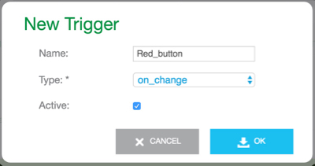
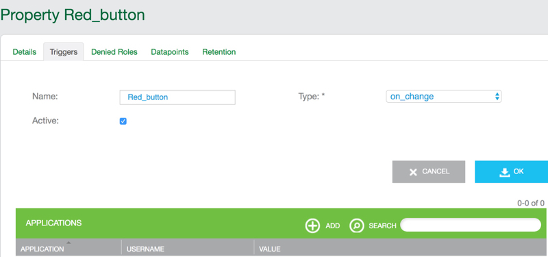
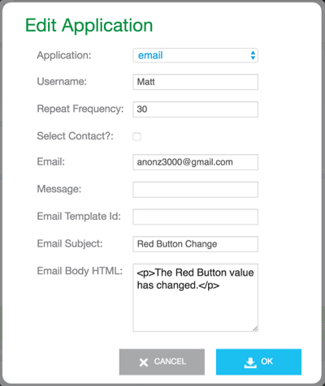

Important: Triggers are deprecated, and will be replaced with the Ayla Rules Engine soon.

This tutorial shows you how to add a trigger to the Red_button property. A trigger is a response (initiated in the Ayla Cloud) to the change in a property value. Adding a trigger requires no coding.

Here are the steps:

<ol>
<li>Browse to the Developer Portal.</li>
<li>Click View My Devices &gt; Raspberry Pi &gt; Red_button &gt; Triggers.</li>
<li>Click Add, fill out the form, and click OK. Use this form as a guide:

</li>
<li>Click Add to add an application to the trigger:

</li>
<li>Add an email application:

</li>
<li>With appd running (optionally in debug mode), click the Red Button on your breadboard. 
<pre>
2018-09-16T09:39:19.978 [DBG] appd::prop_val_send()  Red_button
2018-09-16T09:39:19.979 [DBG] appd::data_send_json()  {"cmd":{"proto":"data","id":8,"op":"prop_send","opts":{"confirm":true},"args":[{"property":{"name":"Red_button","base_type":"boolean","value":1,"metadata":{"buttonSize":"small","buttonDistributer":"Elego"},"dev_time_ms":1537090759979}}]}}
2018-09-16T09:39:19.981 [DBG] appd::data_recv()  {"cmd":{"proto":"data","id":8,"op":"ack"}}
2018-09-16T09:39:19.981 [DBG] appd::data_cmd_parse()  {"proto":"data","id":8,"op":"ack"}, protocol data
2018-09-16T09:39:19.981 [DBG] appd::data_recv_data()  {"proto":"data","id":8,"op":"ack"}, recv_request_id 8
2018-09-16T09:39:20.639 [DBG] appd::data_recv()  {"cmd":{"proto":"data","id":8,"op":"confirm_true"}}
2018-09-16T09:39:33.256 [DBG] appd::prop_val_send()  Red_button
2018-09-16T09:39:33.257 [DBG] appd::data_send_json()  {"cmd":{"proto":"data","id":9,"op":"prop_send","opts":{"confirm":true},"args":[{"property":{"name":"Red_button","base_type":"boolean","value":0,"metadata":{"buttonSize":"small","buttonDistributer":"Elego"},"dev_time_ms":1537090773256}}]}}
2018-09-16T09:39:33.259 [DBG] appd::data_recv()  {"cmd":{"proto":"data","id":9,"op":"ack"}}
2018-09-16T09:39:33.259 [DBG] appd::data_cmd_parse()  {"proto":"data","id":9,"op":"ack"}, protocol data
2018-09-16T09:39:33.259 [DBG] appd::data_recv_data()  {"proto":"data","id":9,"op":"ack"}, recv_request_id 9
2018-09-16T09:39:33.663 [DBG] appd::data_recv()  {"cmd":{"proto":"data","id":9,"op":"confirm_true"}}
</pre>
</li>
<li>Check your email:

</li>
</ol>
