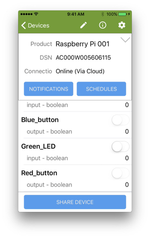

This tutorial shows you how to control a red button with your version of the host application using a new property called Red_button which you will add to the Host Application and to the digital twin in the Ayla Cloud.

# Wire and test the Red Button

### Wire the Red Button

<ol>
<li>Shutdown your RPi.</li>
<li>Wire the GPIO pins on your RPi to a breadboard, adding another button and another 10K Ω resister as seen in the diagram below. Whether or not the button is red, we will refer to it as the red button.

</li>
<li>Restart your RPi.</li>
</ol>

### Test with red_button_isr.c

<ol>
<li>Create <code>~/ayla_tests/red_button_isr.c</code> with the following code:
<pre>
#include <stdio.h>
#include <wiringPi.h>
#define GREEN_LED 1
#define RED_BUTTON 26

void isr(void) {
  if(digitalRead(RED_BUTTON) == LOW) {
    digitalWrite(GREEN_LED, HIGH);
  } else {
    digitalWrite(GREEN_LED, LOW);
  }
}

int main (void) {
  printf("Start of program\n");
  wiringPiSetup();
  pinMode(GREEN_LED, OUTPUT);
  pinMode(RED_BUTTON, INPUT);
  wiringPiISR(RED_BUTTON, INT_EDGE_BOTH, &isr);

  for(;;) {
    delay(1000);
    printf("Awake\n");
  }
  return 0 ;
}
</pre>
Use <code>gpio readall</code> to show the schemes for specifying a GPIO pin. We are using the wPi scheme where wPi 26 == BCM 12.
</li>
<li>Build the program:
<pre>
$ gcc -Wall -o red_button_isr red_button_isr.c -lwiringPi
</pre>
</li>
<li>Run the program to verify that the button can control the LED.
<pre>
./red_button_isr
</pre>
</li>
<li>Press Ctrl-C to stop the program.</li>
</ol>

# Modify appd to control the LED

### Modify main.c

<ol>
<li>Open <code>~/device_linux_public/app/appd/main.c</code> for editing.</li>
<li>Scroll to the main function, and add the following:</code>:
<pre>
pinMode(RED_BUTTON, INPUT);
wiringPiISR(RED_BUTTON, INT_EDGE_BOTH, &red_button_isr);
</pre>
</li>
<li>Save the file.</li>
</ol>

### Modify appd.h

<ol>
<li>Open <code>~/device_linux_public/app/appd/appd.h</code> for editing.</li>
<li>Add the following:</code>:
<pre>
#define RED_BUTTON 26
void red_button_isr(void);
</pre>
</li>
<li>Save the file.</li>
</ol>

### Modify appd.c

<ol>
<li>Open <code>~/device_linux_public/app/appd/appd.c</code> for editing.</li>
<li>Add the following variable:
<pre>
static u8 red_button;
</pre>
</li>
<li>Scroll to <code>appd_prop_table</code>, and add the following prop struct after the Blue_button entry:
<pre>
{
  .name = "Red_button",
  .type = PROP_BOOLEAN,
  .send = prop_arg_send,
  .arg = &red_button,
  .len = sizeof(red_button),
  .ads_failure_cb = appd_prop_ads_failure_cb,
},
</pre>
</li>
<li>Add the following function:
<pre>
void red_button_isr(void) {
  if(digitalRead(RED_BUTTON) == LOW) {red_button = 1;}
  else {red_button = 0;}
  prop_send_by_name("Red_button");
}
</pre>
</li>
<li>Save the file.</li>
</ol>

### Make and run appd

Make and run the host app, but don't push the button yet.

### Test appd (causing an error)

<ol>
<li>tail <code>syslog</code>:
<pre>
$ tail -f /var/log/syslog
</pre>
You should see output similar to this:
<pre>
Sep  6 06:13:55 rpi devd: [debug-client] http_client_send: [app]  Connected to linuxevb-0dfc7900-device.aylane...
Sep  6 06:13:55 rpi devd: [debug-client] http_client_send: [app]  We are completely uploaded and fine
Sep  6 06:13:55 rpi devd: [debug-client] ds_client_parse_auth_token: received Ayla auth token: 36 bytes
Sep  6 06:13:55 rpi devd: [debug-client] http_client_send: [app]  Curl_http_done: called premature == 0
Sep  6 06:13:55 rpi devd: [debug-client] http_client_send: [app]  Connection #1 to host linuxevb-0dfc7900-device...
Sep  6 06:13:55 rpi devd: [debug-client] ds_client_send_done: POST complete, HTTP status 200, time 173ms, ...
Sep  6 06:13:55 rpi devd: [debug-client] ds_client_send_done: uploaded 121B @ 697B/s, downloaded 110B @ 633B/s
Sep  6 06:13:55 rpi devd: [debug-io] app_send_json: {"cmd":{"proto":"data","id":7,"op":"confirm_true"}}
Sep  6 06:13:55 rpi appd: [debug-app] data_recv: {"cmd":{"proto":"data","id":7,"op":"confirm_true"}}
Sep  6 06:13:55 rpi appd: [info-app] appd_prop_confirm_cb: output = 8 send at 1536232435003 to dests 1 succeeded
</pre>
</li>
<li>Click the red button, and view the new output in syslog. The most important line is the following which indicates that the corresponding digital twin in the Ayla Cloud does not know about the new Red_button property.
<pre>
Sep  6 06:17:19 rpi appd: [debug-app] data_recv: {"cmd":{"proto":"data","id":9,"op":"nak","args":[{"err":"unknown_prop","name":"Red_button","dests":1,"op":"prop_send"}]}}
</pre>
</li>
</ol>

### Create the Red_button property in the cloud

<ol>
<li>Browse to the Developer Portal > View My Devices > Raspberry Pi</li>
<li>Click Add, define the new Red_property, and click Save:

</li>
<li>Click the Red Button on the breadboard. The new cloud-based property should reflect the button state.</li>
<li>To see the Red_button property on your iPhone, navigate to the Devices page, tap the gear in the top-right corner, tap Fetch All Properties, click Cancel, and scroll to find the property.

</li>
<li>Tap the Red_button property to see the Red LED illuminate.</li>
</ol>