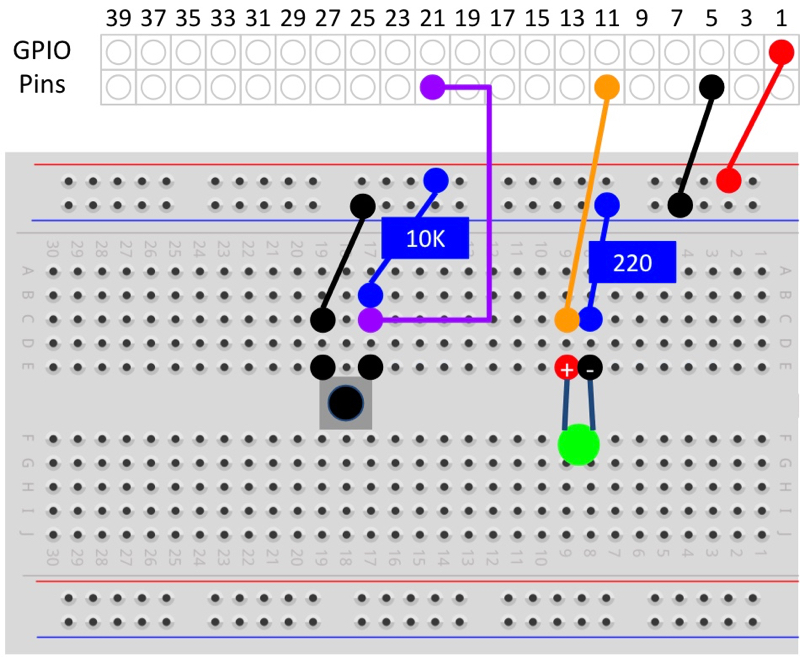

An [Elegoo Super Starter Kit for Arduino](https://www.newegg.com/Product/Product.aspx?Item=9SIABFW5178264&ignorebbr=1) provided the breadboard, jumper wires, LED, and button.

See [Reference: Wiring Pi](/devices/ayla-linux-agent/reference/wiring-pi/).

### button_poll_blink.c
<pre>
#include &lt;stdio.h&gt;
#include &lt;wiringPi.h&gt;

#define RED_LED 1
#define BUTTON 6

int main(void)
{
  printf("Start of button_poll_blink program\n");
  wiringPiSetup();
  pinMode(RED_LED, OUTPUT);
  pinMode(BUTTON, INPUT);
  for(;;)
  {
    if(digitalRead(BUTTON) == LOW)
      digitalWrite(RED_LED, HIGH);
    else
      digitalWrite(RED_LED,  LOW);
  }
  return 0;
}
</pre>

### button_isr_blink.c
<pre>
#include &lt;stdio.h&gt;
#include &lt;wiringPi.h&gt;

#define RED_LED 1
#define BUTTON 6

void isr(void) {
  if(digitalRead(BUTTON) == LOW) {
    digitalWrite(RED_LED, HIGH);
  } else {
    digitalWrite(RED_LED, LOW);
  }
}

int main(void)
{
  printf("Start of button_isr_blink program\n");
  wiringPiSetup();
  pinMode(RED_LED, OUTPUT);
  pinMode(BUTTON, INPUT);
  wiringPiISR(BUTTON, INT_EDGE_BOTH, &isr);
  for(;;)
  {
    delay(1000);
    printf("Awake\n");
  }
  return 0;
}
</pre>
