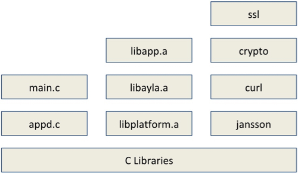

UNDER CONSTRUCTION ON 9/10/2018.

This tutorial helps you explore Host Application (appd) source code, and the application's use of Ayla Linux Agent APIs.

### Host Application Structure

In essence, the host application (appd) is composed of two files and three libraries:

<pre>
~/device_linux_public/app/appd/main.c
~/device_linux_public/app/appd/appd.c
~/device_linux_public/build/native/obj/lib/app/libapp.a
~/device_linux_public/build/native/obj/lib/ayla/libayla.a
~/device_linux_public/build/native/obj/lib/platform/libplatform.a
</pre>

These libraries make up the [Ayla Linux Agent API](/devices/ayla-linux-agent/reference/ayla-linux-agent-api). The most important library is libapp.a, and the most important parts of this library are app.h, which controls the interaction between appd and devd, and props.h, which controls the movement of properties between appd, devd, and the Ayla Cloud. 

main.c implements the main function:
<pre>
int main(int argc, char **argv)
{
  ...
  app_init(cmdname, appd_version, appd_init, appd_start);
  ...
  return app_run(foreground);
}
</pre>

appd.c implements an array of prop structures:
<pre>
sss
</pre>

### Host Application source files and libraries

To determine the source files and libraries that compose appd, open <code>~/device_linux_public/app/appd/Makefile</code>:
<pre>
#
# List of source files to build
#
SOURCES = \
        appd.c \
        main.c \
        $(NULL)

#
# List of libraries to link
#
LIBS = ssl crypto curl jansson

#
# List of dependencies on Ayla libraries 
#
LIBDEPS = $(LIB_PLATFORM) $(LIB_AYLA) $(LIB_APP)
</pre>

Here is the same information in a diagram:

The pertinent source files and libraries reside in these locations:

<pre>
~/device_linux_public/app/appd/main.c
~/device_linux_public/app/appd/appd.c
~/device_linux_public/build/native/obj/lib/app/libapp.a
~/device_linux_public/build/native/obj/lib/ayla/libayla.a
~/device_linux_public/build/native/obj/lib/platform/libplatform.a
</pre>

These three libraries - libapp, libayla, and libplatform - compose the [Ayla Linux Agent API](/devices/ayla-linux-agent/reference/ayla-linux-agent-api). 

To verify that you are able to customize, build, and run your own version of appd, you will modify the behavior of appd slightly, and then stop the current version of the app daemon, run your new version, and verify the new behavior. Recall from [Guide: Tests](/devices/ayla-linux-agent/guide/tests/) that appd includes two integer properties called input and output, and that when you set input to a value, appd sets output to the square of the value.

The code for setting output to input2 resides in <code>~/device_linux_public/app/appd/appd.c</code>:

<pre>
static int appd_input_set(struct prop *prop, const void *val, size_t len, const struct op_args *args) {
  ...
  output = input * input;
  ...
}
</pre>

Rather than setting output to input2, your version of appd will set output to input + input. Here are the steps:

<ol>
<li>Open appd.c for editing:
<pre>
$ nano ~/device_linux_public/app/appd/appd.c
</pre>
</li>
<li>Search for <code>output = input * input;</code>.</li>
<li>Change to <code>output = input + input;</code>, and save the file. Note that you can always find a copy of the original appd files on Github.</li>
<li>Build your new version of appd:
<pre>
$ cd device_linux_public/
$ make
</pre>
Output should look similar to this:
<pre>
make -s -C lib/ayla all
make -s -C lib/platform all
make -s -C lib/app all
make -s -C daemon/devd all
make -s -C daemon/cond all
make -s -C daemon/logd all
make -s -C util/acgi all
make -s -C util/acli all
make -s -C util/devdwatch all
make -s -C util/gw_setup_agent all
make -s -C util/ota all
make -s -C app/appd all
CC appd.c
Linking appd
</pre>
<li>Make and run the host app.</li>
<li>In Aura, set the input property to 4. appd should set the output value to 8:

This new behavior verifies that your version of appd is running.
</li>
</ol>
