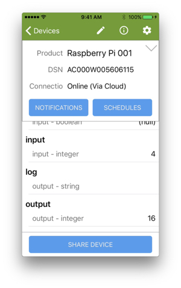

This tutorial helps you explore Host Application (appd) source code, and the application's use of the [Ayla Linux Agent API](/devices/ayla-linux-agent/reference/ayla-linux-agent-api).

## Host Application Structure

In essence, the host application (appd) is composed of two files and three libraries:

<pre>
~/device_linux_public/app/appd/main.c
~/device_linux_public/app/appd/appd.c
~/device_linux_public/build/native/obj/lib/app/libapp.a
~/device_linux_public/build/native/obj/lib/ayla/libayla.a
~/device_linux_public/build/native/obj/lib/platform/libplatform.a
</pre>

### main.c

main.c implements the main function which is, for the most part, boilerplate code. The function parses command-line options, calls several functions in libapp.a (app.h) to set up callbacks for various events, and then calls app_run which is the main program loop:

<pre>
int main(int argc, char **argv)
{
  parse_opts(argc, argv);

  app_init(cmdname, appd_version, appd_init, appd_start);
  app_set_debug(debug);
  app_set_exit_func(appd_exit);
  app_set_factory_reset_func(appd_factory_reset);
  app_set_conn_event_func(appd_connectivity_event);
  app_set_registration_event_func(appd_registration_event);
  if (app_set_conf_file(conf_factory_file, conf_startup_dir) < 0) {
    exit(EXIT_FAILURE);
  }
  if (socket_dir) {
    if (app_set_socket_directory(socket_dir) < 0) {
      exit(EXIT_FAILURE);
    }
  }

  signal(SIGINT, signal_handler);
  signal(SIGTERM, signal_handler);

  return app_run(foreground);
}
</pre>

### appd.c

appd.c implements an array of prop structures, one for each property it maintains:
<pre>
static struct prop appd_prop_table[] = {
  {.name = "version",.type = PROP_STRING,.send = appd_send_version},
  {.name = "Green_LED",.type = PROP_BOOLEAN,.set = appd_led_set,.send = prop_arg_send,.arg = &green_led,.len = sizeof(green_led),.ads_failure_cb = appd_prop_ads_failure_cb,},
  {.name = "Blue_LED",.type = PROP_BOOLEAN,.set = appd_led_set,.send = prop_arg_send,.arg = &blue_led,.len = sizeof(blue_led),.ads_failure_cb = appd_prop_ads_failure_cb,},
  {.name = "Blue_button",.type = PROP_BOOLEAN,.send = prop_arg_send,.arg = &blue_button,.len = sizeof(blue_button),.ads_failure_cb = appd_prop_ads_failure_cb,},
  {.name = "input",.type = PROP_INTEGER,.set = appd_input_set,.send = prop_arg_send,.arg = &input,.len = sizeof(input),.ads_failure_cb = appd_prop_ads_failure_cb,},
  {.name = "output",.type = PROP_INTEGER,.send = prop_arg_send,.arg = &output,.len = sizeof(output),.confirm_cb = appd_prop_confirm_cb,.ads_failure_cb = appd_prop_ads_failure_cb,},
  {.name = "decimal_in",.type = PROP_DECIMAL,.set = appd_decimal_in_set,.send = prop_arg_send,.arg = &decimal_in,.len = sizeof(decimal_in),.ads_failure_cb = appd_prop_ads_failure_cb,},
  {.name = "decimal_out",.type = PROP_DECIMAL,.send = prop_arg_send,.arg = &decimal_out,.len = sizeof(decimal_out),.ads_failure_cb = appd_prop_ads_failure_cb,},
  {.name = "cmd",.type = PROP_STRING,.set = appd_cmd_set,.send = prop_arg_send,.arg = cmd,.len = sizeof(cmd),.ads_failure_cb = appd_prop_ads_failure_cb,},
  {.name = "log",.type = PROP_STRING,.send = prop_arg_send,.arg = log,.len = sizeof(log),.ads_failure_cb = appd_prop_ads_failure_cb,},
  {.name = "file_down",.type = PROP_FILE,.set = prop_arg_set,.arg = file_down_path,.len = sizeof(file_down_path),.confirm_cb = appd_file_down_confirm_cb,.ads_failure_cb = appd_prop_ads_failure_cb,},
  {.name = "file_up",.type = PROP_FILE,.send = prop_arg_send,.arg = file_up_path,.len = sizeof(file_up_path),.confirm_cb = appd_file_up_confirm_cb,.ads_failure_cb = appd_prop_ads_failure_cb,},
  {.name = "file_up_test",.type = PROP_BOOLEAN,.set = appd_file_up_test_set,.send = prop_arg_send,.arg = &file_up_test,.len = sizeof(file_up_test),},
  {.name = "batch_hold",.type = PROP_BOOLEAN,.set = appd_batch_hold_set,.send = prop_arg_send,.arg = &batch_hold,.len = sizeof(batch_hold),},
};
</pre>

### props.h (libapp.a)

Defined and described in <code>~/device_linux_public/lib/app/include/app/props.h</code>, the prop structure looks like this:

<pre>
struct prop {
  const char *name;
  enum prop_type type;
  int (*set)(struct prop *, const void *val, size_t len, const struct op_args *args);
  int (*send)(struct prop *, int req_id, const struct op_options *opts);
  int (*get)(struct prop *, int req_id, const void *arg);
  int (*ads_failure_cb)(struct prop *, const void *val, size_t len, const struct op_options *opts);
  int (*ads_recovery_cb)(struct prop *);
  int (*confirm_cb)(struct prop *, const void *val, size_t len, const struct op_options *opts, const struct confirm_info *confirm_info);
  void *arg;
  size_t len;
  u8 fmt_flags;
  u8 reject_null:1;
  u8 ads_failure:1;
  u8 pass_jsonobj:1;
  u8 app_manages_acks:1;
};
</pre>

The host application calls several functions exposed by props.h (relating to the updating of property values between appd and devd) including the following:

<dl>
<dt>prop_add</dt>
<dd>The host application calls <code>prop_add</code> to register properties with the Ayla Linux Agent.</dd>

<dt>prop_send_by_name</dt>
<dd>The host application calls <code>prop_send_by_name</code> to tell the agent to send a property value to the Ayla Cloud. Interrupt service routines, for example, that listen for button presses and releases, might call this function.</dd>

<dt>prop_lookup</dt>
<dd>The host application calls <code>prop_lookup</code> to determine the current value of a property.</dd>
</dl>

### Makefile

To see the source files and libraries that compose appd, open <code>~/device_linux_public/app/appd/Makefile</code>:
<pre>
#
# List of source files to build
#
SOURCES = \
        appd.c \
        main.c \
        $(NULL)

#
# List of libraries to link
#
LIBS = ssl crypto curl jansson

#
# List of dependencies on Ayla libraries 
#
LIBDEPS = $(LIB_PLATFORM) $(LIB_AYLA) $(LIB_APP)
</pre>

## Modifying a Property

The next tutorial shows you how to run your version of appd. One way to verify that you are running your version (and not the default installed version) is to modify (in your version) the behavior of a property, run it, and observe the new behavior. Recall from [Guide: Tests](/devices/ayla-linux-agent/guide/tests/) that appd includes two integer properties called input and output, and that when you set input to a value, appd sets output to the square of the value:

The code for setting output to input2 resides in <code>~/device_linux_public/app/appd/appd.c</code>:

<pre>
static int appd_input_set(struct prop *prop, const void *val, size_t len, const struct op_args *args) {
  ...
  output = input * input;
  ...
}
</pre>

You can change this behavior in several ways:

<pre>
output = input * 2;
output = input * 3;
output = input + 1;
</pre>

Here is an example:

<ol>
<li>Open appd.c for editing:
<pre>
$ nano ~/device_linux_public/app/appd/appd.c
</pre>
</li>
<li>Search for <code>output = input * input;</code>.</li>
<li>Change to <code>output = input + input;</code>, and save the file.</li>
<li>Build your new version of appd:
<pre>
$ cd device_linux_public/
$ make
</pre>
Output should look similar to this:
<pre>
make -s -C lib/ayla all
make -s -C lib/platform all
make -s -C lib/app all
make -s -C daemon/devd all
make -s -C daemon/cond all
make -s -C daemon/logd all
make -s -C util/acgi all
make -s -C util/acli all
make -s -C util/devdwatch all
make -s -C util/gw_setup_agent all
make -s -C util/ota all
make -s -C app/appd all
CC appd.c
Linking appd
</pre>
<li>Run your new version (see the next tutorial).</li>
<li>In Aura, set the input property to 4. appd should set the output value to 8:

This new behavior verifies that your version of appd is running.
</li>
</ol>
