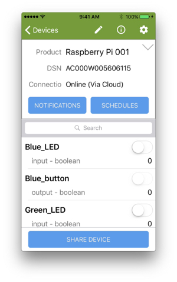

The host application (appd) has a property called Green_LED which does not actually control a real LED:

This page shows you how to modify your RPi and your version of appd to control an LED.

# Wire and test a Green LED

### Wire the Green LED

<ol>
<li>Shutdown your RPi.</li>
<li>Wire the GPIO pins on your RPi to a breadboard, adding a green LED and a 220 Ω resister as seen in the diagram below.

We used a breadboard, jumper wires, and an LED from an [Elegoo Super Starter Kit for Arduino](https://www.newegg.com/Product/Product.aspx?Item=9SIABFW5178264&ignorebbr=1).
</li>
<li>Restart your RPi.</li>
</ol>

### Test with green_led.py

<ol>
<li>ssh to your RPi.</li>
<li>Create a directory called <code>/home/pi/ayla_tests</code>.</li>
<li>Create a text file in this directory called <code>green_led.py</code> with the following code:
<pre>
import RPi.GPIO as GPIO
import time
GPIO.setwarnings(False)
GPIO.setmode(GPIO.BCM)
GPIO.setup(18, GPIO.OUT)
while True:
  GPIO.output(18, True)
  time.sleep(1)
  GPIO.output(18, False)
  time.sleep(1)
</pre>
</li>
<li>Ensure the new file is executable:
<pre>
$ chmod +x green_led.py
</pre>
</li>
<li>Run the python program to verify that your wiring is correct:
<pre>
python green_led.py</pre>
The green LED should blink.</li>
<li>Press Ctrl-C to stop the program.</li>
</ol>

### Test with green_led.c

<ol>
<li>Install [Wiring Pi](/devices/ayla-linux-agent/reference/wiring-pi) on your RPi.</li>
<li>Execute the following command to view a table showing the various schemes for specifying a GPIO pin:
<pre>
$ gpio readall
</pre>
The schemes are BCM, wPi, Name, and Physical. We are using the wPi scheme where wPi 1 == BCM 18.
</li>
<li>Create a text file called <code>~/ayla_tests/green_led.c</code> with the following code:
<pre>
#include &lt;stdio.h&gt;
#include &lt;wiringPi.h&gt;
#define GREEN_LED 1
int main(void) {
  printf("Starting program\n");
  wiringPiSetup();
  pinMode(GREEN_LED, OUTPUT);
  for(;;) {
    digitalWrite(GREEN_LED, HIGH);
    delay(500);
    printf("High\n");
    digitalWrite(GREEN_LED,  LOW);
    delay(500);
    printf("Low\n");
  }
  return 0;
}
</pre>
</li>
<li>Build the program:
<pre>
$ gcc -Wall -o green_led green_led.c -lwiringPi
</pre>
</li>
<li>Run the program to verify that you can control the LED from a program written in C. The LED should blink.
<pre>
./green_led
</pre>
</li>
<li>Press Ctrl-C to stop the program.</li>
</ol>

# Modify appd to control the LED

Recall that appd is composed of three files, main.c, appd.c, and appd.h, which reside in <code>/home/pi/device_linux_public/app/appd</code> along with Makefile. You will modify each of these files.

### Modify Makefile

<ol>
<li>Open <code>~/device_linux_public/app/appd/Makefile</code> for editing.</li>
<li>Scroll to the section called "List of libraries to link."</li>
<li>Add wiringPi (with an uppercase 'P').
<pre>
LIBS = ssl crypto curl jansson wiringPi
</pre>
</li>
<li>Save the file.</li>
</ol>

### Modify main.c

<ol>
<li>Open <code>~/device_linux_public/app/appd/main.c</code> for editing.</li>
<li>Include the wiringPi.h header file:
<pre>
#include <wiringPi.h>
</pre>
</li>
<li>Scroll to the main function, and add the following code just before the call to app_run:
<pre>
wiringPiSetup();
</pre>
</li>
<li>Save the file.</li>
</ol>

### Modify appd.h

<ol>
<li>Open <code>~/device_linux_public/app/appd/appd.h</code> for editing.</li>
<li>Add the following:
<pre>
#define GREEN_LED 1
</pre>
</li>
<li>Save the file.</li>
</ol>

### Modify appd.c

<ol>
<li>Open <code>~/device_linux_public/app/appd/appd.c</code> for editing.</li>
<li>Include the wiringPi.h header file:
<pre>
#include <wiringPi.h>
</pre>
</li>
<li>Scroll to the <code>app_prop_table</code>, and find the entry for the Green_LED, and modify the set field:
<pre>
{
  .name = "Green_LED",
  .type = PROP_BOOLEAN,
  .set = appd_green_led_set,
  .send = prop_arg_send,
  .arg = &green_led,
  .len = sizeof(green_led),
  .ads_failure_cb = appd_prop_ads_failure_cb,
},
</pre>
</li>
<li>Add the following function to the file. Do so before <code>app_prop_table</code>:
<pre>
static int appd_green_led_set(struct prop \*prop, const void \*val, size_t len, const struct op_args \*args) {
  pinMode(GREEN_LED, OUTPUT);
  int green_led = \*((uint8_t \*)val);
  if(green_led == 1) {
    digitalWrite(GREEN_LED, HIGH);
  } else {
    digitalWrite(GREEN_LED, LOW);
  }
  return 0;
}
</pre>
</li>
<li>Save the file.</li>
</ol>

### Make, run, and test appd

Make and run appd according to the instructions in [Building appd](/devices/ayla-linux-agent/tutorials/building-appd/). Test the new functionality by toggling the Green LED property on/off in Aura, and verifying that the actual LED on the breadboard turns on/off.