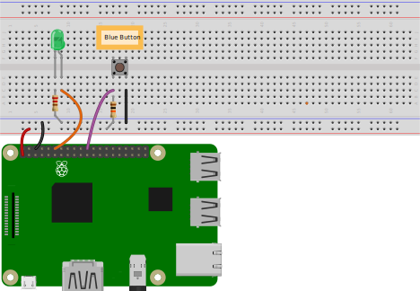

This tutorial shows you how to control a blue button with your version of the host application using an existing property called Blue_button. By default, the Blue_button does not actually respond to a real button:

# Wire and test the Blue Button

### Wire the Blue Button

1. Shutdown your RPi.
1. Wire the GPIO pins on your RPi to a breadboard, adding a button and a 10K Ω resister as seen in the diagram below. Whether or not the button is blue, we will refer to it as the blue button.

1. Restart your RPi.

### Test with blue_button.py

1. ssh to your RPi.
1. Create <code>&#126;/ayla_tests/blue_button.py</code> with the following code:
<pre>
import RPi.GPIO as GPIO
import time
GPIO.setwarnings(False)
GPIO.setmode(GPIO.BCM)
GPIO.setup(18, GPIO.OUT)
GPIO.setup(25, GPIO.IN)
while True:
  if GPIO.input(25):
    GPIO.output(18, False)
  else:
    GPIO.output(18, True)
</pre>
1. Ensure the new file is executable:
<pre>
$ chmod +x blue_button.py
</pre>
1. Run the python program to verify that your wiring is correct:
<pre>
python blue_button.py
</pre>
The button should turn the Green LED on/off.
1. Press Ctrl-C to stop the program.

### Test with blue_button_poll.c

1. Create <code>&#126;/ayla_tests/blue_button_poll.c</code> with the following code:
<pre>
#include &lt;stdio.h&gt;
#include &lt;wiringPi.h&gt;
#define GREEN_LED 1
#define BLUE_BUTTON 6
int main(void) {
  printf("Starting program\n");
  wiringPiSetup();
  pinMode(GREEN_LED, OUTPUT);
  pinMode(BLUE_BUTTON, INPUT);
  for(;;) {
    if(digitalRead(BLUE_BUTTON) == LOW)
      digitalWrite(GREEN_LED, HIGH);
    else
      digitalWrite(GREEN_LED,  LOW);
  }
  return 0;
}
</pre>
Use <code>gpio readall</code> to show the schemes for specifying a GPIO pin. We are using the wPi scheme where wPi 6 == BCM 25.
1. Build the program:
<pre>
$ gcc -Wall -o blue_button_poll blue_button_poll.c -lwiringPi
</pre>
1. Run the program to verify that the button controls the LED.
<pre>
./blue_button_poll
</pre>
1. Press Ctrl-C to stop the program.

### Test with blue_button_isr.c

Here is another approach to try. Rather than constantly polling the state of the button, this version waits for interrupts associated with a push or release of the button.

<pre>
#include &lt;stdio.h&gt;
#include &lt;wiringPi.h&gt;
#define GREEN_LED 1
#define BLUE_BUTTON 6

void blue_button_isr(void) {
  if(digitalRead(BLUE_BUTTON) == LOW) {
    digitalWrite(GREEN_LED, HIGH);
  } else {
    digitalWrite(GREEN_LED, LOW);
  }
}

int main(void) {
  printf("Starting program\n");
  wiringPiSetup();
  pinMode(GREEN_LED, OUTPUT);
  pinMode(BLUE_BUTTON, INPUT);
  wiringPiISR(BLUE_BUTTON, INT_EDGE_BOTH, &blue_button_isr);
  for(;;) {
    delay(1000);
    printf("Awake\n");
  }
  return 0;
}
</pre>

# Modify appd to respond to the button

### Modify main.c

1. Open <code>&#126;/device_linux_public/app/appd/main.c</code> for editing.
1. Scroll to the main function, and add the following just after <code>wiringPiSetup()</code>:
<pre>
pinMode(BLUE_BUTTON, INPUT);
wiringPiISR(BLUE_BUTTON, INT_EDGE_BOTH, &blue_button_isr);
</pre>
1. Save the file.

### Modify appd.h

1. Open <code>&#126;/device_linux_public/app/appd/appd.h</code> for editing.
1. Add the following just after <code>#define GREEN_LED 1</code>:
<pre>
#define BLUE_BUTTON 6
void blue_button_isr(void);
</pre>
1. Save the file.

### Modify appd.c

1. Open <code>&#126;/device_linux_public/app/appd/appd.c</code> for editing.
1. Add the following function (anywhere is fine):
<pre>
void blue_button_isr(void) {
  if(digitalRead(BLUE_BUTTON) == LOW) {blue_button = 1;}
  else {blue_button = 0;}
  prop_send_by_name("Blue_button");
}
</pre>
1. Save the file.

### Make, run, and test appd

Make and run the host app. Test the new functionality by pressing and releasing the button. The Blue_button property in Aura should indicate the button state.

