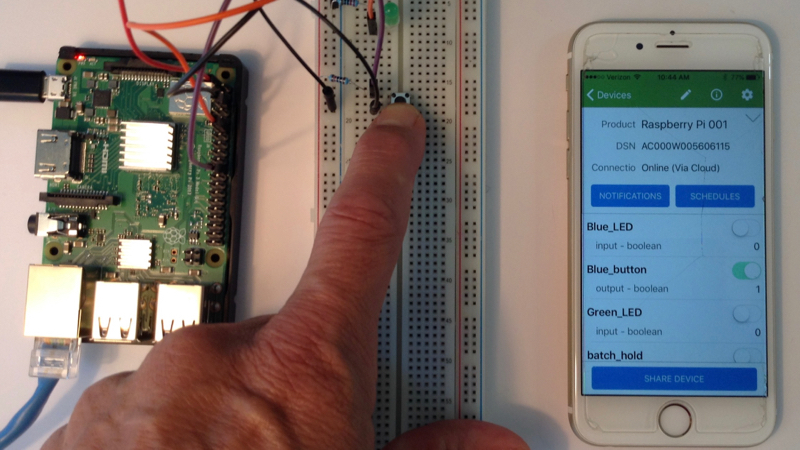
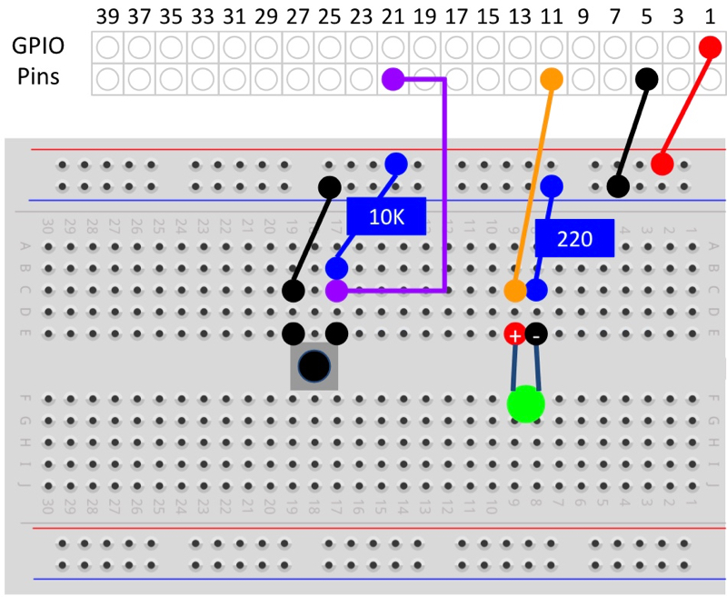

Note: Be sure to complete [Adding an LED](/devices/ayla-linux-agent/tutorials/adding-an-led/) before starting this tutorial.

The host application (appd) has a property called Blue_button which does not actually respond to a real button:

This page shows you how to modify your RPi and your version of appd to respond to a real button.

# Wire and test the button

<ol>
<li>Shutdown your RPi.</li>
<li>Wire the GPIO pins on your RPi to a breadboard, adding a button and a resister as seen in the diagram below.

You can see the same wiring scheme in the [CanaKit Raspberry Pi Quick Start Guide](https://www.canakit.com/Media/CanaKit-Raspberry-Pi-Quick-Start-Guide-3.2.pdf), Page 10.
</li>
<li>Restart your RPi.</li>
</ol>

### Test with button.py

<ol>
<li>ssh to your RPi.</li>
<li>Create a text file in <code>/home/pi/ayla_tests</code> called <code>button.py</code> with the following code:
<pre>
import RPi.GPIO as GPIO
import time
GPIO.setwarnings(False)
GPIO.setmode(GPIO.BCM)
GPIO.setup(18, GPIO.OUT)
GPIO.setup(25, GPIO.IN)
while True:
  if GPIO.input(25):
    GPIO.output(18, False)
  else:
    GPIO.output(18, True)
</pre>
</li>
<li>Ensure the new file is executable:
<pre>
$ chmod +x button.py
</pre>
</li>
<li>Run the python program with <code>python button.py</code> to verify that your wiring is correct. The button should turn the LED on/off.</li>
<li>Press Ctrl-C to stop the program.</li>
</ol>

### Test with button_poll_blink.c

<ol>
<li>Create a text file in <code>/home/pi/ayla_tests</code> called <code>button_poll_blink.c</code> with the following code:
<pre>
#include &lt;stdio.h&gt;
#include &lt;wiringPi.h&gt;
#define GREEN_LED 1
#define BUTTON 6
int main(void) {
  printf("Start of button_poll_blink program\n");
  wiringPiSetup();
  pinMode(GREEN_LED, OUTPUT);
  pinMode(BUTTON, INPUT);
  for(;;) {
    if(digitalRead(BUTTON) == LOW)
      digitalWrite(GREEN_LED, HIGH);
    else
      digitalWrite(GREEN_LED,  LOW);
  }
  return 0;
}
</pre>
</li>
<li>Build the program:
<pre>
$ gcc -Wall -o button_poll_blink button_poll_blink.c -lwiringPi
</pre>
</li>
<li>Run the program to verify that the button can control the LED.
<pre>
./button_poll_blink
</pre>
</li>
<li>Press Ctrl-C to stop the program.</li>
</ol>

### Test with button_isr_blink.c

Rather than constantly polling the state of the button, this version waits for interrupts associated with a push or release of the button.

<pre>
#include &lt;stdio.h&gt;
#include &lt;wiringPi.h&gt;
#define GREEN_LED 1
#define BUTTON 6

void isr(void) {
  if(digitalRead(BUTTON) == LOW) {
    digitalWrite(GREEN_LED, HIGH);
  } else {
    digitalWrite(GREEN_LED, LOW);
  }
}

int main(void) {
  printf("Start of button_isr_blink program\n");
  wiringPiSetup();
  pinMode(GREEN_LED, OUTPUT);
  pinMode(BUTTON, INPUT);
  wiringPiISR(BUTTON, INT_EDGE_BOTH, &isr);
  for(;;) {
    delay(1000);
    printf("Awake\n");
  }
  return 0;
}
</pre>

# Modify appd to respond to the button

### Modify main.c

<ol>
<li>Open <code>~/device_linux_public/app/appd/main.c</code> for editing.</li>
<li>Scroll to the main function, and add the following just after <code>wiringPiSetup();</code>:
<pre>
pinMode(BUTTON, INPUT);
wiringPiISR(BUTTON, INT_EDGE_BOTH, &button_isr);
</pre>
</li>
<li>Save the file.</li>
</ol>

### Modify appd.h

<ol>
<li>Open <code>~/device_linux_public/app/appd/appd.h</code> for editing.</li>
<li>Add the following just after <code>#define GREEN_LED 1</code>:
<pre>
#define BUTTON 6
void button_isr(void);
</pre>
</li>
<li>Save the file.</li>
</ol>

### Modify appd.c

<ol>
<li>Open <code>~/device_linux_public/app/appd/appd.c</code> for editing.</li>
<li>Add the following function:
<pre>
void button_isr(void) {
  if(digitalRead(BUTTON) == LOW) {blue_button = 1;}
  else {blue_button = 0;}
  prop_send_by_name("Blue_button");
}
</pre>
</li>
<li>Save the file.</li>
</ol>

### Build, run, and test appd

Build and run appd according to the instructions in [Building appd](/devices/ayla-linux-agent/tutorials/building-appd/). Test the new functionality by pressing and releasing the button. The Blue_button property in Aura should indicate the button state.

