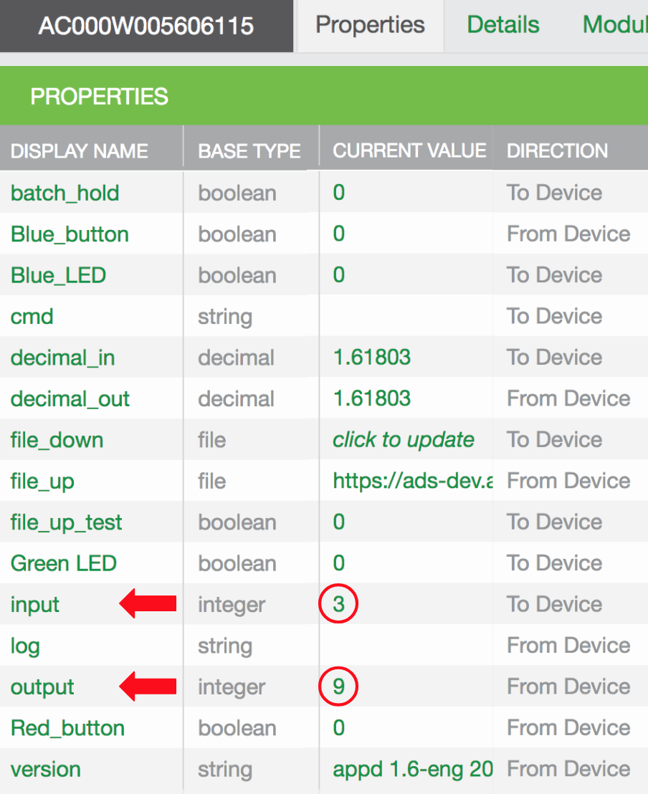
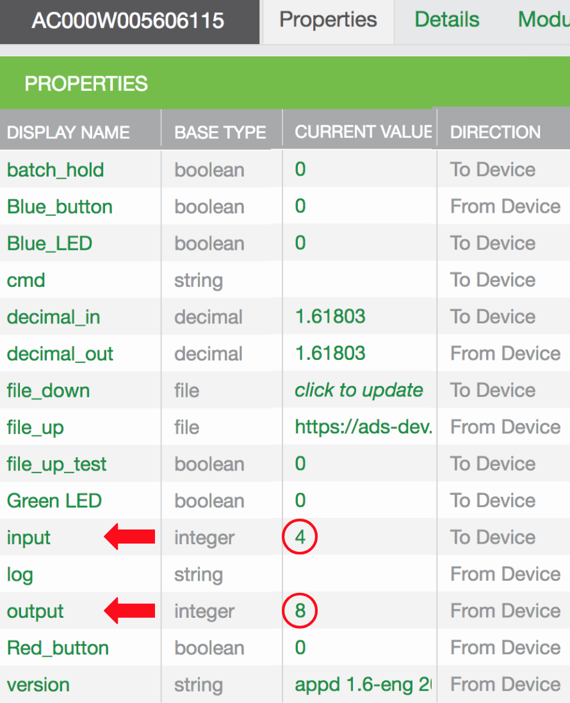

This page shows you how to modify, build, and run appd. Recall that appd includes two integer properties called input and output, and that when you set input to x, appd sets output to x2:

The following directions show you how to modify this behavior:

1. Open <code>~/device_linux_public/app/appd/appd.c</code> for editing.
1. Search for the following function:
<pre>
static int appd_input_set(struct prop &#42;prop, const void &#42;val, size_t len, const struct op_args &#42;args) {
     ...
     if (input > 46340 || input < -46340) {
       output = -1;
     } else {
       output = input &#42; input;
     }
     metadata = prop_metadata_alloc();
     prop_metadata_addf(metadata, "source", "%d x %d", input, input);
     opts.metadata = metadata;
     ...
}
</pre>
1. Change <code>input * input</code> to <code>input + input</code>.
1. Change <code>%d x %d</code> to <code>%d + %d</code>.
1. Save the file.
1. Build a new version of appd:
<pre>
$ cd &#126;/device_linux_public/app/appd
$ sudo make
</pre>
The new appd resides in <code>&#126;/device_linux_public/build/native/obj/app/appd</code>.
1. Stop devd and appd:
<pre>
$ sudo systemctl stop devd
</pre>
Note that devd starts and stops appd. For more information, see <code>Running appd independently</code> below.
1. Optionally, make a copy of the original appd:
<pre>
$ sudo cp ~/ayla/bin/appd ~/ayla/bin/appd.original
</pre>
1. Copy your version of appd to the directory where devd expects to find it:
<pre>
$ sudo cp ~/device_linux_public/build/native/obj/app/appd/appd ~/ayla/bin/appd
</pre>
1. Start devd and appd:
<pre>
$ sudo systemctl start devd  
</pre>
1. Test the new functionality:

## Running appd independently

By default, you start/stop devd, and devd starts/stops appd. You can configure devd to ignore appd so that you can start/stop appd independently in background, foreground, and debug modes:

### Reconfigure devd

1. Stop devd and appd:
<pre>
$ sudo systemctl stop devd
</pre>
1. Open /etc/init.d/devd for editing.
<pre>
$ sudo nano /etc/init.d/devd
</pre>
1. Add -n to OPTIONS, and save the file:
<pre>
OPTIONS="--debug -n -c /home/pi/ayla/config/devd.conf"
</pre>
1. Start devd:
<pre>
$ sudo systemctl start devd
Warning: devd.service changed on disk. Run 'systemctl daemon-reload' to reload units.
$ systemctl daemon-reload
==== AUTHENTICATING FOR org.freedesktop.systemd1.reload-daemon ===
Authentication is required to reload the systemd state.
Multiple identities can be used for authentication:
 1.  ,,, (pi)
 2.  root
Choose identity to authenticate as (1-2): 1
Password: 
==== AUTHENTICATION COMPLETE ===
</pre>
1. Verify that devd is running:
<pre>
$ ps -A | grep devd
  127 ?        00:00:02 systemd-udevd
 3466 ?        00:00:00 devd
</pre>
1. Verify that appd is not running:
<pre>
$ ps -A | grep appd
</pre>

### Run appd in background mode

1. Start appd:
<pre>
$ sudo &#126;/device_linux_public/build/native/obj/app/appd/appd -c /home/pi/ayla/config/appd.conf
</pre>
1. Verify that appd is running:
<pre>
$ ps -A | grep appd
 3581 ?        00:00:00 appd
</pre>
1. Stop appd:
<pre>
$ sudo killall appd
</pre>

### Run appd in foreground mode

1. Restart devd:
<pre>
$ sudo systemctl restart devd
</pre>
1. Run appd:
<pre>
$ sudo &#126;/device_linux_public/build/native/obj/app/appd/appd -f -c /home/pi/ayla/config/appd.conf
</pre>
Terminal output may look like this:
<pre>
[INF] appd::appd_init()  application initializing
[INF] appd::conf_read()  read configuration from file: /home/pi/ayla/config/appd.conf.startup
[INF] appd::msg_client_event_handler()  connected to cloud client
[INF] appd::appd_start()  application starting
[INF] appd::appd_connectivity_event()  Cloud connection UP
[INF] appd::appd_prop_confirm_cb()  output = 0 send at 1545320451361 to dests 1 succeeded
[INF] appd::appd_prop_confirm_cb()  output = 8 send at 1545320452132 to dests 1 succeeded
</pre>
1. Stop appd with <code>Ctrl-C</code>.

### Run appd in foreground+debug mode

1. Restart devd:
<pre>
$ sudo systemctl restart devd
</pre>
1. Run appd:
<pre>
$ sudo &#126;/device_linux_public/build/native/obj/app/appd/appd -f -d -c /home/pi/ayla/config/appd.conf
</pre>
Terminal output may look like this:
<pre>
2018-09-10T12:49:01.436 [DBG] appd::app_set_conf_file()  factory config: /home/pi/ayla/config/appd.conf, startup config dir: default
2018-09-10T12:49:01.437 [DBG] appd::app_set_socket_directory()  socket dir: /run
2018-09-10T12:49:01.473 [INF] appd::appd_init()  application initializing
2018-09-10T12:49:01.474 [DBG] appd::conf_load()  no valid startup config: /home/pi/ayla/config/appd.conf.startup
2018-09-10T12:49:01.474 [INF] appd::conf_read()  read configuration from file: /home/pi/ayla/config/appd.conf
2018-09-10T12:49:01.475 [INF] appd::msg_client_event_handler()  connected to cloud client
2018-09-10T12:49:01.476 [INF] appd::appd_start()  application starting
2018-09-10T12:49:01.477 [DBG] appd::prop_cloud_status_changed()  resending prop: oem_host_version
2018-09-10T12:49:01.478 [DBG] appd::prop_val_send()  oem_host_version
...
...
</pre>
1. Stop appd with <code>Ctrl-C</code>.
