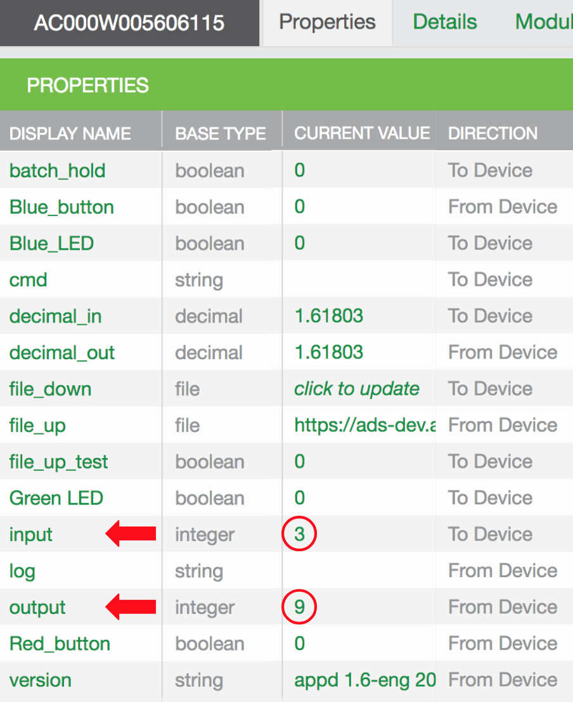

This page shows you how to modify, build, and run appd. Subsequent tutorials delve into the details of Ayla daemons, source code, and the build process. To get started, recall that the sample host application (appd) includes two integer properties called input and output, and that when you set input to x, appd sets output to x2:

The following steps show you how to modify this behavior so that when you set input to x, appd sets output to x * 2. 

<ol>
<li>Open <code>~/device_linux_public/app/appd/appd.c</code> for editing.</li>
<li>Search for the following function:
<pre>
static int appd_input_set(struct prop &#42;prop, const void &#42;val, size_t len, const struct op_args &#42;args) {
  ...
  if (input > 46340 || input < -46340) {
    output = -1;
  } else {
    output = input &#42; input;
  }
  metadata = prop_metadata_alloc();
  prop_metadata_addf(metadata, "source", "%d x %d", input, input);
  opts.metadata = metadata;
  ...
}
</pre>
</li>
<li>Change <code>input * input</code> to <code>input + input</code>.</li>
<li>Change <code>%d x %d</code> to <code>%d + %d</code>.</li>
<li>Save the file.</li>
<li>Build a new version of appd:
<pre>
$ cd &#126;/device_linux_public/app/appd
$ sudo make
</pre>
The new appd resides in <code>&#126;/device_linux_public/build/native/obj/app/appd</code>.
</li>
<li>Stop devd and appd. (devd starts and stops appd.)
<pre>
$ sudo systemctl stop devd
</pre>
</li>
<li>Make a copy of the original appd:
<pre>
$ sudo cp ~/ayla/bin/appd ~/ayla/bin/appd.original
</pre>
</li>
<li>Copy your version of appd to the directory where devd expects to find it:
<pre>
$ sudo cp ~/device_linux_public/build/native/obj/app/appd/appd ~/ayla/bin/appd
</pre>
</li>
<li>Start devd and appd:
<pre>
$ sudo systemctl start devd  
</pre>
</li>
<li>Test the new functionality:

</li>
</ol>
