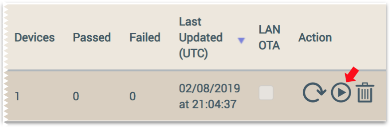

Ayla provides a mechanism for performing over-the-air (OTA) updates in order to replace the Ayla Agent (devd) and/or the host application (appd) running on your Ayla device with different (often newer) versions. This page discusses OTA updates. See also [Versioning](../../guide/versioning).

## How OTA updates work

Ayla does not define a particular file format for OTA image files. The Ayla Cloud and all Ayla device components view the file as opaque. As the following diagram illustrates, and the steps explain, only platform-specific OTA Custom Code needs to understand both the file format and how to use the contents of the file to update software.

1. An admin creates an OTA image file.
1. Using Ayla Dashboard Portal, the admin uploads the file to the Ayla Cloud, associating it with a digital twin.
1. The admin initiates an OTA job, specifying the file.
1. The Ayla Cloud tells the Ayla Agent on the device to initiate an OTA update (see [serv_ota_exec](https://github.com/AylaNetworks/device_linux_public/blob/c102d2dd7fc31386ca2686099bb31fb4ddae8c38/daemon/devd/serv.c)).
1. The Ayla Agent launches the OTA Daemon (see [ota_update.c](https://github.com/AylaNetworks/device_linux_public/blob/c102d2dd7fc31386ca2686099bb31fb4ddae8c38/util/ota/ota_update.c)).
1. The OTA Daemon downloads the OTA file.
1. The OTA Daemon launches platform-specific OTA Custom Code (see [platform_ota_apply](https://github.com/AylaNetworks/device_linux_public/blob/c102d2dd7fc31386ca2686099bb31fb4ddae8c38/util/ota/ota_update.c)).
1. The OTA Custom Code opens the OTA image file, and applies the update.
1. The OTA Daemon resets the device (see [platform_reset](https://github.com/AylaNetworks/device_linux_public/blob/c102d2dd7fc31386ca2686099bb31fb4ddae8c38/util/ota/ota_update.c)).

## Custom OTA for the Ayla Device Platform for Linux on RPi

The OTA image file for the Ayla Platform on RPi is a <code>.tar</code> file of the <code>&#126;/device_linux_public</code> directory including all source files, and excluding the <code>build</code> directory. The custom code untars the file in <code>/tmp</code>, builds and replaces all Ayla daemons, and restarts them. Custom code includes the following:

|&nbsp;|File|Function|Description|
|-|-|-|-|
|1.|[ota.c](https://github.com/AylaNetworks/device_linux_public/blob/c102d2dd7fc31386ca2686099bb31fb4ddae8c38/lib/platform/raspberry_pi/ota.c)|platform_ota_apply|Calls the <code>apply_ota.sh</code> script.|
|2.|[apply_ota.sh](https://github.com/AylaNetworks/device_linux_public/blob/c102d2dd7fc31386ca2686099bb31fb4ddae8c38/lib/platform/raspberry_pi/scripts/apply_ota.sh)|&nbsp;|Creates a temporary build directory. Unpacks <code>/tmp/ayla_ota.img</code> into the directory. Builds and replaces all daemons. Starts the daemons.|

Finally, the OTA Daemon resets the device.

## Steps for performing the OTA update

By default, <code>devd</code> is configured to stop/start <code>appd</code>. For OTA updates to work properly, this default setting must still be in play. 

### Change appd version

1. Open a Secure Shell to your Raspberry Pi.
1. Open <code>appd.c</code>:
<pre>
$ nano ~/device_linux_public/app/appd/appd.c 
</pre>
1. Change <code>appd_version</code> in [appd.c](https://github.com/AylaNetworks/device_linux_public/blob/c102d2dd7fc31386ca2686099bb31fb4ddae8c38/app/appd/appd.c) to a new version:
<pre>
const char &#42;appd_version = "appd_matts_linux_device_1_1";
</pre>
1. Modify <code>appd</code> source code, build, test, repeat. 

### Create the OTA image file

1. When you are ready to perform an OTA update, change directory to <code>&#126;/device_linux_public</code>.
1. Run <code>make clean</code> to delete the <code>build</code> directory.
1. Change directory to <code>&#126;/</code>.
1. Create an archive of the <code>device_linux_public</code> directory:
<pre>
$ cd &#126;/device_linux_public
$ tar -cf ../appd_matts_linux_device_1_1.tar .
</pre>
1. Exit <code>ssh</code>, <code>scp</code> the tar file to your computer, and open <code>ssh</code> again for later:
<pre>
$ scp pi@192.168.1.10:appd_matts_linux_device_1_1.tar .
</pre>

### Upload the OTA image file

1. Browse to the Ayla Dashboard Portal, and log in.
1. Click <code>Devices</code> in the sidebar. In order to perform an OTA update to a device, it must first be a member of a device group. 
1. Click <code>Search Devices</code>, fill in the form, and click Search.

1. Click <code>Create Group</code>, fill in the form, and click Create.

1. Click Groups in the top horizontal menu, and view your new group. Click Close.

1. Click <code>OTA</code> in the sidebar.
1. Click <code>Host MCU Images</code> in the top horizontal menu.
1. Click <code>Create</code>, fill in the form, and click Save:

### Perform the OTA update

Before you launch the OTA update, you may want to <code>ssh</code> to your RPi, and <code>tail -f /var/log/syslog</code> so that you can watch activity. See a sample syslog at the bottom of this page.

1. In Ayla Dashboard Portal, click the Create OTA Job icon for your new image on the Host MCU Images list:

1. Fill in the form, and click Create.

 The job appears in the <code>OTA Jobs</code> list:

1. Slide to find the right end of the job on the list, and click the Start icon:

At the end of the OTA process, your RPi will reboot.

## Check for results

Once the OTA process completes, check the following:

1. Ayla Dashboard Portal &gt; OTA &gt; OTA Jobs.

1. Ayla Dashboard Portal &gt; Devices &gt; DSN.

1. Ayla Developer Portal &gt; Devices &gt; DSN &gt; Details.

1. <a data-toggle="collapse" href="#sample-syslog">Click to view sample syslog</a>.
<pre id="sample-syslog" class="collapse">
Feb  8 21:22:21 MattsLinuxDevice devd: [debug-client] ds_get_cmds_done: &#35;012{&#35;012    "cmds": [&#35;012        {&#35;012            "cmd": {&#35;012                "data": "{\"ota\":{\"url\":\"https&colon;//ais.aylanetworks.com/device/t_otas/16588.json?dsn=AC000W006420034\",\"type\":\"host_mcu\",\"ver\":\"appd_matts_linux_device_1_1\",\"size\":4505600,\"checksum\":\"640e42b7fd7685a3f32ec8a697fc3776\",\"source\":\"local\"}}",&#35;012                "id": 10303704,&#35;012                "method": "PUT",&#35;012                "resource": "ota.json",&#35;012                "uri": "/cmd_post_process.json"&#35;012            }&#35;012        }&#35;012    ],&#35;012    "properties": [],&#35;012    "schedules": []&#35;012}
Feb  8 21:22:21 MattsLinuxDevice devd: [debug-server] server_handle_req: PUT ota.json
Feb  8 21:22:21 MattsLinuxDevice devd: [info-server] serv_ota_exec: starting OTA download/apply of version appd_matts_linux_device_1_1
Feb  8 21:22:21 MattsLinuxDevice devd: [debug-server] serv_rev_put_end: status 200
Feb  8 21:22:21 MattsLinuxDevice devd: [debug2-client] ds_send: PUT https&colon;//ads-dev.aylanetworks.com/devices/5319141/cmd_post_process.json?cmd_id=10303704&status=200
Feb  8 21:22:21 MattsLinuxDevice devd: [debug-server] serv_ota_exec: Starting ota_update using args:
Feb  8 21:22:21 MattsLinuxDevice devd: [debug-server] serv_ota_exec: ota_update
Feb  8 21:22:21 MattsLinuxDevice devd: [debug-server] serv_ota_exec: -u
Feb  8 21:22:21 MattsLinuxDevice devd: [debug-server] serv_ota_exec: https&colon;//ais.aylanetworks.com/device/t_otas/16588.json?dsn=AC000W006420034
Feb  8 21:22:21 MattsLinuxDevice devd: [debug-server] serv_ota_exec: -l
Feb  8 21:22:21 MattsLinuxDevice devd: [debug-server] serv_ota_exec: 4505600
Feb  8 21:22:21 MattsLinuxDevice devd: [debug-server] serv_ota_exec: -c
Feb  8 21:22:21 MattsLinuxDevice devd: [debug-server] serv_ota_exec: 640e42b7fd7685a3f32ec8a697fc3776
Feb  8 21:22:21 MattsLinuxDevice devd: [debug-server] serv_ota_exec: -s
Feb  8 21:22:21 MattsLinuxDevice devd: [debug-server] serv_ota_exec: /var/run/devd/msg_sock
Feb  8 21:22:21 MattsLinuxDevice devd: [debug-server] serv_ota_exec: -ar
Feb  8 21:22:21 MattsLinuxDevice devd: [debug-client] http_client_send: Found bundle for host ads-dev.aylanetworks.com: 0xfa0110 [can pipeline]
Feb  8 21:22:21 MattsLinuxDevice devd: [debug-server] serv_ota_exec: -d
Feb  8 21:22:21 MattsLinuxDevice devd: [debug-server] serv_ota_exec: -H
Feb  8 21:22:21 MattsLinuxDevice devd: [debug-server] serv_ota_exec: x-Ayla-auth-key: Ayla1.0 N9TdYRwCml13W6ajl2H8fVovuVSs4D1cYW1V
Feb  8 21:22:21 MattsLinuxDevice devd: [debug-client] http_client_send: Re-using existing connection! (&#35;3) with host ads-dev.aylanetworks.com
Feb  8 21:22:21 MattsLinuxDevice devd: [debug-client] http_client_send: Connected to ads-dev.aylanetworks.com (18.235.138.13) port 443 (&#35;3)
Feb  8 21:22:21 MattsLinuxDevice ota_update: [debug-ota] platform_ota_flash_write_open: opened file /tmp/ayla_ota.img for writing
Feb  8 21:22:21 MattsLinuxDevice ota_update: [debug-ota] dl_download_with_retry: ota download 1 times, offset:0, total:4505600
Feb  8 21:22:21 MattsLinuxDevice ota_update: [info-ota] dl_curl: downloading https&colon;//ais.aylanetworks.com/device/t_otas/16588.json?dsn=AC000W006420034
Feb  8 21:22:21 MattsLinuxDevice devd: [warning-client] file_event_poll: poll failed: Interrupted system call
Feb  8 21:22:21 MattsLinuxDevice devd: [warning-client] ds_run: poll error: Interrupted system call
Feb  8 21:22:21 MattsLinuxDevice ota_update: [debug-ota] dl_curl_debug:   Trying 18.235.138.13...
Feb  8 21:22:21 MattsLinuxDevice ota_update: [debug-ota] dl_curl_debug: TCP_NODELAY set
Feb  8 21:22:21 MattsLinuxDevice ota_update: [debug-ota] dl_curl_debug: Connected to ais.aylanetworks.com (18.235.138.13) port 443 (&#35;0)
Feb  8 21:22:21 MattsLinuxDevice ota_update: [debug-ota] dl_curl_debug: ALPN, offering http/1.1
Feb  8 21:22:21 MattsLinuxDevice ota_update: [debug-ota] dl_curl_debug: Cipher selection: ALL:!EXPORT:!EXPORT40:!EXPORT56:!aNULL:!LOW:!RC4:@STRENGTH
Feb  8 21:22:21 MattsLinuxDevice ota_update: [debug-ota] dl_curl_debug: successfully set certificate verify locations:
Feb  8 21:22:21 MattsLinuxDevice ota_update: [debug-ota] dl_curl_debug:   CAfile: /etc/ssl/certs/ca-certificates.crt&#35;012  CApath: /etc/ssl/certs
Feb  8 21:22:21 MattsLinuxDevice ota_update: [debug-ota] dl_curl_debug: TLSv1.2 (OUT), TLS header, Certificate Status (22):
Feb  8 21:22:21 MattsLinuxDevice ota_update: [debug-ota] dl_curl_debug: TLSv1.2 (OUT), TLS handshake, Client hello (1):
Feb  8 21:22:21 MattsLinuxDevice ota_update: [debug-ota] dl_curl_debug: TLSv1.2 (IN), TLS handshake, Server hello (2):
Feb  8 21:22:21 MattsLinuxDevice ota_update: [debug-ota] dl_curl_debug: TLSv1.2 (IN), TLS handshake, Certificate (11):
Feb  8 21:22:21 MattsLinuxDevice ota_update: [debug-ota] dl_curl_debug: TLSv1.2 (IN), TLS handshake, Server key exchange (12):
Feb  8 21:22:21 MattsLinuxDevice ota_update: [debug-ota] dl_curl_debug: TLSv1.2 (IN), TLS handshake, Server finished (14):
Feb  8 21:22:21 MattsLinuxDevice ota_update: [debug-ota] dl_curl_debug: TLSv1.2 (OUT), TLS handshake, Client key exchange (16):
Feb  8 21:22:21 MattsLinuxDevice ota_update: [debug-ota] dl_curl_debug: TLSv1.2 (OUT), TLS change cipher, Client hello (1):
Feb  8 21:22:21 MattsLinuxDevice ota_update: [debug-ota] dl_curl_debug: TLSv1.2 (OUT), TLS handshake, Finished (20):
Feb  8 21:22:21 MattsLinuxDevice devd: [debug-client] ds_client_parse_auth_token: received Ayla auth token: 36 bytes
Feb  8 21:22:21 MattsLinuxDevice devd: [debug-client] http_client_send: Curl_http_done: called premature == 0
Feb  8 21:22:21 MattsLinuxDevice devd: [debug-client] http_client_send: Connection &#35;3 to host ads-dev.aylanetworks.com left intact
Feb  8 21:22:21 MattsLinuxDevice devd: [debug-client] ds_client_send_done: PUT complete, HTTP status 200, time 280ms, https&colon;//ads-dev.aylanetworks.com/devices/5319141/cmd_post_process.json?cmd_id=10303704&status=200
Feb  8 21:22:22 MattsLinuxDevice ota_update: [debug-ota] dl_curl_debug: TLSv1.2 (IN), TLS change cipher, Client hello (1):
Feb  8 21:22:22 MattsLinuxDevice ota_update: [debug-ota] dl_curl_debug: TLSv1.2 (IN), TLS handshake, Finished (20):
Feb  8 21:22:22 MattsLinuxDevice ota_update: [debug-ota] dl_curl_debug: SSL connection using TLSv1.2 / ECDHE-RSA-AES128-GCM-SHA256
Feb  8 21:22:22 MattsLinuxDevice ota_update: [debug-ota] dl_curl_debug: ALPN, server accepted to use http/1.1
Feb  8 21:22:22 MattsLinuxDevice ota_update: [debug-ota] dl_curl_debug: Server certificate:
Feb  8 21:22:22 MattsLinuxDevice ota_update: [debug-ota] dl_curl_debug:  subject: C=US; ST=California; L=Sunnyvale; O=Ayla Networks Inc; CN=&#42;.aylanetworks.com
Feb  8 21:22:22 MattsLinuxDevice ota_update: [debug-ota] dl_curl_debug:  start date: Aug  1 18:14:56 2018 GMT
Feb  8 21:22:22 MattsLinuxDevice ota_update: [debug-ota] dl_curl_debug:  expire date: Aug 31 18:44:55 2020 GMT
Feb  8 21:22:22 MattsLinuxDevice ota_update: [debug-ota] dl_curl_debug:  subjectAltName: host "ais.aylanetworks.com" matched cert's "&#42;.aylanetworks.com"
Feb  8 21:22:22 MattsLinuxDevice ota_update: [debug-ota] dl_curl_debug:  issuer: C=US; O=Entrust, Inc.; OU=See www.entrust.net/legal-terms; OU=(c) 2012 Entrust, Inc. - for authorized use only; CN=Entrust Certification Authority - L1K
Feb  8 21:22:22 MattsLinuxDevice ota_update: [debug-ota] dl_curl_debug:  SSL certificate verify ok.
Feb  8 21:22:22 MattsLinuxDevice ota_update: [debug-ota] dl_curl_debug: GET /device/t_otas/16588.json?dsn=AC000W006420034 HTTP/1.1&#35;015&#35;012Host: ais.aylanetworks.com&#35;015&#35;012Accept: */*&#35;015&#35;012x-Ayla-auth-key: Ayla1.0 N9TdYRwCml13W6ajl2H8fVovuVSs4D1cYW1V
Feb  8 21:22:22 MattsLinuxDevice ota_update: [debug-ota] dl_curl_debug: HTTP/1.1 200 OK
Feb  8 21:22:22 MattsLinuxDevice ota_update: [debug-ota] dl_curl_debug: Date: Fri, 08 Feb 2019 21:22:22 GMT
Feb  8 21:22:22 MattsLinuxDevice ota_update: [debug-ota] dl_curl_debug: Content-Type: application/octet-stream;charset=binary
Feb  8 21:22:22 MattsLinuxDevice ota_update: [debug-ota] dl_curl_debug: Transfer-Encoding: chunked
Feb  8 21:22:22 MattsLinuxDevice ota_update: [debug-ota] dl_curl_debug: Connection: keep-alive
Feb  8 21:22:22 MattsLinuxDevice ota_update: [debug-ota] dl_curl_debug: Server: Apache
Feb  8 21:22:22 MattsLinuxDevice ota_update: [debug-ota] dl_curl_debug: ETag: "640e42b7fd7685a3f32ec8a697fc3776"
Feb  8 21:22:22 MattsLinuxDevice ota_update: [debug-ota] dl_curl_debug: Last-Modified: Wed, 14 Dec 2050 18:43:58 GMT
Feb  8 21:22:22 MattsLinuxDevice ota_update: [debug-ota] dl_curl_debug: Range: bytes=0-4505599
Feb  8 21:22:22 MattsLinuxDevice ota_update: [debug-ota] dl_curl_debug: Status: 200 OK
Feb  8 21:22:22 MattsLinuxDevice ota_update: [debug-ota] dl_curl_debug: x-Ayla-auth-key: N9TdYRwCml13W6ajl2H8fVovuVSs4D1cYW1V
Feb  8 21:22:22 MattsLinuxDevice ota_update: [debug-ota] dl_curl_debug: X-Frame-Options: sameorigin
Feb  8 21:22:22 MattsLinuxDevice ota_update: [debug-ota] dl_curl_debug: X-Rack-Cache: miss
Feb  8 21:22:22 MattsLinuxDevice ota_update: [debug-ota] dl_curl_debug: X-Request-Id: 9f3919b02be711e987441963de067d41
Feb  8 21:22:22 MattsLinuxDevice ota_update: [debug-ota] dl_curl_debug: X-Runtime: 0.264316
Feb  8 21:22:22 MattsLinuxDevice ota_update: [debug-ota] dl_curl_debug: X-UA-Compatible: IE=Edge,chrome=1
Feb  8 21:22:22 MattsLinuxDevice ota_update: [debug-ota] dl_curl_debug: Content-Security-Policy: frame-ancestors dashboard-dev.aylanetworks.com
Feb  8 21:22:22 MattsLinuxDevice ota_update: [debug-ota] dl_curl_debug:
Feb  8 21:22:25 MattsLinuxDevice ota_update: [debug-ota] dl_curl_debug: Curl_http_done: called premature == 0
Feb  8 21:22:25 MattsLinuxDevice ota_update: [debug-ota] dl_curl_debug: Connection &#35;0 to host ais.aylanetworks.com left intact
Feb  8 21:22:25 MattsLinuxDevice ota_update: [info-ota] dl_curl: status 200
Feb  8 21:22:25 MattsLinuxDevice ota_update: [debug-ota] dl_curl: downloading from offset 0 finish, transfer len:4505600
Feb  8 21:22:25 MattsLinuxDevice ota_update: [debug-ota] dl_download_with_retry: download sucess, offset:0, total:4505600
Feb  8 21:22:25 MattsLinuxDevice ota_update: [info-ota] dl_verify: verified readback is correct
Feb  8 21:23:08 MattsLinuxDevice devd: [debug-client] msg_server_handle_client_event: connected: fd=11
Feb  8 21:23:08 MattsLinuxDevice devd: [debug-client] amsg_send_default_resp: msg.interface 7, msg.type 0, msg.err 0
Feb  8 21:23:08 MattsLinuxDevice ota_update: [debug-ota] ota_status: sent status 0 to /var/run/devd/msg_sock
Feb  8 21:23:08 MattsLinuxDevice ota_update: [info-ota] main: rebooting
</pre>
