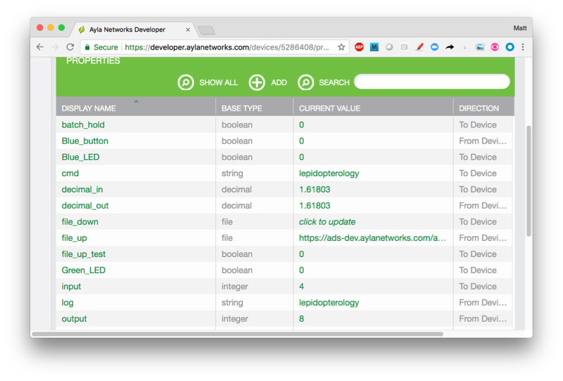
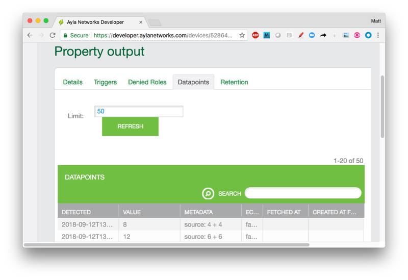

This tutorial shows you how to run the Ayla Linux Agent (devd) and the Host Application (appd).

# About devd and appd 

### Where are devd and appd on disk?

At this point, you have two sets:

<ol>
<li>The <i>Installed Set</i> resides in <code>~/ayla/bin/</code>. This is the devd and appd that ayla_install.sh installed and started. Both should be running on your RPi now. The devd startup script is in <code>/etc/init.d/devd</code>. devd is configured (by default) to keep appd running when devd is running, and to stop appd when devd stops.</li>
<pre>
$ ls -1r ~/ayla/bin/{devd,appd}
/home/pi/ayla/bin/devd
/home/pi/ayla/bin/appd
</pre>

<li>The <i>Cloned Set</i> resides in <code>~/device_linux_public/build/native/obj/</code>. This is the devd and appd that resulted when you cloned and made device_linux_public.
<pre>
$ ls ~/device_linux_public/build/native/obj/daemon/devd/devd
$ ls ~/device_linux_public/build/native/obj/app/appd/appd
</pre>
</li>
</ol>

### What are devd and appd command-line options?

<ol>
<li>Tell devd to show command-line options:
<pre>
$ ~/ayla/bin/devd ?
</pre>
The following options appear:
<pre>
devd: unused arguments
devd 1.5.1-eng 2018-09-06 07:35:34 pi/c102d2d
Usage: devd [OPTIONS]
OPTIONS:
  -d, --debug                 Enable debug verbose debug messages
  -f, --foreground            Do not daemonize
  -c, --factory_config &lt;file&gt; Factory config file path
  -s, --startup_dir &lt;dir&gt;     Startup config directory
  -w, --wait                  Wait for dhcp_bound event enable client
  -o, --sockdir &lt;dir&gt;         Socket directory (e.g. /var/run)
  -n, --no_appd               Do not execute and manage 'appd' application service
  -t, --test                  Connect to cloud in test mode
</pre>
</li>
<li>Tell appd to show command-line options:
<pre>
$ $ ~/ayla/bin/appd ?
</pre>
The following options appear:
<pre>
appd: unused arguments
Usage: appd
  Options:
    -c --factory_config &lt;file&gt;  Specify factory config file
    -s --startup_dir &lt;dir&gt;      Specify startup config directory
    -d --debug                  Run in debug mode
    -f --foreground             Don't detach daemon process, run in foreground
    -o --sockdir &lt;dir&gt;          Specify socket directory
</pre>
</li>
</ol>

### How do you stop/start or restart devd and appd?

Stop/start or restart the Installed Set like this:

<ol>
<li>Stop the devd daemon. This also stops appd. Raspbian will ask for authentication.
<pre>
$ /etc/init.d/devd stop
</pre>
</li>
<li>Start the devd daemon. This also starts appd. Raspbian will ask for authentication.
<pre>
$ /etc/init.d/devd start
</pre>
</li>
<li>Restart the devd daemon. This also restarts appd. Raspbian will ask for authentication.
<pre>
$ /etc/init.d/devd restart
</pre>
</li>
</ol>

# Modify appd

Recall that appd includes two integer properties called input and output, and that when you set input to a value, appd sets output to input2:

You can create your own version of appd by changing this behavior:

<ol>
<li>Open <code>~/device_linux_public/app/appd/appd.c</code> for editing.</li>
<li>Search for the following function:
<pre>
static int appd_input_set(struct prop \*prop, const void \*val, size_t len, const struct op_args \*args) {
  ...
  if (input > 46340 || input < -46340) {
    output = -1;
  } else {
    output = input \* input;
  }
  metadata = prop_metadata_alloc();
  prop_metadata_addf(metadata, "source", "%d x %d", input, input);
  opts.metadata = metadata;
  ...
}
</pre>
</li>
<li>Change <code>input * input</code> to <code>input + input</code>.</li>
<li>Change <code>%d x %d</code> to <code>%d + %d</code>.</li>
<li>Build your new version of appd:
<pre>
$ cd device_linux_public/
$ make
</pre>
Output should look similar to this:
<pre>
make -s -C lib/ayla all
make -s -C lib/platform all
make -s -C lib/app all
make -s -C daemon/devd all
make -s -C daemon/cond all
make -s -C daemon/logd all
make -s -C util/acgi all
make -s -C util/acli all
make -s -C util/devdwatch all
make -s -C util/gw_setup_agent all
make -s -C util/ota all
make -s -C app/appd all
CC appd.c
Linking appd
</pre>
</li>
</ol>

The directions below show you how to run your version of appd in background, foreground, and debug modes. When you do, you can verify that your are, indeed, running your version in several ways:

<ol>
<li>View the results in Aura:

</li>
<li>View the results in Developer Portal:

</li>
<li>In DevPortal, click the output property, and then click Datapoints:

Note <code>source: 4 + 4</code> in the Metadata column. This metadata is the result of the <code>%d + %d</code> modification you made to the <code>appd_input_set</code> function. Property metadata is the topic of another tutorial.
</li>
</ol>

# Run your version of appd

Here are two ways to run your version of appd instead of the default version:

## Method 1: Overwrite the installed version

Overwrite the installed appd with your version, and restart devd which launches your version of appd. Do this repeatedly as you make modifications to your version of appd.

<ol>
<li>Stop devd and appd:
<pre>
$ /etc/init.d/devd stop
</pre>
</li>
<li>Make a copy of the original appd:
<pre>
$ sudo cp ~/ayla/bin/appd ~/ayla/bin/appd.original
</pre>
</li>
<li>Modify and make your version of appd.</li>
<li>Copy your version of appd to the directory where devd expects to find it:
<pre>
$ sudo cp ~/device_linux_public/build/native/obj/app/appd/appd ~/ayla/bin/appd
</pre>
</li>
<li>Start devd:
<pre>
$ /etc/init.d/devd start
</pre>
</li>
<li>Test your modifications.</li>
</ol>

## Method 2: Run your version independently

### Reconfigure devd so that it does not manage appd

<ol>
<li>Stop devd and appd:
<pre>
$ /etc/init.d/devd stop
</pre>
</li>
<li>Open <code>/etc/init.d/devd</code> for editing.
<pre>
$ sudo nano /etc/init.d/devd
</pre>
</li>
<li>Add <code>-n</code> to OPTIONS, and save the file:
<pre>
OPTIONS="--debug -n -c /home/pi/ayla/config/devd.conf"
</pre>
</li>
<li>Start devd:
<pre>
$ /etc/init.d/devd start
</pre>
</li>
<li>Verify that devd is running:
<pre>
$ ps -A | grep devd
  126 ?        00:00:00 systemd-udevd
 1224 ?        00:00:00 devd
</pre>
</li>
<li>Verify that appd is not running:
<pre>
$ ps -A | grep appd
</pre>
</li>
</ol>

IMPORTANT: The sections below show you how to start/stop your version of appd repeatedly (in background, foreground, and debug mode). You must restart devd before restarting appd. Why? During initialization, appd calls prop_add to give its list of properties to devd. If you don't restart devd, and you repeatedly start appd, devd's property table simply continues to grow.

### Run your version of appd in background mode

<ol>
<li>Restart devd:
<pre>
$ /etc/init.d/devd restart
</pre>
</li>
<li>Modify and make your version of appd.</li>
<li>Run appd:
<pre>
$ sudo ~/device_linux_public/build/native/obj/app/appd/appd -c /home/pi/ayla/config/appd.conf
</pre>
</li>
<li>Verify that appd is running:
<pre>
$ ps -A | grep appd
 2147 ?        00:00:00 appd
</pre>
</li>
<li>Test your modifications.</li>
<li>Stop appd:
<pre>
$ sudo killall appd
</pre>
</li>
</ol>

### Run your version of appd in foreground mode

<ol>
<li>Restart devd:
<pre>
$ /etc/init.d/devd restart
</pre>
</li>
<li>Modify and make your version of appd.</li>
<li>Run appd:
<pre>
$ sudo ~/device_linux_public/build/native/obj/app/appd/appd -f -c /home/pi/ayla/config/appd.conf
</pre>
Terminal output will look similar to this:
<pre>
[INF] appd::appd_init()  application initializing
[INF] appd::conf_read()  read configuration from file: /home/pi/ayla/config/appd.conf
[INF] appd::msg_client_event_handler()  connected to cloud client
[INF] appd::appd_start()  application starting
[INF] appd::appd_connectivity_event()  Cloud connection UP
[INF] appd::appd_prop_confirm_cb()  output = 0 send at 1536580478336 to dests 1 succeeded
</pre>
</li>
<li>In another terminal, verify that appd is running:
<pre>
$ ps -A | grep appd
 2244 pts/0    00:00:00 appd
</pre>
</li>
<li>Test your modifications.</li>
<li>Stop appd with <code>Ctl-C</code>. 
<pre>
[WRN] appd::file_event_poll()  poll failed: Interrupted system call
[INF] appd::appd_exit()  application exiting with status: 2
[INF] appd::msg_client_event_handler()  disconnected from cloud client
[INF] appd::appd_connectivity_event()  Cloud connection DOWN
[WRN] appd::app_client_connection_status_handler()  set connect_timer 1000 ms
</pre>
</ol>

### Run your version of appd in foreground/debug mode

<ol>
<li>Restart devd:
<pre>
$ /etc/init.d/devd restart
</pre>
</li>
<li>Modify and make your version of appd.</li>
<li>Run appd:
<pre>
$ sudo ~/device_linux_public/build/native/obj/app/appd/appd -f -d -c /home/pi/ayla/config/appd.conf
</pre>
Terminal output will look similar to this:
<pre>
2018-09-10T12:49:01.436 [DBG] appd::app_set_conf_file()  factory config: /home/pi/ayla/config/appd.conf, startup config dir: default
2018-09-10T12:49:01.437 [DBG] appd::app_set_socket_directory()  socket dir: /run
2018-09-10T12:49:01.473 [INF] appd::appd_init()  application initializing
2018-09-10T12:49:01.474 [DBG] appd::conf_load()  no valid startup config: /home/pi/ayla/config/appd.conf.startup
2018-09-10T12:49:01.474 [INF] appd::conf_read()  read configuration from file: /home/pi/ayla/config/appd.conf
2018-09-10T12:49:01.475 [INF] appd::msg_client_event_handler()  connected to cloud client
2018-09-10T12:49:01.476 [INF] appd::appd_start()  application starting
2018-09-10T12:49:01.477 [DBG] appd::prop_cloud_status_changed()  resending prop: oem_host_version
2018-09-10T12:49:01.478 [DBG] appd::prop_val_send()  oem_host_version
...
...
</pre>
</li>
<li>Test your modifications.</li>
<li>Stop appd with <code>Ctl-C</code>.</li>
</ol>