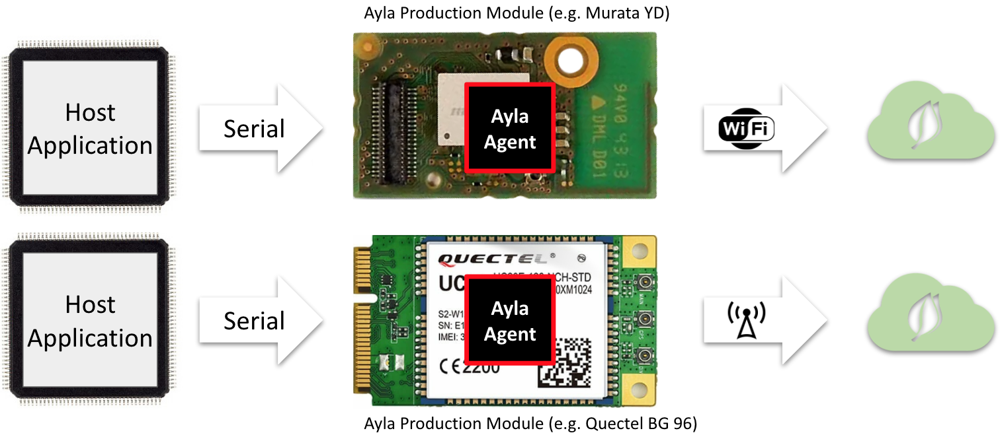
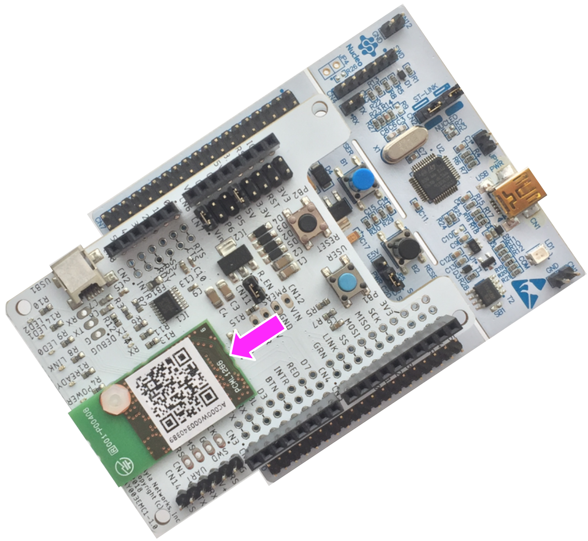
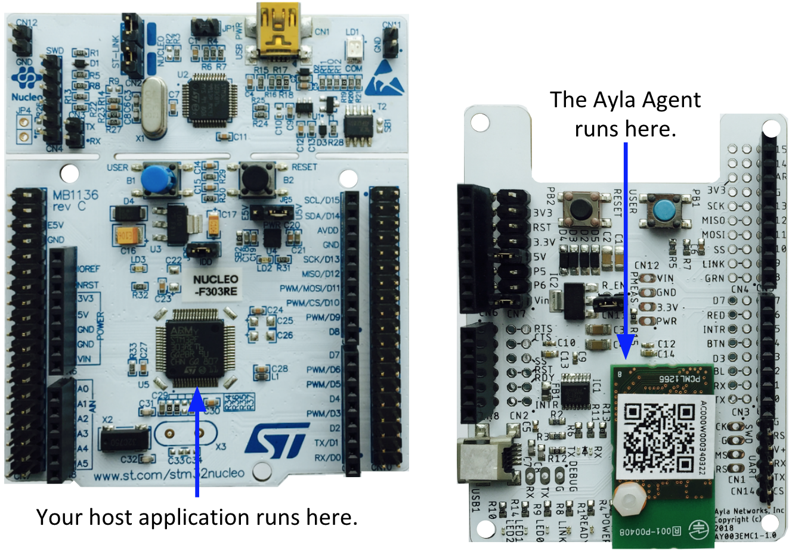
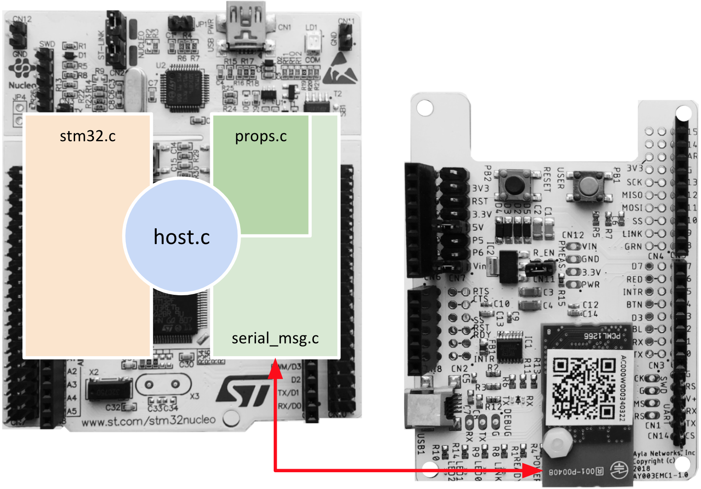
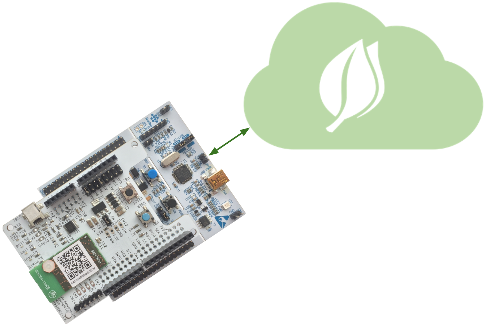

Ayla Production Modules are serial-to-Wi-Fi or serial-to-cellular communication modules pre-loaded with an Ayla software agent that facilitates secure communication from your host application to the Ayla Cloud.

The Ayla Design Kit demonstrates how to incorporate an Ayla Production Module into a device:

This Ayla Design Kit consists of a STM32 Nucleo board with an Ayla Shield on top. Here are the two boards separated:

Ayla also provides a sample host application. The primary source file is <code>host.c</code> which links to Ayla-provided libraries that include <code>stm32.c</code> to facilitate interaction with the STM32 Nucleo board, <code>props.c</code> to define device properties, and <code>serial_msg.c</code> to facilitate communication via SPI/UART with the Ayla Production Module:

The Ayla Production Module enables a device to communicate securely with the Ayla Cloud: 

Ayla utilizes the following modules:

|Name|Ayla Part #​|Description|UART​|SPI​|Availability​|
|-|-|-|-|-|-|
|Murata Type YD​|AY001MTC​|BCM43362+F205​|yes​|yes​|GA​|
|USI BM09A​|AY001MUS​|BCM43362+F205|yes|yes​|GA​|
|USI BM14A​|AY001MUV​|BCM43362+F205​|yes​|yes​|GA​|
|Murata Type 1AD​|AY001MBS​|BCM4390​|yes​||GA​|
|AMPAK 750GN​|AY001MAB​|BCM43362+F411​|yes​|yes​|GA​|
|USI BM-30​|AY001MUX​|BCM43362+F411​|yes​|yes​|GA​|
|Inventek ISM43362​|AY001MIV​|BCM43362+F205​|yes​|yes​|GA​|
|Murata Type ABR​|AY001MTM​|MW300​|yes​||GA​|
|AzureWave CU300​|AY001MWA​|MW300​|yes​|​|GA​|
|USI BM-22​|AY001MUT​|BCM43438+F412​|yes​|yes​|Production Ready​|
|Murata Type 1VD​|AY001MTV​|BCM43438+F412​|yes​|yes​|Production Ready​|
|Murata Type 1LD​|AY001MTL​|BCM43438+F412​|yes​|yes​|Production Ready​|
|Quectel BG 96 (Cellular)​|AY001QCL​|MDM9206​|yes​||Beta​|

Here are additional details:

1. Each module includes pre-loaded Ayla agent software for secure communication with the Ayla Cloud Service.
1. Each module provides OTA support for the Ayla agent image and the host application image.
1. Each module is pre-certified globally (e.g. FCC, IC, CE, Telec).
1. Ayla manages partnership/support with industry-leading chipsets (Qualcomm, Marvell, Cypress)​.
1. All external interactions are the same for all types of modules​.
1. Customers can use the same host application code on different modules.
1. Ayla supports almost any Microcontroller-based system​.
