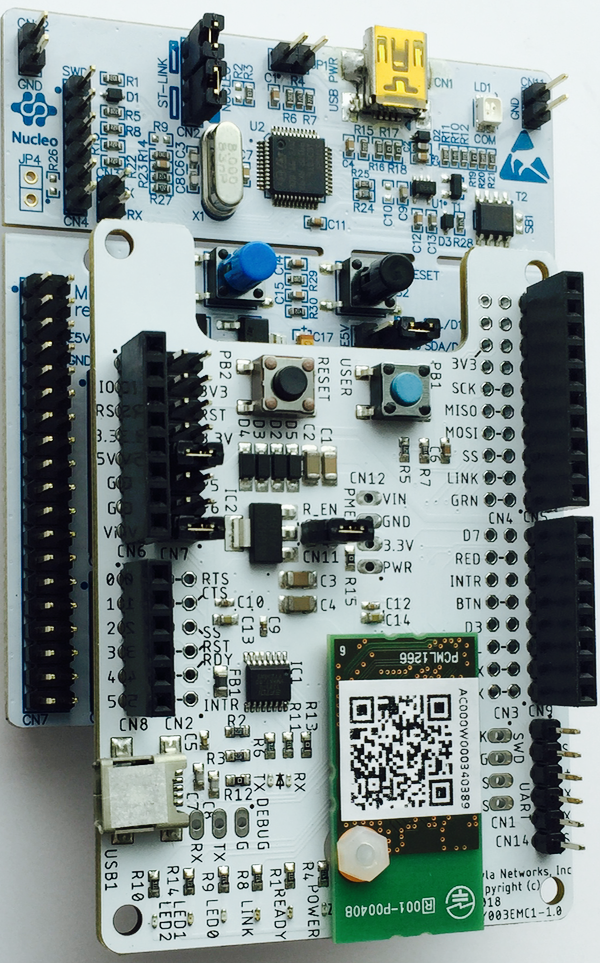
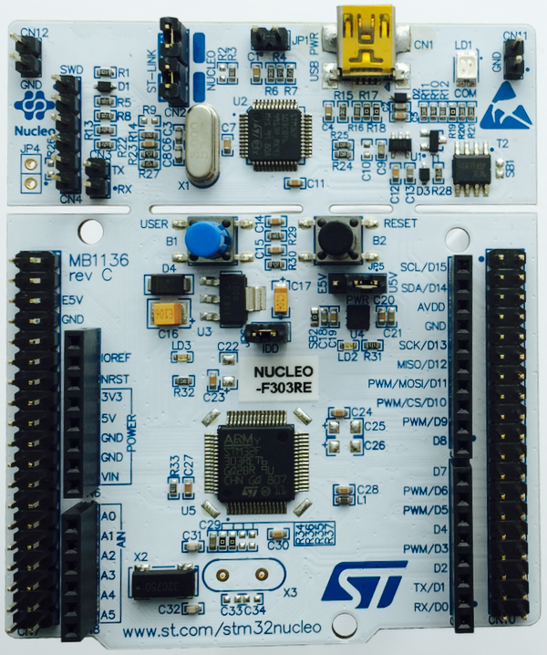
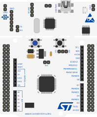
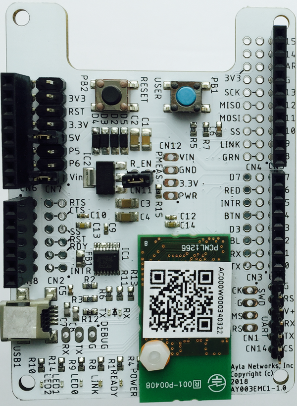

## Notes about Murata YD Dev Kit from Steve

We have implemented changes for the ledevb demo to work with the new board. It's just not packaged up for end customers to work with the source yet. We have to decide on how we want the end user distribution to work. I've been doing a little personal project with an ST Nucleo board. Their stuff all works with GCC, as does ours, so I think it is an option to set the demo up to use free gcc and make tools (use Mylan on Windows). With my experimenting, I've been using Windows and Eclipse, but the end developer could use the tool of his or her choice to edit. It could work with Windows, Linux and Mac, I believe. This would eliminate the issues of cost of the IDE, OS restrictions, overhead for customers to procure IDE and install, particularly if they don't intend to use it after eval. It could be set up so the package would be easy to port to host platforms other than the ST Nucleo we include in the kit. There's work to do on our end to get a distributable SW package together. All just thoughts at this point. Definitely interested in your input on this. Design docs, firmware, etc for the board are [here](https://aylait.sharepoint.com/:f:/r/sites/eng/device/Shared%20Documents/Engineering/Engineering%20Devices/Module%20Hardware/Dev%20Kits/Ayla%20Shield/Murata%20Type-YD%20Shield/Murata%20YD%20Dev%20Kit%20V3?csf=1&e=o4d4NW). 
The RC2 package contains the latest firmware and docs. The manufacturing guide will give you some information.

## Ayla Design Kit

The Ayla Design Kit is composed of a STM32 Nucleo Board and an Ayla shield driven by an Ayla Wi-Fi Production Module. 

### STM32 Nucleo Board

See [STM32 Nucleo Board](https://www.digikey.com/product-detail/en/stmicro/NUCLEO-F030R8/497-14361-ND/4695526&?gclid=EAIaIQobChMI4I2-6LWE4AIVCkRpCh1OLAwOEAQYASABEgJi-vD_BwE) information.

### Ayla Shield

<a href="AylaShieldSchematic-rev2-Final.png" target="_blank">Click to see the Ayla Shield schematic</a>

## Links

1. [Ayla Networks](https://www.aylanetworks.com/) &gt; [Get Started](https://www.aylanetworks.com/how-to-start-your-iot-project) &gt; [Build a Solution with Ayla's Developer Kit](https://www.aylanetworks.com/getting-started)
1. [Microsoft Azure IoT Developer Kit Homepage](https://microsoft.github.io/azure-iot-developer-kit)
1. [Microsoft Azure IoT Developer Kit Web Simulator](https://github.com/Azure-Samples/iot-devkit-web-simulator#create-an-az3166-device-in-your-iot-hub)
1. [Microsoft Azure Portal](https://portal.azure.com/)
1. [MSDN Channel 9](https://channel9.msdn.com/)

## Getting started
1. Purchase and deploy an Ayla Design Kit.
1. Create an Ayla developer account in the Ayla Developer Portal.
  1. What is this account called? 
  1. Need to distinguish this account from the OEM account. 
  1. Do users always start with this account? Do they ever start with their own OEM account?
1. Install a mobile app.
  1. Both iOS and Android supported.
  1. Should users use AMAP or Aura? 
  1. Why use the mobile app? 
  1. How easy is it to use a mobile app after migrating the device to an OEM account?
1. Register the device.
  1. Why not register via the Ayla Developer Portal?
  1. What does a factory reset do?
1. Interact with the device.
  1. Use the Ayla Developer Portal.
  1. Use AMAP/Aura.
  1. Use the Ayla Dashboard Portal.

  [Dev Kit V2 Mobile Onboarding Flow - Aura (PRD)](https://aylanetworks.atlassian.net/wiki/spaces/PM/pages/440533339/Dev+Kit+V2+Mobile+Onboarding+Flow+-+Aura+PRD)