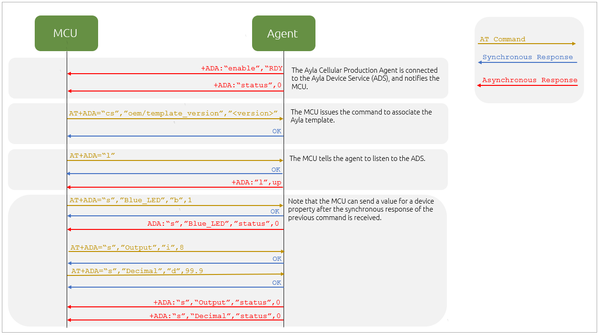

<aside id="pagebar" class="d-xl-block collapse">
  <ul>
    <li><a href="#core-title">Cellular v2.2.5</a></li>
    <li><a href="#at-commands">AT Commands</a>
      <ul>
        <li><a href="#configuration-command">Configuration Command</a></li>
        <li><a href="#listen-command">Listen Command</a></li>
        <li><a href="#send-property-command">Send Property Command</a></li>
        <li><a href="#agent-control-commands">Agent Control Commands</a></li>
        <li><a href="#configuration-commands">Configuration Commands</a></li>
        <li><a href="#ota-commands">OTA Commands</a></li>
        <li><a href="#update-factory-file">Update Factory File</a></li>
        <li><a href="#power-on-off">Power On/Off</a></li>
      </ul>
    </li>
  </ul>
</aside>

[Serial Programming/Modems and AT Commands](https://en.wikibooks.org/wiki/Serial_Programming/Modems_and_AT_Commands)

[Quectel BG96-GG Starter Kit](https://www.top-electronicsusa.com/quectel-bg96-gg-starter-kit-complete-initial-evaluation-kit-for-bg96-gg-ltem1-module-p-17741.html)

[LTE OPEN EVB Kit](https://www.quectel.com/product/lteopenkit.htm)

The Ayla Production Cellular Agent (also referred to as APCA) enables customers to connect to the Ayla Platform with out-of-the-box connectivity using a Quectel BG96 NB-IoT module. This delivers a stable and reliable underlying Device-Cloud messaging transport mechanism, optimized for NB-IoT cellular networks, with the following characteristics:

* Low bandwidth usage (e.g. 1MB/month or 30KB/day)
* Infrequent packet transmission (e.g. data points posted twice a day)
* High-latency networks (e.g. 10 - 20 seconds)
* Extended battery life (e.g. 1 - 5 years)
* Mobile/Nomadic

# AT Commands

Applications use the Ayla-proprietary AT commands in the table below to communicate with the Ayla Production Cellular Agent. The commands extend the [Hayes Command Set](https://en.wikipedia.org/wiki/Hayes_command_set), and comply with [ITU-T Recommendation V.250 (07/2003)](https://www.itu.int/rec/T-REC-V.250/en) which implies the following:

* Multiple values are comma-separated decimal or hexadecimal numbers and strings.
* The strings are quoted with double-quotes (").
* Double-quotes within strings are replaced with "\22" and backslash is replaced with "\5C.
* Any hex character can be replaced by "\xx" where xx is the hexadecimal ASCII value.

|Name|Command|
|-|-|
|[Set Config Parameter](#set-config-parameter)|`ADA="cs","<name>",<value>`|
|[Disable Agent](#disable-agent)|`ADA="disable",[<time>]`|
|[Enable Agent](#enable-agent)|`ADA="enable"`|
|[Apply Factory File](#apply-factory-file)|`ADA="factory"`|
|[Listen to Cloud](#listen-to-cloud)|`ADA="l"`|
|[Apply OTA Image](#apply-ota-image)|`ADA="ota","apply"`|
|[Download OTA Image](#download-ota-image)|`ADA="ota","dl",<type>,<id>[,<len>]`|
|[Notify OTA](#notify-ota)|`ADA="ota","notify"`|
|sss|`ADA="ota","status","host",<id>,<status>`|
|Sends property value and metadata to agent.|`ADA="s"`|
|Gets agent connection status.|`ADA="status"`|

## Set Config Parameter

`ADA="cs","oem/template","1.0"`

## Disable Agent

## Enable Agent

## Apply Factory File

## Listen to Cloud

## Apply OTA Image

## Download OTA Image

## Notify OTA

# Old Stuff


## Configuration Command

The AT command that is used for configuration (e.g. status, etc.) is +ADA. Only one AT command should be in progress at a time. The host MCU generally does not start another AT command until the synchronous response is provided for the AT command in progress. Each command gives a synchronous response, and some AT commands may give asynchronous responses later, which most often is to clarify an error response. The general format of the +ADA command is as follows:

```
AT+ADA="<subcmd>"[,args>]
Response OK
Response ERROR
+ADA: "<subcmd>","err",<code>,"<explanation>"
Error Code:
1 – missing
2 – busy
3 – unknown
4 – usage
5 – len err
6 – invalid
7 – err
8 – not supported
9 – cmd id
Asynchronous Response: +ADA: "<subcmd>"[,<parameters>]
```

Note: The asynchronous response always starts with a single space after the colon, which is followed by the sub-command in quotes, e.g. "+ADA:". The final synchronous response should always be either OK or ERROR. An error response can be preceded or followed by asynchronous responses that clarify the error. As already stated, the MCU generally does not start another AT command until the synchronous response is shown.

Following is a diagram of the power cycle sequence for the AT commands:



## Listen Command

This command enables the Ayla Production Cellular Agent to listen to the cloud (e.g. for get commands and when properties are changed in the cloud). The command gives the device time to send to-device properties to the cloud before the device properties are overwritten by new property values from the cloud. The command should be issued by the MCU every time the agent reconnects to the cloud and indicates that the MCU has updated any to-device properties that have changed locally.

For example, when the device is disconnected from the cloud, both the device and the cloud may update a device property with different values. Then, when the device reconnects to the cloud, the MCU must choose the new value from the cloud or the device:

* If the MCU uses the new property value from the device, the MCU sends the value to the cloud first; the cloud updates its value and issues the Listen commands to sync all device properties to the new value.
* If the MCU uses the new property value from the cloud, the MCU issues the Listen commands, and the to-device properties kept locally on the device are overwritten by the new values from the cloud.

```
AT+ADA="l"
Response OK
Asynchronous Responses:
  +ADA: "l","down" - indicates a loss of connection to the service.
  +ADA: "1","up" - indicates a connection to the service.
```

## Send Property Command

This command sends a property value to the Ayla Device Service (also sometimes referred to as ADS).

```
AT+ADA="s","<name>","<type>","<value>"
<name>	Property Name
<type>	b: Boolean; i: Integer; d: Decimal; s,st,ss,sn: String; m: meta data
<value>	Property value
Failure Responses	
  connection down 
  prop send unknown error 
  prop may not be in template 
  prop send failed
Asynchronous Response	
  +ADA: "s","<name>","status",<status-code> (0 for success)
```

Note: After receiving the synchronous response of OK, the next device property may be sent. The MCU does not need to wait for the asynchronous response before sending the next new value for a device property. You can issue multiple send property commands before getting the asynchronous response.

### Examples
To send the integer_out property with a value of 8, issue the command below. The length of the string property value for this interface is currently a maximum of 90 characters and must be ASCII.

```
AT+ADA="s","integer_out","i",8
OK
+ADA: "s","integer_out","status",0
```

To send the string in several parts, use the type "st" for the first part, "ss" for the following parts, and "sn" for the final part; refer to the following example:

```
AT+ADA="s","name","st","How "
OK
AT+ADA="s","name","ss","are "
OK
AT+ADA="s","name","ss","you "
OK
AT+ADA="s","name","sn","? "
OK
+ADA: "s","name","status",0
```

To send a string in one part:

```
AT+ADA="s","name","s","value"
OK
+ADA: "s","name","status",0
```

To send metadata, issue the key and value pairs first, and then send out the value of the property, for example:

```
AT+ADA="s","Sony","m","Artist","Queen"
OK
AT+ADA="s","Song","m","Time","5:54"
OK
AT+ADA="s","Song","s","Bohemian Rhapsody"
OK
```

## Agent Control Commands

These commands are used to operate the Ayla Production Cellular Agent.

### Disable and shut down the agent

This command stops the agent after completing any commands, including downloading an OTA firmware update. The agent gives an asynchronous response upon completion.

```
AT+ADA="disable",[<time>]
<time>	
  Optional time in seconds as an estimate of how much later the device 
  will reconnect to the Ayla Device Service. This can be reported to the
  service to influence the online/offline status of the device.
Response OK for success, or err for the error response
```

```
Asynchronous Response +ADA: "disable",<status>
<status>	
  OK for success, or rewake to indicate a reconnection to the ADS
```

Example

```
AT+ADA="disable"
OK
+ADA: "disable","ok"
```

```
(...<time> seconds passed)
+ADA: "disable","rewake"
```

### Enable the Agent

This command starts the agent, including the data call. By default, the agent also turns on automatically after booting up and issuing the asynchronous response "RDY" to indicate that the agent is up and starting to establish a connection to the Ayla Device Service. The MCU should wait for this message before issuing the first AT command to agent. You do not have to issue the enable command after booting up. The agent is already enabled after powering on. The MCU issues the enable command only if the MCU previously issued a disable command and wants to enable the agent again.

```
AT+ADA="enable"
Response	OK
Asynchronous Response	+ADA: "enable","RDY" – indicates that the service is connected
```

Example

```
AT+ADA="enable"
OK
+ADA: "enable","RDY"
```

### Get Status

This command gets the status of the agent’s connection to the Cloud. You should issue the status command and get 0 before sending properties. This command is not based on the Listen command, +ADA: "l","up". If you receive +ADA: "l","down", this means that the device is not connected to the cloud. In this case, you need to wait and issue the Listen command again. The Ayla Production Cellular Agent version 2.2.3 will not send an asynchronous response to indicate the connection status. Only the status command provides the connection status.

```
AT+ADA="status"
Response	
+ADA: "status",<call status code>
OK
```

```
Asynchronous Response +ADA: "status",<call status code>
<code>	
0 for connected normally, and other values to indicate the reason for the data call failure. 
See the Call Status Codes in the example below.
<call status code>	The reason for the data call failure if one occurred.
```

Example

```
AT+ADA="status"
+ADA: "status",0
OK
+ADA: "status",15
```

Call Status Codes
0      No error – connected
3      Non-specific error - the agent is not available for a non-specific issue
8      Busy - still connected, but the agent is temporarily not available to process more requests
15    Not connected – disabled

## Configuration Commands

These commands are used to set parameters in the Ayla-enabled module. Currently, there is only one configuration item supported. The response should always be synchronous.

```
AT+ADA="cs","<name>",<value>
<name>	The name of the configuration item.
<value>	The value of the configuration item.
Response	OK
Response (when the given value is same as the current value)	+ADA:"cs","<name>","no change"
Error Response	+ADA: "cs","err","<name>",<number>[,"<explanation>"]
```

Example

The MCU must send the template version (also known as the oem_host_version). The Ayla-enabled module will persist this value, so the MCU only has to send the value once after booting up or connecting with the module. After that, the MCU sends this value only if it changes. When the cloud receives a change to the template version, the cloud re-associates the agent to the new version.

Note: The template version is not the same as the host MCU firmware version since the template version only needs to change when an incompatible template change is required. Bug fixes or new features in the host MCU firmware do not require a template version change.

```
AT+ADA="cs","oem/template","1.0"
OK
```

## OTA Commands

The three OTA commands are described below. The Module OTA only supports the download of the Ayla Production Cellular Agent. The OTA of the Quectel SDK is not supported. Please work directly with Quectel to use FOTA with the Quectel BG96 NB-IoT module.

### Asynchronous Notification of the Image

```
ADA: "ota","notify",<type>,<id>,[<size>,<ver>]
<name>	The name of configuration item.
<type>	This is "host" or "module."
<id>	Short string specifying the ID of the OTA command to tie together the download and status commands.
<size>	Length of the image in bytes for the host OTA only
<ver>	Version of the image from the cloud for the host OTA only
```

Example: Notification of the Host OTA

```
AT+ADA: "ota","notify","host","id4",150224,"ver 1.3"
```

Example: Notification of the Module OTA

```
AT+ADA: "ota","notify","module","idm1"
```

### Downloading the Host Image

```
AT+ADA="ota","dl",<type>,<id>[,<len>]
<type>	This is "host" or "module."
<id>	Short string specifying the ID of the OTA command to tie together the download and status commands.
Response	OK
Async Response	+ADA: "ota","part",<id>,<data-base-64>
Error Response	+ADA: "ota","err",<number>[,"<explanation>"]
```

Example

Notice below that the 128 bytes of the image is downloaded first to, for example, check the header or in order to allow other commands to run during the download. Random data, which was 128 bytes before base-64 encoding, is shown.

```
AT+ADA="ota","dl","host","id4",128
OK

+ADA: "ota","part","id4","qHMvOsl52J8oad6w3LI1Jtdcrk6jC+ij5iXVyW"
+ADA: "ota","part","id4","sh7w/J0pnFwT5fKFA6GaTW2g3rmCIYuMKUZkTDU"
+ADA: "ota","part","id4","OKd58QLo6mh0uYDtQPcdNiQb+Kj7Tt4n9MOz7Gg"
+ADA: "ota","part","id4","aUBykInk4qZtOa+vIpIYcknvC8oxmFtmgj8cqRu"
+ADA: "ota","ok","id4","JdqD2RqArBzr4gs="
```

### Finishing the OTA Download

This command (shown below) indicates that the host has completed the OTA download and is ready to apply the image, or that the OTA download has failed.

```
AT+ADA="ota","status","host",<id>,<status>
<id>	
Short string specifying the ID of the OTA command to tie together the download and status commands.

<status>	Status code. 0 indicates success; non-zero is the patch error number.
Response	OK
```

This command can be sent at any time during the host OTA download in case of failures.

Module OTA Examples

Start a module OTA download:

```
AT+ADA="ota","dl","module","idm1"
OK
```

Send a notification when a module OTA download is complete:

```
+ADA: "ota","notify","module","idml","ready"
```

Have the MCU indicate that the module may apply the OTA and reboot:

```
AT+ADA="ota","apply","module","idm1"
OK
```

## Update Factory File

The procedures and commands provided below support the manufacturing process using the QFLOG tool to update the factory configuration file (with the file name of factory) located in the Customer folder in the Qualcomm CIOT platform alternate file system (e.g. /customer/factory).

### Appending CRC to the Factory File

Ayla provides a Python script called "QFLOGTransform.py", which appends the CRC calculation result to the end of the factory file. The following steps provide the commands to convert the factory file to a file with the CRC calculation appended. This can be done in any platform command console that can run Python 2.7. 

1. Install crcmod using C:\Python27\Scripts\pip, which is where pip is located on Windows.
    ```
    pip install crcmod
    ```
1. Run the script:
    ```
    python QFLOGTransform.py <QFLOG data file>
    ```
The output for the encoded file is "output.QFLOG". Before QFLOG transfers this file, it will be renamed to "factory.QFLOG".

### QFLOG Sending File

You can use QFLOG on a Windows system as follows:

Install python-2.7.16.amd64
Install pyserial using C:\Python27\Scripts\pip, which is where pip is located on Windows.
pip install pyserial

Copy QFLOG to C:\QFLOG.
In Windows, navigate as follows to add the new variable:
Open the System Properties dialog box, and click the Advanced tab.
Click the Environment Variable button.
In the System variables section, click the New... button.
In the New System Variable dialog box, enter "PYTHONPATH" for the Variable name, and then "C:\QFLOG;C:\QFLOG\src" for the Variable value. 
Send the following AT commands (to the CIOT platform) to enable QFLOG:
AT+QCFGEXT="qflogport",1

AT+QCFGEXT="qflogen",1

Reboot the Quectel BG96 NB-IoT module.
Once the BG96 module is online, push the factory.QFLOG file to the module; a sample of the command is as follows: 
python.exe .\src\QFLOGPackage\QFLOG.py -p COM[##] PUSH -f factory.QFLOG

### Verify and apply the factory setting sent by QFLOG

The command described below checks the CRC of the factory.QFLOG file sent by QFLOG. If the file’s CRC is correct, the factory file is applied to the system and keeps the setting for further use.

```
AT+ADA="factory"
Response	OK
Error Response	+ADA: "factory","err",<number>[,"<explanation>"]
```

## Power On/Off

The MCU must follow the power-on and power-off sequences detailed below to work properly with the Ayla agent.

### Power-On Sequence

1. The MCU waits for the unsolicited result code `+ADA: "enable","Rdy"` before issuing the first AT command. This code indicates that the agent is already connected to Ayla cloud.
1. The MCU issues listen `AT+ADA="l"` to inform the Ayla agent that the MCU is ready, and then waits for a response of `+ADA: "l","up"`, which indicates that the Ayla agent is also ready to process commands with the Ayla Cloud.
1. Every Ayla agent must have a template associated in cloud. The MCU can issue `AT+ADA="cs","oem/template_version"`,"<version>" to associate a template to the agent, or the MCU can use this command to associate a different template. The agent persists with the current template version and only does the re-association when the template is different.
1. The MCU can issue `AT+ADA="status"` for the connection status. Once issued, the MCU can get an unsolicited result code using `+ADA: "status", <code>` whenever the connection status changes.

### Power-Off Sequence

Before turning off the power, the MCU must issue `AT+ADA="disable"` and wait for a response of `+ADA: "disable","ok"`, which indicates that the agent finished all queue commands and is ready to be turned off.