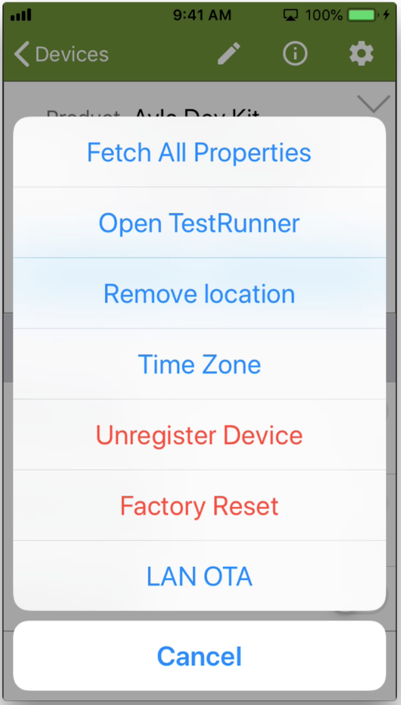
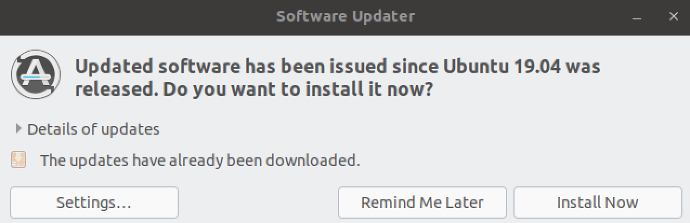
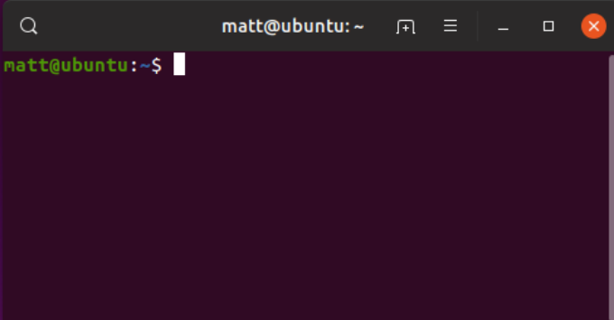

Ayla Development Kit provides an opportunity (1) to experiment with Ayla IoT Cloud features, and (2) to modify, build, flash, and run the example host application in preparation for connecting your own devices and gateways. The kit is composed of a STM32 Nucleo Board and an Ayla Shield:

The Ayla Shield includes an Ayla Wi-Fi Production module which is a communication module pre-loaded with an Ayla Agent that enables secure communication with the Ayla Cloud. Production modules are one of <a href="https://www.aylanetworks.com/edge-connectivity">several options</a> for connecting devices and gateways to the Cloud.

To request a kit, visit the <a href="http://iot.aylanetworks.com/ayla-dev-kit-freel-trial-program.html" target="_blank">Ayla Free Trial Program</a> landing page.

# About this guide

This guide helps you create a user account with EndUser access rights in the Ayla Public Account. 

Next, it shows you how to connect your kit to the Ayla Public Cloud Account, and register it to your user account:

Then, it helps you explore your kit using the Aura Mobile App, Ayla Developer Portal, and Ayla Dashboard Portal:

# Connect your kit

Connecting your dev kit to the Ayla Cloud takes only a few steps:

1. Connect your mobile device to a 2.4GHz Wi-Fi LAN.
1. On your mobile device, get and install the "Ayla Aura Mobile App" from [App Store](https://itunes.apple.com/us/app/ayla-aura/id1104515028?mt=8) or [Google Play](https://play.google.com/store/apps/details?id=com.aylanetworks.aura). You can also use the following QR Code to find the app:
    

1. To create a user account with EndUser access rights in the Ayla Public Account, tap <code>Sign Up</code>, fill in the form, receive the verification email on your mobile device, and confirm. If you already have a user account in an Ayla <u>Customer</u> Account, then you can use that account. To configure Aura to communicate with this account, see [these directions](/system-administration/aura-mobile-app/#configuration).
    

1. Tap "+" to add a device:
    

1. Tap Ayla Dev Kit:
    

1. Enter the same Wi-Fi credentials as those used by your mobile device, and tap Continue:
    

    

1. Take your Ayla Dev Kit out of the box.
1. Plug the small end of the cable into the STM32 Nucleo board:
    

1. Plug the large end into a USB outlet, tap continue, and then tap Join:
    

1. Tap Done to see your new device on the Devices screen. Then, tap *Ayla Dev Kit* to see the Details screen:
    

# Explore properties

This section helps you explore Ayla device properties. To start with, the Ayla Shield on your Ayla Development Kit has several important landmarks:

If you were the manufacturer of this device, you would decide which of these landmarks should be modeled in the Ayla Cloud. You might want the cloud to be aware when a user presses the blue button. And, you might want to cloud to be able to turn on/off the blue and green LEDs. So, you would designate these landmarks as device properties. The Ayla Cloud sees your Ayla Development Kit as a set of properties bundled into a digital twin:

Some of these properties (e.g. Blue_LED) do, indeed, represent device landmarks. Others (e.g. input & output) exist simply to demonstrate various property types: boolean, string, integer, decimal, and file. The following sections help you explore these properties.

## Boolean properties

1. Tap the Blue_LED property slider:
    

    The Blue LED on the dev kit illuminates. Tapping the slider sends an update *to the device*.
    

1. Tap the Blue_LED slider On/Off several times to generate a history of values.
1. Tap the Blue_LED name. The Property details screen appears. Pull down on the screen momentarily. The Datapoints list appears:
    

    A datapoint is a time-stamped property value.
1. Tap the Green_LED property slider:
    

    The Green LED on the dev kit illuminates. Tapping this slider also sends an update *to the device*.
    

1. Press the light-blue button on the Ayla Shield of the dev kit:
    

    The Blue_button property slider slides on.
    

    So, pressing the button on the kit sends an update *from the device*.

## String properties

1. Tap the white space to the right of the cmd property:
    

1. Enter a string like <code>community</code>, and tap Update Value.
    

    Setting the cmd property sends a string value *to the device*.
1. View the log property:
    

    The host app (on the device) sets <code>log = cmd</code>, and sends the string *from the device*.
1. Tap the version property name:
    

    The Property Details screen displays three property attributes:
    

    The *Current Value* attribute represents the host (application) software version because another attribute (not seen on this screen), <code>host_sw_version</code>, is set to `true`. The name <code>version</code> is non-essential.

## Integer properties

1. Tap the value to the right of the input property:

A dialog box appears.
1. Enter an integer like <code>5</code>, and tap Update Value.

Setting the input property sends an integer value *to the device*.
1. View the output property:

The host app (on the device) sets <code>output = input &#42; input</code>, and sends the integer *from the device*.

## Decimal properties

1. Tap the value to the right of the decimal_in property:

A dialog box appears.
1. Enter a decimal like <code>2.71</code>, and tap Update Value.

Setting the decimal_in property sends a decimal value *to the device*.
1. View the decimal_out property:

The host app (on the device) sets <code>decimal_out = decimal_in</code>, and sends the decimal *from the device*.

## File properties

1. In the Ayla Developer Portal, on the Device Menu, click the Properties tab to display the "stream" properties:

1. Set *stream_up_len* to 5000. The value will (almost immediately) change to zero. Setting *stream_up_len* to 5000 causes the Ayla Cloud to send the value 5000 to the host application on the dev kit. The host application responds by streaming 5000 bytes to the *stream_up* property in the Ayla Cloud. The 5000 bytes conform to a pattern similar to the following:
<pre>
"3D"3E"3F"3G"3H"3I"3J"...
</pre>
1. In the Display Name column, click the *stream_up* property.
1. Click Download, and download the generated file to your computer.
1. Open the file with a text editor to verify the pattern.
1. In the Current Value column of the *stream_down* row, click *click to update*.
1. Click Choose File, select the file you just downloaded, and click OK. The Ayla Cloud streams the file down to the host application on the dev kit. The host application does not store the file. Instead, it counts the number of bytes received, and sets *stream_down_len* to that count. It sets *stream_down_match_len* to the number of bytes that match the pattern originally uploaded. Both should be 5000. This behavior merely demonstrates file properties. You can customize this functionality in your own host application implementation.

# Explore schedules

This section introduces you to Ayla schedules. 

1. Ensure that the Blue_LED property is off.

1. Ensure that the time zone on the dev kit is set appropriately by clicking the Gear, and then Time Zone.

1. Tap the Schedules button on the Device screen.

The Schedules screen appears with one pre-made schedule called schedule_in. 

1. Tap schedule_in to display the Edit Schedule screen.

1. Scroll to Schedule Actions:

Note that this schedule sets Blue_LED to 1 at start date/time, and to 0 at end date/time.
1. Scroll to Start Time, and set the time to a few minutes from now.
1. Scroll to End Time, and set the time to a minute after Start Time.

1. Scroll to Active, and activate the schedule:

1. Tap *Save Schedule* at the bottom of the screen.
1. Observe (on the dev kit and in Aura) Blue_LED glow at start time, and dim at end time.

# Explore notifications

This section introduces you to push notifications of property or device conditions that you define. For example, you can configure the Ayla Cloud to send a push notification to your mobile device when the Green_LED property value changes, and/or when the Ayla Development Kit goes offline/online. For email and text message notifications, see [Ayla Developer Portal](/system-administration/ayla-developer-portal). To get started with push notifications, tap the *Notifications* button in Aura.

## Property notifications

1. Tap "+".
1. Tap "Property notification".
1. Configure the following fields:
<table>
<tr><th>Field</th><th>Value</th></tr>
<tr><td>Notification Name</td><td>Green LED Changed</td></tr>
<tr><td>Notification Message</td><td>The Green LED changed.</td></tr>
<tr><td>Condition</td><td>When Green_LED has Changed.</td></tr>
<tr><td>Send push notification to this device</td><td>&#10003;</td></tr>
</table>
1. Tap *Save Notifications*.
1. Turn on/off Green_LED. See a push notification similar to the following:

Wait a few seconds before generating the next push notification.
1. Uncheck *Send push ...*, and save again.

## Device notifications

1. Tap "+".
1. Tap "Device notification".
1. Configure the following fields:
<table>
<tr><th>Field</th><th>Value</th></tr>
<tr><td>Notification Name</td><td>Ayla Dev Kit Offline</td></tr>
<tr><td>Event</td><td>on_connection_lost</td></tr>
<tr><td>Threshhold</td><td>300 (seconds)</td></tr>
<tr><td>Notification Message</td><td>The Ayla Dev Kit is offline.</td></tr>
<tr><td>Send push notification to this device</td><td>&#10003;</td></tr>
</table>
1. Tap *Save Notifications*.
1. Disconnect the Ayla Dev Kit, and wait for a few minutes. See a push notification similar to the following:

1. Uncheck *Send push ...*, and save again.

# Explore device sharing

This section shows you how to share a device with another Ayla user account.

## Granting access

1. Tap Share Device at the bottom of the Device screen:

1. Enter the email address for an existing Ayla user account:

1. Choose capabilities:

Note that Default is the same as Read Only.
1. Optionally, choose a start and end date to define an active duration. Initially, leave this blank.
1. Tap Create Share:

You will see the following message:

1. Tap Menu Menu > Shares:

You will see the device under "Devices You Own" on the Shared Devices list:

1. Check your email. You will receive an email from the Ayla Cloud similar to the following:
<table>
<tr><th>Subject:</th><td>Matt Hagen granted access to device with ID: AC000W000123456</td></tr>
<tr><th>Message:</th><td>Hello, Matt Hagen granted read access to the device with ID: AC000W000123456</td></tr>
</table>
Note that each Ayla device has an id and a Device Serial Number (dsn). The value in the email is actually the dsn.

## Receiving access

The person with whom the device is shared will see the device on their Aura Devices list:

They will also see the device under "Devices Shared To You" on the Shared Devices list:

With default (read-only) access, most functionality will be disabled:

They will, however, receive notifications:

# Explore factory resets

A factory reset of your Ayla Development Kit reinitializes certain configuration parameters (e.g. Wi-Fi and Time Zone) to default values. For details about these configuration parameters, see [Configuration](#configuration).

Performing a factory reset is one step in the process of moving your dev kit from one LAN to another:

1. Factory reset your Ayla Dev Kit via Aura (see Aura Factory Reset below).
1. Connect your mobile device to the new LAN.
1. Start with [Connect your kit](#connect-your-kit), Step 4, above.

There are several ways to perform a factory reset. Here are two:

## Aura factory reset

Tap your device on the Aura Devices list, tap the gear (top-right), and tap Factory Reset:

## Physical factory reset

The diagram shows you how to perform a physical factory reset of the dev kit:

# Build environment

This section helps you download Ayla software and establish a build environment that enables you to iteratively modify, build, flash, and run the host application.

## Host Application

The host application (<code>ledevb.img</code>) consists of <code>demo.c</code> linked to four Ayla libraries: <code>libdemo.a</code>, <code>libayla.a</code>, <code>libtarget.a</code>, and <code>libcons.a</code>. It runs on the MCU of the STM32 Nucleo board, and interfaces via SPI or UART serial communication with the Ayla Agent running on the Ayla production module affixed to the Ayla Shield:

<code>demo.c</code> defines a set of properties appropriate for the Ayla Dev Kit:

<pre>
static struct prop prop_table[] =   {
  {"Blue_button", ATLV_BOOL, NULL, send_prop_with_meta, &blue_button, sizeof(blue_button)},
  {"Blue_LED", ATLV_BOOL, set_led, send_led, (void *)LED0, 1},
  {"Green_LED", ATLV_BOOL, set_led, send_led, (void *)LED1, 1},
  {"log", ATLV_UTF8, NULL, prop_send_generic, cmd_buf, 0},
  {"cmd", ATLV_UTF8, set_cmd, prop_send_generic, cmd_buf, 0},
  {"input", ATLV_INT, set_input, prop_send_generic, &input, sizeof(input)},
  {"output", ATLV_INT, NULL, prop_send_generic, &output, sizeof(output)},
  {"decimal_in", ATLV_CENTS, set_dec_in, prop_send_generic, &decimal_in, sizeof(decimal_in)},
  {"decimal_out", ATLV_CENTS, NULL, prop_send_generic, &decimal_out, sizeof(decimal_out)},
  {"schedule_in", ATLV_SCHED, demo_sched_set, NULL, &demo_sched[0]},
  {"stream_up", ATLV_LOC, NULL, demo_send_file_prop_with_meta, &stream_up_state, 0},
  {"stream_up_len", ATLV_INT, demo_set_length_up, prop_send_generic, &stream_up_len, sizeof(stream_up_len)},
  {"stream_down", ATLV_LOC, prop_dp_set, prop_dp_send, &stream_down_state, 0},
  {"stream_down_len", ATLV_UINT, NULL, prop_send_generic, &stream_down_state.next_off, sizeof(stream_down_state.next_off)},
  {"stream_down_match_len", ATLV_UINT, NULL, prop_send_generic, &stream_down_patt_match_len, sizeof(stream_down_patt_match_len)},
  {"version", ATLV_UTF8, NULL, send_version, NULL, 0},
  {"oem_host_version", ATLV_UTF8, NULL, prop_send_generic, template_version, sizeof(template_version) - 1},
};
</pre>

When you connect your Ayla Dev Kit to the Ayla Cloud, the cloud instantiates a digital twin from a template (not shown) to model the kit. Client applications like Aura interact with the Ayla Dev Kit via the digital twin:

## Ayla Host Library

The Ayla Host Library contains the source code and supporting files needed to customize, compile, link, download, and run the host application (<code>ledevb.img</code>) on the Ayla Dev Kit. The following diagram illustrates Ayla Host Library organization:

The following table provides an introductory description of the components that make up the host application.

<table>
<tr>
<th nowrap>Component</th>
<th>Description and Source Files</th>
</tr>
<tr>
<td rowspan="2" nowrap><code>demo.c</code></td>
<td>This is the only file you need to modify as you experiment with the Ayla Dev Kit. It implements an array of properties (with supporting functions) supported by the host application. You can modify this array.</td>
</tr>
<tr>
<td>
<code>example/app/ledevb/demo.c</code>
</td>
</tr>
<tr>
<td rowspan="2" nowrap><code>libdemo.a</code></td>
<td>These files compartmentalize host application functionality for better code organization. The factory reset code tells the Ayla Agent to "factory reset" when a user pushes the appropriate buttons on the dev kit. The polling code implements timers, callbacks, and continuous polling of the corresponding digital twin in the Ayla Cloud. The power management code puts the Ayla production module in standby mode, and wakes it up when needed. The image management code participates in over-the-air updates.</td>
</tr>
<tr>
<td>
<code>example/libdemo/demo_factory_reset.c</code> 
<code>example/libdemo/demo_poll.c</code> 
<code>example/libdemo/demo_power.c</code> 
<code>example/libdemo/demo_img_mgmt.c</code>
</td>
</tr>
<tr>
<td rowspan="2" nowrap><code>libcons.a</code></td>
<td>This library enables serial communication, primarily for debugging purposes, between your computer and the host app running on the MCU of the host board. Run <code>screen /dev/ttyACM0 115200</code> or similar in a terminal to initiate communication, and press <code>Ctl-A + k + y</code> to terminate the session. Use the <code>demo_log</code> function to <code>printf</code> messages from the host app on the dev kit to a terminal on your computer. See the <code>console_cmds</code> array in <code>console.c</code> for a list of commands.</td>
</tr>
<tr>
<td>
<code>example/libcons/atty.c</code> 
<code>example/libcons/cmd_handle.c</code> 
<code>example/libcons/console.c</code> 
<code>example/libcons/parse_argv.c</code> 
<code>example/libcons/parse_hex.c</code> 
<code>example/libcons/printf.c</code>
</td>
</tr>
<tr>
<td rowspan="2" nowrap><code>libayla.a</code></td>
<td>This platform-independent library implements the Ayla Agent API. Below are just a few examples of important API functions and structs used by the host application. Name prefixes indicate the corresponding library file:

<code>void host_event_register(struct host_event_callback &ast;cb);</code>

<code>int prop_send(struct prop &ast;, const void &ast;val, size_t val_len, void &ast;arg);</code>

<code>void prop_table_add(struct prop_table &ast;table);</code>

<code>void sched_run_all(u32 &ast;tick_ct_to_use);</code>

<code>struct prop_table {...};</code>

</td>
</tr>
<tr>
<td>
<code>ayla/libayla/callback.c</code> 
<code>ayla/libayla/clock_utils.c</code> 
<code>ayla/libayla/conf_access.c</code> 
<code>ayla/libayla/crc16.c</code> 
<code>ayla/libayla/crc32.c</code> 
<code>ayla/libayla/host_event.c</code> 
<code>ayla/libayla/host_lib.c</code> 
<code>ayla/libayla/host_log.c</code> 
<code>ayla/libayla/host_ota.c</code> 
<code>ayla/libayla/prop_dp.c</code> 
<code>ayla/libayla/props.c</code> 
<code>ayla/libayla/sched.c</code> 
<code>ayla/libayla/schedeval.c</code> 
<code>ayla/libayla/serial_msg.c</code> 
<code>ayla/libayla/spi.c</code> 
<code>ayla/libayla/spi_ping.c</code> 
<code>ayla/libayla/timer.c</code> 
<code>ayla/libayla/tlv.c</code> 
<code>ayla/libayla/uart.c</code> 
<code>ayla/libayla/utf8.c</code> 
<code>ayla/libayla/wifi_conf.c</code>
</td>
</tr>
<tr>
<td rowspan="2" nowrap><code>libtarget.a</code></td>
<td>This platform-dependent library implements the host board API. As you can see by the files below, the default host board is the STM32F303RE Nucleo board. Porting your host application to a different host board means replacing <code>libtarget.a</code>.</td>
</tr>
<tr>
<td>
<code>arch/stm32/al_intr.c</code> 
<code>arch/stm32/stm32.c</code> 
<code>arch/stm32/uart_platform_noOS.c</code> 
<code>arch/stm32f3/mcu_io.c</code> 
<code>arch/stm32f3/spi_platform.c</code> 
<code>arch/stm32f3/stm32f3_discovery.c</code> 
<code>arch/stm32f3/uart_platform.c</code> 
<code>arch/stm32f3/console_platform.c</code> 
<code>ext/STM32F30x_StdPeriph_Driver/src/stm32f30x_rcc.c</code> 
<code>ext/STM32F30x_StdPeriph_Driver/src/stm32f30x_exti.c</code> 
<code>ext/STM32F30x_StdPeriph_Driver/src/stm32f30x_flash.c</code> 
<code>ext/STM32F30x_StdPeriph_Driver/src/stm32f30x_gpio.c</code> 
<code>ext/STM32F30x_StdPeriph_Driver/src/stm32f30x_misc.c</code> 
<code>ext/STM32F30x_StdPeriph_Driver/src/stm32f30x_spi.c</code> 
<code>ext/STM32F30x_StdPeriph_Driver/src/stm32f30x_syscfg.c</code> 
<code>ext/STM32F30x_StdPeriph_Driver/src/stm32f30x_tim.c</code> 
<code>ext/CMSIS/Device/ST/STM32F30x/Source/Templates/system_stm32f30x.c</code>
</td>
</tr>
</table>

## Set up an environment

This section helps you set up a GNU build environment on VMware/Ubuntu so that you can iteratively modify and build the host application on your computer, and download and run it on the STM32 Nucleo board of your Ayla Dev Kit.

<ol>
<li>Browse to <a href="https://ubuntu.com/download/desktop">Download Ubuntu Desktop</a>.</li>
<li>Download <code>Ubuntu 19.04</code>.</li>
<li>Run VMware Fusion, click <code>File &gt; New</code>, and drag <code>ubuntu-19.04-desktop-amd64.iso</code> to the installation screen:

</li>
<li>Complete the installation:

</li>
<li>In the VM, if prompted, update software, and reboot:

</li>
<li>Open a terminal:

</li>
<li><code>sudo apt install git</code>.</li>
<li><code>sudo apt install screen</code>.</li>
<li>Add your user to the <code>dialout</code> group, and restart:
<pre>
$ groups matt
matt : matt adm cdrom sudo dip plugdev lpadmin sambashare
$ sudo usermod -a -G dialout matt
$ groups matt
matt : matt adm dialout cdrom sudo dip plugdev lpadmin sambashare
</pre>
</li>
<li>Inspect the OS environment:
<pre>
$ git --version
git version 2.20.1

$ screen --version
Screen version 4.06.02 (GNU) 23-Oct-17

$ python2 --version
Python 2.7.16

$ python3 --version
Python 3.7.3

$ unzip --version
caution:  both -n and -o specified; ignoring -o
UnZip 6.00 of 20 April 2009, by Debian. Original by Info-ZIP.

$ gcc --version
gcc (Ubuntu 8.3.0-6ubuntu1) 8.3.0
Copyright (C) 2018 Free Software Foundation, Inc.

$ make --version
GNU Make 4.2.1
Built for x86_64-pc-linux-gnu
Copyright (C) 1988-2016 Free Software Foundation, Inc.
</pre>
</li>
</ol>

## Add ARM and Ayla

<ol>
<li>Browse to <a href="https://developer.arm.com/tools-and-software/open-source-software/developer-tools/gnu-toolchain/gnu-rm/downloads">ARM</a>, and download <code>gcc-arm-none-eabi-8-2018-q4-major-linux.tar.bz2</code>.</li>
<li>Move the file to <code>/home/matt</code>, and extract:
<pre>
$ tar xjf gcc-arm-none-eabi-8-2018-q4-major-linux.tar.bz2
</pre>
You should see the following in <code>/home/matt</code>:
<pre>
$ ls -1d gcc&ast;
gcc-arm-none-eabi-8-2018-q4-major
gcc-arm-none-eabi-8-2018-q4-major-linux.tar.bz2
</pre>
</li>
<li>Install <code>openocd</code>:
<pre>
$ sudo apt-get install openocd
</pre>
It should install in the following location:
<pre>
$ ls -1 /usr/bin/openocd
/usr/bin/openocd
</pre>

Note the <code>/usr/share/openocd/scripts</code> directory which contains essential configuration files (e.g. <code>board/st_nucleo_f3.cfg</code>) that enable openocd to communicate with your Ayla Dev Kit.

You may want to run these commands:
<pre>
$ which openocd
/usr/bin/openocd

$ openocd --version
Open On-Chip Debugger 0.10.0
</pre>
</li>
<li><a href="https://connection.aylanetworks.com/s/article/Ayla-Host-Library-and-Reference-Application" target="_blank">Download the Ayla Host Library</a> archive file (e.g. Ayla-host-lib-2.0.zip) to <code>/home/matt</code>, and unzip:
<pre>
$ unzip Ayla-host-lib-2.0-rc4.zip
</pre>
You should see this in <code>/home/matt</code>:
<pre>
$ ls -1d Ayla&ast;
Ayla-host-lib-2.0
Ayla-host-lib-2.0-rc4.zip
</pre>
If you need to copy the Ayla Host Library archive file from your computer to the VM, you first need to enable sharing:
<ol>
<li>On the VMware Fusion menu bar, click <code>Virtual Machine &gt; Sharing &gt; Sharing Settings</code>.</li>
<li>Check <code>Enable Shared Folders</code>.</li>
<li>Click the <code>+</code> sign, and add a folder.</li>
<li>Exit the Sharing dialog box.</li>
<li>In a VM terminal, access the shared folder with <code>cd /mnt/hgfs</code> and <code>ls</code>.</li>
</ol>
</li>
<li>Modify your shell environment:
<pre>
$ export TOOLCHAIN_DIR=/home/matt/gcc-arm-none-eabi-8-2018-q4-major
$ export PYTHON=python3
</pre>
</li>
<li>Build Ayla components:
<pre>
$ cd ~/Ayla-host-lib-2.0
$ make
</pre>
<li>Connect your computer to the STM32 Nucleo board of your Ayla Dev Kit:

</li>
<li>Connect to Linux:

The following notification appears:

</li>
<li>Flash <code>build/stm32f3_nucleo/spi/example/app/ledevb/ledevb.img</code> to your Ayla Dev Kit:
<pre>
$ make download
</pre>
</li>
</ol>

## Test the environment

Recall that the default host application includes <code>input</code> and <code>output</code> integer properties, and that when you set <code>input</code> to a value (e.g. <code>5</code>) the host application sets <code>output</code> to <code>input * input</code> (e.g. <code>25</code>). Changing this behavior so that the host application sets <code>output</code> to <code>input + input</code> (e.g. <code>10</code>) provides a simple way to test your build environment:

<ol>
<li><code>cd ~/Ayla-host-lib-2.0</code>.</li>
<li><code>cp example/app/ledevb/demo.c example/app/ledevb/demo.orig</code>.</li>
<li><code>nano example/app/ledevb/demo.c</code>.</li>
<li>Find the <code>prop_table</code> array:
<pre>
static struct prop prop_table[] = {
  ...
  ...
}
</pre>
</li>
<li>Find the <code>input</code> prop structure within the array:
<pre>
{"input", ATLV_INT, set_input, prop_send_generic, &input, sizeof(input)},
</pre>
Note that the Ayla Cloud invokes <code>set_input</code> to set a new value for the <code>input</code> property.
</li>
<li>Find the <code>set_input</code> function:
<pre>
static void set_input(struct prop &ast;prop, void &ast;arg, void &ast;valp, size_t len)
  ...
  output = i &ast; i;
  ...
}
</pre>
</li>
<li>Change <code>i &ast; i</code> to <code>i + i</code>, and save.</li>
<li><code>make</code> and <code>make download</code>.
<li>Press/release the black button on the host board to run the newly downloaded host app.

</li>
<li>In Aura, change <code>input</code> to some value (e.g. <code>4</code>), and verify that <code>output</code> changes to twice the value (e.g. <code>8</code>).

</li>
</ol>

# Tutorials

Below are a set of tutorials that build on the Baseline application.

## Baseline application

This example is a simplified version of the default <code>example/app/ledevb/demo.c</code>. As you can see in the listing, it includes only four properties: <code>Blue_button</code>, <code>Green_LED</code>, <code>version</code>, and <code>oem_host_version</code>. Below the listing are instructions for running the example followed by a line-by-line analysis. Subsequent pages in the guide provide a series of examples that augment this baseline example to help you explore additional capabilities.

<pre class="numbered">
#include &lt;string.h&gt;
#include &lt;ayla/utypes.h&gt;
#include &lt;ayla/host_lib.h&gt;
#include &lt;arch/board.h&gt;
#include &lt;mcu_io.h&gt;
#include &lt;toolchain/attributes.h&gt;
#include &lt;ayla/ayla_proto_mcu.h&gt;
#include &lt;ayla/props.h&gt;
#include &lt;demo/demo.h&gt;

#define DEMO_SUFFIX ""
#define DEMO_NAME "demo"
#define DEMO_VERSION "2.0"

const char version[] ATTRIB_VERSION = DEMO_NAME DEMO_SUFFIX " " DEMO_VERSION " " BUILD_VERSION;
static char template_version[] = DEMO_NAME DEMO_SUFFIX " 1.9";

static u8 blue_button;

static void set_led(struct prop &ast;prop, void &ast;arg, void &ast;valp, size_t len) {
  u8 val = &ast;(u8 &ast;)valp;
  u32 led = (u32)arg;
  board_led_set(led, val);
}

static int send_led(struct prop &ast;prop, void &ast;arg) {
  u32 led = (u32)prop-&gt;arg;
  u8 val = board_led_get(led);
  return prop_send(prop, &val, sizeof(val), arg);
}

static int send_version(struct prop &ast;prop, void &ast;arg) {
  return prop_send(prop, version, strlen(version), arg);
}

static struct prop prop_table[] = {
  {"Blue_button", ATLV_BOOL, NULL, prop_send_generic, &blue_button, sizeof(blue_button)},
  {"Green_LED", ATLV_BOOL, set_led, send_led, (void &ast;)LED1, 1},
  {"version", ATLV_UTF8, NULL, send_version, NULL, 0},
  {"oem_host_version", ATLV_UTF8, NULL, prop_send_generic, template_version, sizeof(template_version) - 1},
};

static struct prop_table demo_prop_table = PROP_TABLE_INIT(prop_table);

static void demo_set_button_state(u32 button, u32 button_value) {
  blue_button = button_value;
  prop_send_req("Blue_button");
}

int main(int argc, char &ast;&ast;argv) {
  board_init(argc, argv);
  ayla_host_lib_init();
  board_module_reset();
  demo_factory_reset_handle();
  mcu_button_handler_set(0, demo_set_button_state);
  prop_table_add(&demo_prop_table);
  prop_send_req_to_ads_only("version");
  prop_request_value(NULL);

  for (;;) {
    demo_poll();
  }
}
</pre>

## Run the example

<ol>
<li><code>cd ~/Ayla-host-lib-2.0</code>.</li>
<li>If necessary, <code>cp example/app/ledevb/demo.c example/app/ledevb/demo.orig</code>.</li>
<li><code>nano example/app/ledevb/demo.c</code>, and replace the contents with the example.</li>
<li><code>make</code> and <code>make download</code>.
<li>Press/release the black button on the host board.</li>
<li>Verify that the <code>Blue_button</code> and <code>Green_LED</code> properties work.</li>
</ol>

## Analyze the example

### prop_table

The primary Ayla-related purpose of a host application is to define and maintain a <code>prop_table</code> with one entry for each supported property:

<pre class="numbered" style="counter-reset: line 35;">
static struct prop prop_table[] = {
  {"Blue_button", ATLV_BOOL, NULL, prop_send_generic, &blue_button, sizeof(blue_button)},
  {"Green_LED", ATLV_BOOL, set_led, send_led, (void &ast;)LED1, 1},
  {"version", ATLV_UTF8, NULL, send_version, NULL, 0},
  {"oem_host_version", ATLV_UTF8, NULL, prop_send_generic, template_version, sizeof(template_version) - 1},
};

static struct prop_table demo_prop_table = PROP_TABLE_INIT(prop_table);

prop_table_add(&demo_prop_table);
</pre>

A <code>prop_table</code> is an array of <code>struct prop</code> instances, each containing the name, type, set function pointer, send function pointer, value, and/or other information pertinent to a supported property. <code>To Device</code> properties like <code>Green_LED</code> have both set and send function pointers. The Ayla Cloud calls the set function to, for example, power on/off an LED. The host application utilizes the send function to provide the current state of the property to the Ayla Cloud when, for example, the device comes back online. <code>From Device</code> properties like <code>Blue_button</code>, <code>version</code>, and <code>oem_host_version</code>, which send information to the Ayla Cloud, but do not receive information from the cloud, have <code>send</code> functions, but not <code>set</code> functions. So, for example, <code>Blue_button</code> sends changes in button state to the Ayla Cloud, but does not allow the cloud to change button state. 

The <code>PROP_TABLE_INIT</code> macro transforms a <code>struct prop</code> array into a <code>struct prop_table</code> as required by the <code>prop_table_add</code> function which provides to the Ayla Agent a pointer to the property table. 

These structures and macros are defined in <code>ayla/libayla/include/ayla/props.h</code>.

### Blue_button

To handle blue button interrupt events, the host application implements <code>demo_set_button_state</code> which sets <code>blue_button</code> to the new value, and then calls <code>prop_send_req</code> to schedule the sending of the Blue_button property value via <code>prop_send_generic</code>. 

<pre class="numbered" style="counter-reset: line 44;">
static u8 blue_button;

static void demo_set_button_state(u32 button, u32 button_value) {
  blue_button = button_value;
  prop_send_req("Blue_button");
}

mcu_button_handler_set(0, demo_set_button_state);
</pre>

During initialization, the host application registers <code>demo_set_button_state</code> with the platform-dependent layer (<code>libtarget.a</code>) by calling <code>mcu_button_handler_set</code>.

### Green_LED

To handle green LED events from the Ayla Cloud, the host application implements <code>set_led</code> which calls <code>board_led_set</code>, part of the platform-dependent layer in <code>libtarget.a</code>, to power on/off the LED. 

<pre class="numbered" style="counter-reset: line 19;">
static void set_led(struct prop &ast;prop, void &ast;arg, void &ast;valp, size_t len) {
  u8 val = &ast;(u8 &ast;)valp;
  u32 led = (u32)arg;
  board_led_set(led, val);
}

static int send_led(struct prop &ast;prop, void &ast;arg) {
  u32 led = (u32)prop-&gt;arg;
  u8 val = board_led_get(led);
  return prop_send(prop, &val, sizeof(val), arg);
}
</pre>

The host application also implements <code>send_led</code> to determine the current state of an LED, and send the state to the Ayla Cloud, usually at initialization time.

### version

The <code>version</code> property specifies the host application software version (e.g. <code>demo 2.0 2019-06-06 06:29:07</code>). You do not have to use the constants and macro seen in the code snippet. You can use a string instead.

<code>ATTRIB_VERSION</code> is defined in <code>toolchain/gcc/include/toolchain/attributes.h</code>.

<code>BUILD_VERSION</code> is defined in <code>example/libdemo/include/demo/demo.h</code>

<pre class="numbered" style="counter-reset: line 10;">
#define DEMO_SUFFIX ""
#define DEMO_NAME "demo"
#define DEMO_VERSION "2.0"

const char version[] ATTRIB_VERSION = DEMO_NAME DEMO_SUFFIX " " DEMO_VERSION " " BUILD_VERSION;
</pre>

Important: The property name "version" does NOT indicate that this property contains the host application software version. Rather, it is the property attribute "Host SW Version" set to TRUE. To see this property attribute, browse to the [Ayla Developer Portal](/system-administration/ayla-developer-portal), click on the DSN of your device, click on the <code>version</code> property, and note the "Host SW Version" attribute set to TRUE.

### oem_host_version

The <code>oem_host_version</code> property helps to tell the Ayla Cloud which template to use when instantiating a digital twin for this device. The Ayla Cloud actually uses the OEM ID, OEM Model, and template version when choosing a template for a device.

<pre class="numbered" style="counter-reset: line 10;">
#define DEMO_SUFFIX ""
#define DEMO_NAME "demo"

static char template_version[] = DEMO_NAME DEMO_SUFFIX " 1.9";

static struct prop prop_table[] = {
  {"oem_host_version", ATLV_UTF8, NULL, prop_send_generic, template_version, sizeof(template_version) - 1},
};
</pre>

<code>oem_host_version</code> is an "internal reserved property" by name. The Ayla Cloud creates one of these properties for each digital twin. 

### main

<pre class="numbered" style="counter-reset: line 49;">
int main(int argc, char &ast;&ast;argv) {
  board_init(argc, argv);
  ayla_host_lib_init();
  board_module_reset();
  demo_factory_reset_handle();
  mcu_button_handler_set(0, demo_set_button_state);
  prop_table_add(&demo_prop_table);
  prop_send_req_to_ads_only("version");
  prop_request_value(NULL);

  for (;;) {
    demo_poll();
  }
}
</pre>

<table class="code-line">
<tr>
<td>Line 51</td>
<td>The <code>board_init</code> function initializes the host board which may include initializing timers, interrupts, and serial communication.</td>
</tr>
<tr>
<td>Line 52</td>
<td>The <code>ayla_host_lib_init</code> function initializes platform-independent <code>libayla.a</code> which enables communication between the host application and the Ayla Agent.</td>
</tr>
<tr>
<td>Line 53</td>
<td>The <code>board_module_reset</code> function sets up a reset line to the Ayla Module, and pulses the line to reset the module.</td>
</tr>
<tr>
<td>Line 54</td>
<td>The <code>demo_factory_reset_handle</code> function checks to see if a user has pushed a button on the host board to cause a factory reset and, if so, tells the Ayla Module to reset the host board.</td>
</tr>
<tr>
<td>Line 55</td>
<td>The <code>mcu_button_handler_set</code> function tells <code>libtarget.a</code> which function to call for button interrupts.</td>
</tr>
<tr>
<td>Line 56</td>
<td>The <code>prop_table_add</code> function provides <code>libayla.a</code> a pointer to the <code>demo_prop_table</code> which includes a pointer to the <code>prop_table</code> array.</td>
</tr>
<tr>
<td>Line 57</td>
<td>The <code>prop_send_req_to_ads_only</code> function schedules the sending of the <code>version</code> property value to the Ayla Cloud.</td>
</tr>
<tr>
<td>Line 58</td>
<td>The <code>prop_request_value</code> function asks the Ayla Cloud to send all "To Device" property values to the host application. </td>
</tr>
<tr>
<td>Line 61</td>
<td>The <code>demo_poll</code> function processes callbacks and timers. It must be called within an infinite loop.</td>
</tr>
</table>

## Console example

This example shows how to enable serial communication between (1) a terminal on your computer and (2) the host application on your dev kit. With serial communication enabled, you can (a) issue commands to the host app, and (b) view <code>printf</code> messages from the host app, helpful especially during development. In the example, the yellow lines, which implement console functionality, are additions to the [Baseline application](#baseline-application).

<pre class="numbered">
#include &lt;string.h&gt;
#include &lt;ayla/utypes.h&gt;
#include &lt;ayla/host_lib.h&gt;
#include &lt;arch/board.h&gt;
#include &lt;mcu_io.h&gt;
#include &lt;toolchain/attributes.h&gt;
#include &lt;ayla/ayla_proto_mcu.h&gt;
#include &lt;ayla/props.h&gt;
#include &lt;demo/demo.h&gt;

#define DEMO_SUFFIX ""
#define DEMO_NAME "demo"
#define DEMO_VERSION "2.0"

const char version[] ATTRIB_VERSION = DEMO_NAME DEMO_SUFFIX " " DEMO_VERSION " " BUILD_VERSION;
static char template_version[] = DEMO_NAME DEMO_SUFFIX " 1.9";

static u8 blue_button;

static void set_led(struct prop &ast;prop, void &ast;arg, void &ast;valp, size_t len) {
  u8 val = &ast;(u8 &ast;)valp;
  u32 led = (u32)arg;
  board_led_set(led, val);
  demo_log("%s set %s to %u", prop_source_string(prop), prop->name, val);
}

static int send_led(struct prop &ast;prop, void &ast;arg) {
  u32 led = (u32)prop-&gt;arg;
  u8 val = board_led_get(led);
  return prop_send(prop, &val, sizeof(val), arg);
}

static int send_version(struct prop &ast;prop, void &ast;arg) {
  return prop_send(prop, version, strlen(version), arg);
}

static struct prop prop_table[] = {
  {"Blue_button", ATLV_BOOL, NULL, prop_send_generic, &blue_button, sizeof(blue_button)},
  {"Green_LED", ATLV_BOOL, set_led, send_led, (void &ast;)LED1, 1},
  {"version", ATLV_UTF8, NULL, send_version, NULL, 0},
  {"oem_host_version", ATLV_UTF8, NULL, prop_send_generic, template_version, sizeof(template_version) - 1},
};

static struct prop_table demo_prop_table = PROP_TABLE_INIT(prop_table);

static void demo_set_button_state(u32 button, u32 button_value) {
  blue_button = button_value;
  prop_send_req("Blue_button");
}

int main(int argc, char &ast;&ast;argv) {
  board_init(argc, argv);
  ayla_host_lib_init();
#ifdef DEMO_CONSOLE
  atty_init(console_cli);
#endif
  board_module_reset();
  demo_factory_reset_handle();
  demo_log("host application version is \"%s\"", version);
  demo_log("Host template version is \"%s\"", template_version);
  demo_log("host library version is \"%s\"", ayla_host_lib_version());
  mcu_button_handler_set(0, demo_set_button_state);
  prop_table_add(&demo_prop_table);
  prop_send_req_to_ads_only("version");
  prop_request_value(NULL);
  demo_log("init completed\n");

  for (;;) {
    demo_poll();
  }
}
</pre>

Run the example:

<ol>
<li><code>cd ~/Ayla-host-lib-2.0</code>.</li>
<li><code>nano example/app/ledevb/demo.c</code>, and replace the contents with the example.</li>
<li><code>make</code> and <code>make download</code>.
<li>Open a screen session with <code>screen /dev/ttyACM0 115200</code> or similar.</li>
<li>Press/release the black button on the host board.</li>
<li>View the output in your screen session:
<pre>
demo: host application version is "demo 2.0 2019-06-06 13:05:05"
demo: Host template version is "demo 1.9"
demo: host library version is "ayla_host_lib 2.0"
demo: init completed
ADS connection DOWN
ADS connection DOWN
ADS connection UP
demo: cloud set Green_LED to 0
pushed version
</pre>
</li>
<li>Terminate the screen session with <code>Ctl-A + k + y</code>.</li>
</ol>

Analyze the example:

<table class="code-line">
<tr>
<td>Line 54</td>
<td>

<code>DEMO_CONSOLE</code> is set to TRUE by default. You can set it to FALSE on the make command line like this:

<pre>
$ touch example/app/ledevb/demo.c
$ make NO_CONSOLE=1
</pre>
See <code>Makefile</code> for more details.
</td>
</tr>
<tr>
<td>Line 55</td>
<td><code>console_cli</code> is the function in <code>example/libcons/console.c</code> that handles console commands. <code>atty_init</code> initializes serial communication between your computer and the host board. It also initializes <code>libcons.a</code>. It is defined in <code>example/libcons/atty.c</code>.</td>
</tr>
<tr>
<td>Line 24 Line 59 Line 60 Line 61 Line 66</td>
<td>

<code>demo_log</code> defined in <code>example/libdemo/include/demo/demo.h</code> is a macro that, if <code>DEMO_CONSOLE = TRUE</code>, is replaced with the following:

<pre>
printf("demo: " fmt "\n", ##__VA_ARGS__)
</pre>
</td>
</tr>
</table>

## Ack example

This example shows how to report to the Ayla Cloud the status of a property update just received from the Ayla Cloud. The example implements the <code>input</code> and <code>output</code> properties mentioned in [Test the environment](#test-the-environment), but limits permissible <code>input</code> values to between 5 and -5 inclusive, so that the greatest permissible <code>output</code> value is <code>5 &ast; 5 = 25</code>. In the example, the yellow lines, which implement acknowledgement functionality, are additions to the [Baseline application](#baseline-application).

<pre class="numbered">
#include &lt;string.h&gt;
#include &lt;ayla/utypes.h&gt;
#include &lt;ayla/host_lib.h&gt;
#include &lt;arch/board.h&gt;
#include &lt;mcu_io.h&gt;
#include &lt;toolchain/attributes.h&gt;
#include &lt;ayla/ayla_proto_mcu.h&gt;
#include &lt;ayla/props.h&gt;
#include &lt;demo/demo.h&gt;

#define DEMO_SUFFIX ""
#define DEMO_NAME "demo"
#define DEMO_VERSION "2.0"

const char version[] ATTRIB_VERSION = DEMO_NAME DEMO_SUFFIX " " DEMO_VERSION " " BUILD_VERSION;
static char template_version[] = DEMO_NAME DEMO_SUFFIX " 1.9";

static u8 blue_button;
static s32 input;
static s32 output;

enum demo_val_err {VAL_NO_ERR = 0, VAL_BAD_LEN, VAL_OUT_OF_RNG};

static void set_led(struct prop &ast;prop, void &ast;arg, void &ast;valp, size_t len) {
  u8 val = &ast;(u8 &ast;)valp;
  u32 led = (u32)arg;
  board_led_set(led, val);
}

static int send_led(struct prop &ast;prop, void &ast;arg) {
  u32 led = (u32)prop-&gt;arg;
  u8 val = board_led_get(led);
  return prop_send(prop, &val, sizeof(val), arg);
}

static int send_version(struct prop &ast;prop, void &ast;arg) {
  return prop_send(prop, version, strlen(version), arg);
}

static void set_input(struct prop *prop, void *arg, void *valp, size_t len) {
  s32 i = *(s32 *)valp;
  if (len != sizeof(s32)) {
    prop->ack.ack_status = 1;
    prop->ack.ack_message = VAL_BAD_LEN;
    return;
  }
  if (i > 5 || i < -5) {
    output = -1;
    prop->ack.ack_status = 1;
    prop->ack.ack_message = VAL_OUT_OF_RNG;
  } else {
    input = i;
    output = i * i;
    prop->ack.ack_status = 0;
    prop->ack.ack_message = VAL_NO_ERR;
  }
  demo_log("proposed %s = %ld", prop->name, (long)i);
  demo_log("%s = %ld", prop->name, (long)input);
  demo_log("output = %ld", (long)output);
  prop_send_req("output");
}

static struct prop prop_table[] = {
  {"Blue_button", ATLV_BOOL, NULL, prop_send_generic, &blue_button, sizeof(blue_button)},
  {"Green_LED", ATLV_BOOL, set_led, send_led, (void &ast;)LED1, 1},
  {"input", ATLV_INT, set_input, prop_send_generic, &input, sizeof(input)},
  {"output", ATLV_INT, NULL, prop_send_generic, &output, sizeof(output)},
  {"version", ATLV_UTF8, NULL, send_version, NULL, 0},
  {"oem_host_version", ATLV_UTF8, NULL, prop_send_generic, template_version, sizeof(template_version) - 1},
};

static struct prop_table demo_prop_table = PROP_TABLE_INIT(prop_table);

static void demo_set_button_state(u32 button, u32 button_value) {
  blue_button = button_value;
  prop_send_req("Blue_button");
}

int main(int argc, char &ast;&ast;argv) {
  board_init(argc, argv);
  ayla_host_lib_init();
  atty_init(console_cli);
  board_module_reset();
  demo_factory_reset_handle();
  mcu_button_handler_set(0, demo_set_button_state);
  prop_table_add(&demo_prop_table);
  prop_send_req_to_ads_only("version");
  prop_request_value(NULL);

  for (;;) {
    demo_poll();
  }
}
</pre>

Run the example:

<ol>
<li><code>cd ~/Ayla-host-lib-2.0</code>.</li>
<li><code>nano example/app/ledevb/demo.c</code>, and replace the contents with the example.</li>
<li><code>make</code> and <code>make download</code>.
<li>Open a screen session with <code>screen /dev/ttyACM0 115200</code> or similar.</li>
<li>Press/release the black button on the host board.</li>
<li>View the output in your screen session:
<pre>
ADS connection DOWN
ADS connection DOWN
ADS connection UP
demo: cloud set input to 4
demo: set output to 16
pushed output
pushed version
</pre>
</li>
<li>Browse to the [Ayla Developer Portal](/system-administration/ayla-developer-portal), click on the <code>input</code> property of your device, check <code>Ack Enabled</code>, and click OK:

</li>
<li>In the Ayla Developer Portal, set <code>input</code> to <code>5</code>:

<code>5</code> is a permissible number, so the host app squares it.
</li>
<li>Check the serial console:
<pre>
demo: proposed input = 5
demo: input = 5
demo: output = 25
pushed output
</pre>
</li>
<li>Check the <code>input</code> datapoint tab:

</li>
<li>Then, set <code>input</code> to <code>7</code>:

<code>7</code> is not a permissible number, so, after receiving the negative ack from the host app, the cloud resets to the previous value.
</li>
<li>Check the serial console:
<pre>
demo: proposed input = 7
demo: input = 5
demo: output = -1
pushed output
</pre>
</li>
<li>Check the <code>input</code> datapoint tab:

</li>
</ol>

## Metadata example

This example shows how to include metadata with property value updates. By default, when a host app sends a property value to the Ayla Cloud, the cloud records the new datapoint along with a timestamp. You may, however, want to record additional metadata that provides context to the datapoint such as location, temperature, pressure, customer id, etc. In the example, the yellow lines, which implement metadata functionality, are additions to the [Baseline application](#baseline-application).

<pre class="numbered">
#include &lt;string.h&gt;
#include &lt;ayla/utypes.h&gt;
#include &lt;ayla/host_lib.h&gt;
#include &lt;arch/board.h&gt;
#include &lt;mcu_io.h&gt;
#include &lt;toolchain/attributes.h&gt;
#include &lt;ayla/ayla_proto_mcu.h&gt;
#include &lt;ayla/props.h&gt;
#include &lt;demo/demo.h&gt;

#define DEMO_SUFFIX ""
#define DEMO_NAME "demo"
#define DEMO_VERSION "2.0"

const char version[] ATTRIB_VERSION = DEMO_NAME DEMO_SUFFIX " " DEMO_VERSION " " BUILD_VERSION;
static char template_version[] = DEMO_NAME DEMO_SUFFIX " 1.9";

static u8 blue_button;

static void set_led(struct prop &ast;prop, void &ast;arg, void &ast;valp, size_t len) {
  u8 val = &ast;(u8 &ast;)valp;
  u32 led = (u32)arg;
  board_led_set(led, val);
}

static int send_led(struct prop &ast;prop, void &ast;arg) {
  u32 led = (u32)prop-&gt;arg;
  u8 val = board_led_get(led);
  return prop_send(prop, &val, sizeof(val), arg);
}

static int send_version(struct prop &ast;prop, void &ast;arg) {
  return prop_send(prop, version, strlen(version), arg);
}

static int send_prop_with_meta(struct prop &ast;prop, void &ast;arg) {
  struct datapoint_meta meta[DP_META_MAX_ENTRIES + 1];
  int rc;
  memset(&meta, 0, sizeof(meta));
  meta[0].key = "mykey0";
  meta[0].val = "myval0";
  meta[1].key = "mykey1";
  meta[1].val = "myval1";
  rc = prop_validate_meta(meta);
  if (rc < 0) {
    prop->send_mask = 0;
    return rc;
  }
  return prop_send_meta(prop, meta, arg);
}

static struct prop prop_table[] = {
  {"Blue_button", ATLV_BOOL, NULL, send_prop_with_meta, &blue_button, sizeof(blue_button)},
  {"Green_LED", ATLV_BOOL, set_led, send_led, (void &ast;)LED1, 1},
  {"version", ATLV_UTF8, NULL, send_version, NULL, 0},
  {"oem_host_version", ATLV_UTF8, NULL, prop_send_generic, template_version, sizeof(template_version) - 1},
};

static struct prop_table demo_prop_table = PROP_TABLE_INIT(prop_table);

static void demo_set_button_state(u32 button, u32 button_value) {
  blue_button = button_value;
  prop_send_req("Blue_button");
}

int main(int argc, char &ast;&ast;argv) {
  board_init(argc, argv);
  ayla_host_lib_init();
  board_module_reset();
  demo_factory_reset_handle();
  mcu_button_handler_set(0, demo_set_button_state);
  prop_table_add(&demo_prop_table);
  prop_send_req_to_ads_only("version");
  prop_request_value(NULL);

  for (;;) {
    demo_poll();
  }
}
</pre>

Run the example:

<ol>
<li><code>cd ~/Ayla-host-lib-2.0</code>.</li>
<li><code>nano example/app/ledevb/demo.c</code>, and replace the contents with the example.</li>
<li><code>make</code> and <code>make download</code>.
<li>Press/release the black button on the host board.</li>
<li>Press/release the blue button on the Ayla Shield to send a datapoint (with metadata) to the Ayla Cloud.</li>
<li>Browse to the [Ayla Developer Portal](/system-administration/ayla-developer-portal), click the DSN of your Ayla Dev Kit, click the Blue_button property, click Datapoints, and note the new datapoints with your metadata.

</li>
</ol>

## Schedule example

This example shows how to implement a schedule property which receives (from the Ayla Cloud) and executes a set of repeatable, user-defined actions between two points of time. In the example, the yellow lines, which implement schedule functionality, are additions to the [Baseline application](#baseline-application).

<pre class="numbered">
#include &lt;string.h&gt;
#include &lt;ayla/utypes.h&gt;
#include &lt;ayla/host_lib.h&gt;
#include &lt;arch/board.h&gt;
#include &lt;mcu_io.h&gt;
#include &lt;toolchain/attributes.h&gt;
#include &lt;ayla/ayla_proto_mcu.h&gt;
#include &lt;ayla/props.h&gt;
#include &lt;demo/demo.h&gt;
#include &lt;ayla/schedeval.h&gt;
#include &lt;ayla/sched.h&gt;

#define DEMO_SUFFIX ""
#define DEMO_NAME "demo"
#define DEMO_VERSION "2.0"

const char version[] ATTRIB_VERSION = DEMO_NAME DEMO_SUFFIX " " DEMO_VERSION " " BUILD_VERSION;
static char template_version[] = DEMO_NAME DEMO_SUFFIX " 1.9";

static u8 blue_button;

static void set_led(struct prop &ast;prop, void &ast;arg, void &ast;valp, size_t len) {
  u8 val = &ast;(u8 &ast;)valp;
  u32 led = (u32)arg;
  board_led_set(led, val);
}

static int send_led(struct prop &ast;prop, void &ast;arg) {
  u32 led = (u32)prop-&gt;arg;
  u8 val = board_led_get(led);
  return prop_send(prop, &val, sizeof(val), arg);
}

static int send_version(struct prop &ast;prop, void &ast;arg) {
  return prop_send(prop, version, strlen(version), arg);
}

#define DEMO_NSCHED 1
static struct sched_prop demo_sched[DEMO_NSCHED];

static void demo_sched_set(struct prop &ast;prop, void &ast;arg, void &ast;valp, size_t len) {
  struct sched_prop &ast;sched = (struct sched_prop &ast;)arg;
  if (len > sizeof(sched->tlvs)) {
    demo_log("received schedule %s is too long, %u bytes", prop->name, len);
    len = 0;
  }
  demo_log("%s set %s (%u bytes)", prop_source_string(prop), prop->name, len);
  memcpy(sched->tlvs, valp, len);
  sched->len = len;
  sched_run_all(NULL);
}

static struct prop prop_table[] = {
  {"Blue_button", ATLV_BOOL, NULL, prop_send_generic, &blue_button, sizeof(blue_button)},
  {"Green_LED", ATLV_BOOL, set_led, send_led, (void &ast;)LED1, 1},
  {"schedule_in", ATLV_SCHED, demo_sched_set, NULL, &demo_sched[0]},
  {"version", ATLV_UTF8, NULL, send_version, NULL, 0},
  {"oem_host_version", ATLV_UTF8, NULL, prop_send_generic, template_version, sizeof(template_version) - 1},
};

static struct prop_table demo_prop_table = PROP_TABLE_INIT(prop_table);

static void demo_set_button_state(u32 button, u32 button_value) {
  blue_button = button_value;
  prop_send_req("Blue_button");
}

int main(int argc, char &ast;&ast;argv) {
  board_init(argc, argv);
  ayla_host_lib_init();
  atty_init(console_cli);
  board_module_reset();
  demo_factory_reset_handle();
  mcu_button_handler_set(0, demo_set_button_state);
  prop_table_add(&demo_prop_table);
  prop_send_req_to_ads_only("version");
  prop_request_value(NULL);

  for (;;) {
    demo_poll();
  }
}
</pre>

Run the example:

<ol>
<li><code>cd ~/Ayla-host-lib-2.0</code>.</li>
<li><code>nano example/app/ledevb/demo.c</code>, and replace the contents with the example.</li>
<li><code>make</code> and <code>make download</code>.
<li>Open a screen session with <code>screen /dev/ttyACM0 115200</code> or similar.</li>
<li>Press/release the black button on the host board.</li>
<li>View the output in your screen session:
<pre>
ADS connection DOWN
ADS connection DOWN
ADS connection UP
pushed version
demo: cloud set schedule_in (47 bytes)
</pre>
</li>
<li>Verify that the <code>Blue_button</code> and <code>Green_LED</code> properties work.</li>
<li>In Aura, tap Schedules:

</li>
<li>Tap <code>schedule_in</code>:

</li>
<li>Modify Scheduled Actions to target the Green_LED property:

</li>
<li>Modify Start Time an End Time, and tap Save Schedule.</li>
<li>Observe the green LED glow and dim.</li>
</ol>

## Config example

This example shows how to obtain and display configuration information from the Ayla production module affixed to the Ayla Shield of your dev kit. In the example, the yellow lines, which implement config functionality, are additions to the [Baseline application](#baseline-application).

<pre class="numbered">
#include &lt;string.h&gt;
#include &lt;ayla/utypes.h&gt;
#include &lt;ayla/host_lib.h&gt;
#include &lt;arch/board.h&gt;
#include &lt;mcu_io.h&gt;
#include &lt;toolchain/attributes.h&gt;
#include &lt;ayla/conf_token.h&gt;
#include &lt;ayla/conf_access.h&gt;
#include &lt;ayla/ayla_proto_mcu.h&gt;
#include &lt;ayla/props.h&gt;
#include &lt;demo/demo.h&gt;

#define DEMO_SUFFIX ""
#define DEMO_NAME "demo"
#define DEMO_VERSION "2.0"

const char version[] ATTRIB_VERSION = DEMO_NAME DEMO_SUFFIX " " DEMO_VERSION " " BUILD_VERSION;
static char template_version[] = DEMO_NAME DEMO_SUFFIX " 1.9";

static u8 blue_button;

static void set_led(struct prop &ast;prop, void &ast;arg, void &ast;valp, size_t len) {
  u8 val = &ast;(u8 &ast;)valp;
  u32 led = (u32)arg;
  board_led_set(led, val);
}

static int send_led(struct prop &ast;prop, void &ast;arg) {
  u32 led = (u32)prop-&gt;arg;
  u8 val = board_led_get(led);
  return prop_send(prop, &val, sizeof(val), arg);
}

static int send_version(struct prop &ast;prop, void &ast;arg) {
  return prop_send(prop, version, strlen(version), arg);
}

static struct prop prop_table[] = {
  {"Blue_button", ATLV_BOOL, NULL, prop_send_generic, &blue_button, sizeof(blue_button)},
  {"Green_LED", ATLV_BOOL, set_led, send_led, (void &ast;)LED1, 1},
  {"version", ATLV_UTF8, NULL, send_version, NULL, 0},
  {"oem_host_version", ATLV_UTF8, NULL, prop_send_generic, template_version, sizeof(template_version) - 1},
};

static struct prop_table demo_prop_table = PROP_TABLE_INIT(prop_table);

static void demo_set_button_state(u32 button, u32 button_value) {
  blue_button = button_value;
  prop_send_req("Blue_button");
}

int main(int argc, char &ast;&ast;argv) {
  board_init(argc, argv);
  ayla_host_lib_init();
  atty_init(console_cli);
  board_module_reset();
  demo_factory_reset_handle();
  conf_poll_start();
  mcu_button_handler_set(0, demo_set_button_state);
  prop_table_add(&demo_prop_table);
  prop_send_req_to_ads_only("version");
  prop_request_value(NULL);

  for (;;) {
    demo_poll();
  }
}
</pre>

Run the example:

<ol>
<li><code>cd ~/Ayla-host-lib-2.0</code>.</li>
<li><code>nano example/app/ledevb/demo.c</code>, and replace the contents with the example.</li>
<li><code>make</code> and <code>make download</code>.
<li>Open a screen session with <code>screen /dev/ttyACM0 115200</code> or similar.</li>
<li>Press/release the black button on the host board.</li>
<li>View the output in your screen session:
<pre>
ADS connection DOWN
conf_dsn_rx: dsn AC000W000340322
conf_model_rx: model AY001MTC1
ADS connection DOWN
ADS connection UP
pushed version
</pre>
</li>
</ol>

Analyze the example:

<code>conf_poll_start</code> defined in <code>ayla/libayla/conf_access.c</code> eventually invokes <code>conf_poll</code>:

<pre>
static int conf_poll(void) {
  const enum conf_token devid_tokens[] = { CT_sys, CT_dev_id };
  const enum conf_token model_tokens[] = { CT_sys, CT_model };
  ...
  if (conf_dsn[0] == '\0') {
    if (conf_read(devid_tokens, 2, conf_dsn_rx)) {
      return -1;
    }
  }
  if (conf_model[0] == '\0') {
    if (conf_read(model_tokens, 2, conf_model_rx)) {
      return -1;
    }
  }
  return 0;
}
</pre>

<code>conf_dsn_rx</code> invokes <code>host_log</code> to write the DSN to the serial port for display by the serial terminal on your computer:

<pre>
static void conf_dsn_rx(void &ast;buf, size_t len) {
  struct ayla_tlv &ast;tlv;

  tlv = tlv_get(ATLV_UTF8, buf, len);
  if (!tlv) {
    return;
  }
  if (tlv->len >= sizeof(conf_dsn)) {
    return;
  }
  memcpy(conf_dsn, tlv + 1, tlv->len);
  conf_dsn[tlv->len] = '\0';
  host_log("conf_dsn_rx: dsn %s", conf_dsn);
}
</pre>

<code>conf_model_rx</code> also invokes <code>host_log</code>:

<pre>
static void conf_model_rx(void &ast;buf, size_t len) {
  struct ayla_tlv &ast;tlv;

  tlv = tlv_get(ATLV_UTF8, buf, len);
  if (!tlv) {
    return;
  }
  if (tlv->len >= sizeof(conf_model)) {
    return;
  }
  memcpy(conf_model, tlv + 1, tlv->len);
  conf_model[tlv->len] = '\0';
  host_log("conf_model_rx: model %s", conf_model);
}
</pre>

## Event register example

This example shows how to register callbacks using <code>host_event_register</code> to receive notifications about events occurring on the Ayla production module. These events include when the module resets, and when the module enters standby mode. In the example, the yellow lines, which implement event functionality, are additions to the [Baseline application](#baseline-application). To learn how to cause an event on the Ayla production module using <code>host_event_notify</code>, see the [Event notify example](#event-notify-example).

<pre class="numbered">
#include &lt;string.h&gt;
#include &lt;ayla/utypes.h&gt;
#include &lt;ayla/host_lib.h&gt;
#include &lt;ayla/host_event.h&gt;
#include &lt;arch/board.h&gt;
#include &lt;mcu_io.h&gt;
#include &lt;toolchain/attributes.h&gt;
#include &lt;ayla/ayla_proto_mcu.h&gt;
#include &lt;ayla/props.h&gt;
#include &lt;demo/demo.h&gt;

#define DEMO_SUFFIX ""
#define DEMO_NAME "demo"
#define DEMO_VERSION "2.0"

const char version[] ATTRIB_VERSION = DEMO_NAME DEMO_SUFFIX " " DEMO_VERSION " " BUILD_VERSION;
static char template_version[] = DEMO_NAME DEMO_SUFFIX " 1.9";

static u8 blue_button;

static void set_led(struct prop &ast;prop, void &ast;arg, void &ast;valp, size_t len) {
  u8 val = &ast;(u8 &ast;)valp;
  u32 led = (u32)arg;
  board_led_set(led, val);
}

static int send_led(struct prop &ast;prop, void &ast;arg) {
  u32 led = (u32)prop-&gt;arg;
  u8 val = board_led_get(led);
  return prop_send(prop, &val, sizeof(val), arg);
}

static int send_version(struct prop &ast;prop, void &ast;arg) {
  return prop_send(prop, version, strlen(version), arg);
}

static struct prop prop_table[] = {
  {"Blue_button", ATLV_BOOL, NULL, prop_send_generic, &blue_button, sizeof(blue_button)},
  {"Green_LED", ATLV_BOOL, set_led, send_led, (void &ast;)LED1, 1},
  {"version", ATLV_UTF8, NULL, send_version, NULL, 0},
  {"oem_host_version", ATLV_UTF8, NULL, prop_send_generic, template_version, sizeof(template_version) - 1},
};

static struct prop_table demo_prop_table = PROP_TABLE_INIT(prop_table);

static void demo_set_button_state(u32 button, u32 button_value) {
  blue_button = button_value;
  prop_send_req("Blue_button");
}

static void demo_event_cb(enum host_event event, void *data, size_t len) {
  switch (event) {
    case HEV_RESET:
    demo_log("Module was reset.\n");
    break;

    default:
    break;
  }
}

static struct host_event_callback demo_event_callback = HOST_EVENT_INIT_HANDLER(demo_event_cb);

int main(int argc, char &ast;&ast;argv) {
  board_init(argc, argv);
  ayla_host_lib_init();
  atty_init(console_cli);
  board_module_reset();
  demo_factory_reset_handle();
  host_event_register(&demo_event_callback);
  mcu_button_handler_set(0, demo_set_button_state);
  prop_table_add(&demo_prop_table);
  prop_send_req_to_ads_only("version");
  prop_request_value(NULL);

  for (;;) {
    demo_poll();
  }
}
</pre>

Run the example:

<ol>
<li><code>cd ~/Ayla-host-lib-2.0</code>.</li>
<li><code>nano example/app/ledevb/demo.c</code>, and replace the contents with the example.</li>
<li><code>make</code> and <code>make download</code>.
<li>Open a screen session with <code>screen /dev/ttyACM0 115200</code> or similar.</li>
<li>Press/release the black button on the host board.</li>
<li>View the output in your screen session:
<pre>
ADS connection DOWN
demo: Module was reset.
ADS connection DOWN
ADS connection UP
pushed version
</pre>
</li>
</ol>

Analyze the example:

Events are defined in <code>ayla/libayla/include/ayla/host_event.h</code>:

<pre>
enum host_event {
  HEV_NONE = 0,           /* reserved */
  HEV_RESET,              /* module has been reset */
  HEV_STANDBY,            /* module entered standby */
  HEV_WIFI_STATUS,        /* module sent Wi-Fi connection status */
  HEV_WIFI_STATUS_FINAL,  /* module sent Wi-Fi final connection status */
  HEV_REG_INFO,           /* module sent registration info */
  HEV_WAKEUP,             /* module should be woken after standby */
  HEV_FEATURES_SENT,      /* host has sent features to module */
  HEV_TIME_UPDATED,       /* time information updated */
  HEV_PROP_ERROR,         /* property error received */
  HEV_PROP_NOTIFY,        /* property or cmd pending during file xfer */
  _HEV_LIMIT              /* reserved - no trailing comma for Keil */
};
</pre>

## Event notify example

This example shows how to cause an event on the Ayla production module using <code>host_event_notify</code>. Specifically, the example shows you how to wake up the module from standby mode. In the example, the yellow lines, which implement event functionality, are additions to the [Baseline application](#baseline-application). To learn how to register for event notification using <code>host_event_register</code>, see the [Event register example](#event-register-example).

<pre class="numbered">
#include &lt;string.h&gt;
#include &lt;ayla/utypes.h&gt;
#include &lt;ayla/host_lib.h&gt;
#include &lt;ayla/host_event.h&gt;
#include &lt;arch/board.h&gt;
#include &lt;mcu_io.h&gt;
#include &lt;toolchain/attributes.h&gt;
#include &lt;ayla/ayla_proto_mcu.h&gt;
#include &lt;ayla/props.h&gt;
#include &lt;demo/demo.h&gt;

#define DEMO_SUFFIX ""
#define DEMO_NAME "demo"
#define DEMO_VERSION "2.0"

const char version[] ATTRIB_VERSION = DEMO_NAME DEMO_SUFFIX " " DEMO_VERSION " " BUILD_VERSION;
static char template_version[] = DEMO_NAME DEMO_SUFFIX " 1.9";

static u8 blue_button;

static void set_led(struct prop &ast;prop, void &ast;arg, void &ast;valp, size_t len) {
  u8 val = &ast;(u8 &ast;)valp;
  u32 led = (u32)arg;
  board_led_set(led, val);
}

static int send_led(struct prop &ast;prop, void &ast;arg) {
  u32 led = (u32)prop-&gt;arg;
  u8 val = board_led_get(led);
  return prop_send(prop, &val, sizeof(val), arg);
}

static int send_version(struct prop &ast;prop, void &ast;arg) {
  return prop_send(prop, version, strlen(version), arg);
}

static struct prop prop_table[] = {
  {"Blue_button", ATLV_BOOL, NULL, prop_send_generic, &blue_button, sizeof(blue_button)},
  {"Green_LED", ATLV_BOOL, set_led, send_led, (void &ast;)LED1, 1},
  {"version", ATLV_UTF8, NULL, send_version, NULL, 0},
  {"oem_host_version", ATLV_UTF8, NULL, prop_send_generic, template_version, sizeof(template_version) - 1},
};

static struct prop_table demo_prop_table = PROP_TABLE_INIT(prop_table);

static void demo_set_button_state(u32 button, u32 button_value) {
  blue_button = button_value;
  prop_send_req("Blue_button");
  if (button_value) {
    host_event_notify(HEV_WAKEUP, NULL, 0);
  }
}

int main(int argc, char &ast;&ast;argv) {
  board_init(argc, argv);
  ayla_host_lib_init();
  atty_init(console_cli);
  board_module_reset();
  demo_factory_reset_handle();
  mcu_button_handler_set(0, demo_set_button_state);
  prop_table_add(&demo_prop_table);
  demo_power_mgmt_init();
  prop_send_req_to_ads_only("version");
  prop_request_value(NULL);

  for (;;) {
    demo_poll();
  }
}
</pre>

Run the example:

<ol>
<li><code>cd ~/Ayla-host-lib-2.0</code>.</li>
<li><code>nano example/app/ledevb/demo.c</code>, and replace the contents with the example.</li>
<li><code>make</code> and <code>make download</code>.
<li>Open a screen session with <code>screen /dev/ttyACM0 115200</code> or similar.</li>
<li>Press/release the black button on the host board.</li>
<li>View the output in your screen session:
<pre>
ADS connection DOWN
demo: module reset event
demo: power mode rx 50
conf_dsn_rx: dsn AC000W000340322
conf_model_rx: model AY001MTC1
ADS connection DOWN
ADS connection UP
pushed version
demo: power timeout - staying up
</pre>
</li>
<li>Push Blue_button, and view the output in your screen session:
<pre>
demo: module wakeup event - reset not needed
pushed Blue_button
pushed Blue_button
demo: power timeout - staying up
</pre>
</li>
</ol>

## New property example

The purpose of this example is to show how to add a property to a host application and to the corresponding digital twin in the Ayla Cloud. Specifically, this example shows how to add two string properties, <code>str_in</code> and <code>str_out</code>. The first is a <code>to device</code> property, and the second is a <code>from device</code>. The host application receives a <code>str_in</code> property value update, transforms the string to uppercase, and sends the transformed string back to the cloud as <code>str_out</code>. In the example, the yellow lines, which implement the new properties, are additions to the [Baseline application](#baseline-application).

<pre class="numbered">
#include &lt;string.h&gt;
#include &lt;ctype.h&gt;
#include &lt;ayla/utypes.h&gt;
#include &lt;ayla/host_lib.h&gt;
#include &lt;arch/board.h&gt;
#include &lt;mcu_io.h&gt;
#include &lt;toolchain/attributes.h&gt;
#include &lt;ayla/ayla_proto_mcu.h&gt;
#include &lt;ayla/props.h&gt;
#include &lt;demo/demo.h&gt;

#define DEMO_SUFFIX ""
#define DEMO_NAME "demo"
#define DEMO_VERSION "2.0"

const char version[] ATTRIB_VERSION = DEMO_NAME DEMO_SUFFIX " " DEMO_VERSION " " BUILD_VERSION;
static char template_version[] = DEMO_NAME DEMO_SUFFIX " 1.9";

static u8 blue_button;
static char str_in_buf[TLV_MAX_STR_LEN + 1];
static char str_out_buf[TLV_MAX_STR_LEN + 1];

static void set_led(struct prop &ast;prop, void &ast;arg, void &ast;valp, size_t len) {
  u8 val = &ast;(u8 &ast;)valp;
  u32 led = (u32)arg;
  board_led_set(led, val);
}

static int send_led(struct prop &ast;prop, void &ast;arg) {
  u32 led = (u32)prop-&gt;arg;
  u8 val = board_led_get(led);
  return prop_send(prop, &val, sizeof(val), arg);
}

static int send_version(struct prop &ast;prop, void &ast;arg) {
  return prop_send(prop, version, strlen(version), arg);
}

static void set_str_in(struct prop &ast;prop, void &ast;arg, void &ast;valp, size_t len) {
  if (len >= sizeof(str_in_buf)) {
    len = sizeof(str_in_buf) - 1;
  }
  memcpy(str_in_buf, valp, len);
  str_in_buf[len] = '\0';
  for(int i=0; i&lt;len; i++){
    str_out_buf[i] = toupper(str_in_buf[i]);
  }
  str_out_buf[len] = '\0';
  demo_log("str_in = %s", str_in_buf);
  demo_log("str_out = %s", str_out_buf);
  prop_send_req("str_out");
}

static struct prop prop_table[] = {
  {"Blue_button", ATLV_BOOL, NULL, prop_send_generic, &blue_button, sizeof(blue_button)},
  {"Green_LED", ATLV_BOOL, set_led, send_led, (void &ast;)LED1, 1},
  {"str_in", ATLV_UTF8, set_str_in, prop_send_generic, str_in_buf, 0},
  {"str_out", ATLV_UTF8, NULL, prop_send_generic, str_out_buf, 0},
  {"version", ATLV_UTF8, NULL, send_version, NULL, 0},
  {"oem_host_version", ATLV_UTF8, NULL, prop_send_generic, template_version, sizeof(template_version) - 1},
};

static struct prop_table demo_prop_table = PROP_TABLE_INIT(prop_table);

static void demo_set_button_state(u32 button, u32 button_value) {
  blue_button = button_value;
  prop_send_req("Blue_button");
}

int main(int argc, char &ast;&ast;argv) {
  board_init(argc, argv);
  ayla_host_lib_init();
  atty_init(console_cli);
  board_module_reset();
  demo_factory_reset_handle();
  mcu_button_handler_set(0, demo_set_button_state);
  prop_table_add(&demo_prop_table);
  prop_send_req_to_ads_only("version");
  prop_request_value(NULL);

  for (;;) {
    demo_poll();
  }
}
</pre>

Run the example:

<ol>
<li>Browse to the [Ayla Developer Portal](/system-administration/ayla-developer-portal), and click on the DSN of your device.</li>
<li>Click Add.</li>
<li>Add a <code>str_in</code> property to the digital twin by filling in the form, and clicking OK.

</li>
<li><code>Click to update</code>, and set <code>str_in</code> to a known value (e.g. "surprise").

</li>
<li>Add a <code>str_out</code> (from device) property.

</li>
<li>In a terminal, <code>cd ~/Ayla-host-lib-2.0</code>.</li>
<li><code>nano example/app/ledevb/demo.c</code>, and replace the contents with the example.</li>
<li><code>make</code> and <code>make download</code>.
<li>Open a screen session with <code>screen /dev/ttyACM0 115200</code> or similar.</li>
<li>Press/release the black button on the host board.</li>
<li>View the output in your screen session:
<pre>
ADS connection DOWN
ADS connection DOWN
ADS connection UP
demo: str_in = surprise
demo: str_out = SURPRISE
pushed str_out
pushed version
</pre>
</li>
</ol>

# Appendix

## Serial mode

Serial communication between the Ayla Shield and the STM32 board can be SPI or UART. See the diagram:

You specify SPI or UART mode when you build your host application. SPI mode is the default:

<pre>
$ make
</pre>

UART mode requires the following:

<pre>
$ make USE_UART=1
</pre>

The choice between SPI and UART depends on your choice of MCU. The STM32 Nucleo board of the Ayla Dev Kit supports both.

## Ayla Shield Schematic

Click [Ayla Shield Schematic](AylaShield-YD-Rev3-1-SCH.pdf).

## Configuration

To configure your Ayla Dev Kit via the command line, see [Ayla Module CLI Specifications](/archive/ayla-module-cli-specification) and [Ayla Module and MCU Interface Specification](/archive/ayla-module-and-mcu-interface-specification). An Ayla Development Kit has three categories of configuration parameters: Factory (f), Startup (s), and Running (r).

<a data-toggle="collapse" href="#ooob">View the configuration of a dev kit that has just been reset</a>.

<pre class="collapse" id="ooob">
f log/mod/1/mask = 15 = 0xf
f log/mod/2/mask = 15 = 0xf
f log/mod/3/mask = 15 = 0xf
f log/mod/4/mask = 15 = 0xf
f log/mod/5/mask = 15 = 0xf
f log/mod/6/mask = 15 = 0xf
f log/mod/7/mask = 15 = 0xf
f log/mod/8/mask = 15 = 0xf
f log/mod/9/mask = 15 = 0xf
f log/mod/10/mask = 15 = 0xf
f log/mod/11/mask = 15 = 0xf
f log/mod/12/mask = 15 = 0xf
f log/client/enable = 1 = 0x1
f wifi/mac_addr = len 6 00 00 00 00 00 00 
f wifi/scan/save_on_ap_connect = 0 = 0x0
f wifi/scan/save_on_server_connect = 1 = 0x1
f sys/reset = 1 = 0x1
f sys/timezone_valid = 0 = 0x0
f sys/timezone = 0 = 0x0
f sys/dst_active = 0 = 0x0
f sys/dst_change = 0 = 0x0
f sys/dst_valid = 0 = 0x0
f sys/host = 124 = 0x7c
f client/lan/enable = 0 = 0x0
f client/server/default = 0 = 0x0
f client/poll_interval = 300 = 0x12c
f client/ssl/enable = 1 = 0x1
f power/mode = 80 = 0x50
f power/awake_time = 10 = 0xa
f power/standby_powered = 300 = 0x12c
f power/unconf_powered = 600 = 0x258
f oem/complete = 0 = 0x0
f metric/client/client/enable = 0 = 0x0
f metric/client/client/poll_interval = 50 = 0x32
f metric/client/client/count = 10 = 0xa
f metric/client/http/enable = 0 = 0x0
f metric/client/http/poll_interval = 50 = 0x32
f metric/client/http/count = 10 = 0xa
f metric/client/ssl/enable = 0 = 0x0
f metric/client/ssl/poll_interval = 50 = 0x32
f metric/client/ssl/count = 10 = 0xa
f metric/client/tcp/enable = 0 = 0x0
f metric/client/tcp/poll_interval = 50 = 0x32
f metric/client/tcp/count = 10 = 0xa
f locale/default = 0 = 0x0
f gpio/enable = 0 = 0x0
f gpio/status/wifi = 0 = 0x0
f gpio/status/server = 0 = 0x0
f gpio/status/setup_mode = 0 = 0x0
f gpio/status/ready = 11 = 0xb
f gpio/status/link = 1 = 0x1
f gpio/status/intr = 12 = 0xc
f gpio/n/0/mode = 0 = 0x0
f gpio/n/1/mode = 75 = 0x4b
f gpio/n/2/mode = 0 = 0x0
f gpio/n/3/mode = 0 = 0x0
f gpio/n/4/mode = 0 = 0x0
f gpio/n/5/mode = 0 = 0x0
f gpio/n/6/mode = 0 = 0x0
f gpio/n/7/mode = 0 = 0x0
f gpio/n/11/mode = 75 = 0x4b
f gpio/n/12/mode = 75 = 0x4b
f gpio/n/18/mode = 0 = 0x0
f gpio/n/29/mode = 0 = 0x0
f gpio/n/30/mode = 0 = 0x0
f gpio/n/31/mode = 0 = 0x0
f gpio/n/45/mode = 0 = 0x0
f wifi/ant = 1 = 0x1
f wifi/enable = 1 = 0x1
f wifi/profile/10/security = 40 = 0x28
f wifi/profile/10/key = ""
f wifi/profile/10/enable = 1 = 0x1
f sys/mfg_mode = 0 = 0x0
f client/enable = 1 = 0x1
f log/mod/13/mask = 15 = 0xf
f eth/enable = 0 = 0x0
f eth/mac_addr = len 6 00 00 00 00 00 00 
f eth/speed = 0 = 0x0
f wifi/power = 31 = 0x1f
f wifi/setup_ios_app = "iMDA"
f wifi/setup_mode/enable = 0 = 0x0
f wifi/setup_mode/key = (set)
f wifi/setup_mode/id = ""
f wifi/profile/10/ssid = "Ayla-DevKit"
f sys/setup_mode = 0 = 0x0
f sys/setup_mode/key = len 20 f3 13 33 ff 94 79 2c 30 f6 c7 77 
f client/server/region = ""
f oem/oem = "0dfc7900"
f oem/model = "AylaShield"
f oem/key = len 256 bf 76 c7 16 cb 31 50 8d 7e 17 3c 
f oem/version = "demo_dp 1.7"
f server/security/enable = 1 = 0x1
f gpio/status/reg = 20 = 0x14
f gpio/status/WPS = 0 = 0x0
f gpio/status/snapshot = 0 = 0x0
f gpio/status/clock = 0 = 0x0
f gpio/status/data = 0 = 0x0
f gpio/status/reset = 0 = 0x0
f gpio/status/test = 0 = 0x0
f gpio/status/ap_mode/setup_mode = 0 = 0x0
f gpio/n/15/mode = 81 = 0x51
f gpio/n/19/mode = 0 = 0x0
f gpio/n/20/mode = 81 = 0x51
types: f = factory, s = startup, r = running
</pre>

<a data-toggle="collapse" href="#registered">View the configuration of a dev kit that has just been connected to the Ayla Cloud</a>.

<pre class="collapse" id="registered">
f log/mod/1/mask = 15 = 0xf
f log/mod/2/mask = 15 = 0xf
f log/mod/3/mask = 15 = 0xf
f log/mod/4/mask = 15 = 0xf
f log/mod/5/mask = 15 = 0xf
f log/mod/6/mask = 15 = 0xf
f log/mod/7/mask = 15 = 0xf
f log/mod/8/mask = 15 = 0xf
f log/mod/9/mask = 15 = 0xf
f log/mod/10/mask = 15 = 0xf
f log/mod/11/mask = 15 = 0xf
f log/mod/12/mask = 15 = 0xf
f log/client/enable = 1 = 0x1
f wifi/mac_addr = len 6 00 00 00 00 00 00 
f wifi/scan/save_on_ap_connect = 0 = 0x0
f wifi/scan/save_on_server_connect = 1 = 0x1
f sys/host = 124 = 0x7c
f client/server/default = 0 = 0x0
f client/poll_interval = 300 = 0x12c
f client/ssl/enable = 1 = 0x1
f power/mode = 80 = 0x50
f power/awake_time = 10 = 0xa
f power/standby_powered = 300 = 0x12c
f power/unconf_powered = 600 = 0x258
f oem/complete = 0 = 0x0
f metric/client/client/enable = 0 = 0x0
f metric/client/client/poll_interval = 50 = 0x32
f metric/client/client/count = 10 = 0xa
f metric/client/http/enable = 0 = 0x0
f metric/client/http/poll_interval = 50 = 0x32
f metric/client/http/count = 10 = 0xa
f metric/client/ssl/enable = 0 = 0x0
f metric/client/ssl/poll_interval = 50 = 0x32
f metric/client/ssl/count = 10 = 0xa
f metric/client/tcp/enable = 0 = 0x0
f metric/client/tcp/poll_interval = 50 = 0x32
f metric/client/tcp/count = 10 = 0xa
f locale/default = 0 = 0x0
f gpio/enable = 0 = 0x0
f gpio/status/wifi = 0 = 0x0
f gpio/status/server = 0 = 0x0
f gpio/status/setup_mode = 0 = 0x0
f gpio/status/ready = 11 = 0xb
f gpio/status/link = 1 = 0x1
f gpio/status/intr = 12 = 0xc
f gpio/n/0/mode = 0 = 0x0
f gpio/n/1/mode = 75 = 0x4b
f gpio/n/2/mode = 0 = 0x0
f gpio/n/3/mode = 0 = 0x0
f gpio/n/4/mode = 0 = 0x0
f gpio/n/5/mode = 0 = 0x0
f gpio/n/6/mode = 0 = 0x0
f gpio/n/7/mode = 0 = 0x0
f gpio/n/11/mode = 75 = 0x4b
f gpio/n/12/mode = 75 = 0x4b
f gpio/n/18/mode = 0 = 0x0
f gpio/n/29/mode = 0 = 0x0
f gpio/n/30/mode = 0 = 0x0
f gpio/n/31/mode = 0 = 0x0
f gpio/n/45/mode = 0 = 0x0
f wifi/ant = 1 = 0x1
f wifi/enable = 1 = 0x1
f wifi/profile/10/security = 40 = 0x28
f wifi/profile/10/key = ""
f wifi/profile/10/enable = 1 = 0x1
f sys/mfg_mode = 0 = 0x0
f client/enable = 1 = 0x1
f log/mod/13/mask = 15 = 0xf
f eth/enable = 0 = 0x0
f eth/mac_addr = len 6 00 00 00 00 00 00 
f eth/speed = 0 = 0x0
f wifi/power = 31 = 0x1f
f wifi/setup_ios_app = "iMDA"
f wifi/setup_mode/enable = 0 = 0x0
f wifi/setup_mode/key = (set)
f wifi/setup_mode/id = ""
f wifi/profile/10/ssid = "Ayla-DevKit"
f sys/setup_mode = 0 = 0x0
f sys/setup_mode/key = len 20 f3 13 33 ff 94 79 2c 30 f6 c7 77 
f client/server/region = ""
f oem/oem = "0dfc7900"
f oem/model = "AylaShield"
f oem/key = len 256 bf 76 c7 16 cb 31 50 8d 7e 17 3c 
f oem/version = "demo_dp 1.7"
f server/security/enable = 1 = 0x1
f gpio/status/reg = 20 = 0x14
f gpio/status/WPS = 0 = 0x0
f gpio/status/snapshot = 0 = 0x0
f gpio/status/clock = 0 = 0x0
f gpio/status/data = 0 = 0x0
f gpio/status/reset = 0 = 0x0
f gpio/status/test = 0 = 0x0
f gpio/status/ap_mode/setup_mode = 0 = 0x0
f gpio/n/15/mode = 81 = 0x51
f gpio/n/19/mode = 0 = 0x0
f gpio/n/20/mode = 81 = 0x51
s client/user/hostname = "Ayla Dev Kit"
s sys/reset = 0 = 0x0
s wifi/scan/profile = len 78 02 06 09 54 68 6f 72 6e 64 69 6b 
s wifi/profile/0/ssid = "Thorndike"
s wifi/profile/0/security = 43 = 0x2b
s wifi/profile/0/key = (set)
s wifi/profile/0/enable = 1 = 0x1
s sys/timezone_valid = 1 = 0x1
s sys/timezone = 300 = 0x12c
s sys/dst_active = 1 = 0x1
s sys/dst_change = 1572760800 = 0x5dbe6ce0
s sys/dst_valid = 1 = 0x1
s client/lan/enable = 1 = 0x1
s client/lan/poll_interval = 30 = 0x1e
s client/lan/private_key = (set)
s client/lan/key = 1722 = 0x6ba
s client/lan/auto = 1 = 0x1
s client/reg/ready = 1 = 0x1
types: f = factory, s = startup, r = running
</pre>

This table compares reset and connected configuration values:

|Parameter|Reset Value|Connected Value|Comment|
|-|-|-|-|
|sys/reset|1|0|&nbsp;|
|sys/timezone_valid|0|1|&nbsp;|
|sys/timezone|0|300|See [Earth Time Zones](http://forbrains.co.uk/international_tools/earth_timezones)|
|sys/dst_active|0|1|Daylight Savings Time|
|sys/dst_change|0|1572760800|&nbsp;|
|sys/dst_valid|0|1|&nbsp;|
|client/lan/enable|0|1|&nbsp;|
|client/user/hostname|&nbsp;|"Ayla Dev Kit"|&nbsp;|
|wifi/scan/profile|&nbsp;|len 78 02 06 09 54 68 6f 72 6e 64 69 6b|&nbsp;|
|wifi/profile/0/ssid|&nbsp;|"Thorndike"|&nbsp;|
|wifi/profile/0/security|&nbsp;|43|&nbsp;|
|wifi/profile/0/key|&nbsp;|(set)|&nbsp;|
|wifi/profile/0/enable|&nbsp;|1|&nbsp;|
|client/lan/poll_interval|&nbsp;|30|&nbsp;|
|client/lan/private_key|&nbsp;|(set)|&nbsp;|
|client/lan/key|&nbsp;|1722|&nbsp;|
|client/lan/auto|&nbsp;|1|&nbsp;|
|client/reg/ready|&nbsp;|1|&nbsp;|
