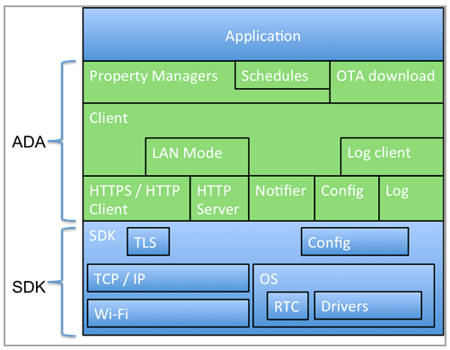

<aside id="pagebar" class="d-xl-block collapse">
  <ul>
    <li>
      <a href="#core-title">Ayla Embedded Agent</a>
      <ul>
        <li><a href="#features-and-benefits">Features and Benefits</a></li>
        <li><a href="#oem-requirements">OEM Requirements</a></li>
        <li><a href="#components">Components</a></li>
        <li><a href="#dependencies">Dependencies</a></li>
        <li><a href="#multithreading">Multithreading</a></li>
        <li><a href="#memory-requirements">Memory Requirements</a></li>
      </ul>
    </li>
    <li>
      <a href="#ada-client">ADA Client</a>
    </li>
    <li>
      <a href="#property-subsystem">Property Subsystem</a>
      <ul>
        <li><a href="#data-types">Data Types</a></li>
        <li><a href="#destination-mask">Destination Mask</a></li>
        <li><a href="#error-codes">Error Codes</a></li>
        <li><a href="#property-interfaces">Property Interfaces</a></li>
      </ul>
    </li>
    <li>
      <a href="#simple-table-interface">Simple Table Interface</a>
      <ul>
        <li><a href="#simple-property-structure">Simple property structure</a></li>
        <li><a href="#library-provided-handlers">Library-provided Handlers</a></li>
        <li><a href="#simple-table-functions">Simple table functions</a></li>
        <li><a href="#manage-file-properties">Manage file properties</a></li>
        <li><a href="#available-destinations">Available destinations</a></li>
        <li><a href="#simple-table-example">Simple table example</a></li>
      </ul>
    </li>
    <li>
      <a href="#primitive-interface">Primitive Interface</a>
      <ul>
        <li><a href="#property-structure">Property structure</a></li>
        <li><a href="#property-mgr-structure">Property mgr structure</a></li>
        <li><a href="#primitive-functions">Primitive functions</a></li>
      </ul>
    </li>
    <li>
      <a href="#batch-datapoints">Batch Datapoints</a>
      <ul>
        <li><a href="#batch-functions">Batch functions</a></li>
        <li><a href="#batch-best-practices">Batch best practices</a></li>
      </ul>
    </li>
    <li>
      <a href="#schedules">Schedules</a>
      <ul>
        <li><a href="#schedule-functions">Schedule functions</a></li>
      </ul>
    </li>
    <li>
      <a href="#logging">Logging</a>
      <ul>
        <li><a href="#logging-functions">Logging functions</a></li>
      </ul>
    </li>
    <li>
      <a href="#ota-updates">OTA Updates</a>
      <ul>
        <li><a href="#patch_state">patch_state</a></li>
        <li><a href="#ada_ota_ops">ada_ota_ops</a></li>
        <li><a href="#ota-functions">OTA functions</a></li>
        <li><a href="#ota-best-practices">OTA best practices</a></li>
      </ul>
    </li>
    <li>
      <a href="#command-line-interfaces">Command Line Interfaces</a>
      <ul>
        <li><a href="#cli-functions">CLI functions</a></li>
      </ul>
    </li>
    <li>
      <a href="#required-app-interfaces">Required App Interfaces</a>
    </li>
    <li>
      <a href="#configuration-subsystem">Configuration subsystem</a>
    </li>
    <li>
      <a href="#wi-fi-subsystem">Wi-Fi subsystem</a>
    </li>
  </ul>
</aside>

Ayla Networks has four different device agents that run on IoT devices or gateways and incorporate a fully optimized networking stack, along with the additional protocols needed to connect devices to the Ayla Cloud. Developers using almost any microcontroller or operating system can use Ayla-enabled connectivity modules to enable cloud capabilities over any type of networking protocol. The four device agents are:

* Production Agent. See [Ayla Development Kit](/edge-solutions/ayla-development-kit).
* Embedded Agent. See [Ayla ESP32 Solution](/edge-solutions/ayla-esp32-solution).
* Linux Agent. See [Ayla Linux Device Solution](/edge-solutions/ayla-linux-device-solution).
* Generic Gateway. [Ayla Linux Gateway Solution](/edge-solutions/ayla-linux-gateway-solution).

## Features and Benefits

The Ayla Embedded Agent is essentially embedded code integrated with embedded networking and OS software to run on a Wi-Fi communications module. This allows OEMs to create their own firmware solution for secure connectivity to Ayla Services. The customer application code runs on this module with the Ayla Embedded Agent, and has access to all of the features and services of the OS and networking stack on the module. Some primary characteristics are:

* Available for embedded or LINUX solutions.
* Targeted for specific Wi-Fi manufacturers and their supported SDKs.
* The Ayla Embedded Agent is available as a library or source.
* Secure, reliable connectivity to the Ayla Cloud Service.
* LAN mode support – direct mobile-to-device communications.
* Support for file property transfer (upload and download).
* Support for OTA image management and distribution.
* On-Device schedules for automated control.
* Wi-Fi setup for specific Wi-Fi modules, and example application code.
* Well-equipped for applications with existing RTOS and networking.
* APIs and data representation are similar to the Ayla Production Agent (Black Box).
* The Ayla White-Box-based Cloud Agent’s modular design allows code for additional functions to be included as needed.

## OEM Requirements

Though the Ayla Embedded Agent (White Box) is a type of endpoint that allows for a more complex and versatile device than the Black Box class of devices, the development effort is significantly longer for OEMs and therefore results in longer time to market than the Black-Box modules. OEMs are responsible for all device side applications including:

* Host application implementation.
* OS features, such as tasks, timers, memory management.
* Networking stack, including TLS.
* Security routines for authentication and encryption.
* Integration of the Ayla Embedded Agent into the OS and network stack.

## Components

The Ayla Embedded Agent is divided into the components shown in the following diagram:



Note: The Ayla Embedded Agent was previously called the Ayla Device Agent (ADA), and there are still references to ADA in our code and end-user documentation.

_ADA Client_

The ADA client manages the connection to the Ayla Device Service (ADS). The ADA client receives property updates and commands and then sends property updates and responses to commands, using RESTful HTTP interfaces over TLS.

_Property Subsystem_

The property subsystem collects the interfaces between the application and the client to allow parts of the application to control the Ayla Device Service (ADS) properties. As the client receives properties, these properties are sent to various property managers and then the client sends them to the application. As the application receives the new property values, the application may call property manager interfaces to send the new values to the client.

_Notification Subsystem_

The notify subsystem in the Ayla Embedded Agent manages the protocol used by the Ayla Notification Service (ANS). This maintains a UDP flow with ANS so that the ANS may send events indicating when the ADS has property updates or commands for the client. This subsystem sends a periodic UDP packet, typically every 30 to 90 seconds to keep the firewall open for notifications from the ANS. This also informs the ANS and ADS of the on-line status of the device.

_LAN Client_

The LAN client operates as an HTTP service on the local network. The RESTful interface presents to mobile apps that allow them to read and write properties and send some commands to the device. The device and mobile apps use a shared secret during a key-exchange to create a session key used to encrypt subsequent traffic. The mobile client sends a keep-alive HTTP PUT command periodically.

_HTTP Client_

The HTTP client subsystem of the Ayla Embedded Agent provides a common interface to the HTTP client in the platform’s SDK. The client and LAN client use it for their RESTful interfaces.

_Schedule Subsystem_

The schedule subsystem provides the ability for the device to change a property value on a specified time schedule. For example, a schedule sent to the device from the cloud could entail turning on lights from 7 PM to 11 PM every weeknight. As long as the time is known, schedules respond even when Internet connectivity is down. On the Ayla Device Service (ADS), schedules are distinct from properties, but in the Ayla Embedded Agent schedules are treated as just another type of property.

_Configuration Subsystem_

The configuration subsystem interfaces to the SDK’s or the application’s particular method for saving data in persistent storage between boots of the device. The configuration is organized as a set of name / value pairs. The names are hierarchically oriented and specified by ASCII tokens separated by slashes. The values can be binary data up to 1 Kilobyte or more, but are typically much shorter UTF-8 strings.

_Logging_

The Ayla Embedded Agent has a logging system used by each of the agent’s subsystems. Log messages can be enabled or disabled by subsystem and severity. Normally, error, warning, and informational messages are enabled on all subsystems. In addition, debug or verbose-debug messages can be enabled.

_Command-line Interface_

The Ayla Embedded Agent provides a small number of CLI commands that may or may not be used by the application. These interfaces allow some debugging and manufacturing setup of the device.

_OTA Updates_

The Ayla Embedded Agent and Ayla Device Service (ADS) provide the ability to download OTA updates to the device. The format of the OTA and method of applying the update is left up to the SDK and application implementer. The Ayla Embedded Agent has APIs, which notify the application that an OTA is available, let the agent start the download, receive the update sections, and report the status of the update back to the ADS.

## Dependencies

The Ayla Embedded Agent relies on the functionality provided by the platform and supplied by the product integrator. These include:

* C library functions
* RTOS functions
* TCP/IP network
* Connection monitor: indicate to the Ayla Embedded Agent when the network is available and not.
* If Wi-Fi is used, the platform must provide for Wi-Fi setup and monitoring.
* TLS/SSL client
* HTTP client
* HTTP server
* A configuration system to persist configuration information over power cycles.
* Console output for debug logging
* A CLI or other method to configure the device during manufacture
* Console output for debug logging
* A CLI or other method to configure the device during manufacture
* Firmware update methods (OTA), if desired
* Real-time clock

## Multithreading

The Ayla Embedded Agent can be used in a number of multithreading models. The simplest, from a multi-threading perspective, is the asynchronous model, where almost all activity is done in a single thread. The black-box model uses this with the TCP/IP thread from LwIP. This conserves memory by doing everything on one stack, but increases complexity by forcing all code to be non-blocking and event-driven.

The second model, which is used in all currently supported SDKs, runs the agent code in its own thread. Events and calls from other threads are queued to be performed in the agent thread. The agent thread may block while doing HTTP client calls, and these should be protected by time limits. In this model, responses from HTTP client requests are in the same thread.

## Memory Requirements

The memory requirements for the Ayla Embedded Agent are feature-dependent and depend on the SDK. This section estimates the memory required on ARM Cortex-M3 or -M4 processors, not including the size of the platform SDK, which must provide certain features, such as an TLS client. The TLS client can significantly add to the base memory required by the platform when used by other applications. These memory estimates also only approximate the amount of code needed in the application to provide the initial configuration support needed by the Ayla Embedded Agent.

For a system in which code cannot be directly executed from flash, the code requires space in both flash and in RAM. Code space includes any significant initialized-data space as well. Data space is almost entirely uninitialized data, so only requires RAM. The code space estimates can be used to determine the amount of flash needed for Over-the-Air (OTA) updates.

Note: Remember to include any additional space as needed for Wi-Fi firmware or Web server images.

The following tables provide estimates for the memory required by the Ayla Embedded Agent code and data. If LAN support, schedules, and OTA are not desired, you can deduct the memory required by those three subsystems. The sizes for OTA are only the memory required for downloading the image, not for saving or applying the update. The schedule support is almost entirely code. The data requirement depends on the number of schedules supported.

Memory requirements for the Ayla Embedded Agent:

|Subsystem|Code Size (bytes)|Data Size (bytes)|
|-|-|-|
|ADA Cloud Client|51000|7700|
|ADA LAN Client|11000|4600|
|Ayla Schedules|5100|32|
|OTA Support|2100|0|
|Heap|0|20000|
|Stacks|0|10000|
|SSL Certs (DER alternative)|3600|0|
|SSL Certs (PEM alternative)|5100|0|
|TOTAL|77900|42332|

Memory requirements for a typical platform:

|Subsystem|Code Size (bytes)|Data Size (bytes)|
|-|-|-|
|RTOS|51000|7700|
|SDK and drivers|-|4600|
|TCP/IP|5100|32|
|SSL client|2100|0|
|HTTP client|0|20000|
|HTTP server|0|10000|
|Heap (not including ADA)|-|0|
|Stacks (not including ADA)|-|-|
|Ayla Embedded Agent|-|-|
|Minimal demo application|-|-|
|TOTAL|58200|42332|

Note: The memory allocated for packets in TCP/IP (LwIP, in this example) is more than absolutely necessary. It may be acceptable to reduce it by 10k to 15k bytes.

# ADA Client

The ADA client manages the connection to the Ayla Device Service (ADS). The ADA client receives property updates and commands and then sends property updates and responses to commands, using RESTful HTTP interfaces over TLS. The platform initialization calls `ada_init()` to initialize the Ayla Embedded Agent before waiting for a Wi-Fi or network connection to be established. Once a network connection is established, the `ada_client_up()` call is made to start the connection to the ADS. Following are the APIs used:

`int ada_init(void)`

This call initializes the Ayla Embedded Agent. The call returns 0 on success. This API should be called after the platform (including Wi-Fi) is initialized, but before waiting for a Wi-Fi or network connection to be established. The ada_conf structure should be initialized first. ada_init() initializes the Ayla Embedded Agent software real-time clock (RTC) and sets the hardware RTC if it is set to a time before a minimum value required for the TLS certificates. This also sets the Ayla Embedded Agent logging options. If necessary, ada_init() creates the client thread. Finally, `ada_init()` sets up mDNS to advertise the device for the mobile application.

`int ada_client_up()`

The platform calls `ada_client_up()` when the local network is connected and the client should start connecting to the ADS and providing LAN-mode service. The mac_addr and hw_id must be set in the ada_conf first. This call returns 0 on success, or -1 if the client is not enabled or not configured.

`int ada_client_down(void)`

The platform calls `ada_client_down()` when the connection to the local network is lost.

# Property Subsystem

The main purpose of the Ayla Embedded Agent is to transfer datapoint values for properties. The agent does this through handlers called property managers. An application can have several property managers, but usually just has one. Each property manager handles one or more properties. A property manager registers with the Ayla Embedded Agent, providing a structure containing function pointers to the various entry points. Afterward, the property manager may call the agent to send a new property value to the ADS. The agent may also call the property manager to get or set a property value. The agent calls the `connect_status()` function of the property manager whenever reachability to the ADS or LAN clients changes. 

Several property interfaces are asynchronous. For example, when a property is requested by the agent, the response may be delivered immediately or at a later time, for example, after an interaction with an external device completes. To send a new value for a property, the property manager calls the `ada_prop_mgr_send()`. This call does not send the property immediately, but merely indicates that the property manager has something to send. When the Ayla Embedded Agent sends the data, the agent then calls the `send_done()` function of the property manager to report success or failure. When receiving a property value from the ADS, the agent calls the `prop_recv()` function of the property manager.

## Data Types

The `ayla_tlv_type` enum indicates the type of a property value. Only some of the possible values are used for property types. Others have internal uses. The table below provides the property types and their meaning.

|Type|Description|
|-|-|
|ATLV_INT|Integer, 32-bit|
|ATLV_UINT|Unsigned integer, 32-bits|
|ATLV_BIN|Binary bytes, up to 255 bytes long|
|ATLV_UTF8|UTF-8 encoded character string (see note below)|
|ATLV_BOOL|Boolean value (0 or 1)|
|ATLV_CENTS|A decimal number multiplied by 100 in a 32-bit integer|
|ATLV_SCHED|A schedule describing actions to be taken at specified times|
|ATLV_LOC|A file property location|

Note: UTF-8 string values may be up to 1024 bytes long, not counting the NUL termination. The string must still be no longer than 1024 bytes after the agent applies escapes required for JSON strings. For example, a new-line, carriage-return, tab, backslash, or double-quote takes 2 bytes to JSON-encode. A byte value between 1 and 0x1f takes 6 bytes to JSON-encode, as does any invalid UTF-8 byte. 

## Destination Mask

Several APIs use a parameter or variable called the destination mask. This is an unsigned 8-bit integer value in which each bit represents a destination, and may indicate that a property should be sent to that destination, or that connectivity is available to that destination:

```
0x01 Mask for ADS
0x02 Mask for LAN Client 1
0x04 Mask for LAN Client 2
0x08 Mask for LAN Client 3
0x10 Mask for LAN Client 4
0x20 Mask for LAN Client 4
0x40 Mask for LAN Client 5
0x80 Mask for Schedule Properties
```

## Error Codes

Several APIs return or use enum ada_err. The enum ada_err value provides the reason for failure so that an appropriate action may be taken. Error values from enum ada_err are always negative and can therefore be used with an interface that returns a zero or positive value on success. Zero generally indicates success; however, some interfaces return a Boolean result of 0 or 1, neither of which is an error. The following table provides the error codes and a short description of each.

|Error Code|Description|
|-|-|
|AE_OK|Success (zero).|
|AE_IN_PROGRESS|Successfully started, but not finished.|
|AE_ALLOC|Memory allocation failed.|
|AE_ERR|Non-specific error used when nothing else is appropriate.|
|AE_NOT_FOUND|Property or other object not found.|
|AE_INVAL_VAL|Invalid value for the property or other object.|
|AE_INVAL_TYPE|Incorrect type for the property or other object.|
|AE_BUF|Network buffer shortage.|
|AE_BUSY|Another operation is in progress|
|AE_LEN|Invalid or excessive length.|
|AE_INVAL_STATE|Invalid state, the API was called without correct prerequisites.|
|AE_TIMEOUT|Operation exceeded a time limit.|
|AE_ABRT|Connection aborted.|
|AE_RST|Connection reset.|
|AE_CLSD|Connection closed.|
|AE_NOTCON|Not connected.|
|AE_INVAL_NAME|Invalid property name.|
|AE_RDONLY|Ayla Embedded Agent tried to set a from-device property.|
|AE_CERT_EXP|TLS certificate is not yet valid or has expired.|
|AE_INVAL_OFF|Invalid file offset.|
|AE_FILE|Generic file error during file transfers.|

## Property Interfaces

Host applications can use one of two property management interfaces offered by the agent which differ in the way they manage the asynchronous notification of the success or failure related to the action of sending a property value from the device to the cloud:

* The [Simple Table Interface](#simple-table-interface) is the easier of the two. It is a way to handle properties in a synchronous manner in cases where the property manager can respond immediately (synchronously) to property requests.
* The [Primitive Interface](#primitive-interface) is a low-level interface that offers greater flexibility, but requires more work including property name validation. The Simple Table Interface is build on the primitive one.

# Simple Table Interface

The Simple Table Approach to property management handles properties using a table that lists each property by name. The table is an array of `ada_sprop` structure instances. Each instance has a property name and type, a pointer to the variable holding the value, and a pointer to a function that is called to handle changes to the value. The following sections describe the more important aspects of the table approach to property management.

## Simple property structure

Declared in `<ada/sprop.h>`, the `ada_sprop` structure defines a simple property:

```
struct ada_sprop {
  const char *name;
  enum ada_tlv_type type;
  void *val;
  size_t val_len;
  ssize_t (*get)(struct ada_sprop *, void *buf, size_t len);
  enum ada_err (*set)(struct ada_sprop *, const void *buf, size_t len);
};
```

|Variable|Description|
|-|-|
|name|The name member is the name of the property. This should match a name used in the Ayla service template for the device.|
|type|The "type" enum gives the type of the property as returned and expected by the get and set functions.|
|val|This is the pointer to the storage for the value. Integer values are placed there as 32-bit binary values in the host byte order.|
|val_len|This is the size of the value in bytes. These are used only by the get or set functions provided here, so it can actually be anything.|
|get|The get member points to a function that is called whenever the property value is needed by the ADS or a mobile application. It should store the value into the provided buffer. The len argument specifies the size of the buffer, which should be large enough to receive the value. The get function should return the length that was stored or an enum ada_err if the get could not be performed for some reason.|
|set|The set member points to a function to be called whenever the property value is to be changed by the ADS or a mobile application or a schedule. The function may fetch the value from the provided buffer.|

## Library-provided Handlers

The ADA library provides functions that can be used directly in the property table or by application handlers that are called from the property table. These functions make it easier to handle simple properties. These functions match the struct ada_sprop members for get and set and are:

```
ssize_t ada_sprop_get_int(struct ada_sprop *, void *, size_t)
ssize_t ada_sprop_get_uint(struct ada_sprop *, void *, size_t)
ssize_t ada_sprop_get_bool(struct ada_sprop *, void *, size_t)
ssize_t ada_sprop_get_string(struct ada_sprop *, void *, size_t)
enum ada_err ada_sprop_set_int(struct ada_sprop *, const void *, size_t)
enum ada_err ada_sprop_set_uint(struct ada_sprop *, const void *, size_t)
enum ada_err ada_sprop_set_bool(struct ada_sprop *, const void *, size_t)
enum ada_err ada_sprop_set_string(struct ada_sprop *, const void *, size_t)
```

Each `get` or `set` routine uses the `val` and `val_len` fields of the supplied property table entry to get or set the value and place it in the supplied buffer. If you want the application to do additional checks or operations on the value, the application may do this by supplying its own set routine in the table. It may be convenient to call the library-supplied handler from that routine in order to perform size conversions and type checks, and then to reflect the newly set value onto an output pin or LED, for example.

## Simple table functions

### ada_sprop_mgr_register

```
enum ada_err ada_sprop_mgr_register(char *name, struct ada_sprop *table, unsigned int entries)
```

This function registers a property table with the Ayla Embedded Agent. The `name` argument gives the group of properties a name for debugging messages. The `table` argument is the address of the property table. The third argument is the number of `entries` in the table. This returns 0 on success. The only possible error is a memory allocation failure (AE_MEM).

### ada_sprop_send

```
enum ada_err ada_sprop_send(struct ada_sprop *sprop
```

This function sends the value of the property pointed to by `sprop`, which should point to the entry in the table that was used in ada_sprop_mgr_register(). The get() function in sprop is used to get the current value, and that value is saved until it is sent to the service. There is no output from the application if the value is not sent successfully.

### ada_sprop_send_by_name

```
enum ada_err ada_sprop_send_by_name(const char *name)
```

This function sends the value of the property specified by `name`, the `get()` function in sprop is used to get the current value, and that value is saved until it is sent to the service. This function returns 0 if the request is started successfully. There is no feedback to the application if the value is not sent successfully.

## Manage file properties

A file property is required to upload or download datapoints of large sizes. The library requires multiple packets to send or fetch binary data during a file transfer. In case of network connection loss, packets can be re-transmitted.

The library requires a file property to be of ATLV_LOC type and the void *val pointer to be of struct file_dp type. This is required to keep track of the current status of the on-going file transfer. There can only be one outstanding file transfer active at a time. The file_dp structure looks as follows:

```
struct file_dp {
  enum file_dp_state state;
  struct ada_sprop *sprop;
  u32 next_off;
  u32 tot_len;
  size_t chunk_size;
  u8 aborted;
  void *val_buf;
  char loc[PROP_LOC_LEN];
  size_t (*file_get)(struct ada_sprop *sprop, size_t off,
  void *buf, size_t len);
  enum ada_err (*file_set)(struct ada_sprop *sprop, size_t off,
  void *buf, size_t len, u8 eof);
}
```

In this structure (above), `file_dp_state` enumeration can have the following values:

```
enum file_dp_state {
  FD_IDLE = 0,	/* nothing to do */
  FD_CREATE,	/* send datapoint create */
  FD_SEND,	/* send datapoint value */
  FD_RECV,	/* request and receive datapoint value */
  FD_FETCHED,	/* send datapoint fetched opcode */
  FD_ABORT,	/* abort the datapoint operation */
}
```

The structure keeps a pointer to the sprop structure of the file property. The next_off bytes attribute keeps track of the progress of the file transfer. The tot_len bytes attribute is used during file upload to know the file size to be uploaded. The chunk_size bytes attribute records the maximum acceptable chunk sizes managed by the application. The default value is set to 512 bytes; for example, the library will send chunks of 512 bytes to the application during download, or the application will send chunks of 512 bytes to the library during upload. The aborted attribute indicates if the last file transfer for that file property was successfully aborted or not. The val_buf pointer points to a buffer of chunk_size bytes during file transfer. The loc attribute is used to save the current Ayla Cloud location that can be used to "GET" a remote URL where the file can be uploaded/downloaded.

The file_get callback function should be defined for file uploads. The library uses this callback function to read chunks of the file currently being uploaded. The file_set callback function should be defined for file downloads. The library uses this callback function to send chunks of the file currently being downloaded to the application.

To set the appropriate file_get and file_set callback functions and the maximum allowed chunk_size that can be handled by the application during file transfers use the following API:

```
void ada_sprop_file_init(
  struct file_dp *dp,
  size_t (*file_get)(struct ada_sprop *sprop, size_t off,
  void *buf, size_t len),
  enum ada_err (*file_set)(struct ada_sprop *sprop, size_t off,
  void *buf, size_t len, u8 eof),
  size_t chunk_size
)
```

To start a file upload, use the ada_sprop_file_start_send API. For this API, name is the name of the file property and len is the total size of the file to be transferred.

```
enum ada_err ada_sprop_file_start_send(const char *name, size_t len)
```

Internally, when this API is called, the simple property manager sends a datapoint create request (corresponds to the FD_CREATE state) for the file property. Ayla Cloud responds with a location, on which, a GET request is initiated to find the remote URL where the file can be uploaded. Once this happens, the simple property subsystem starts retrieving file chunks by calling the file property’s file_get callback and sends them to the remote URL (corresponds to the FD_SEND state). When the complete file is uploaded, a PUT is done on the Ayla Cloud location to mark the transfer complete. At this point, the library sends a PME_FILE_DONE event to indicate that the upload is complete.

To start a file download, the ada_sprop_file_start_recv API can be used. For this API, name is the name of the file property, buf is the pointer to the Ayla Cloud location that holds the remote URL for the file to be downloaded, len is the length of the buf and off is the offset from which the file needs to be downloaded.

```
enum ada_err ada_sprop_file_start_recv(const char *name, const void *buf, size_t len, u32 off)
```

Internally, when this API is called, the simple property manager first acquires the remote URL where the file is stored using Ayla Cloud location held by buf. Once this happens, the library starts downloading the file chunks (corresponds to the FD_REQ state). Simple property subsystem uses the file_set callback function to send the chunks to the application. The final chunk has the eof flag set. The library also indicates the completion of file download with a PME_FILE_DONE event. At this point of time, the file needs to be marked fetched by clearing the Ayla Cloud location. Currently, this is already taken care of by the simple property subsystem; however, the application can take charge of it by calling the ada_sprop_file_fetched API (corresponds to the FD_FETCHED state). For this API, name is the name of the file property.

```
enum ada_err ada_sprop_file_fetched(const char *name)
```

At any time, the file transfer can be aborted by using the following API. This API aborts any current ongoing file transaction.

```
void ada_sprop_file_abort(void)
```

This may be helpful in the case when other property updates from the Ayla Cloud or LAN client are received during file transfer. The library indicates this by sending a PME_NOTIFY event.

## Available destinations

The simple property manager exports the variable `extern u8 ada_sprop_dest_mask` indicating the currently available destinations. See [Destination Mask](#destination-mask).

## Simple table example

This usage example of sprop implements one property, Blue_LED to control an LED.

```
#include <wm_os.h>
#include <wmstdio.h>
#include <board.h>
#include <ada/libada.h>
#include <ada/sprop.h>

static u8 blue_led;

/*
* Demo set function for bool properties.
*/

static enum ada_err demo_led_set(struct ada_sprop *sprop, const void *buf, size_t len) {
  int ret = ada_sprop_set_bool(sprop, buf, len);
  if (!ret) {
    set_led(blue_led);
  }
  return ret;
}

static struct ada_sprop demo_props[] = {
  {"Blue_LED", ATLV_BOOL, &blue_led, sizeof(blue_led), ada_sprop_get_bool, demo_led_set},
};

/*
* Initialize property manager.
*/

void demo_init(void) {
  ada_sprop_mgr_register("ledevb", demo_props, ARRAY_LEN(demo_props));
}
```

Note the following descriptions of the above example:

* The function demo_init() registers the demo_props table as a set of simple properties. The ARRAY_LEN() macro evaluates to 1, in this case, the number of entries in the table.
* The function demo_led_set() is called by the Ayla Embedded Agent whenever it receives a new value for the Blue_LED property. This calls ada_sprop_set_bool(), a libada function that handles any Boolean property, and puts its value in the location (blue_led) specified in the demo_props table entry. If that works, it then calls the set_led() function, which the application code provides to turn on or off the desired LED.
* To add a second LED property to this example, create another table entry naming the new property and using the same set function. To distinguish between the LEDs in demo_led_set(), compare the sprop->val pointer to & blue_led or the address of the added LED variable. Alternatively, use a string compare on sprop->name.
* The LEDs in this example are to-device (input) properties.
* For a from-device (output) property, the set() function pointer in the table can be NULL. The get() function may have to read a GPIO pin or just a variable that holds the latest state of the property to be sent. To send a property, the application calls ada_sprop_send_by_name(), which calls the get() function to get the value. The get() function can be called anytime that the Ayla Embedded Agent needs the property value, perhaps due to a request from a LAN client.

# Primitive Interface

The Primitive Property Subsystem is the low-level interface to properties. This subsystem is very flexible, but requires the individual property manager to validate property names and determine how to handle the various events. The other property managers are built on top of this set of interfaces.

There can be several individual property managers. When performing a property-specific operation, for example, a set operation, the agent calls the appropriate handler in all registered property managers until one claims the property by returning success or an error other than AE_NOT_FOUND. This means that each property manager should check the name first and if it is not a property, the property manager handles return AE_NOT_FOUND.

If a property manager wants to handle all properties, the property manager should be registered after any others. This might be useful when sending updates to an external processor without knowing which properties that external processor handles.

The remainder of this subsection provides descriptions of the most important aspects of the Primitive Property Subsystem

## Property structure

Declared in `<ada/prop.h>`, the `prop` structure defines a property:

```
struct prop {
  const char *name;
  u8 fmt_flags;
  u8 echo:1;
  u8 send_dest;
  u8 is_dl;
  enum ayla_tlv_type type;
  void *val;
  size_t len;
  struct prop_dp_meta *dp_meta;
  void (*prop_mgr_done)(struct prop *);
  void *send_done_arg;
  STAILQ_ENTRY(prop) list;
  const struct prop_mgr *mgr;
};
```

Fields important to the interface include the following:

|Variable|Description|
|-|-|
|name|This field contains the property name.|
|val|This field points to the value of the property, for example, a string, 32-bit integer, or a byte, depending on the type.|
|len|This field contains the maximum length of the value. For integers, this field is the actual length. For strings (UTF-8), this field contains the maximum length in bytes, including NUL termination.|
|type|This field gives the type for the value.|
|prop|This field provides a function to be called after the property manager is done with the property operation.|

## Property mgr structure

Declared in `<ada/prop_mgr.h>`, the prop_mgr structure defines a property manager:

```
struct prop_mgr {
  const char *name;
  enum ada_err (*prop_recv)(
    const char *name, 
    enum ayla_tlv_type type,
    const void *val, 
    size_t len,
    size_t *offset, 
    u8 src, 
    void *cb_arg
  );
  void (*send_done)(enum prop_cb_status, u8 fail_mask, void *cb_arg);
  enum ada_err (*get_val)(
    const char *name,
    enum ada_err (*get_cb)(
      struct prop *, 
      void *arg, 
      enum ada_err
    ),
    void *arg
  );
  void (*connect_status)(u8 mask);
  void (*event)(enum prop_mgr_event, const void *arg);
};
```

|Variable|Description|
|-|-|
|name|The member name points to the name of the property manager for use in debug messages. This member should be a short, readable string.|
|prop_recv|The agent calls `prop_recv` in the property manager when a new value for a data point has arrived. The `name` argument points to the name of the property. The `type` argument is the datapoint type as received from the ADS or the LAN client. The `val` argument points to the datapoint value in a format appropriate to the type. The `len` argument gives the size of the value in bytes. The `offset` argument is used only when handling file properties. This points to the offset of the data being received in bytes from the beginning of the value. The `prop_recv` handler must advance the pointed-to offset by the number of bytes actually used. Simple property managers do not need to use this at all. The `source_mask` is a destination mask indicating which destination originated the property update. The final argument, `cb_arg`, is an opaque callback argument. This is NULL except when the `prop_recv` call is in response to a request from the application to the cloud for a property using `ada_prop_mgr_request`. For now, the application can ignore this argument.|
|send_done|The agent calls `send_done` when a request to send a property has been completed. On normal completion, the status is PROP_CB_DONE. The argument `fail_mask` is set to a mask of destinations to which the datapoint could not be delivered. The argument `cb_arg` has the value passed as cb_arg to `ada_prop_mgr_send`.|
|get_val|The agent calls `get_val` to get the value of a particular property, and send it to ADS. Upon completion, the agent calls the `get_cb` callback function.|
|connect_status|The agent calls `connect_status` whenever the connection to the service or a LAN client is established or broken. The `connect_status` handler is optional and may be NULL. The `mask` argument is the new value of the available destination mask.|
|event|The agent calls `event` to indicate the occurrence of certain events that may be of interest to property managers. The `event` handler is optional and may be NULL. The `event` argument gives the event type, which may be one of the following:<ul><li>PME_TIME - This indicates the time parameters (time, time zone, daylight savings, and so on) have changed. This is of particular interest to property managers that handle schedules or that merely want to display the correct time.</li><li>PME_PROP_SET - This indicates that a property was changed when received from or sent to the ADS successfully. The argument arg is the property name string. This can be used to trigger an action after a change in any property, whether that property is from the same property manager or not.</li><li>PME_NOTIFY - This indicates that an ANS notification was received, and some properties may have new values in the cloud, or there may be a command pending for the device in the cloud. This event may be ignored, or the property manager may wish to pause a long-running activity, such as a file property download in order to allow the agent to fetch new property values so that the device can remain responsive to service changes.</li><li>PME_ECHO_FAIL - This indicates that a property value set by one destination could not be echoed to all other destinations. In this case, the event arg parameter points to the name of the property. The property manager application normally wants to set a flag to send the property to the ADS once connectivity is restored.</li><li>PME_TIMEOUT - This indicates that a timeout occurred while waiting for the property manager to respond to a request. The request is abandoned.</li><li>PME_FILE_DONE - This indicates that the ongoing file property transaction is complete.</li></ul>|

## Primitive functions

### ada_prop_mgr_register

`void ada_prop_mgr_register(const struct ada_prop_mgr *);`

This function adds the given property manager to an internal list of property managers. The call also declares that the property manager may handle some set of properties and should be called for property operations as defined in the struct ada_prop_mgr. The application should eventually call ada_prop_mgr_ready() (described next) as well.

### ada_prop_mgr_ready

`void ada_prop_mgr_ready(const struct ada_prop_mgr *);`

This function indicates to Ayla Embedded Agent that the property manager is ready to receive property values. This must be called after ada_prop_mgr_register() and after each time the ADS destination becomes available. ada_prop_mgr_ready() can be called by the connect_status() handler and may be safely called more often than necessary.

The Ayla Embedded Agent does not fetch commands or property values from the ADS until all property managers have indicated their readiness by calling ada_prop_mgr_ready(). If properties have changed while connectivity to the ADS was lost, it is desirable to send the new values to the service before calling ada_prop_mgr_ready() so that the datapoint values from the device have precedence over any datapoints that may have been created on the ADS during the connectivity loss.

### ada_prop_mgr_request

`enum ada_err ada_prop_mgr_request(const char *name);`

This function requests that the Ayla Embedded Agent fetch the value of a property from the ADS. The name argument specifies the property name. If name is NULL, a request for all to-device (input) properties is made.

Upon success (which is indicated by 0 return value), this starts the request which completes, if possible, sometime later. Failures are not reflected back to the application, and may include loss of connectivity or a property name that is not in the device template of the ADS.

### ada_prop_mgr_send

`enum ada_err ada_prop_mgr_send(const struct prop_mgr *mgr, struct prop *prop, u8 dests, void *cb_arg);`

This call initiates a request to send a property to the specified destinations. The first argument is the property manager that handles the property. The second arg is the prop structure, which must be available until (*send_cb)() is called, indicating that the value has been completely sent.

The dests argument indicates which destinations should receive the property. The opaque cb_arg pointer is provided to the send_cb() callback. Upon success, this function returns AE_IN_PROGRESS, indicating the operation was started successfully. If the dests mask is 0, it returns AE_INVAL_STATE.

### ada_prop_mgr_get

```
enum ada_err ada_prop_mgr_get(
  const char name, 
  enum ada_err (*get_cb)(struct prop *prop, 
  void *arg, enum ada_err), void *cb_arg
);
```

This function requests that a property is fetched from the ADS. The supplied get_cb() function is called on completion. The name argument gives the property name. The cb_arg argument is passed as arg to the get_cb() function.

### ada_prop_mgr_set

```
enum ada_err ada_prop_mgr_set(
  const char *name, 
  enum ayla_tlv_type type,
  const void *val, 
  size_t val_len,
  size_t *offset, 
  u8 src, 
  void *set_arg
);
```

This function requests that a property on the device is set to the value specified. This is usually used only internally in Ayla Embedded Agent, but may be useful for a property manager to set a property handled by another property manager. This function calls the prop_recv() handler in the appropriate property manager. See the prop_mgr prop_recv() function for a description of the arguments.

### ada_prop_mgr_dp_put

```
enum ada_err ada_prop_mgr_dp_put(
  const struct prop_mgr *pm,
  struct prop *prop, 
  u32 off, 
  size_t tot_len, 
  u8 eof,
  void *cb_arg
);
```

This function is used to queue a file chunk to be uploaded to the remote URL received from the Ayla Cloud location. tot_len is used when off is 0. The last chunk should have eof set to 1. cb_arg is sent back to the prop_send_done callback.

### ada_prop_mgr_dp_get

```
enum ada_err ada_prop_mgr_dp_get(
  const struct prop_mgr *pm,
  struct prop *prop, 
  const char *location, 
  u32 off,
  size_t max_chunk_size,
  enum ada_err (*prop_mgr_dp_process_cb)(
    const char *location, 
    u32 off, 
    void *buf, 
    size_t len, 
    u8 eof),
  void *cb_arg
);
```

This function is used to queue the initiation of a download of a file property. The function retrieves the remote URL where the file resides, using the Ayla Cloud location. off to indicate the offset from which the file is to be downloaded. max_chunk_size indicates the maximum allowed chunk size that can be processed by the application at a time. Invoking the prop_mgr_dp_process_cb callback function processes these chunks. cb_arg is sent back to the prop_send_done callback function.

### ada_prop_mgr_dp_fetched

```
enum ada_err ada_prop_mgr_dp_fetched(
  const struct prop_mgr *pm,
  struct prop *prop, 
  const char *location,
  void *cb_arg
);
```

This function is used to mark the downloaded file property fetched, and clearing the Ayla Cloud location. cb_arg is sent back to the prop_send_done callback function.

### ada_prop_mgr_dp_abort

`void ada_prop_mgr_dp_abort(const char *location);`

This function is used to abort the ongoing file upload/download at the Ayla Cloud location.

# Batch Datapoints

A batch is a buffer for accumulating datapoints. Batch datapoints are used to reduce the network flow and traffic. Once the batch is created, the datapoints can be put in a batch-buffer. When the batch-buffer is full, the device application can send the batch datapoints to the Ayla Cloud in a single transmission. Following are some important points about this batch datapoint feature:

When creating a batch, the maximum datapoints allowed and maximum data size in memory are specified by the device application.
A batch can be multi-instance. For example, a device application can create two or more batches, add data properties to them independently, and send the batches at different times.

No auto-sending is provided for a batch. Even when the batch-buffer is full or its age is expired, the device application is responsible for sending a batch. A prop_mgr can send both individual properties and batch properties. 

## Batch functions

### ada_batch_create

`struct batch_ctx *ada_batch_create(u16 max_dps, u16 max_size);`

This function is used to create a batch buffer. The maximum datapoints and maximum total data size should be specified. Upon failure, the function returns NULL. Upon success, the function returns a handle. With this handle, the device app can add datapoints to the batch and send all datapoints in the batch to the cloud.

### ada_batch_destroy

`void ada_batch_destroy(struct batch_ctx *ctx);`

This function is used to free memory of all datapoints in the specified batch, as well as the batch-buffer. After this call, the batch handle becomes invalid.

### ada_batch_add_prop_by_name

`int ada_batch_add_prop_by_name(struct batch_ctx *ctx, const char *prop_name, s64 time_stamp);`

This function is used to add a property to the batch by the property name. The batch handle is specified by ctx, the property name is specified by prop_name. If the argument time_stamp is not zero, the time stamp (in UTC seconds since 1970) is specified by the app for the datapoint. If time_stamp is zero, the batch-manager will use the current time (UTC) for the data point’s time stamp. On success, the function’s return value is a positive batch-ID. On error, the return value is negative or 0. A special return value of AE_BUF means that the datapoints in the batch reached the maximum datapoints limit, or the data size of all datapoints in the batch reached the maximum data-size limit.

### ada_batch_add_prop

`int ada_batch_add_prop(struct batch_ctx *ctx, struct ada_sprop *sprop, s64 t_stamp);`

This function is almost as same as ada_batch_add_prop_by_name(). The function can be used to add a property to a batch-buffer. But the property is specified by a pointer to struct ada_sprop, not by property name.

### ada_batch_send

`enum ada_err ada_batch_send(struct batch_ctx *ctx,	void (*done_cb)(size_t size_sent));`

This function is used to send a specified batch to the cloud. The batch is queued by prop_mgr, and will be sent later. After the batch is sent, the memory of all associated datapoints is freed. The batch handle ctx remains valid after the call. If the parameter done_cb is not null, it will be invoked after the batch is sent. The argument size_sent of the callback provides the sent payload size. On success, the function’s return value is zero.

### ada_batch_set_err_cb

`void ada_batch_set_err_cb(void (*err_cb)(int batch_id, int err));`

The batch-manager has a default error callback, which simply prints the status for each datapoint sent. This function can be used to override the default error-callback. The first argument of the err_cb() is the datapoint’s batch-ID. The second argument is the error code (positive is HTTP status code, and negative is enum ada_err).

### ada_batch_discard

`void ada_batch_discard(struct batch_ctx *ctx);`

This function is used to discard all datapoints in the batch. The memory of discarded datapoints is freed. After the call, the batch’s handle ctx is still valid.

## Batch best practices

To use a batch in the device app, you need to determine the maximum batch datapoints and the maximum total batch data size in bytes for the batch according to your platform. First, call ada_batch_create() to create a batch buffer. With the returned handle, you can add properties to the batch-buffer by calling ada_batch_add_prop_by_name() or ada_batch_add_prop(). In the process of adding datapoints to batch, when an error of AE_BUF (buffer buff) occurs, you may call ada_batch_send() to send the batch to the cloud.

All batch operations should be performed after your device is connected to Ayla Device Service (ADS) server. Perform the batch-related initialization after the flag (ada_sprop_dest_mask and NODES_ADS) is changed from 0 to non-zero. The batch operation should be stopped when the flag is changed from non-zero to 0.

The device application may need to trace the datapoint sending status. In this case, the app should call ada_batch_set_err_cb() to set an error callback. When adding each datapoint to the batch-buffer, save the returned batch-id. When the error callback is invoked, check each data-point’s status.

Following is an example of a batch test program. The test app runs in a loop:

```
add data-point to batch;
send the batch when it is full;
```

In some cases, the memory in the device system will be totally consumed (fortunately in PDA’s prop_mgr, only 20 properties can be stored in the sending queue). To solve this problem, call ada_batch_send() with a parameter done_cb in which you may count all batches having been actually sent and put datapoints into the batch buffer again after a specified number of batches has been sent.

# Schedules

Each schedule is like a property and its value is a list of time-based conditions and actions to take when those conditions are met. These conditions and actions are expressed as binary TLV items.

The names of the schedules have the same restrictions as property names and must not be the same as any other property name. The schedule feature is implemented on top of the primitive property manager subsystem.

In order for schedules to operate, the platform must have the current UTC time and, for schedules using local time, the local time offset and daylight savings information. These are provided by the Ayla Device Service, but must be maintained by the platform during restarts or power-downs using a hardware RTC or non-volatile memory. Also kept in NVRAM is the time that the schedules were last evaluated to save some work at startup. APIs for these purposes must be provided by the platform.

## Schedule functions

### ada_sched_init

`enum ada_err ada_sched_init(unsigned int count)`

This interface initializes the schedule system. The interface sets the number of schedules to count and allocates resources accordingly. The return is 0 on success. This interface initializes the schedule system and sets the number of schedules to count and allocates resources accordingly. The return is 0 on success.

### ada_sched_set_name

`enum ada_err ada_sched_set_name(unsigned int index, const char *name)`

This interface sets the name of the schedule specified by index, which must be less than the count supplied to ada_sched_init(). The supplied name must be a valid property name.

### ada_sched_get_index

`enum ada_err ada_sched_get_index(unsigned int index, char **name, const void *buf, size_t *lenp)`

This interface gets the name and the binary value of the schedule specified by index in the supplied buffer. This may be used when persisting the schedule value to persistent storage. The name argument points to a string pointer that is set by the function. The buf argument points to the buffer to receive the value. The lenp argument points to a length variable that is initially set to the size of the buffer. On success, this function sets the length variable to the length stored and returns 0.

### ada_sched_set

`enum ada_err ada_sched_set(const char *name, const void *buf, size_t len)`

This interface sets the value of the schedule specified by name to the contents of the supplied buffer.

### ada_sched_set_index

`enum ada_err ada_sched_set_index(unsigned int index, const void *buf, size_t len)`

This interface sets the value of the schedule specified by index from the contents of the supplied buffer. This is used when loading the schedule values from persistent storage shortly after booting.

### ada_sched_enable

`enum ada_err ada_sched_enable(void)`

This interface enables the scheduling system, and should be called after all schedules have had their names set and saved values restored.

# Logging

Provided that the targeted SDK has a console logging subsystem (a serial console), the Ayla Embedded Agent messages are sent to that log. The Ayla Embedded Agent log messages are classified by subsystem and severity. These are defined in `<ayla/log.h>` and `<ayla/mod_log.h>`.

Subsystems of interest include mod, client, notify, server, log-client, and sched. Others are defined, but not used by the Ayla Embedded Agent. The subsystem mod is the default for module logging; almost all messages are classified as belonging to one of the other subsystems.

The severities used are info, warn, err, debug, and debug2. The info, warn, and err messages are enabled by default. Debug gives more details about activity; much of it is of interest only to developers and is cryptic. Debug2 gives even more information, including network I/O packets in some cases. Other severities are defined, but not used by the Ayla Embedded Agent.

Following is an example of log messages:

```
[ada] 2015-08-19T17:32:08.500 i m client: ADA-DEMO 1.0-eng
[ada] 17:32:15.739 d m client: http_client_idle_close: session 0
[ada] 17:32:15.744 i m client: ada_client_up: IP 172.16.11.79
[ada] 17:32:15.753 i c client: get DSN AC000W000432408
```

The fields prior to the log message are as follows:

* [ada] is the prefix for all Ayla Embedded Agent log messages and may be present or omitted depending on the platform.
* Following the [ada] is the UTC time in seconds and milliseconds. When the hour is different from the previous message, or on the first log message, the date is shown as well.
* The UTC is followed by a single character that indicates the severity level of the message, i for info, d for debug or debug2, W for warning, E for error. On multi-threaded platforms this is followed by a short, usually single-letter, indication of the thread that is issuing the log message, that is, m for main thread, c for client.
* The severity level is followed by the subsystem name (for example, client) and then the text of the message. Often, but not always, the text begins with the function name or a portion of it.

Most messages from CLI commands are not considered log messages and do not have this format. The application may want to generate log messages in the Ayla Embedded Agent format. These should be made under the mod subsystem.

## Logging functions

### log_info

`void log_info(const char *format, …)`

This is a printf-like interface that logs an info message under the default (mod) subsystem. This is currently implemented as a macro.

### log_put

`void log_put(const char *format, …)`

This interface can be used to log a message of any severity on the default (mod) subsystem. The beginning of the format string is a severity designation. These strings are defined as LOG_INFO, LOG_WARN, LOG_ERR, LOG_DEBUG, or LOG_DEBUG2, and one of these is usually prepended to the format string. For example:

```
log_put(LOG_WARN "%s: error code %d", __func__, err);
```

Notice the use of string concatenation (no comma after LOG_WARN) to prepend the severity designator.

# OTA Updates

The OTA feature lets the module accept firmware changes from the Ayla Device Service (ADS). The Ayla Embedded Agent uses the "host" OTA type, in which the OEM provides the firmware image. The use of this feature is entirely optional; it is extremely useful, however, and highly recommended. Also, the platform may or may not provide this OTA capability.

Caution: It is important that platforms which implement the OTA feature do so in a "brick-proof" manner so that failure never leaves the device in a non-working state. 

The platform or application code can provide a different OTA handler for each of the two types of OTAs. The OTA handler provides a set of functions that handle the download and installation of the new firmware.

The ADS and the Ayla Embedded Agent do not place any special requirements on the contents of the OTA firmware image. The OTA image is entirely up to the developer of the platform.

You can start an OTA operation by deploying the image either from the Ayla Developers Portal or Ayla Customer Dashboard. Once the agent is notified that an OTA image is going to be deployed, the agent indicates this by calling the OTA handler’s notify() function. If the image is desired, the handler calls ada_ota_start() to prompt the agent to download the image. The agent provides the image to the handler by calling the save() function for each part of the image as it arrives. After all of the parts have been given to the handler in sequence, the agent calls the handler’s save_done() function.

Once the handler has applied the OTA and rebooted to the new firmware image, the handler reports the completion of the operation by calling ada_ota_report().

## patch_state

This enum provides status codes for OTA updates and is the return value for several operations. The ADS understands the codes, and existing assignments must not change. The codes are defined in `<ayla/patch_state.h>`. Only some of the values apply to the OTA update platform code. Others are used internally. The following table describes the codes that may be used by the platform.

|Code|Description|
|-|-|
|PB_ERR_NEW_CRC|The modified code results in a CRC error.|
|PB_ERR_STALL|This is not an error. It is an indication that the download should pause until ada_ota_continue() is called. This code may be used for temporary resource shortages or a delay imposed by an external system.|
|PB_ERR_DECOMP|The update had failed to decompress.|
|PB_ERR_OP_LEN|A patch had a length error.|
|PB_ERR_FATAL|An unspecified error occurred while applying the update.|
|PB_ERR_OP|A segment of the update had an invalid opcode.|
|PB_ERR_STATE|The patch program was in an invalid state.|
|PB_ERR_CRC|A section of the image being patched had a bad CRC before patching.|
|PB_ERR_COPIES|More than one block is in the copied state.|
|PB_ERR_HEAD|The patch file area in flash had a bad structure or length.|
|PB_ERR_FILE_CRC|The update file had a CRC error.|
|PB_ERR_ERASE|Persistent storage erasure failed.|
|PB_ERR_WRITE|Persistent storage write failed.|
|PB_ERR_SCRATCH_SIZE|The scratch area was too short.|
|PB_ERR_DIFF_BLKS|The old and new data were in different storage blocks.|
|PB_ERR_OLD_BLKS|The old data for a section of the patch spanned two blocks.|
|PB_ERR_NEW_BLKS|The new data for a section of the patch spanned two blocks.|
|PB_ERR_SCR_ERASE|The scratch block erasure failed.|
|PB_ERR_SCR_WRITE|The scratch block write failed.|
|PB_ERR_PROG|An error occurred reading or writing a progress byte.|
|PB_ERR_PROT|A block to be patched was not in the correct progress state.|
|PB_ERR_NOFILE|The patch file was not found in persistent storage.|
|PB_ERR_HEAD|The patch file could not be read.|
|PB_ERR_NO_PROG|The update area did not contain a progress area.|
|PB_ERR_INV_PROG|The progress area was invalid.|
|PB_ERR_READ|The patch file could not be read.|
|PB_ERR_DECOMP_INIT|A failure occurred in initializing the decompressor.|
|PB_ERR_PREV|A previous patch attempt failed.|
|PB_ERR_OPEN|An error occurred opening the persistent storage device.|
|PB_ERR_BOOT|The update program did not boot.|

## ada_ota_ops

Declared in `<ada/client_ota.h>`, this structure contains pointers to the functions implementing the OTA handler. The structure is filled in by the handler code and passed to `ada_ota_register`. This structure must remain valid for the duration of the client operations.

```
struct ada_ota_ops {
  enum patch_state (*notify)(unsigned int len, const char *version);
  enum patch_state (*save)(unsigned int offset, const void *, size_t);
  void (*status_clear)(void);
};
```

|Variable|Description|
|-|-|
|notify|This function indicates that an OTA is available.|
|save|This function gives the handler a section of the OTA update to save in persistent storage.|
|status_clear|This function handles the completion of the OTA update.|

## OTA functions

### ada_ota_register

`void ada_ota_register(enum ada_ota_type type, const struct ada_ota_ops *ops)`

This function registers a set of handlers for the specified type of OTA (either OTA_MODULE or OTA_HOST). To unregister a handler, the second argument may be NULL. This function always succeeds or results in an assertion failure if an unrecognized type is given. The ops structure is described next, struct ada_ota_ops.

### ada_ota_start

`void ada_ota_start(enum ada_ota_type otype)`

The handler calls the ada_ota_start function to start an OTA download. This function may be called from the handler’s notify() function or later. The first argument gives the type of the OTA to be started.

### ada_ota_continue

`void ada_ota_continue(void)`

The handler calls this function to continue a download after a call to save() returned PB_ERR_STALL.

### ada_ota_report

`void ada_ota_report(enum ada_ota_status)`

The handler calls this to the status of an OTA image after it has been completely downloaded. This may be called during the save_done() function or at a later time, even in the new image after it has booted.

## OTA best practices

The primary concern around OTA updates is to make sure that the module continues to run either the old image or the new image after the update, even if power is lost at some point during the OTA update.

The SDK may have an OTA mechanism that can be used, including a boot loader that allows installing a new image or two images in flash that can be alternately booted.

Be sure to preserve the configuration during an OTA, and allow for compatibility between old configurations and new firmware images. Some configuration items expected by new images may not be present in the old configuration. These should have reasonable default values.

Often Wi-Fi firmware has to be updated at the same time as an SDK change. Therefore, you may want to combine the Wi-Fi firmware with the rest of the firmware so that they can be updated together.

# Command Line Interfaces

All CLI functions take as an argument the number of command line arguments and a pointer to an array of the command line argument pointers. They return void. The first argument is always the command name.

## CLI functions

### ada_conf_oem_cli

`void ada_conf_oem_cli(int argc, char **argv)`

This CLI can be used to show the OEM settings and to set the OEM ID, OEM model, and OEM key. The OEM ID and OEM model values entered by the CLI override the compiled-in defaults. Following are a few other important factors:

* The ada_conf_oem_cli interface should be used for manufacturing setup only and may be left out of end-user applications.
* Without arguments, the current settings are shown.
* With one argument, the OEM ID is set.
* If the command is given as oem model <value>, the OEM model is set.
* With the command syntax oem key <secret> [<oem-model>], the OEM key is set.
* The optional OEM-model entered with the key restricts the device to just that OEM model; unless, the key is re-entered. If omitted, the current OEM model setting is used. The oem_model can be entered as * (a single asterisk) to allow the OEM model to be set to anything by the application later.

### ada_log_cli

`void ada_log_cli(int argc, char **argv)`

This CLI can be used to show and modify logging settings. The help string `extern char ada_log_cli_help[];` may be used if desired to show the usage of the command.

The CLI syntax is `log [--mod <subsystem>] [<level>…]`.

The available subsystems are client, conf, dnss, mod, notify, server, wifi, ssl, log-client, io, sched, eth, and test. If no subsystem is specified, the command affects all subsystems (modules). Without a level argument, the current logging levels are shown. The available logging levels are info, warning, error, debug, debug2, metric, pass, fail, none, and all. If a logging level is preceded with a hyphen, for example -debug, then that level is turned off. Some levels (such as warning and error) cannot be turned off. Some information messages may occur even when info messages are disabled.

# Required App Interfaces

The host application must implement the following subsystems for use by the Ayla Embedded Agent.

* [Configuration subsystem](#configuration-subsystem)
* [Wi-Fi subsystem](#wi-fi-subsystem)

These interfaces provide for configuration and logging, among other platform-specific tasks. 

# Configuration subsystem

The platform must provide a method for persistently saving certain configuration items. The device must maintain a unique ID and key that are used to authenticate the device in the Ayla Device Service (ADS). In addition, the ADS sends configuration items, such as the time zone, daylight-savings information, the LAN key, and various modes. These must be persisted and kept across reboot and power-cycles in order for the device to work without Internet connectivity. This section provides the required and persisting configuration items.

### id/dev_id

This string is the Ayla Device Serial Number (DSN). It is usually a 15-character value, like AC000W123456789. The device OEM must set this. The DSN can be stored in a one-time-programming area if practical. This is the primary identifier for the device within the ADS.

### id/pub_key

This is the 2048-bit RSA public key corresponding to the DSN. The device OEM must set this. This value can be saved in binary or as a base-64 text string.

### struct ada_conf

Declared in `<ada/ada_conf.h>`, the ada_conf structure is a global structure that collects several configuration items which control the Ayla Embedded Agent and in particular the client portion of the agent:

```
struct ada_conf {
  u8 enable:1;
  u8 get_all:1;
  u8 lan_disable:1;
  u8 test_connect:1;
  u8 conf_serv_override;
  const char *region;
  char conf_server[CONF_ADS_HOST_MAX];
  u16 conf_port;
  u16 poll_interval;
  const u8 *mac_addr;
  const char *hw_id;
  char host_symname[CLIENT_CONF_SYMNAME_LEN];
  char reg_token[CLIENT_CONF_REG_TOK_LEN];
  u8 reg_user;
  enum client_event event_mask;
};
```

There are two sections of fields in the ada_conf structure. The first part is composed of fields that are set by the platform application before starting the client. The second part contains items that may be of interest to the platform application. Following are descriptions of the fields in the ada_conf structure:

|Variable|Description|
|-|-|
|enable|This bit is normally set to 1 during initialization by the application startup. In some situations, you may want to control this bit with a CLI.|
|get_all|This bit, if set, indicates that the client should fetch all input (to-device) properties upon the first connection to the ADS. This is often desirable, but some applications may want the chance to send properties that the application altered due to LAN mode devices or persisted due to scheduled changes before fetching the latest ADS.|
|test_connect|This bit, if set, indicates to the ADS that the connection is for testing at the factory and doesn’t indicate the first end-user connection by the device. Test software may want a way to set this temporarily, but it shouldn’t be persisted.|
|conf_serv_override|This byte, if non-zero, indicates that the client should use the default ADS server name rather than the name that would be implied by the combination of the oem_model and OEM. This does not override the region and can be generally ignored by the application. This byte can also be set through the cloud and persisted in the configuration.|
|mac_addr|The platform must set this field to a unique MAC address for the device before starting the client.|
|hw_id|The platform should set this field to a unique hardware ID string of ASCII characters (usually hex digits and dashes). The string should remain valid while the Ayla Embedded Agent is active. This field is sent to the ADS and available as information on the Ayla OEM Dashboard. The field may be used to verify the uniqueness of the DSN assignments.|
|region|The two-letter region string indicates the part of the world where the device will operate. This determines the DNS domain that is used for the ADS server. Use `CN` for People’s Republic of China, or `US` (or NULL) for the rest of the world.|
|conf_server|This field can be used to configure the entire ADS server host name, for example, to connect to a test server. Generally it is left NULL.|
|conf_port|This field can be used to set the port used by the server’s HTTPS server, for example, to connect to a test server. Generally, the field is set to 0.|
|poll_interval|This field is the number of seconds between polls of the ADS by the ADA client at times when ANS is not reachable. The field is normally is set to 30 seconds by the application. If set to 0, the client currently uses 5 minutes as the default.|
|host_symname|This string is received from the cloud and filled in by the Ayla Embedded Agent. The string holds the symbolic name that comes from the template originally and may be set by the user.|
|reg_token|This string is set by the Ayla Embedded Agent and holds the registration token that must be entered by the user to register the device. In the Display Method of registration, the application would need a way to display this string.|
|reg_user|This bit is set by the Ayla Embedded Agent when the device is registered to a user.|

### u8 oem[]

The application must set this global string to the OEM ID assigned by Ayla. This is typically an 8-character ASCII string composed of hex digits.

### u8 oem_model[]

The application must set this global string. The OEM model indicates the template to be used. The OEM key is used to authenticate the OEM and OEM model.

### adap_conf_sw_build()

`const char *adap_conf_sw_build(void)`

This function should return the version string to report to the ADS as the module software version. Among other things, this is used to as information to filter the available module OTA images. The function may return ada_version_build, the supplied build info for the Ayla Embedded Agent.

### adap_conf_sw_version()

`const char *adap_conf_sw_version(void)`

This function should return the module version string to report to LAN clients. The function may return ada_version, the supplied version of the Ayla Embedded Agent.

### adap_conf_reg_changed()

`void adap_conf_reg_changed(void)`

This function must be provided by the application. The function is called when ada_conf.reg_user changes. This function may be used to indicate that progress to the user with a display or LED, or may do nothing.

### adap_conf_get()

`int adap_conf_get(const char *name, void *buf, size_t len)`

This function fetches the specified configuration item if found in persistent storage. The name argument is the name of the configuration item. The buf argument specifies the buffer address, and the len specifies the length in bytes. The function should return the number of bytes read, which is generally a string length, but in some cases is the length of binary data read. On error, the function should return -1 or a negative error number.

### adap_conf_set()

`int adap_conf_set_bin(const char *name, const void *buf, size_t len)`

This function saves a configuration item, specified by the name. The source of the data is the buffer specified by the buf and the len in bytes. Although in many cases the buffer is a string, the buffer can be binary data and no assumptions about the content should be made. The function returns 0 on success, and -1 or a negative error number on failure.

### adap_conf_pub_key_get()

`int ada_conf_pub_key_read(void *buf, size_t len)`

This function reads the configured device public key as an ASN-1-encoded binary 2048-bit RSA key. The key must be configured in the platform during manufacturing and may be saved in binary or base-64 or some other format, but delivered in binary. If a name/value configuration system is used, the name id/pub_key is recommended.

### adap_conf_oem_key_get()

`int ada_conf_oem_key_read(void *buf, size_t len)`

This function reads the encrypted OEM key in binary. This may have been saved by a CLI command or another method during manufacturing. The arguments buf and len specify the area to receive the key. The return value is the length of the key read, or a negative value on error. If a name/value configuration system is used, the name oem/key is recommended.

# Wi-Fi subsystem

The Ayla Embedded Agent, Ayla Device Wi-Fi (ADW), and alternative Wi-Fi subsystems require Wi-Fi interfaces. If there is no Wi-Fi interface, these may be stubbed out, but must still be supplied.

### adap_wifi_features_get

`enum ada_wifi_features adap_wifi_features_get(void);`

This function returns a mask of features provided by this version of the ADW. The function can depend on compile options and on the version of the ADW being used. The features may include:

|Feature|Description|
|-|-|
|AWF_SIMUL_AP_STA|Indicates that simultaneous AP and Station mode can be used.|
|AWF_WPS|Indicates that Wi-Fi Protected Setup (WPS) is supported.|
|AWF_WPS_APREG|Indicates that AP-Mode registration of the device to a user during WPS setup is supported.|

All the values that are supported are ORed together. The caller can test for the presence of a given feature using code that tests the associated bit; for example:

```
enum ada_wifi_features features;
features = adap_wifi_features_get();
if (features & AWF_WPS) {
  printf("WPS supported\n");
}
```

### adap_wifi_in_ap_mode

`int adap_wifi_in_ap_mode();`

This returns a non-zero value if the AP interface is active, and zero otherwise.

### adap_wifi_get_ssid

`int adap_wifi_get_ssid(void *buf, size_t len);`

This function fills in the supplied buffer with the (Service Set Identifier) SSID of the connected network. The len argument gives the total length of the buffer available, which must be at least 33 bytes long. The returned value is the length of the SSID in bytes. It will be 0 or a negative number if the station interface is not connected to a network.

### adap_wifi_stayup

`void adap_wifi_stayup(void);`

This function instructs the ADW that the interface is in use and connectivity should be maintained. The Ayla Embedded Agent uses this to inform ADW when the internal web server is in use so that AP mode remains active for some unspecified time.

### adap_wifi_show_hist

`void adap_wifi_show_hist(void);`

This should cause the history of that last several Wi-Fi connection attempts to be logged to the console as Wi-Fi info messages. This function is called before logs are sent to the logging service the first time. This gives the Wi-Fi subsystem a chance to include its status and history in the first connection to the log server.

### adap_net_get_signal

`int adap_net_get_signal(int *signalp);`

The Ayla Embedded Agent uses this function to get the current signal strength from the network subsystem. If a wireless network is connected, it should set the integer pointed to by signalp to the signal strength in dBm and return 0. If no wireless network is connected or this functionality is not provided, the return is -1.