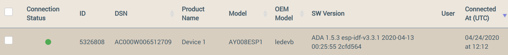
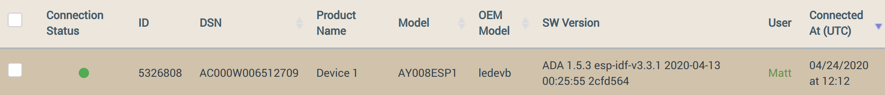

<aside id="pagebar" class="d-xl-block collapse">
  <ul>
    <li><a href="#core-title">ESP32 v1.5.3</a></li>
    <li><a href="#first-steps">First steps</a></li>
    <li><a href="#build-and-run">Build and Run</a>
      <ul>
        <li><a href="#gcc-ubuntu-docker">GCC/Ubuntu/Docker</a>
        <li><a href="#gcc-windows">GCC/Windows</a>
      </ul>
    </li>
    <li><a href="#register-your-device">Register your device</a></li>
    <li><a href="#perform-an-ota-update">Perform an OTA update</a></li>
    <li><a href="#sample-application-code">Sample Application Code</a>
      <ul>
        <li><a href="#properties">Properties</a></li>
        <li><a href="#demo_ledevb-c">demo_ledevb.c</a></li>
        <li><a href="#demo_common-c">demo_common.c</a></li>
        <li><a href="#conf-c">conf.c</a></li>
        <li><a href="#command-c">command.c</a></li>
        <li><a href="#ota-c">ota.c</a></li>
        <li><a href="#sched_conf-c">sched_conf.c</a></li>
        <li><a href="#demo_stub-c">demo_stub.c</a></li>
        <li><a href="#demo_wifi-c">demo_wifi.c</a></li>
      </ul>
    </li>
    <li><a href="#library-code">Library Code</a></li>
  </ul>
</aside>

<div class="dropdown mb-3">
  <button class="btn btn-warning btn-sm dropdown-toggle" type="button" id="versions" data-toggle="dropdown" aria-haspopup="true" aria-expanded="false">Choose a version</button>
  <div class="dropdown-menu" aria-labelledby="versions">
    <a class="dropdown-item" href="../v1-5-3">v1.5-3</a>
    <a class="dropdown-item" href="../v1-5-beta">v1.5-beta</a>
    <a class="dropdown-item" href="../v1-3-10-beta">v1.3.10-beta</a>
    <a class="dropdown-item" href="../v1-3-9">v1.3.9</a>
    <a class="dropdown-item" href="../v1-3-8">v1.3.8</a>
  </div>
</div>

The Ayla ESP32 Solution includes example host application source code, an Ayla Wi-Fi Integrated Agent, and Ayla extensions to the Espressif IoT Development Framework (IDF). These pieces link together to provide an Ayla edge solution for the ESP32 board. <a href="https://www.aylanetworks.com/edge-connectivity" target="_blank">Learn more about Ayla Integrated Agents</a>.

# First steps

1. Obtain an Espressif [ESP32-DevKitC](https://www.espressif.com/en/products/hardware/esp32-devkitc/overview) board.

1. Create an Ayla user account. You will probably need to have your Ayla Customer Account admin or Ayla support create a user account for you with admin or developer access rights. 

1. Reserve a DSN. Browse to [Ayla Dashboard Portal](/system-administration/ayla-dashboard-portal). On the sidebar, navigate to Factory Actions. Click the Reserve DSN button. For Model, select AY008ESP1. Click Submit, and then download the associated XML file. You will need the DSN value and key from the file.

1. Browse to the [Ayla Developer Portal](/system-administration/ayla-developer-portal/), and create a template with the following details.
    <table>
    <tr><td>Visibility:</td><td>private</td></tr>
    <tr><td>Name:</td><td>ADA ESP v1.5.3</td></tr>
    <tr><td>Description:</td><td>ADA ESP v1.5.3</td></tr>
    <tr><td>Registration:</td><td>Dsn</td></tr>
    <tr><td>Model:</td><td>ledevb</td></tr>
    <tr><td>Version:</td><td>ada-esp-idf-src-1.5.3</td></tr>
    <tr><td>Type:</td><td>Wifi</td></tr>
    </table>
1. Select the new template, click the Properties tab, and note the Import button.
1. Copy & paste the following properties into a text file (e.g. `properties.csv`), and import the file.
    ```
base_type,direction,name,scope
boolean,output,Blue_button,user
boolean,input,Blue_LED,user
string,input,cmd,user
decimal,input,decimal_in,user
decimal,output,decimal_out,user
boolean,input,Green_LED,user
integer,input,input,user
boolean,input,node_batch_hold,user
string,output,log,user
integer,output,output,user
file,input,stream_down,user
integer,output,stream_down_len,user
integer,output,stream_down_match_len,user
file,output,stream_up,user
integer,input,stream_up_len,user
string,output,version,user
    ```
1. Click the new ```version``` property, check ```Host SW Version```, and click ```OK```.

# Build and Run

## GCC/Ubuntu/Docker

This section provides directions for building an Ayla ESP32 Solution v1.5.3 using a GCC/Ubuntu/Docker development environment.

1. Download [Ayla source code](https://connection.aylanetworks.com/s/article/2648919) (ada-esp-idf-src-1.5.3.tgz). `ada` stands for Ayla Device Agent.

1. Determine the computer-to-ESP32 serial port:

    1. List the serial ports on your computer (e.g. ```ls /dev/tty*```).

    1. Connect an ESP32 board to your computer using a serial cable.

    1. List the serial ports again. The new serial port on the list is the one to use (e.g. ```/dev/ttyUSB0```).

1. Install a [Docker Engine](https://docs.docker.com/get-started/) on your Windows, Mac, and/or Linux host OS.

1. Create a Docker [64-bit Ubuntu](https://hub.docker.com/_/ubuntu) container:

    ```
  $ docker run --net=host --name=ada153 -w /root -it --device=/dev/ttyUSB0 ubuntu bash
    ```

    You are user `root`, and the current working directory is ```/root```. Later, when you want to exit your Docker container, type `exit`. Then, to restart and re-attach to your Docker container, type the following:

    ```
    $ docker ps -a
    $ docker start ada153
    $ docker attach ada153
    ```
    
1. Prepare your development environment:

    1. Update the package list in your Ubuntu Docker instance:

        ```
      # apt update
        ```

    1.  Install miscellaneous packages:

        ```
      # apt install nano screen iputils-ping 
        ```

    1. Install prerequisites for [Espressif Standard Setup of Toolchain v3.3.1 for Linux](https://docs.espressif.com/projects/esp-idf/en/v3.3.1/get-started/linux-setup.html).

        ```
      # apt install gcc git wget make libncurses-dev flex bison gperf python python-pip python-setuptools python-serial python-cryptography python-future python-pyparsing
        ```

    1. Create an ```esp``` directory, and change directory:

        ```
      # mkdir esp
      # cd esp
        ```

    1. Download a ESP32 toolchain for 64-bit Linux:

        ```
      # wget https://dl.espressif.com/dl/xtensa-esp32-elf-linux64-1.22.0-80-g6c4433a-5.2.0.tar.gz
        ```

        For the 32-bit version, see [this Espressif page](https://docs.espressif.com/projects/esp-idf/en/v3.3.1/get-started/linux-setup.html).

    1. Extract the archive file:

        ```
      # tar -xzf xtensa-esp32-elf-linux64-1.22.0-80-g6c4433a-5.2.0.tar.gz
        ```

    1. Add to the PATH environment variable, and persist the change in `.bashrc`:

        ```
      # export PATH=$HOME/esp/xtensa-esp32-elf/bin:$PATH
      # echo "export PATH=\$HOME/esp/xtensa-esp32-elf/bin:\$PATH" >> ~/.bashrc
        ```

    1. Clone the [Espressif IoT Development Framework](https://github.com/espressif/esp-idf):

        ```
      # git clone -b v3.3.1 --recursive https://github.com/espressif/esp-idf.git esp-idf-v3.3.1
        ```

    1. Create the ```IDF_PATH``` environment variable, and persist the change in `.bashrc`:

        ```
      # export IDF_PATH=$HOME/esp/esp-idf-v3.3.1
      # echo "export IDF_PATH=\$HOME/esp/esp-idf-v3.3.1" >> ~/.bashrc
        ```

1. Test the development environment with the hello_world example:

    1. Change directory:
    
        ```
      # cd $IDF_PATH/examples/get-started/hello_world
        ```

    1. Customize configuration. (Defaults should be fine.)
    
        ```
      # make menuconfig
        ```

    1. Build, flash, and monitor:

        ```
      # make
      # make flash
      # make monitor
        ```

        Output appears similar to this:

        ```
      Toolchain path: /root/esp/xtensa-esp32-elf/bin/xtensa-esp32-elf-gcc
      Toolchain version: crosstool-ng-1.22.0-80-g6c4433a
      Compiler version: 5.2.0
      ...
      ...
      Hello world!
      This is ESP32 chip with 2 CPU cores, WiFi/BT/BLE, silicon revision 1, 4MB external flash
      Restarting in 10 seconds...
      Restarting in 9 seconds...
      ...
      ...
        ```

        Press ```Ctl``` + ```]``` to exit the monitor.

1. Install Ayla source code:

    1. <span style="color:red;">In a host terminal</span>, copy ```ada-esp-idf-src-1.5.3.tgz``` to your Docker container:

        ```
      $ docker cp /home/matt/Downloads/ada-esp-idf-src-1.5.3.tgz ada153:/root/esp
        ```

    1. <span style="color:red;">In your Docker terminal</span>, extract the archive file:

        ```
      # cd /root/esp
      # tar zxvf ada-esp-idf-src-1.5.3.tgz
        ```

    1. Copy the ```ada-esp-idf-src-1.5.3``` directory on top of the ```esp-idf-v3.3.1``` directory:

        ```
      # cp -R ada-esp-idf-src-1.5.3/* ./esp-idf-v3.3.1
        ```

1. Configure and build the Ayla agent and host application:

    1. Change directory:

        ```
      # cd $IDF_PATH/examples/ayla_demo
        ```

    1. Edit ```./main/conf.h```. Set the following:

        ```
      #define DEMO_OEM_ID           "00000000" /* replace with your Ayla OEM ID */
      #define DEMO_TEMPLATE_VERSION "ada-esp-idf-src-1.5.3"
        ```

    1. Build, flash, and monitor:

        ```
      # make
      # make erase_flash
      # make flash
      # make monitor
        ```

    1. Configure networking and security (use ```log debug all``` for maximum visibility):

        ```
      # nvs-set ada.f.wifi/profile/0/ssid <ssid>
      # nvs-set ada.f.wifi/profile/0/security <security_type> # 0=none, 3=wpa, 4=wpa2
      # nvs-set ada.f.wifi/profile/0/key <passphrase>
      # nvs-set ada.f.wifi/profile/0/enable 1
      # nvs-set "ada.f.id/dev_id" AC000W000000001
      # nvs-set "ada.f.id/key" MIIB... (long number)
      # nvs-set ada.f.client/server/default 1
      # esp-reboot
        ```
        ```
      # oem key 0123456789abcdef0123456789abcdef ledevb
      # save
        ```

## GCC/Windows

See [Ayla ESP32 Solution v1.3.8](../v1-3-8/#gcc-windows).

# Register your device

1. Browse to the [Ayla Dashboard Portal](/system-administration/ayla-dashboard-portal), click OEM Users in the sidebar, click your account, and copy your UUID (e.g. ```a0000000-0000-0000-0000-000000000000```). 

1. Click Devices in the sidebar, and find the new device on the list:

    

1. Click the device row. Then, in the Device > Settings table, paste your UUID, and click Register:

    

1. View the device on the Devices list again. Note that the device is registered to you.

    

1. View the device in the Ayla Developer Portal:

    

# Perform an OTA update

# Sample Application Code

All of the sample application code provided below are working examples of how Ayla Embedded Agent APIs are used. This code should be evaluated as examples only and not considered the only way or your best practice when using the APIs.

## Properties

The ledevb demo in `examples/ayla_demo/main` implements a subset of the Ayla development kit demo properties:

* Button 0 (which is the Boot button): used for the Blue_Button property as well as the Button Push method of registration. Pressing button 0 for more than 5 seconds starts the registration window.
* The Blue_Button property: indicates the current state of button 0, (GPIO_0 on ESP32). 1 indicates pressed, and 0 indicates not pressed. The value is sent on each change.
* The decimal_in property to the device is reflected back as the decimal_out property from the device as an example of how to use decimal properties. The value in the demo is 100 times the value entered. For example, if 1.23 is entered on the developer site, the value set in the decimal_in variable is 123.
* The input and output properties are also linked. The integer value sent to input is sent back to the service as output.
* The cmd and log properties are strings that are linked. When the demo receives a string value for cmd, the value is reflected back as log. The maximum length of these strings is 1024 bytes of UTF-8 after JSON encoding. This means that some characters are counted as multiple bytes.
* The oem_host_version property is a string that gives the template version. The version property is a from-device string that provides the version of code running on the device.
* sched1 through sched5 are the five schedules associated with the demo. These schedules allow changes to the properties per specific time settings. For example, you could program the Blue_LED property to turn on every 10 seconds, or once a day, and so on.

Other properties in the ledevb template, for example, stream_*, are not implemented by the demo.

The other demo in examples/ayla_demo/main is demo_outlet1.c, which is an alternative to demo_ledevb.c.

The sample application source is in `ayla_demo/main` and is composed of the following C files:

```
# ls *.c
command.c  conf.c  demo_common.c  demo_ledevb.c  demo_outlet1.c  demo_stub.c  demo_wifi.c  ota.c  sched_conf.c
```

## demo_ledevb.c

The demo_ledevb.c file contains the code specific to the demo and its properties. This file works as follows:

* The demo starts in app_main(), which calls demo_start() which is part of demo_common.c. This initializes the demo and ADA and starts the esp wifi framework and launches an application thread which calls demo_init() and runs demo_idle() in this file.
* demo_init() uses the API ada_sprop_mgr_init() to register the properties handled by the device through the simple property manager. The table used is called demo_props.
* demo_led_set() is used for the setting of the LED properties.
* demo_int_set() is used for the setting of the input and decimal_in properties.
* demo_cmd_set() is used for the setting of the cmd property.
* demo_idle() first reads the two buttons, and then does the following:
    * Sends the version and oem_host_version properties.
    * Enters an idle loop that sleeps for 100 ms.
    * Updates the Link LED.
    * Samples the buttons.

## demo_common.c

The demo_common.c file contains the code that is common among most demos running under the ESP32. This file works as follows:

* The first call to this file is from main() calling demo_start(), which calls module_init(), prints the software version, and then calls app_framework_start() to trigger callbacks to event_handler().
* modules_init() initializes the serial port, the CLI.
* event_handler() logs each event as it occurs and handles the WLAN_INIT_DONE and NORMAL_CONNECTED events. When WLAN init is completed, it calls init_nvs() to enable the non-volatile storage command line interface, and then it calls demo_client_start() to initialize the ADA. On the NORMAL_CONNECTED event, the event_handler() starts the ADA client and creates the demo thread which runs in demo_idle_enter().
* demo_client_start() calls initialization routines that are part of the ADA interfaces and in conf.c and sched_conf.c.
* clock_init() makes sure the clock is in range so that the SSL(mbedtls) certificates are valid.
* client_conf_init() is described in the conf.c section below.
* client_task_init() starts the ADA client thread.
* ada_sched_enable() turns on the schedule handler inside the ADA.
* demo_client_start() calls demo_init() in demo_ledevb.c to register the properties.

## conf.c

The conf.c file loads the ADA client configuration from the ESP32 NVS and stores values for ADA as needed. This file also provides several platform-specific interfaces required by the ADA. The platform-provided interfaces have the prefix "adap_."

ADA configuration variables have hierarchical names separated by slash characters, for example"id/dev_id." These names have the prefix "ada." For example, the full name for the ESP32 NVS would be "ada.id/dev_id."

In the conf.c file, client_conf_init() reads the MAC address and the system UUID, which the ADA sends to the ADS to confirm that the device is not using the same serial number as another device. client_conf_init() also does the following:

* Calls sched_conf_load() to load the saved schedules.
* Sets the enable and get_all flags in the client_conf structure, as well as the poll_interval, which is used in cases where connectivity to the Ayla Notification Service (ANS) is lost. 
* Calls log_init() to initialize the ADA logging Interfaces.

## command.c

The command.c file contains the code for CLI commands. Most of these commands are wrappers for the ADA command interfaces. Several of these CLI commands should only be used for manufacturing setup and should not be used for production devices.

## ota.c

The ota.c file contains code to demonstrate the OTA firmware download interfaces. A host OTA can be deployed from the developer’s site, and the code in this file receives, installs, and boots this OTA. After you burn the first OTA, the device always boots from an OTA partition. The device never boots from the factory partition after that; unless, you erase the OTADATA partition, which is instructing the second stage bootloader to boot from the OTA.

## sched_conf.c

The sched_conf.c file contains code to support schedules that are optional. These schedules allow actions on properties to be set for a regular or irregular time frame. For example, you could set a schedule to turn on an output property once every 10 seconds or on the third Tuesday of every month.

The function sched_conf_load() sets the number of schedules and the name for each one. The names should match the names in the Ayla template on the ADS, and the names known by the mobile application. This function also loads the saved values of any schedules that have been set.

The platform-support function adap_sched_conf_persist() saves any schedules that have been changed by the ADA. The in-memory value of the schedule is read using ada_sched_get_index() and compared to the saved value obtained by adap_conf_get(). If there is a difference, the in-memory value is written using adap_conf_set().

The function sched_conf_name() fills in the configuration name for the value of a schedule, given its index.

The functions adap_sched_run_time_write() and adap_sched_run_time_read() save and restore the last time that the schedules were processed. These functions should put that time in non-volatile storage, if possible, to avoid having to re-process events that have already taken place after rebooting the system. This saves power if non-volatile memory is retained and may be important if schedules are heavily used.

Be sure to validate that the non-volatile storage is valid when reading the value (for the time of the event), as it can be scrambled if power is not maintained. A CRC and magic number could be used. If the value is not valid, 0 should be returned.

## demo_stub.c

The demo_stub.c file contains sample implementation for interfaces required by the embedded agent from the Wi-Fi code. This is only used if Ayla’s Wi-Fi code (ADW) is not used.

## demo_wifi.c

The demo_wifi.c file initializes the ADW configuration for the AP-mode SSID and the iOS setup app. This file contains an event handler that receives the notifications of significant Wi-Fi events.

# Library Code

The example application links with the following Ayla libraries residing in `components/ayla`: 

|Library|Notes|
|-|-|
|libada|See below.|
|libayla|See [Ayla Embedded Agent for Embedded Systems](https://docs.aylanetworks.com/archive/ayla-embedded-agent-for-embedded-systems).|
|libadw|See [Ayla Device Wi-Fi for Embedded Systems](https://docs.aylanetworks.com/archive/ayla-device-wi-fi-for-embedded-systems).|
|libjsmn|JSMN (pronounced Jasmine) is a small JSON parser. ADA uses a different version of JSMN than the one in ESP32. The ADA version is in `components/ayla/jsmn`.|
|libnet|This library contains a thin layer of macros and functions that interface with LwIP and ESP32.|

## Library ada

Below are summaries of the files in this library to help you with ESP32 development. For a full description of this library, see [Ayla Embedded Agent for Embedded Systems](https://docs.aylanetworks.com/archive/ayla-embedded-agent-for-embedded-systems).

### `al/esp32/ada_lock.c`

This file implements an interface to the thread mutexes.

### `al/esp32/client_task.c`

This file contains code for the client thread and its initialization, timers, locking, and work queue.

The function ada_init() does the following:

* Initializes the logging subsystem, including setting severity levels to be logged for each subsystem.
* Initializes the timers and the mutex, which protects most of the client data structures.
* Calls init functions for various subsystems.
* Calls ada_conf_load() to read configuration settings.
* Creates the client_task_queue and the client thread.

The client thread runs in the function client_idle(). This function initializes the TLS library, and the client_redir_client_htlm() handler (described below) takes the client lock and then enters the idle loop.

The idle loop handles any pending timers that need to be handled in the client thread while still holding the client lock. Then, the idle loop waits for callbacks on the client_task_queue. This client_task_queue waits until the next scheduled timer or until an event occurs. If a callback is found, its handler is called and the loop repeats.

The al/esp32/client_task.c file contains code in the function client_redir_client_html() that redirects HTTP requests for “/client” to “/client.html”. This is necessary for same-LAN web-based device registration.

The remainder of the code in the al/esp32/client_task.c file implements the client timers and synchronization needed with the server thread:

* The functions client_lock_int() and client_unlock_int() implement the locking around the client structures. These functions keep some debugging information that can be useful if there is trouble in this area.
* The global string pointer client_mutex_func holds the name of the function that last successfully locked the client_lock.
* The global integer client_mutex_line gives the line number in that function.
* The global pointer client_mutex_owner is a pointer to the OS task that holds the mutex and is used to detect recursive attempts on the lock.

### `al/esp32/http_client.c`

The al/esp32/http_client.c file implements the interface between the HTTP client of ADA and the httpc functionality of the ESP32.

### `al/esp32/log.c`

The al/esp32/log.c file loads the configuration of the logging system in ADA. 

### `al/esp32/notify_task.c`

The al/esp32/notify_task.c implements timers for the notification subsystem, which interacts with ANS.

### `al/esp32/stubs.c`

The al/esp32/stubs.c file contains miscellaneous required routines - some for features that are not functional in this architecture, and some that are simple interfaces between ADA and ESP32.

### `al/net/server.c`

The al/net/server.c file implements an HTTP server that binds to TCP port 80. This is used for Wi-Fi setup and LAN mode. The httpc functionality in ESP32 is not usable while this server is running.
