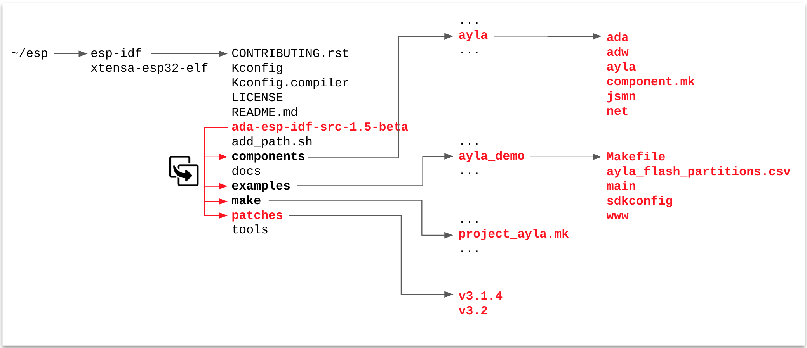
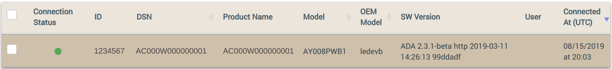

<aside id="pagebar" class="d-xl-block collapse">
  <ul>
    <li><a href="#core-title">ESP32 v1.5-beta</a></li>
    <li><a href="#first-steps">First steps</a></li>
    <li><a href="#build-and-run">Build and Run</a>
      <ul>
        <li><a href="#gcc-ubuntu-docker">GCC/Ubuntu/Docker</a>
        <li><a href="#gcc-windows">GCC/Windows</a>
      </ul>
    </li>
    <li><a href="#register-your-device">Register your device</a></li>
  </ul>
</aside>

<div class="dropdown mb-3">
  <button class="btn btn-warning btn-sm dropdown-toggle" type="button" id="versions" data-toggle="dropdown" aria-haspopup="true" aria-expanded="false">Choose a version</button>
  <div class="dropdown-menu" aria-labelledby="versions">
    <a class="dropdown-item" href="../v1-5-beta">v1.5-beta</a>
    <a class="dropdown-item" href="../v1-3-10-beta">v1.3.10-beta</a>
    <a class="dropdown-item" href="../v1-3-9">v1.3.9</a>
    <a class="dropdown-item" href="../v1-3-8">v1.3.8</a>
  </div>
</div>

The Ayla ESP32 Solution includes example host application source code, an Ayla Wi-Fi Integrated Agent, and Ayla extensions to the Espressif IoT Development Framework (IDF). These pieces link together to provide an Ayla edge solution for the ESP32 board. <a href="https://www.aylanetworks.com/edge-connectivity" target="_blank">Learn more about Ayla Integrated Agents</a>.

# First steps

1. Obtain an Espressif [ESP32-DevKitC](https://www.espressif.com/en/products/hardware/esp32-devkitc/overview) board.

1. Create an Ayla user account. You will probably need to have your Ayla Customer Account admin or Ayla support create a user account for you with admin or developer access rights. 

1. Reserve a DSN. Browse to [Ayla Dashboard Portal](/system-administration/ayla-dashboard-portal). On the sidebar, navigate to Factory Actions. Click the Reserve DSN button. For Model, select AY008ESP1. Click Submit, and then download the associated XML file. You will need DSN value and the key from the file.

1. Browse to the [Ayla Developer Portal](/system-administration/ayla-developer-portal/), and create a template with the following details.
    <table>
    <tr><td>Visibility:</td><td>oem</td></tr>
    <tr><td>Name:</td><td>ADA ESP v1.5 Beta</td></tr>
    <tr><td>Description:</td><td>ADA ESP v1.5 Beta</td></tr>
    <tr><td>Registration:</td><td>Dsn</td></tr>
    <tr><td>Model:</td><td>ledevb</td></tr>
    <tr><td>Version:</td><td>ada-esp-idf-src-1.5-beta</td></tr>
    <tr><td>Type:</td><td>Wifi</td></tr>
    </table>
    After creating the template, copy & paste the following properties into a text file, and import the file.
    <pre>base_type,direction,name,scope
boolean,output,Blue_button,user
boolean,input,Blue_LED,user
string,input,cmd,user
decimal,input,decimal_in,user
decimal,output,decimal_out,user
boolean,input,Green_LED,user
integer,input,input,user
string,output,log,user
integer,output,output,user
string,output,version,user</pre>
    Finally, click the new ```version``` property, check ```Host SW Version```, and click ```OK```.

# Build and Run

## GCC/Ubuntu/Docker

This section provides directions for building an Ayla ESP32 Solution v1.5-beta using a GCC/Ubuntu/Docker development environment.

1. Download [Ayla source code](https://connection.aylanetworks.com/s/article/2648919) (ada-esp-idf-src-1.5-beta.tgz).

1. Determine the computer-to-ESP32 serial port:

    1. List the serial ports on your computer (e.g. ```ls /dev/tty*```).

    1. Connect an ESP32 board to your computer using a serial cable.

    1. List the serial ports again. The new serial port on the list is the one to use (e.g. ```/dev/ttyUSB0```).

1. Install a [Docker Engine](https://docs.docker.com/get-started/) on your Windows, Mac, and/or Linux host OS.

1. Create a Docker [ubuntu](https://hub.docker.com/_/ubuntu) container:

    ```
  $ docker run --net=host --name=esp -w /root -it --device=/dev/ttyUSB0 ubuntu bash
    ```

    You are root, and the current working directory is ```/root```.

1. Prepare your development environment:

    1. Update package list:

        ```
      # apt update
        ```

    1.  Install miscellaneous packages:

        ```
      # apt install nano screen iputils-ping 
        ```

    1. Install prerequisites for [Espressif Standard Setup of Toolchain v3.2.2 for Linux](https://docs.espressif.com/projects/esp-idf/en/v3.2.2/get-started/linux-setup.html).

        ```
      # apt install gcc git wget make libncurses-dev flex bison gperf \
      python python-pip python-setuptools python-serial python-cryptography python-future
        ```

    1. Create an ```esp``` directory, and change directory:

        ```
      # mkdir esp
      # cd esp
        ```

    1. Download ESP32 toolchain for Linux:

        ```
      # wget https://dl.espressif.com/dl/xtensa-esp32-elf-linux64-1.22.0-80-g6c4433a-5.2.0.tar.gz
        ```

    1. Extract the archive file:

        ```
      # tar -xzf xtensa-esp32-elf-linux64-1.22.0-80-g6c4433a-5.2.0.tar.gz
        ```

    1. Add to the PATH environment variable:

        ```
      # export PATH=$HOME/esp/xtensa-esp32-elf/bin:$PATH
        ```

    1. Clone the [Espressif IoT Development Framework](https://github.com/espressif/esp-idf):

        ```
      # git clone -b v3.2 --recursive https://github.com/espressif/esp-idf.git esp-idf-v3.2
        ```

    1. Create the ```IDF_PATH``` environment variable:

        ```
      # export IDF_PATH=$HOME/esp/esp-idf-v3.2
        ```

1. Test the development environment with the hello_world example:

    1. Change directory:
    
        ```
      # cd $IDF_PATH/examples/get-started/hello_world
        ```

    1. Customize configuration. (Defaults should be fine.)
    
        ```
      # make menuconfig
        ```

    1. Build, flash, and monitor:

        ```
      # make
      # make flash
      # make monitor
        ```

        Output appears similar to this:

        ```
      Toolchain path: /root/esp/xtensa-esp32-elf/bin/xtensa-esp32-elf-gcc
      Toolchain version: esp32-2019r1
      Compiler version: 8.2.0
      ...
      ...
      Hello world!
      This is ESP32 chip with 2 CPU cores, WiFi/BT/BLE, silicon revision 1, 4MB external flash
      Restarting in 10 seconds...
      Restarting in 9 seconds...
      ...
      ...
        ```

        Press ```Ctl``` + ```]``` to exit the monitor.

1. Install Ayla source code:

    1. <span style="color:red;">In a host terminal</span>, copy ```ada-esp-idf-src-1.5-beta.tgz``` to your Docker container:

        ```
      $ docker cp /home/matt/Downloads/ada-esp-idf-src-1.5-beta.tgz esp:/root/esp
        ```

    1. In your Docker terminal, extract the archive file:

        ```
      # cd /root/esp
      # tar zxvf ada-esp-idf-src-1.5-beta.tgz
        ```

    1. Copy the ```ada-esp-idf-src-1.5-beta``` directory on top of the ```esp-idf-v3.2``` directory:

        ```
      # cp -R ada-esp-idf-src-1.5-beta/* ./esp-idf-v3.2
        ```

        This diagram gives you an idea of where the Ayla files are copied:

        

1. Configure and build the Ayla agent and host application:

    1. Change directory:

        ```
      # cd $IDF_PATH/examples/ayla_demo
        ```

    1. Edit ```./main/conf.h```. Set the following:

        ```
      #define DEMO_OEM_ID           "00000000" /* replace with your Ayla OEM ID */
      #define DEMO_TEMPLATE_VERSION "ada-esp-idf-src-1.5-beta"
        ```

    1. Build, flash, and monitor:

        ```
      # make
      # make erase_flash
      # make flash
      # make monitor
        ```

    1. Configure networking and security (use ```log debug all``` for maximum visibility):

        ```
      # nvs-set ada.f.wifi/profile/0/ssid <ssid>
      # nvs-set ada.f.wifi/profile/0/security <security_type> # 0=none, 3=wpa, 4=wpa2
      # nvs-set ada.f.wifi/profile/0/key <passphrase>
      # nvs-set ada.f.wifi/profile/0/enable 1
      # nvs-set "ada.f.id/dev_id" AC000W000000001
      # nvs-set "ada.f.id/key" MIIB... (long number)
      # nvs-set ada.f.client/server/default 1
      # esp-reboot
        ```
        ```
      # oem key 0123456789abcdef0123456789abcdef ledevb
      # save
        ```

## GCC/Windows

See [Ayla ESP32 Solution v1.3.8](../v1-3-8).

# Register your device

1. Browse to the [Ayla Dashboard Portal](/system-administration/ayla-dashboard-portal), click OEM Users in the sidebar, click your account, and copy your UUID (e.g. ```a0000000-0000-0000-0000-000000000000```). 

1. Click Devices in the sidebar, and find the new device on the list:

    

1. Click the device row. Then, in the Device > Settings table, paste your UUID, and click Register:

    

1. View the device on the Devices list again. Note that the device is registered to you.

    

1. View the device in the Ayla Developer Portal:

    

1. View the device in the Aura Mobile App:
