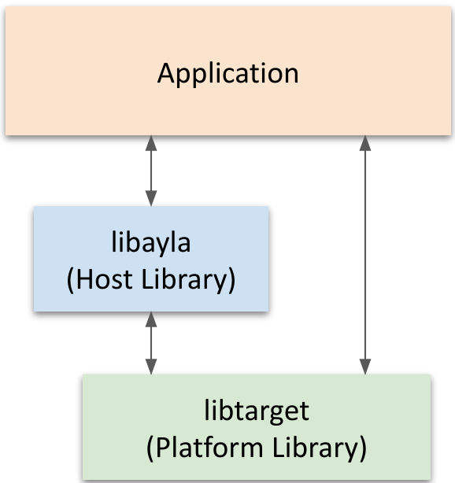
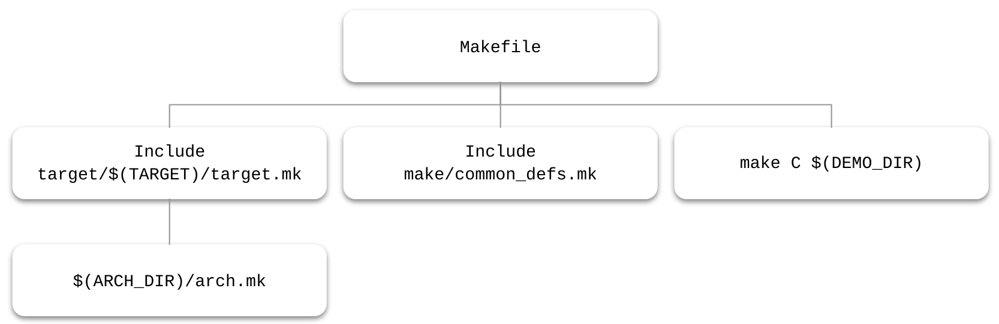

# Introduction

This document describes: 

* Host applications which connect to an Ayla module containing an Ayla Production Agent. 
* The Ayla host library which provides connectivity to the Ayla module from a host MCU. 
* Reference host applications.
* Ayla hardware demonstration kits. 
* How to build and install the host application on the demonstration kits.
* How to port the host library and reference applications to other MCU types or other platforms.

This document is intended for those familiar with embedded C programming.

The Ayla host library and reference applications package contains libraries and example applications. This document version corresponds to host library version 2.1 and the reference applications included in that package. 

The Ayla host library assists a device developer in connecting an MCU to an Ayla module to access the Ayla device service. It is intended to be portable so that it can be used by customers with their host apps on whatever platform they choose. 

The reference host application ledevb contains code to demonstrate the use of the host library to send and receive simple properties, to configure certain module features, and to handle over-the-air (OTA) firmware updates. 

The reference host application demo_batch contains code to demonstrate sampling values over time and sending them periodically to the service with a single batch API. 

The host library and reference applications are built without an Operating System (OS) and can be ported to work with an RTOS.

By default, they use a SPI connection between the Host MCU and the module. A build option can select UART mode instead of SPI. Other build options can add or remove features. 

The code is supported for the STM32F3Discovery board or the STM32F303RE Nucleo board. A port to use the code on Linux connecting to the module over a UART is also provided. 

The code can be built with GCC on Linux, Mac-OS, or Windows. 

# Host Applications

# Host Library

# Reference Host Applications

## Host Application Organization

The reference host application organization is shown in the following block diagram. The application can use functions in the demo library (example/libdemo) and the console library (example/libcons). 

The target library, built from source under arch/stm32f3, arch/stm32, and ext, contains platform-specific functions and definitions to perform low-level I/O, for SPI and UART communications, and GPIO access, etc. These are the portions specific to a particular MCU and board.



## ledevb application

### Example properties

The ledevb example code in `examples/apps/ledevb/demo.c` demonstrates several properties which help in testing the interaction between the module and device service. This section lists the properties and describes the behavior associated with them.

|Name|Type|Direction|
|-|-|-|
|binary_in|ATLV_MSG_BIN|To Device|
|binary_out|ATLV_MSG_BIN|From Device|
|Blue_button|ATLV_BOOL|From Device|
|Blue_LED|ATLV_BOOL|sss|
|cmd|ATLV_UTF8|sss|
|decimal_in|ATLV_CENTS|sss|
|decimal_out|ATLV_CENTS|sss|
|Green_LED|ATLV_BOOL|sss|
|input|ATLV_INT|sss|
|json_in|ATLV_MSG_JSON|sss|
|json_out|ATLV_MSG_JSON|sss|
|log|ATLV_UTF8|sss|
|message_start|ATLV_UTF8|sss|
|oem_host_version|ATLV_UTF8|sss|
|output|ATLV_INT|sss|
|schedule_in|ATLV_SCHED|sss|
|stream_down|ATLV_LOC|sss|
|stream_down_len|ATLV_UINT|sss|
|stream_down_match_len|ATLV_UINT|sss|
|stream_up|ATLV_LOC|sss|
|stream_up_len|ATLV_INT|sss|
|string_in|ATLV_MSG_UTF8|sss|
|string_out|ATLV_MSG_UTF8|sss|
|version|ATLV_UTF8|sss|

When the ADS changes property values of `Green_LED` or `Blue_LED`, the associated LED is turned on (value 1) or off (value 0). The MCU reacts to the blue button on the AylaShield if using a Nucleo board, or on the Discovery board if using that board. When the blue button is pressed or released, the property `Blue_button` is sent to the ADS with a Boolean value of 1 (when pressed) and 0 (when released). The on time of the button is extended at least two seconds.

`Blue_button` has another function – as part of a factory reset. To reset the module to its factory configuration, hold the blue button down and then press and release the black reset button on the MCU board. The blue LED will blink quickly for five seconds, and if still holding the blue button at that time, the application instructs the module to restore its factory configuration. During the five-second startup time, the blue LED blinks to confirm the reset is happening. If reset is not wanted, the button can be released before the time is up. If the button is pressed for the entire five seconds after reset, the blue LED will be on for a short time and then go off when the module re-asserts the ready signal.

A pair of integer properties called `input` and `output` works as follows:  When the service sets property `input` to a value, the demo receives the new value and sets the `output` property to the square of that value, and then sends the output property to the service. If the square would overflow a 32-bit number, `output` is set to -1.

A pair of string properties, `cmd` and `log`, work together as follows: When the service sets `cmd` to a value, it is copied to the `log` property, which is sent to the service. This can be used to test long string properties of up to 1024 bytes.

A pair of decimal properties, `decimal_in` and `decimal_out`, work together as follows: When the service sets `decimal_in` to a value, the demo MCU sets the `decimal_out` property to the same value, and sends it back to the service.

`stream


## demo_batch application

# Reference Libraries

## libdemo library

### Example Over-The-Air Firmware Update 

Over-the-air (OTA) update refers to updating the firmware image on the MCU with a new version. This may include defect fixes or new features. The full development kit contains a sample implementation. The internal flash is split into different regions. It holds a bootloader, two images, and scratch areas, used when swapping images between active and inactive slots. Here's the layout of the STM32F303 flash as it is used:

|Address|Use|
|-|-|
|0x08000000|Bootloader (start of flash)|
|0x08001800|Copy "progress bar"|
|0x08002000|Active image|
|0x08020000|Inactive image|
|0x0803e000|Copy scratch area|
|0x08040000|End of flash|

*Bootloader*

After reset, the MCU enters the bootloader which will eventually boot the actual image. The bootloader determines whether it should boot the image that's currently in the active slot, or if it should swap that with the inactive image. A swap is done if the MCU wants to boot a new image, or if it is falling back to the old image. Fallback happens after a failure to boot to newly uploaded image. In case the MCU is reset before completing a swap of the images, an block of flash is used to keep track of the progress of the operation and the bootloader will continue from where it left off. This block of flash is called the "progress bar". The bootloader starts the active image by jumping to address in reset interrupt vector in the image. 

*Image Download*

Firmware download and reset of the image management is done while the MCU runs the active image. The download can be interrupted and restarted. During the download, the module may restart the process by sending a new OTA notification message. 

1. OTA is started by a message from ADS. The message includes the image name and its size.
1. The MCU firmware can decide to reject the image, for example, if it is already running the new version, or if the images is the wrong type. 
1. If MCU firmware approves the download, the application prepares the inactive image slot. 
1. Once MCU application gives a go-ahead, module fetches the image from the Ayla Cloud. 
1. The MCU firmware image then comes one block at a time from the module. 
1. Firmware stores this image in the inactive slot. 
1. When the download is complete, the image integrity is checked and the MCU reports successful completion. 
1. After the Ayla module informs ADS the download was OK, it asks the MCU to boot the new image. 

*OTA Properties*

An image update can include one or more of these changes: 

* introduce new properties 
* removal old properties 
* change existing properties 

The "oem_host_version" is a reserved property that selects the appropriate service template for the MCU firmware. The module may ask for this property at any time, currently after each time the module boots. The successful completion of the OTA is indicated by sending the new MCU firmware version. The "version" property is a string property that contains the MCU firmware version. This property name is not reserved, but the name "version" is used in the ledevb demo. In your product, any string property can be used to hold the firmware version. The "Host SW Version" flag associated with the property in the template indicates it is used for this purpose.

*Image Format*

For OTA, each product design can use any file format that is convenient, although often it will be a binary image that is stored in flash, possibly with an additional header and checksum or equivalent. MCU firmware images in the demo kit have a specific format. This makes it possible to validate images. For the STM32F2, we use one of two versions.

Use these offsets when the image size &lt; 64K (65,536):

|Offset (bytes)|Size (bytes)|Name|Use|
|-|-|-|-|
|0x0|0x188|Interrupt vector|This is kept in the beginning because of STM32 memory alignment restrictions.|
|0x188|4|Magic number|Value 0xbfa43640. Detects that this file is probably an MCU firmware image.|
|0x18c|2|CRC-16|CRC-16 of the image, calculated with this field set to 0.|
|0x18e|2|Size|Total size of the image.|
|0x190|72|Version|Image version string. Reported as property "version" to ADS, or as "inactive_version", when image is in inactive slot.|
|0x1d8|--|Image Text|Rest of the image.|

Use these offsets when the image size &ge; 64K (65,536):

|Offset (bytes)|Size (bytes)|Name|Use|
|-|-|-|-|
|0x0|0x188|Interrupt vector|This is kept in the beginning because of STM32 memory alignment restrictions.|
|0x188|4|Magic number|Value 0xbfa43641. Detects that this file is probably an MCU firmware image.|
|0x18c|4|Size|Total size of the image.|
|0x190|72|Version|Image version string. Reported as property "version" to ADS, or as "inactive_version", when image is in inactive slot.|
|0x1d8|--|Image Text|Rest of the image.|
|<Size>|4|CRC32|32-bit CRC such that the overall CRC including this is 0.|

### Factory Reset API

This API consists of the following function:

```
int demo_factory_reset_handle(void);
```

This function can be called early in the demo to determine whether a factory reset should be performed. A platform-specific function, `board_factory_reset_detect()`, is called and if that returns non-zero, the module is sent a command to restore its factory configuration.

### Demo Library Files

The library in `example/libdemo` is a set of routines usable in all applications as desired to implement various application-dependent and feature-dependent operations. It contains these files, divided by function: 

* `demo_factory_reset.c` has a function that can be used to detect that the user desires a factory reset of the module and the host application. 
* `demo_img_mgmt.c` has functionality used for handling over-the-air updates and multiple firmware images. Note that this version is specific to the STM32F303 and would need to be ported for other MCUs and other firmware update schemes. 
* `demo_message.c` implements the ledevb demo message properties. 
* `demo_poll.c` has the polling loop for the demo, which calls the polling loop for libhost and the console, and runs timers and callbacks that allow other parts of the demo to work without explicit hooks into the polling loop. This functionality could be ported to work with an RTOS. 
* `demo_power.c` demonstrates some methods for controlling the module power by tracking when the module goes into standby mode and resetting when needed. 
* `include/demo/demo.h` defines the primary interfaces to libdemo. 
* `include/demo/demo_message.h` defines the interfaces to demo_message.c. 

## libcons library

### Source Files

The library in `example/libcons` is provided for use in setting up a debug port and a command line interface for testing the application. It contains these files: 

* `atty.c`: Driver layer to write log messages and other output to the console UART. 
* `cmd_handle.c`: Callbacks for incoming user commands on the console. 
* `console.c`: Command handlers for console commands that users may define. 
* `libcons_int.h`: declarations for interfaces used inside libcons. 
* `parse_argv.c`: Utility to tokenize command string. 
* `parse_hex.c`: Utility to convert string to hex. 
* `printf.c`: Implementations of common print functions including putchar, puts, printf, etc. 

### Header Files

The header files in `example/libcons/include/ayla` are: 

* `atty.h`: Function prototypes for platform routines to control the console serial port. 
* `cmd.h`: Function prototypes for handlers of the console CLI commands. 
* `console.h`: Function prototypes for the console driver. 
* `parse.h`: Function prototypes for parsing console input. 

# Reference Evaluation Boards

The Ayla Shield devkit and the Discovery board devkit come prewired. The Ayla Shield connects via SPI to the host MCU via its connections to the STM32F3 Nucleo board. The Discovery board devkit has connections for both SPI and UART mode. This section shows how the signals on each board are used. 

The SPI signals SPI_NSS, SPI_SCK, SPI_MOSI, SPI_MISO and their usage are described in the Ayla SPI protocol document. 

READY_N from the module is asserted to indicate that the module has initialized the SPI interface and is ready to accept commands. 

INTR_N from the module is asserted when the module has a SPI message waiting to be collected by the master. This de-asserts after the message has started to transfer to the master. Each time a SPI message becomes pending, the module generates a falling edge on INTR_N, even if it is already low. 

Reset_N is connected between the host and the Ayla module. The demo software uses this line to reset the module during startup. 

When UART is used, the READY_N and INTR_N lines are not needed. The 4-wire UART signals are RX, TX, CTS, and RTS. Hardware flow control is required. 

### Nucleo Board in SPI mode

|STM32F303 Nucleo pin|Signal|
|-|-|
|PB6|SPI_NSS (input to module, active low, open-drain)|
|PA5|SPI_SCK|
|PA6|SPI_MISO (master in, slave out)|
|PA7|SPI_MOSI (master out, slave in)|
|PC0|INTR_N (slave output) active low, open-drain|
|PC1|READY_N (slave output) active low, open-drain|
|PC7|LINK_N (slave output) active low, open-drain|
|PB0|Reset_N (output to module, open-drain)|

### Nucleo Board in UART mode

|STM32F303 Nucleo pin|Signal|
|-|-|
|PC5|UART RX from module|
|PC4|UART TX to module|
|PA11|UART CTS from module|
|PA12|UART RTS to module|
|PB0|Reset_N (output to module, open-drain)|

### Discovery Board in SPI mode

|STM32 F3 Discovery Pin|Signal|
|-|-|
|PB12|SPI_NSS (input to module, active low, open-drain)|
|PB13|SPI_SCK|
|PB14|SPI_MISO (master in, slave out)|
|PB15|SPI_MOSI (master out, slave in)|
|PB11|INTR_N (slave output) active low, open-drain|
|PB10|READY_N (slave output) active low, open-drain|
|PB1|LINK_N (slave output) active low, open-drain|
|PB0|Reset_N (output to module, open-drain)|

### Discovery Board in UART mode 

|STM32 F3 Discovery Pin|Signal|
|-|-|
|PA3|UART RX from module|
|PA2|UART TX to module|
|PD3|UART CTS from module|
|PA1|UART RTS to module|
|PB0|Reset_N (output to module, open-drain)|

# Reference Platform Code

The example platform support code for is under the `arch` folder. Folder `arch/stm32f3` has code that is common to the stm32f303 processor used on the evaluation boards. The components in `arch/stm32f3` are: 

* console_platform.c initializes and supports the serial console, if needed. 
* mcu_analog.c contains code supporting the batch demo using analog-to-digital (ADC) inputs. 
* mcu_io.c initializes the board GPIOs and LEDs. 
* spi_platform.c contains the low-level SPI driver for module communication. 
* stm32f3_discovery.c is only used by mcu_io for LED initialization. 
* uart_platform.c contains the low-level UART driver for module communication. 

Folder `arch/stm32` has code that is common to several stm32 processors. The components in `arch/stm32` are: 

* al_intr.c This contains functions for masking and unmasking interrupts. It is not used by the included demos. 
* cm3_intr.h Is no longer used. 
* loader.c is the bootloader. 
* stm32.c contains board initialization, GPIO routines, the SYSTICK handler, and al_time.h functions. 
* uart_platform_noOS.c contains stubs for two uart_platform functions. 

# Building Host Code

The demo software package can be built using `make` from the command line. 

## Demo Components

The demo software package is divided into these components: 

* `ayla/libayla`: This folder contains Ayla's platform-independent host library. Portions of this library are optional and will be included in the final application only if referenced. Code in this folder should be portable to any platform without modification. 
* `example`: This folder contains top-level reference files to exercise various Ayla features. The standard application used in Ayla's development kits is in "app/ledevb."   An application using batch datapoints is in "app/demo_batch". 
* `ext`: This folder includes code developed by STMicroelectronics, ARM Limited, or others for platform support. 
* `arch`: This folder contains platform-specific code. It needs to be modified to suit your platform needs. The code includes UART/SPI configuration, I/O config, and bootloader. 
* `proj`: This folder contains project files for the unsupported toolchain: Keil. 
* `target`: This folder contains build options for each target board. 
* `toolchain`: This folder contains gmake settings for each toolchain (compiler suite). 

## Building the App

The Makefile works natively on Linux or Mac-OS or under Cygwin on Windows. The user must install the GNU ARM toolchain, Python, and OpenOCD as prerequisites. 

1. For Windows, install cygwin, keeping default tools, and adding "make", "python3.7" interpreter, and "gcc". 
1. Download and extract gnu_arm_eabi_none toolchain inside `<gnuarmtc>` (e.g. `/cygdrive/c/Program Files (x86)/GNU Tools ARM Embedded/8 2018-q4-major`). 
1. Unzip host library pkg (e.g., Ayla-host-lib-2.0.zip) inside a cygwin user home directory folder. 
1. Install openocd 0.10.0 or later from http://www.freddiechopin.info/en/download into cygwin /usr/share (it should be /usr/share/openocd). OpenOCD is a tool that gives access to on-chip debugging via JTAG for loading flash and debugging. 
1. Add the /usr/share/openocd/bin or bin-x64 to $PATH. Use bin-x64 if you have a 64-bit Windows system. 
    ```
    PATH=$PATH:~/openocd-0.10.0/bin-x64 
    ```
1. Set TOOLCHAIN_DIR in your environment to `<gnuarmtc>` or edit `<demo>/toolchain/arm-none-eabi.mk` to set TOOLCHAIN_DIR to `<gnuarmtc>`: 
    ```
    export TOOLCHAIN_DIR="/cygdrive/c/Program Files (x86)/GNU Tools ARM Embedded/8 2018-q4-major" 
    ```
1. Install Python. For Windows, you can use https://www.python.org/downloads/windows. This was tested with Python 3.7.3, but other versions should work. 
1. Run make. This will build the host library, libdemo, libcons, libarch, and the demo. The default target is the Nucleo board in SPI mode, with a debug console. To select the discovery board, specify BOARD=discovery. To select UART mode, select USE_UART=1. To disable the debug console, specify NO_CONSOLE=1. For example, use just 'make' for the Nucleo board: 
    ```
    make 
    make BOARD=discovery USE_UART=0 
    ```
1. Run "make download" with all of the other options you used for your build. This will download the demo to the devkit:
    ```
    make download 
    ```
1. For a new board that has not been set up before, the bootloader, which boots the app and is used to apply firmware updates, must be built and installed. To do this run "make download_loader" 
    ```
    make download_loader 
    ```

After these build steps are complete, the board can be reset to start the app running. A gdb debugging session is available with "make debug". 

## Make Files

This section documents how the make files are organized to select the components to be built and the compile options to be used. Using this organization may help in porting to new targets. 

The approach used attempts to define a set of variables so that common make files can be used for uniformity and easy of support. This makes things a bit harder to understand at first, but hopefully they are easy to use and not too hard to modify as needed. 

A basic understanding the GNU make syntax and features is important before attempting to modify the files. 

Each Makefile sets two variables, DIR and SRC. DIR is the relative path from the top of the host_library package file hierarchy to the directory containing the Makefile. SRC is the relative path from the directory DIR back to the top of the hierarchy. These variables are used by included make files to find other files. 

### Top Level Makefile

The top level Makefile sets variables to select the target board, and then includes the associated target.mk file which sets the architecture directory and then includes the definitions for that architecture. The variables used here can be over-ridden in the command line, the environment, or in an optional file config.mk. The variables are shown with their default values in the table below:

|Variable|Default|Meaning|
|-|-|-|
|TARGET|stm32f3_nucleo|target hardware, subdir of target/|
|BOARD|stm32f3_nucleo|alternate for TARGET|
|APP_DIR|example/app|Location of applications|
|DEMO|ledevb|selected application in APP_DIR|
|DEMO_DIR|$(APP_DIR)/$(DEMO)|Path to application directory|

After setting the variables, the target definitions are included from target/$(TARGET)/target.mk. 

target.mk in turn sets the ARCH_DIR variable to the directory for the MCU architecture definitions and includes arch.mk from that directory. target.mk may set other variables as well, to add compile options or default settings for library features. 

arch.mk defines variables for the MCU architecture that are common to all targets using that architecture. 

After including target.mk, the top-level Makefile includes make/common_defs.mk which sets common compile flags and other variables to be used later in the build. See the next section for those variables. 

Next, the top-level Makefile makes the various targets specified, or the default target, if none are specified. Usually this means running make against the Makefile in the application directory, for example, $(DEMO_DIR)/Makefile which expands to example/app/ledevb/Makefile. 

The relationships between the make files are shown below: 



### Common Definitions

Several make files include make/common_defs.mk which sets common compile flags and other variables to be used later in the build. The most important variables are listed in the following table: 

|Variable|Default|Meaning|
|-|-|-|
|BUILD_ROOT|$(SRC)/build/$(TARGET)/$(TRANSPORT)|location for derived files and object files|
|BUILD|$(BUILD_ROOT)/$(DIR)|location for current directory objects|
|BUILD_LIB|$(BUILD_ROOT)/lib|location for libraries|
|EXEC||program to build|
|LIB||library to build|
|LIBS||libraries to link with|
|CFLAGS||compile flags|
|LDFLAGS||linker flags|
|SOURCES||list of C source files to compile|
|OBJS|set from $(SOURCES)|list of object files to generate from SOURCES|
|DEPS|set from $(SOURCES)|list of dependency files to generate|

### Common Compile Rules

Several make files include the file make/common_cc.mk, which has rules for making the various targets defined in make/common_defs.mk. Separating these two files allows modifying or appending to variables between the two includes, which is sometimes necessary. The rules in common_cc.mk build either the target library $(LIB) or executable $(EXEC) depending on which one is set by the including make file. The rules for $(LIB) and $(EXEC) depend on the $(OBJS) and other targets that are built up from the list of source files in $(SOURCES). 

### Application Makefile

Each application has its own make file, but often it will set EXEC to it's program name, set needed compiler options in CFLAGS, add its files to SOURCES,  and include $(SRC)/make/demo.mk. 

### Demo Makefile

The file make/demo.mk has common settings that can be used by multiple host applications. It adds options to CFLAGS and LIBS based on command line and other variables. For demos, it bases these settings on the following variables that may have come from the command line or environment: 

|Variable|Default|Meaning when 1|
|-|-|-|
|MSG_PROP|0|Include code to demonstrate message properties.|
|NO_FILE_PROP|0|Do not include code for file properties.|
|NO_OTA|0|Do not include code to support host OTA updates.|
|NO_SCHED|0|Do not include code to support schedules.|
|USE_UART|0|Use UART instead of SPI to connect to module.|
|CONSOLE_UART|0|Do not include a platform debug console UART.|
|NO_CONF|0|Do not include code to access module configuration.|
|POWER_MGMT|0|Include code to demonstrate module power savings|

# Porting Host Code

If the host library needs to be ported to a different MCU, this section can assist with the process. The host library itself is intended to be portable, but may need minor changes inside the `ayla/libayla` subtree. 

The `arch` subtree contains all architecture-specific code that could be replicated or modified to support your platform.

Section 3.11 above describes the APIs needed by the host library from the platform. These should be implemented in a separate platform-specific library for portability. 

The example code uses abstractions from mcu_io.h in the arch subdirectories to access LEDs and buttons, but whether a new host application uses these is optional. 

Here are some recommendations:

* In the arch folder: 
    * Create a subdirectory named for your architecture with contents similar to those in the stm32f3 and stm32 directories. Note that some of these files may not be necessary, depending on your platform and host application. 
    * Modify the mcu_io.c and mcu_io.h files to match your IO configuration. 
    * If using UART to the module, modify the uart_platform files. 
    * If using SPI to the module, modify the spi_platform files. 
* If MCU Over The Air (OTA) is needed, rewrite the following file: 
    * Create a bootloader that determines which image to boot. It may need to swap the location of the images in flash. The file arch/stm32/loader.c may be used as a reference. 
    * Use libdemo/demo_img_mgmt.c as a module to use target MCU persistent storage. 
* In your arch subdirectory, make changes as required to arch.mk and arch_image.mk to control how the host application links with the platform library. 
* Also in your arch subdirectory, modify Makefile to make the platform library (libtarget.a) itself.