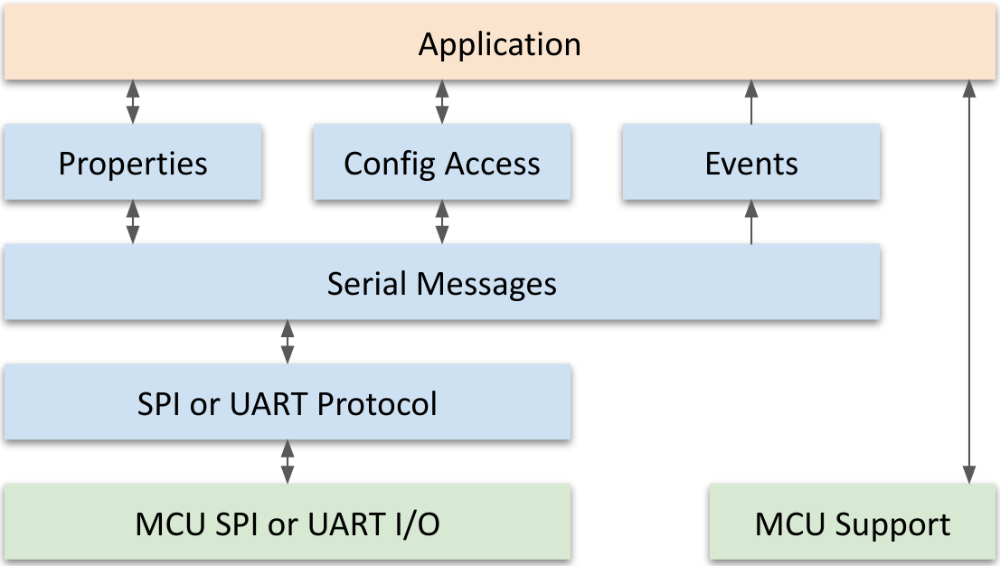

<aside id="pagebar" class="d-xl-block collapse">
  <ul>
    <li><a href="#core-title">Ayla Host Lib & Ref App</a></li>
<li>
<a href="#host-applications">Host Applications</a>
<ul>
<li><a href="#properties">Properties</a></li>
<li><a href="#metadata">Metadata</a></li>
<li><a href="#batch-updates">Batch Updates</a></li>
<li><a href="#reference-apps">Reference Apps</a></li>
</ul>
</li>
<li>
<a href="#host-library">Host Library</a>
<ul>
<li><a href="#polling-model">Polling Model</a></li>
<li><a href="#initialization-apis">Initialization APIs</a></li>
<li><a href="#clock-apis">Clock APIs</a></li>
<li><a href="#polling-apis">Polling APIs</a></li>
<li><a href="#logging-apis">Logging APIs</a></li>
<li><a href="#event-apis">Event APIs</a></li>
<li><a href="#properties-and-datapoints">Properties and Datapoints</a></li>
<li><a href="#property-table-apis">Property Table APIs</a></li>
<li><a href="#property-apis">Property APIs</a></li>
<li><a href="#batch-datapoint-apis">Batch Datapoint APIs</a></li>
<li><a href="#file-property-apis">File Property APIs</a></li>
<li><a href="#message-property-apis">Message Property APIs</a></li>
<li><a href="#schedule-apis">Schedule APIs</a></li>
<li><a href="#configuration-access-apis">Configuration Access APIs</a></li>
<li><a href="#wi-fi-configuration-apis">Wi-Fi Configuration APIs</a></li>
<li><a href="#module-command-apis">Module Command APIs</a></li>
<li><a href="#module-ota-update-apis">Module OTA Update APIs</a></li>
<li><a href="#host-ota-update-apis">Host OTA Update APIs</a></li>
<li><a href="#spi-ping-test-api">SPI Ping Test API</a></li>
<li><a href="#required-platform-apis">Required Platform APIs</a></li>
<li><a href="#source-files">Source Files</a></li>
</ul>
</li>
<li>
<a href="#reference-app-ledevb">Reference App: ledevb</a>
<ul>
<li><a href="#properties-1">Properties</a></li>
<li><a href="#set-functions">Set functions</a></li>
<li><a href="#send-functions">Send functions</a></li>
</ul>
</li>
<li>
<a href="#reference-app-demo_batch">Reference App: demo_batch</a>
</li>
<li>
<a href="#reference-lib-libdemo">Reference Lib: libdemo</a>
<ul>
<li><a href="#ota-update-example">OTA Update example</a></li>
<li><a href="#factory-reset-api">Factory Reset API</a></li>
</ul>
</li>
<li>
<a href="#reference-lib-libcons">Reference Lib: libcons</a>
<ul>
<li><a href="#source-files-1">Source Files</a></li>
<li><a href="#header-files-1">Header Files</a></li>
</ul>
</li>
<li>
<a href="#reference-eval-boards">Reference Eval Boards</a>
</li>
<li>
<a href="#reference-platform-code">Reference Platform Code</a>
</li>
<li>
<a href="#building-host-code">Building Host Code</a>
<ul>
<li><a href="#demo-components">Demo Components</a></li>
<li><a href="#building-the-app">Building the App</a></li>
<li><a href="#make-files">Make Files</a></li>
</ul>
</li>
<li>
<a href="#porting-host-code">Porting Host Code</a>
</li>
  </ul>
</aside>

<div class="dropdown mb-3">
  <button class="btn btn-warning btn-sm dropdown-toggle" type="button" id="versions" data-toggle="dropdown" aria-haspopup="true" aria-expanded="false">Choose a version</button>
  <div class="dropdown-menu" aria-labelledby="versions">
    <a class="dropdown-item" href="../v2-1">v2.1</a>
  </div>
</div>

This document, intended for those familiar with embedded C programming, describes the following: 

* Host applications which connect to an Ayla module containing an Ayla Production Agent. 
* The Ayla host library which provides connectivity to the Ayla module from a host MCU. 
* Reference host applications.
* Ayla hardware demonstration kits. 
* How to build and install the host application on the demonstration kits.
* How to port the host library and reference applications to other MCU types or other platforms.

The Ayla host library and reference applications package contains libraries and example applications. This document version corresponds to host library version 2.1 and the reference applications included in that package. The Ayla host library assists a device developer in connecting an MCU to an Ayla module to access the Ayla device service. It is intended to be portable so that it can be used by customers with their host apps on whatever platform they choose. 

The reference host application `ledevb` contains code to demonstrate the use of the host library to send and receive simple properties, to configure certain module features, and to handle over-the-air (OTA) firmware updates. The reference host application `demo_batch` contains code to demonstrate sampling values over time and sending them periodically to the service with a single batch API.

The host library and reference applications are built without an operating system, and can be ported to work with an RTOS. By default, they use a SPI connection between the Host MCU and the module. A build option can select UART mode instead of SPI. Other build options can add or remove features. The code is supported for the STM32F3Discovery board or the STM32F303RE Nucleo board. A port to use the code on Linux connecting to the module over a UART is also provided. The code can be built with GCC on Linux, macOS, or Windows.

# Host Applications

A host application, together with the platform support libraries it uses, should handle all of the following device features: 

* Platform Initialization 
* Time keeping 
* Over-the-air (OTA) firmware update validation and installation. Ayla modules handle two types of OTA updates: Module OTA and host OTA. Both involve the host MCU.
* Property handling 
* Accepting new datapoints 
* Sending changed datapoints 
* Delivering requested datapoints 

Usually the platform has a boot program that loads and enters the host application.  The host application does some platform initialization (e.g. sets up a stack), and then enters the main program.  The main program must have these steps: 

1. Initialize the platform’s I/O. 
1. Initialize the host library by calling ayla_host_lib_init(). 
1. Inform the host_library about the property table by calling prop_table_add(). 
1. Send the property which represents the firmware version. 
1. Enter a polling loop which calls ayla_host_lib_poll(). 

In addition, the main program may include some of these optional steps before entering the polling loop: 

* Handle any OTA update status, which might be present if the program is booting for the first time after an OTA update was applied or attempted. 
* Set up an event handler using host_event_register().  
* Request all to-device properties, using prop_request_value(NULL). 
* Start configuration access by calling conf_poll_start(). 

## Properties

The Ayla module transfers properties (i.e. data items) to and from the Ayla Device Service (ADS) for an application running on the MCU.  A property has a name, type, and value. The property name is an ASCII string chosen by the application.  The name should be descriptive and short (only alphanumeric characters, and _ underscore) starting with a letter.  The name must be strictly less than 28 characters long. A property has a direction, called *from device* (output) or *to device* (input). The value of the property is called a datapoint.

The Ayla Cloud and the host application use properties and property values to communicate. The cloud, for example, might send a new property value to the host application indicating that the app should turn on an LED, close a relay, adjust a thermostat, or cause a more elaborate process. The host app, on the other hand, might send a property value to the cloud indicating that a button was pushed, or a temperature was exceeded.

Ayla supports the following property types:

|Name|Constant|Note|
|-|-|-|
|Boolean|`ATLV_BOOL`||
|Decimal|`ATLV_CENTS`||
|File|`ATLV_LOC`|Large value of any type.|
|Integer (signed)|`ATLV_INT`||
|Integer (unsigned)|`ATLV_UINT`||
|Message (binary)|`ATLV_MSG_BIN`|Message properties allows large values of either JSON, UTF-8, or binary format to be sent and received.  These properties use a simpler API than file properties, and have different datapoint characteristics in the cloud.  JSON formatted message properties have JSON validity enforced by the cloud.|
|Message (json)|`ATLV_MSG_JSON`||
|Message (string)|`ATLV_MSG_UTF8`||
|Schedule*|`ATLV_SCHED`|Schedules are not properties, but are treated as such by the host library.   Schedules must have valid property names, distinct from other properties. A schedule is an expression of a set of time-based conditions for a set of property actions to be taken.  For example, one can define a schedule to set a property to a given value every day at a certain time, or every so often.|
|String|`ATLV_UTF8`|Max 1024 bytes.| 

## Metadata

A property update may include not only the property value, but also **metadata** to be stored in the cloud. Metadata can be used by the Host MCU to annotate each datapoint update by providing additional debug, trace, time, or other information.   The interface to the module allows up to four key-value pairs, with up to 1516-byte tags and 3132-byte values.

## Batch Updates

Property values can be sent to the cloud one at a time or in a **batch of datapoints** sent with a single API to the cloud service.  This may be more efficient or may save power by allowing the host to sample values over a long period and send them less frequently, but with time stamps showing the actual time of the sample.  Batch updates do not support File properties, Message properties or Metadata.

## Reference Apps

The example folder contains the following demo applications:

|Name|Description|
|-|-|
|`ledevb/demo.c`|This is the application that all Ayla demo kits are shipped with by default. This demo exercises the use of Ayla’s Boolean, integer, and string properties through LEDs and buttons. It also shows how to use message properties and schedules.|
|`demo_batch/demo.c`|This application demonstrates batch properties by posting timestamped temperature and voltage values periodically in batches.|

The reference host application organization is shown in the following block diagram. 


The application can use functions in the demo library (`example/libdemo`) and the console library (`example/libcons`). The target library, built from source under `arch/stm32f3`, `arch/stm32`, and `ext`, contains platform-specific functions and definitions to perform low-level I/O for SPI and UART communications and GPIO access, etc. These are the portions specific to a particular MCU and board.

# Host Library

The Ayla Host Library (`libayla`) contains portable functions to handle connectivity to the Ayla module. The following diagram shows some of the internal blocks and the connections to the host application and the platform code. The host library blocks are shown in light blue:



The following table describes each block in the diagram:

|Block|Description|
|-|-|
|Application|Handles the interface to the embedded device and performs whatever functions are needed. This is where most of the customer’s customization occurs.|
|Properties|Handles tables of properties that are set up by the application for properties that may be received and sent. It handles incoming messages from the Serial Messages block and calls a function in the application to act on new property values. A function in the Properties block is called by the application to send property values to the module.|
|Config Access|Handles requests from the Application to control and change the configuration of the Ayla module.|
|Events|Handles sending information to the host application based on messages received from the module.|
|Serial Messages|Handles packets over SPI or UART as messages containing TLVs that describe properties or configuration messages.|
|SPI or UART Protocol|Handles the transfer of message packets over SPI or UART. For SPI, this includes a flow-control mechanism to be sure the module is ready to receive messages before they are sent. For UART, this includes byte-stuffing to divide the bytes into packets, and CRC handling.|
|MCU SPI or UART I/O|Sends and receives bytes over SPI or UART.|
|MCU Support|Handles startup initialization and exception vectors, and low-level I/O for SPI, UART and GPIOs, including any LEDs or buttons used by the application.|

## Polling Model

The host library uses a non-blocking polling model so that it can run without an RTOS and be relatively independent of any RTOS. After initialization, the application repeatedly calls ayla_host_lib_poll(). The polling routines are not allowed to block, but rely on being called again if they need to do more work or check for some event before they can do more work. They can schedule timers or callbacks to complete their job if necessary. A timer is a structure that contains a function pointer and a time at which the the function should be called. A callback is a structure containing a function pointer that should be called on the next polling call. The host library maintains a list of timers and a list of callbacks.

## Initialization APIs

These APIs are declared in `ayla/host_lib.h`.

### ayla_host_lib_init

This function initializes the host library.

```
void ayla_host_lib_init(void);
```

The application must call this function once before calling any other host library functions or entering the polling loop.

### ayla_host_lib_version

This function returns a pointer to the host library version string.

```
const char *ayla_host_lib_version(void); 
```

### host_lib_callback_pend

This function provides a callback function to the library to be called the next time the host_lib polling loop runs.

```
void host_lib_callback_pend(struct ayla_callback *cb); 
```

## Clock APIs 

These APIs are declared in `ayla/host_lib.h`. The MCU_TIME_SUBSCRIPTION flag is set in the feature_mask sent to the module.  When this flag is set, the module provides the MCU with the latest UTC time, timezone information, and daylight savings information received from the Ayla cloud.  The timezone information can be persisted by the host application as well, if desired. To keep the platform requirements as simple as possible, monotonic time progression in the host mcu is provided to the host library via API functions al_time_ms() and al_time_secs_get(), which return milliseconds and seconds since boot, respectively. When UTC time information is received, the difference between the UTC time and the time since boot is calculated as the apparent time of startup.  That value is saved to allow calculating UTC time from al_time_secs_get() at any later time.

### host_lib_time

This structure specifies the time (millisecond granularity) since 1970-01-01T00:00:00 UTC.

```
struct host_lib_time {
  u32	ht_sec;  // seconds since 1970-01-01T00:00:00 UTC
  u32	ht_ms;   // milliseconds since the last second
};
```

### host_lib_clock_get

This function fills in the structure pointed to by `dest` with the UTC time of day in seconds and milliseconds since 1970.

```
int host_lib_clock_get(struct host_lib_time *dest); 
```

It returns 0 on success, or -1 if the clock has not been set or received from the service yet.

### host_lib_clock_local_get

This function fills in the structure pointed to by `dest` with the local time of day in seconds and milliseconds since 1970. 

```
int host_lib_clock_local_get(struct host_lib_time *dest); 
```

It returns 0 on success, or -1 if the clock has not been set or received from the service yet, or if the timezone is not yet known. 

## Polling APIs

This API are declared in `<ayla/host_lib.h>`.

### ayla_host_lib_poll

The function calls any queued callback functions and any expired timers.

```
void ayla_host_lib_poll(void); 
```

The application should call this function within the polling loop.  One of the callbacks is host_poll_cb() which is always pending and calls prop_poll() and serial_poll(). The various polled functions called from prop_poll() and serial_poll() and deeper typically return zero on completion (either success or failure) and -1 or some other non-zero value when they have not been able to complete the function and need to be called again.

## Logging APIs

These APIs are declared in `ayla/host_log.h`.

### host_log_handler_set

This function sets an internal function pointer to func, which will be used to log any console messages that the host library might print.  

```
void host_log_handler_set(int (*func)(const char *format, __builtin_va_list args)); 
```

This can be useful for debugging. The function func should behave like the POSIX function vprintf(). The first argument is a format string, and the second argument is a variable argument array satisfying the format items in the format string.  See vprintf(3) in the Linux manual pages for how this should work.

### host_log

This function logs a message through the logging handler set by host_log_handler_set().

```
host_log(const char *format, …); 
```

It is primarily for internal use by the host library, and may be removed in future versions. 

## Event APIs

These APIs are declared in `host_event.h`. The host library event APIs allow the application to be notified when certain events occur.  The host application may ignore any of these if it is not interested.  These are also used internally. For certain events, additional data is given to the event handler.  The form of this data varies according to the event number, as described in the following section. 

### host_event

This enum provides possible host events.

```
enum host_event {
  HEV_NONE = 0,           // reserved, not used
  HEV_RESET,              // module has been reset
  HEV_STANDBY,            // module entered low-power standby state.
  HEV_WIFI_STATUS,        // module sent Wi-Fi connection status.  Event data is 1-byte SSID len + SSID.
  HEV_WIFI_STATUS_FINAL,  // module sent Wi-Fi final connection status
  HEV_REG_INFO,           // module sent registration info
  HEV_WAKEUP,             // host should wake up module from standby
  HEV_FEATURES_SENT,      // host has sent features to module
  HEV_TIME_UPDATED,       // time information updated
  HEV_PROP_ERROR,         // property error received. Event data is struct host_event_prop_err.
  HEV_PROP_NOTIFY,        // property or cmd pending during file xfer
  HEV_PROP_ACK_ERROR,     // error on sending property ACK
  HEV_CONN_STATUS_UPDATE, // connectivity has changed
  _HEV_LIMIT              // reserved - no trailing comma for Keil
}; 
```

### host_event_prop_err

This structure is provided to event handlers on event `HEV_PROP_ERROR`:

```
struct host_event_prop_err {
  struct prop *prop;      // property affected
  unsigned int error;     // error number from AERR_xxx defines
  u8 failed_dests;        // mask of failed destinations
};
```

### host_event_callback

This structure can be initialized with a macro `HOST_EVENT_CALLBACK_INIT_HANDLER` at compile time.

```
struct host_event_callback {
  void (*handler)(enum host_event ev, void *data, size_t len);
  struct host_event_callback *next; // ptr to next structure in list
}; 
```

Using the `HOST_EVENT_CALLBACK_INIT_HANDLER` macro is advisable to maintain source compatibility in case of changes in future host library versions. This would be done like this: 

```
static void demo_event_cb(enum host_event event, void *data, size_t len) { 
  switch (event) { 
    case HEV_PROP_ERROR: 
      // handle property error
      break; 
    default: 
      break; 
  }
} 

static struct host_event_callback demo_event_callback = HOST_EVENT_INIT_HANDLER(demo_event_cb); 
```

### host_event_register

This function registers the specified callback, `event_cb`, with the host library. 

```
void host_event_register(struct host_event_callback *event_cb); 
```

### host_event_notify

This function calls all registered event handlers with the specified event.

```
void host_event_notify(enum host_event ev, void *arg, size_t len); 
```

Argument `ev` is the event number. Argument arg points to the data for the event, which may be NULL, and len is the length of the optional data.

## Properties and Datapoints

### Connectivity Mask and Syncing with ADS

The host library maintains a variable called "valid_dest_mask" which represents the active destinations for the MCU. The module communicates the list of active destinations with the MCU by sending the AD_CONNECT command. Bit 0 of the destination mask represents a connection to ADS and bits 1-6 represent connections with LAN apps that securely registered with the module. Bit 7 is reserved to indicate local changes or schedule-initiated changes. The LAN feature allows the MCU to securely communicate with apps in the local area network directly without going to the ADS service and with or without connectivity to the Internet.

### Enable the Service Listener

The module notifies the MCU of reachability to the ADS service through the AD_CONNECT command. When the module notifies the MCU it regained connectivity to ADS, the MCU must enable the service listener through the AD_LISTEN_ENB command. Sending this command allows the module to fetch any property updates that happen through the service, but only after the MCU has had a chance to send updates it has made locally for any to-device properties. The host library does this as soon as connectivity to ADS has been established. This is a very important requirement for the MCU, and must be implemented and tested for the device to work correctly. Without it, the device will not be able to receive property updates from the cloud

### Property Send Mask

When the MCU sends a property update, it can choose to include an ATLV_NODES TLV to specify the destinations for the update. If TLV is not included, the module automatically sends the update to all active destinations. See the description of valid_dest_mask, below.

### Datapoint Metadata

The example code shows metadata sent along with "Blue_button" and "stream_up" properties. An array of datapoint_meta structs can be used to pass metadata to the library. This array must be defined/allocated by the application. The application layer must set the key and val pointers. One extra array element (number of key-value pairs + 1) must be allocated (set to NULL). The module allows up to 4 key-value pairs.

### Errors

When a property update fails to reach a destination, the module returns a NAK message with a code indicating the error and a nodes mask that represents the failed destinations. The host library handles this such that failure to update LAN clients is ignored. Failure to update the service is noted by setting bit 0 of the send_mask for that property. This allows the property update to be sent again when connectivity to the service resumes. On receiving a NAK the host library sends an event for which the application can register a handler. The event code in the ledevb demo just prints an error message if there is a debug serial port.

### Echoes

If a LAN client or the service updates the property value, it is preferred that this update is echoed to the other destinations. If "auto_sync" is enabled in the template, the module takes care of doing this update automatically. If "auto_sync" is disabled, it is expected that the host will decide if/when the update should be echoed. ADS treats all to-device property posts from the device as echos. An echo is sent (just like a property update) except with an additional echo TLV. If connectivity to ADS is lost and a LAN client updates a property value, the module cannot update ADS with an echo. The MCU must remember datapoint posts that need to be sent to ADS when it is reachable. The host_library implements echoing. Bit 0 of the send_mask is set to 1 and the "echo" flag is turned on in the props structure. When ADS connectivity resumes, the host_library makes sure to send echoes before enabling listen, to override any stale values coming from the service.

## Property Table APIs

These APIs are declared in `ayla/props.h`. 

### prop

This structure defines a single property.

```
struct prop {
  const char *name;
  enum ayla_tlv_type type;
  void (*set)(struct prop *prop, void *arg, void *val, size_t val_len);
  int (*send)(struct prop *prop, void *req_arg);
  void *arg;
  size_t val_len;
  u8 _fmt_flags;
  const void *uuid;
  char *location;
  u8 name_len;
  u8 send_mask;
  u8 send_err;
  u16 send_err_counter;
  enum prop_ops curr_op;
  u16 req_id;
  unsigned int get_val:1;
  unsigned int echo:1;
  struct prop_ack ack;
  enum prop_source source; 
  u8 send_ack;
  struct datapoint_meta dp_meta_in[DP_META_MAX_ENTRIES + 1];
};
```

For each supported property, the host application creates one instance of the `prop` structure composed of the following fields:

|Field|Description|
|-|-|
|`name`|property name, string. A property name must start with an alphabetic character, can contain only the ASCII alphanumeric characters plus underscore or hyphen and may be up to 27 bytes long.|
|`type`|Ayla type (for example, ATLV_BOOL or ATLV_INT). The type indicates how the value is stored locally. In case the value is stored as an unsigned integer, ATLV_UINT is used, and both ATLV_UINT and ATLV_INT map to Integer properties in the cloud.|
|`set`|pointer to a function which can be called when a value for the property is received from the module. This is required for to-device (input) properties and should be NULL for from-device (output) properties.|
|`send`|pointer to a function which is called to send the property to the module. This is required for all properties. It gets the value of the property from the device, even for to-device properties.|
|`arg`|an opaque (void pointer) argument for the set function. This lets the same set function handle multiple LEDs, for example. This must be a pointer to the value when using a library-supplied set or send function.|
|`val_len`|length of the value. For booleans, must be 1. For integers, can be 1, 2, or 4. For text items, maximum length of the string, including the NUL.|
|`fmt_flags`|This field is no longer used but remains for source compatibility. It used to contain formatting flags (for example, read/only) for the property.|
|`name_len`|the length of the name, not including the NUL at the end. This can be initialized as 0. The property layer will fill this in with the actual length of the name and uses this field to avoid calling strlen() on each lookup.|
|`send_mask`|if this is non-zero, it indicates that a send is requested for this property. The mask represents the destinations that the prop update needs to be sent to. Bit 0 of the mask represents ADS and bits 1-6 represent LAN destinations, although only LANs 1 and 2 are used for now.|
|`send_err`|if module returned a NAK during a property send, the error code reported is stored here.|
|`send_err_counter`|number of send failures.|
|`curr_op`|current ongoing operation for this property (GET, POST, ECHO).|
|`req_id`|request id for the current ongoing operation for this prop.|
|`get_val`|if non-zero, this indicates the value from ADS is needed for this property.|
|`echo`|if non-zero, this indicates that a property update needs to be echoed to ADS.|

### prop_table

This structure describes an array of `prop` structures initialized by the application code.

```
struct prop_table {
  struct prop *props;       // ptr to the property array
  unsigned int prop_count;  // number of entries in the array
  struct prop_table *next;  // ptr used internally to link these prop_table structures together
};
```

The host library supports multiple property tables which can be added using the function `prop_table_add`. 

### prop_table_add

This function adds a property table to the internal list of property tables managed by the host library. 

```
void prop_table_add(struct prop_table *table);
```

This list is managed in a first-in first-out order. Each property table must be added at most once.

### prop_table_lookup

This function looks for a property with the specified name.

```
struct prop *prop_table_lookup(const char *name);
```

It searches the property tables from the first one added until it finds a matching name or reaches the end. It returns a pointer to the property table entry if found, or a NULL if no match is found.

### prop_table_lookup_index

This function looks for a property by position in all the property tables by index.

```
struct prop *prop_table_lookup_index(u32 index);
```

The first property in the first table added is index 0. It searches the property tables from the first one added until it finds the indexed entry. It returns a pointer to the property table entry if found, or a NULL if the end is reached first.

### prop_table_iterate

This function goes through the property tables from the first one added and calls the handler for each property structure in the tables.

```
int prop_table_iterate(int (*handler)(struct prop *prop, void *arg), void *arg);
```

It will stop the iteration if the handler returns non-zero, and will return that value.

## Property APIs

These APIs are declared in `ayla/props.h`. They handle individual properties.

### prop_request_value

This function requests the value of a property from the module.

```
int prop_request_value(const char *name);
```

When name is NULL, it requests the value for all "to-device" properties. When the value arrives, the property structure set() function will be called to receive the datapoint. Returns 0 when successfully setting the request, -1 for name not found.

### prop_send

This function sends a property to the module.

```
int prop_send(struct prop *prop, void *val, size_t val_len, void *arg);
```

This function is intended to be called from the polling loop, usually from the send function in a property table entry. The property structure contains the name and type of the property. The val argument points to the value to be sent, and val_len is the actual length. The opaque arg value must be NULL, unless the call is the result of a request from the module. In which case, the arg value is passed to the property’s send function by the request. The return value is zero on success and non-zero if the function should be called again on the next polling loop.

### prop_send_generic

This function is a generic send function used as a send callback function for a property of any of the basic types, (not applicable for file or message properties).

```
int prop_send_generic(struct prop *prop, void *arg);
```

The property structure contains the name and type of the property. The opaque arg value must be NULL. If the call is the result of a request from the module, the arg value should be passed to the property’s send function by the request. The return value is zero on success and non-zero if the function should be called again on the next polling loop.

### datapoint_meta

This structure describes metadata for property datapoints to be sent to the service.

```
struct datapoint_meta {
  const char *key; // NUL-terminated string up to 16 UTF-8 characters (excluding the NUL)
  const char *val; // NUL-terminated string up to 32 UTF-8 characters (excluding the NUL)
};
```

Metadata is sent in key-value pairs. Currently, up to four key-value pairs are supported.

### prop_validate_meta

This function validates a metadata structure created by the application.

```
int prop_validate_meta(struct datapoint_meta *dp_meta);
```

Must be called before sending metadata with property update. The dp_meta pointer points to an array of datapoint_meta structs. Return value is zero on success, -1 for a bad key/value format and -2 for invalid struct termination or exceeding the limit for key/value pairs.

### prop_send_meta

This function sends a property with some metadata to the module.

```
int prop_send_meta(struct prop *prop, struct datapoint_meta *dp_meta, void *arg);
```

Can be used for all properties except file properties. The property structure contains the name and type of the property. The dp_meta pointer points to an array of datapoint_meta structs. The passed in metadata buffer must be validated with prop_validate_meta before calling this API. The opaque arg value must be NULL, unless the call is the result of a request from the module, in which case it should be the arg value passed to the property’s send function by the request. The return value is zero on success and non-zero if the function should be called again on the next polling loop.

### valid_dest_mask

The global variable valid_dest_mask is an 8-bit mask which keeps track of the current registered destinations for this device.

```
extern u8 valid_dest_mask;
```

Bit 0 represents ADS and bits 1-6 represent LAN destinations. Bit 7 is reserved. The module communicates the reachable destinations with the MCU by sending an ATLV_NODES TLV in an AD_CONNECT command. The valid_dest_mask lets the MCU know whenever ADS is reachable. The host library leverages this by keeping bit 0 of the send_mask active for properties that couldn’t be sent to ADS. When connectivity to the service is established, the module communicates this to the MCU and the host library will send up all the updates that the service missed.

## Batch Datapoint APIs

These APIs are declared in `ayla/prop_batch.h`. Batch datapoints provides a more efficient way of sending several datapoints to ADS. This can send many datapoints in one API, and each datapoint can have its own time stamp. There can be many datapoints accumulated over some time for the same or multiple properties. Each datapoint in a batch will be given a 16-bit non-zero integer batch ID that is used to associate status with the individual datapoint. To use batch datapoints, follow these steps:

1. Create the batch with prop_batch_create().
1. Add datapoints to the batch with prop_batch_dp_add().
1. Send the batch with prop_batch_send(), specifying a function to be called when the send is complete.
1. Collect the status of the batch once the completion function is called, using prop_batch_status_get() and prop_batch_dp_status_get().
1. The batch can be re-used once it is complete, or destroyed by calling prop_batch_destroy().

You may want to use two batches so that while one is being sent, you can add datapoints to the other. There are some limitations:

* datapoints cannot be sent with metadata.
* datapoints cannot indicate the echo flag.
* file and message datapoints are not supported.
* batch datapoints cannot be sent to mobile apps in LAN mode.

### prop_batch_create

This function uses the supplied buffer, which must be at least PROP_BATCH_BUF_MIN bytes long, to create a batch data structure and associated internal structures where the batch datapoints will accumulated. 

```
struct prop_batch *prop_batch_create(void *buf, size_t len, size_t api_size_limit);
```

The returned pointer will be used in subsequent calls to the APIs but is an otherwise opaque handle. The parameter buf is the address of an area in memory, supplied by the caller, that is to be used by the batch. The parameter len is the size of buf. Parameter api_size_limit is an integer size limit in bytes that controls how many datapoints may be added to the batch. It is the maximum number of bytes which will be sent as the payload of the request, including any escapes needed. The function returns a pointer to the batch or NULL on error, for example, if the buffer is too small.

### prop_batch_dp_add

This function adds a datapoint to a batch.

```
enum ayla_proto_err prop_batch_dp_add(
  struct prop_batch *batch,   // ptr to batch
  u32 *idp,                   // ptr to batch ID storage location or NULL if unneeded.
  const char *name,           // name of property
  void *val,                  // ptr to value. binary for int & bool. UTF-8 for str.
  size_t val_len,             // length of the value in bytes.
  struct host_lib_time *time  // ptr to datapoint timestamp. If NULL, library supplies.
);
```

The function returns zero on success, non-zero on error. Possible errors are:

* `AERR_INVAL_OP` if the batch not initialized or is full or already sent.
* `AERR_LEN_ERR` if val_len is too long.
* `AERR_UNK_PROP` if the property name is not found in the property tables.

### prop_batch_send

This function arranges to send the batch on the next opportunity during the polling loop.

```
enum ayla_proto_err prop_batch_send(
  struct prop_batch *batch,
  void (*complete_cb)(void *arg, enum ayla_proto_err status),
  void *complete_arg
);
```

 The batch may not be appended to after this. The completion callback is called once the batch has been sent and the responses have been received. After the completion callback the status of individual datapoints may be inspected using \ref prop_batch_dp_status_get(). If some datapoints failed to be sent, the values of those datapoints can be retrieved using prop_batch_dp_get(). If the error indicates the batch was not successfully sent (or even if it has been), it may be resent after the completion callback. The parameters are as follows:

* `batch` the batch pointer.
* `complete_cb` the completion callback.
* `complete_arg` an argument for the completion callback

The completion callback function receives the specified argument and the overall status of the batch, which can be one of these values:

* `AERR_NONE`, if all datapoints were successfully sent;
* `AERR_PARTIAL`, if some datapoints in the batch received errors.
* `AERR_CONN_ERR`, if the batch could not be sent or may have been partially sent but a connection error occurred.
* other, if the module returned an error on the overall operation

This function returns zero on success, non-zero on error. Possible errors are:

* `AERR_INVAL_OP`, if the batch not initialized or is empty or is being sent.
* `AERR_TIME_UNK`, if the time of day is unknown.

### prop_batch_destroy

This function sets the batch to be unusable so that the buffer can be reused by the calling application. 

```
void prop_batch_destroy(struct prop_batch *batch);
```

### prop_batch_dp_status_get

This function returns the status that was received from the module for the specified datapoint.

```
int prop_batch_dp_status_get(struct prop_batch *batch, u16 batch_id, enum ayla_proto_err *statusp);
```

If no status on the datapoint has been received, the status given will be AERR_UNK_STAT. The parameters are:

* `batch` the batch pointer,
* `batch_id` the batch id for the datapoint
* `statusp` a pointer to the location where the status should be stored. statusp may be NULL if not needed.

Returns 0 on success, -1 on an incomplete or invalid batch or invalid batch_id.

### prop_batch_status_get

This function return the overall status for a batch.

```
int prop_batch_status_get(struct prop_batch *batch, enum ayla_proto_err *statusp);
```

If the batch is invalid or not finished being sent, this returns non-zero. If the batch as a whole could not be sent or there was some overall error on the operation and no individual datapoint status was received, that error will be indicated in the status. If any datapoints had errors or some had missing status, the status will be AERR_PARTIAL. If no datapoints had errors, the status will be 0 (AERR_NONE). The first parameter batch is the batch pointer. The second parameter, statusp is a pointer to the resulting overall status for the batch. This returns 0 if the status is valid, or -1 on an incomplete or invalid batch or invalid batch_id or NULL statusp.

### prop_batch_dp_get_next

This function returns the batch ID of the next datapoint in the batch.

```
int prop_batch_dp_get_next(struct prop_batch *batch, u32 batch_id);
```

 To iterate through all the datapoint IDs in the batch, pass in a batch_id of zero and this function will return the batch ID of the first datapoint in the batch. If a non-zero batch_id is passed in, this returns the non-zero batch ID of the next datapoint in the batch. The parameter batch is the batch pointer. The parameter batch_id is the batch ID from the previous datapoint in the batch, or zero if the first batch ID is desired. This returns the batch ID of the following datapoint in the batch. It returns zero if there is no following datapoint. It returns -1 on error.

 ### prop_batch_dp_get

 This function returns the property pointer, value, and timestamp for the given batch ID inside the batch. 

```
int prop_batch_dp_get(
  struct prop_batch *batch, 
  u32 batch_id,
  struct prop **propp, 
  void *val_buf, 
  size_t val_buf_len,
  struct host_lib_time *time
);
```

The arguments are:

* `batch` the batch pointer.
* `batch_id` the batch ID from the previous datapoint in the batch.
* `propp` pointer to the destination where the property pointer for the datapoint will be stored.
* `val_buf` points to the user-supplied buffer for the datapoint value.
* `val_buf_len` is the length of the user-supplied buffer.
* `time` is a pointer to the destination timestamp of the datapoint.

The function returns the length of the buffer that would be used. If the data did not fit into the supplied buffer, the data is truncated without supplying NUL termination in the case of string values, but the total length needed is returned. Returns -1 on error.

### prop_batch_dp_count

This function returns the number of datapoints in the batch pointed to by batch.

```
int prop_batch_dp_count(struct prop_batch *batch);
```

Returns -1 on if the batch is not valid.

### prop_batch

The `prop_batch` structure is internal to the host library and accessed only through APIs. It is described here for completeness and to aid in debugging. The structure prop_batch contains the following fields:

|Field|Description|
|-|-|
|`magic`|Should contain `0xbac0bac0` indicating the batch is initialized.|
|`state`|Current state of the batch as an enum prop_batch_state.|
|`init_buf`|struct `prop_batch_buf` giving the initial buffer allocated for the batch.|
|`buf`|struct `prop_batch_buf` giving the currently available buffer for the batch.|
|`api_size_limit`|`size_t` value giving the limit of the number of bytes to be sent with the batch POST to ADS. This limit is specified when the batch is created by prop_batch_create().|
|`api_size`|`size_t` value giving the length in API bytes represented by the datapoints currently in the batch.|
|`dp_count`|number of datapoints in the batch.|
|`req_id`|request ID used for the previous batch message.|
|`time_adj`|boolean value that is non-zero if any timestamps in the batch need to be adjusted from relative to absolute time.|
|`dp_next`|pointer to a struct prop_batch_dp for the next datapoint to send.|
|`dp_head`|pointer to the struct prop_batch_dp for the head of the list of datapoints in the batch.|
|`dp_tail`|pointer to the pointer to the last struct prop_batch_dp in the list of datapoints in the batch. If the list is empty, dp_tail will point to dp_head, which will be NULL. If the list is non-empty, dp_tail will point to the next pointer of the last element.|
|`complete_cb`|function pointer for the completion callback specified in prop_batch_send().|
|`complete_arg`|opaque argument to the complete_cb function, as specified in prop_batch_send().|
|`cb`|struct `ayla_callback` which is used in the polling loop to send the batch.|

### prop_batch_buf

This structure contains the description of a buffer in memory for the batch

```
struct prop_batch_buf {
  void *start;    // start address
  size_t len;     // length in bytes
};
```

### prop_batch_dp

This structure, allocated from the batch buffer, represents a single datapoint in the batch.

```
struct prop_batch_dp {
  struct prop_batch_dp *next;  // ptr to next datapoint on list.
  struct prop *prop;           // ptr to prop_table entry for datapoint.
  struct host_lib_time time;   // ptr to struct host_lib_time.
  u8 status_valid:1;           // non-zero if status has been received for the datapoint.
  enum ayla_proto_err status;  // if status_valid set, status of datapoint send.
  u16 id;                      // datapoint id.
  u16 val_len;                 // length of value immediately following struct in memory.
};
```

### prop_batch_state

This enum contains various possible states.

```
enum prop_batch_state {
  PBS_INIT = 1,  // the batch is initialized
  PBS_ADD,       // the batch is accepting new datapoints
  PBS_SEND,      // the batch is ready to be sent or in the process of being sent
  PBS_SENT,      // the last datapoint of the batch has been sent
  PBS_DONE,      // the response has been received
  PBS_ABORT,     // sending has been aborted
  PBS_DESTROYED  // prop_batch_destroy has been called
};
```

## File Property APIs

These APIs are declared in `ayla/prop_dp.h`. File properties are used to hold large datapoint values that can be larger than the limit of string properties. For file properties, the prop_table entry type field should be set to ATLV_LOC, indicating that the property set routine expects a location value. The prop_table set routine should be set to point to prop_dp_set(), and the send routine to point to prop_dp_send(). The prop_table arg pointer should point at a struct prop_dp, which must be created and initialized for each file property. It contains function pointers to handle sending and receiving individual pieces of the file property. Sending or receiving long datapoints requires several message transactions and those functions handle those activities.

### prop_dp

This structure supports functions related to file and message property datapoints. 

```
struct prop_dp {
  enum prop_dp_state state; 
  struct prop *prop;
  u32 next_off;
  u32 tot_len;
  u8 aborted;
  u8 loc_len;
  char loc[PROP_LOC_LEN];
  int (*prop_get)(struct prop *prop, size_t off, void *buf, size_t len);
  int (*prop_set)(struct prop *prop, size_t off, void *buf, size_t len, u8 eof);
  void *val_buf;
};
```

|Field|Description|
|-|-|
|`state`|an enumeration that tracks the transfer progress for long datapoints.|
|`prop`|a pointer to the associated prop_table entry.|
|`next_off`|offset of the next byte to be transferred for the datapoint.|
|`tot_len`|total length expected to be sent.|
|`aborted`|set to 1 if the last operation for this property was aborted.|
|`loc_len`|length of the location value.|
|`loc`|location value used to identify the datapoint.|
|`prop_get`|pointer to the function that provides a piece of the value.|
|`prop_set`|pointer to the function that receives a piece of the value.|
|`val_buf`|a pointer to the value buffer, if needed, for message properties.|

For file properties, the set and send functions from the prop table are set to prop_dp_set() and prop_dp_send(), and the arg is set to point to the prop_dp structure for that property. For message properties, the prop_dp structure is used internally in the host library to track the transfer of the value.

### prop_get

This function pointer in the prop_dp structure is provided by the application.

```
int prop_get(struct prop *prop, void *buf, size_t len);
```

The function is called by the API to fill a buffer with the next piece of the data to be sent to the module. The arguments give the property table entry, the buffer address and its length. The offset of the data to be sent must be obtained from the struct prop_dp next_off member.

### prop_set

This function pointer in the prop_dp structure is provided by the application.

```
int prop_set(struct prop *, size_t off, void *buf, size_t len, u8 eof);
```

The function is called by the API to receive a portion of the value. The arguments give the property table entry, and the offset, location, and length of the value portion. The final argument, end of file (eof), is non-zero if this is the final portion of the value.

### prop_dp_init

This function initializes the prop_dp structure pointed to by dp, clearing its state and setting the prop_get and prop_set functions.

```
void prop_dp_init(
  struct prop_dp *dp,
  int (*prop_get)(struct prop *prop, size_t off, void *buf, size_t len),
  int (*prop_set)(struct prop *prop, size_t off, void *buf, size_t len, u8 eof)
);
```

### prop_dp_set

This function updates a file property value. 

```
void prop_dp_set(struct prop *prop, void *arg, void *val, size_t len);
```

The function is called through the property table when a new value (datapoint location) is received for a file property.

### prop_dp_send

This function performs the next step in sending or receiving a file datapoint. 

```
int prop_dp_send(struct prop *prop, void *arg);
```

The `prop->arg ` member points to the prop_dp structure that contains the state of the file activity. Called whenever the send_req field of the prop table entry is set. If another long property is sent or received, that property is handled first.

### prop_dp_send_meta

This function sends a file property with associated metadata.

```
int prop_dp_send_meta(struct prop *prop, struct datapoint_meta *dp_meta, void *arg);
```

The `prop->arg` member points to the prop_dp structure that contains the state of the file activity. The dp_meta pointer points to an array of datapoint_meta structs. The passed in metadata buffer must be validated with prop_validate_meta before calling this API.

### prop_dp_start_send

This function starts sending a file property datapoint.

```
void prop_dp_start_send(struct prop *, struct prop_dp *, size_t len);
```

If there is already a send operation in progress, the call is ignored.

### prop_dp_abort

This function aborts any ongoing file operations (upload or download), and marks the `aborted` flag of the `prop_dp` structure representing that property.

```
int prop_dp_abort(void);
```

The application might want to abort an ongoing file operation if there is a pending property update. The serial_msg.c file shows how an application may choose to abort a file operation in cases of a pending property update so it can receive the update right away.

## Message Property APIs

These APIs are declared in `ayla/prop_message.h`. A message datapoint is a string, binary, or JSON value with length up to 4GB, although the service limit is currently 512 KB. These are similar to file properties but have some differences in overhead and retention in the cloud. Each message property has a MIME type describing the type of all datapoints of the property. The table shows the supported MIME types:

|Common Name|Mime Type|Property Table Type|
|-|-|-|
|string|`text/plain`|`ATLV_MSG_UTF8`|
|binary|`application/octet-string`|`ATLV_MSG_BIN`|
|json|`application/json`|`ATLV_MSG_JSON`|

Sending and receiving message properties require multiple packets, similar to file datapoints. The host library handles transfer of message datapoints differently than other ones. The host application must know which properties have message datapoints. When a new datapoint is received for a message property, the host library buffers the data and calls the property table `set` function with the entire value. The buffer in the host library must be sufficient for the length received. The size can be increased at compile time. 

When sending a datapoint for a message property, the host library calls the `send` function in the property table, which may be prop_message_send(), prop_message_string_send(), or a custom send function. If prop_message_send() or prop_message_string_send() are used, the entire value to be sent must be available thoughout the sending process. If a custom send function is used, it can call prop_message_send_start() either with the full value, or with a pointer to a function that delivers the value in parts.

### prop_message_send_start

This function sends a message datapoint and metadata.

```
int prop_message_send_start(
  struct prop *prop, 
  void *buf, 
  size_t len,
  void *req_arg,
  struct datapoint_meta *meta,
  int (*get_part)(struct prop *prop, size_t off, void *buf, size_t len)
);
```

Argument prop is a pointer to the property structure. Argument buf is a pointer to a buffer holding the value to send. This is used only if the get_part function pointer is NULL. Argument len is the length of the value. Argument req_arg is an opaque argument that gives context when responding to a request from the module. Argument meta, can be NULL, or a pointer to metadata to be sent with the value. Argument get_part can be NULL or a pointer to a function to be used to get each part of the value. The function pointed to by get_part is passed the property pointer, as well as the offset into the value for the portion to be delivered, the buffer into which to place the value, and the length to deliver. It should return zero on success. This is a polling function which returns non-zero if it needs to be called again in the next polling loop.

### prop_message_send

This function can be used in a property table as a send function for message values.

```
int prop_message_send(struct prop *prop, void *req_arg)
```

The `prop->arg` points to the value, prop->val_len is the length. Argument prop is a pointer to the property structure. Argument req_arg is an opaque argument that gives context when responding to a request from the module. The function returns non-zero if it should be called again during the polling function.

### prop_message_string_send

This function can be used as a property table send function for message strings.

```
int prop_message_string_send(struct prop *prop, void *req_arg)
```

The `prop->arg` points to the value, which is a NUL-terminated string. Argument prop is a pointer to the property structure. Argument req_arg is an opaque argument that gives context when responding to a request from the module. The function returns non-zero if it should be called again during the polling function.

## Schedule APIs

These APIs are declared in `ayla/sched.h`. Schedules allow the MCU to set properties at specified times in a one-time or recurrent basis, even when the device is not connected to the network. Schedules are fetched from the cloud when the module connects, and should ideally be persisted in the MCU’s flash or NVRAM so that they can be used without reconnecting. Neither the host library nor reference code persists schedules. 

Schedules are treated as properties for convenience in the MCU, although they are not properties in the cloud. The namespace for schedules and properties must not overlap. 

To use the schedule functionality, the host_library must know the time of day. If schedules are included, the host library will get time information from the module. To evaluate stored schedules inside the properties table, the sched_run_all() function is called. With information provided by the Host Time APIs, sched_run_all can call sched_evaluate to determine the scheduled event. The sched_evaluate function is defined in schedeval.c. It parses a schedule and returns the UTC time of the next event in the schedule. There are many complexities in calculations of the next event time. These are abstracted out into schedeval.c and clock_utils.c files for the host library. Along with returning the next scheduled event time, sched_evaluate also performs any actions set to occur at the given time. These actions may set properties specified by the schedule. With the next scheduled event time returned by sched_evaluate(), the sched_run_all() function determines the time when sched_run_all() should be called again, which is handled internally by the host library.

### sched_run_all

This function parses and evaluates all schedule properties in the property tables.

```
void sched_run_all(u32 *time_to_use)
```

User has the option to specify the time in seconds from which to evaluate the schedules. If NULL, given, the function uses the current time from host_lib_clock_get(). This performs any actions set to fire at the given time and sets the internal sched_next_event_time to be the time in seconds for the next scheduled action.

### sched_clock_set

Called whenever new time information is received from the module, this function sets the host library’s internal time without affecting the platform’s RTC.

```
void sched_clock_set(u32 new_item);
```

The host application could call this if needed, but only needs to do that if it has an RTC. Otherwise the time comes from the module when connectivity is established. This calls host_lib_clock_set().

## Configuration Access APIs

These APIs are declared in `ayla_proto_mcu.h`, `tlv_access.h`, and `conf_access.h`. The host library provides functions to read and write configuration items in the module. Writing some of these items has side-effects, such as starting Wi-Fi association. There are also APIs to send commands to the module, for example, to reset the module to the factory configuration or to open a registration window. See also [Ayla Module / MCU Interface](https://docs.aylanetworks.com/edge-solutions/ayla-module-mcu-interface).

### ayla_tlv

Used by several configuration APIs, this structure defines a TLV (time, length, value) unit. 

```
struct ayla_tlv { 
  u8 type; // type code
  u8 len;  // length of value
           // value follows immediately
}; 
```

### tlv_get

This function finds the first TLV of a specified type in a response buffer.

```
struct ayla_tlv *tlv_get(
  enum ayla_tlv type,
  void *buf,           // response buffer starting with struct `ayla_cmd` plus 0 or more TLVs.
  size_t len           // length of response buffer
);
```

This function returns a pointer to the TLV in the buffer, or NULL if it is not found.

### Misc tlv functions

These functions return the requested type value from the tlv, with byte-order and size conversions and range checking. 

```
int tlv_u32_get(u32 *dest, const struct ayla_tlv *tlv);
int tlv_s32_get(s32 *val, const struct ayla_tlv *tlv);
int tlv_u16_get(u16 *val, const struct ayla_tlv *tlv);
int tlv_s16_get(s16 *val, const struct ayla_tlv *tlv);
int tlv_u8_get(u8 *val, const struct ayla_tlv *tlv);
int tlv_s8_get(s8 *val, const struct ayla_tlv *tlv);
```

`val` points to the location to receive the value, which is stored only if no errors occur. `tlv` points to the TLV, possibly returned by tlv_get(). These functions return 0 on success, -1 if the TLV is not an appropriate type or the value is out of range for the destination. Note that an ATLV_INT (integer) TLV may have a value that does not fit into a u32 (unsigned 32-bit value).

### conf_poll_start

Called before the main polling loop, this function causes the configuration polling function to be called from the host_lib_polling loop. 

```
void conf_poll_start(void);
```

As standard actions, if a configuration access function is not already in progress and DSN is not already read, the configuration polling loop sends a Get Configuration command to the module to read the DSN and the module model name.

### conf_read

This function sends the Get Configuration command to read a configuration item.

```
int conf_read(enum conf_token *tokens, unsigned int ntokens, void (*cb)(void *buf, size_t len));
```

The argument tokens is a pointer to the configuration tokens array. The second argument, ntokens is the number of tokens. The cb argument is a pointer to the function to call with the message when the response is received. This function should be called in a polling mode until it returns 0. The callback function cb should use tlv_get() to get the value from the buffer.

### conf_write

This function allocates a buffer, fills it in with configuration tokens and values, and sends the message. It is intended to be called until it returns 0.

```
int conf_write(int cnt, …);
```

A single write request can update several configuration items and can be called for this process. First argument, `cnt`, specifies how many configuration items are sent. Other arguments come in groups of five:

* configuration item name (char *).
* configuration item name length (size_t).
* type of the configuration item (enum ayla_tlv_type).
* pointer to value being set (void *).
* length of that value (size_t).

This set of five must be repeated for every item that is getting set in the write request. This function should be called in a polling mode until it returns 0.

## Wi-Fi Configuration APIs

These APIs are declared in `ayla/conf_access.h`, `ayla/wifi_conf.h`, and `ayla/wifi_error.h`. They allow starting Wi-Fi association or perform other Wi-Fi configuration actions.

### conf_wifi_join

This function configures the Wi-Fi network for the module and starts an association. This is a polling routine and should be called until it returns zero.

```
int conf_wifi_join(char *ssid, int slen, char *key, int klen, u8 sec_type);
```

Argument `ssid` points to the byte array containing the SSID for the network. Argument slen is the length of the SSID in bytes. Argument key points to the byte array holding the passphrase. Argument klen is the length of the key in bytes. Argument sec_type is the security type from enum conf_token, either CT_none, CT_WEP, CT_WPA, or CT_WPA2_Personal.

Note that `ssid` and `key` might not be strings, although they usually are. The module attempts to connect to ADS via the specified network. Depending on configuration variable settings `/wifi/scan/save_on_ap_connect` and `/wifi/scan/save_on_server_connect` and whether connection succeeds or fails, the module saves this configuration for the next time module restarts.

A return code of zero will indicate the message was sent to the module, but not that the join has completed. The host application must monitor the status or wait for the connection event to determine when the association completes.

### conf_wifi_leave

This function requests that the module leave and delete the profile for the specified network.

```
int conf_wifi_leave(char *ssid, int slen);
```

Argument ssid points to the byte array containing the SSID for the network. Argument slen is the length of the SSID in bytes. This is a polling routine and should be called until it returns zero.

### conf_wifi_start_ap

This function tells the module to start its own access point. 

```
int conf_wifi_start_ap(void);
```

This is a polling routine and should be called until it returns zero. The AP mode stays in effect until the module restarts, AP mode times out, a new Wi-Fi network gets configured, or the module is asked to scan for Wi-Fi networks and finds a network to join. After a scan, the module attempts to join any network that is visible and has been configured.

### conf_wifi_conditional_ap

This function configures the module by setting conditional AP mode. 

```
int conf_wifi_conditional_ap(void);
```

This is the recommended way to configure AP mode behavior. This is a polling routine and should be called until it returns zero. If conditional AP mode is set, the module goes into AP mode only if there are no Wi-Fi profiles configured and enabled. If there are any enabled Wi-Fi profiles, the module does not go in to AP mode whether or not they can be successfully associated with. This protects the device from being set up to use another AP while the configured AP is down or inaccessible. A call to conf_mod_save_send() is required to persist this change over resets.

### wifi_start_scan

This function initiates Wi-Fi scan on the module by writing to /wifi/scan/start configuration item

```
int wifi_start_scan(void);
```

This is a polling routine and should be called until it returns zero.

### wifi_fetch_scan_ready

This function initiates fetch of status variable /wifi/scan/ready.

```
int wifi_fetch_scan_ready(void (*done_cb)(int value));
```

Once the variable is fetched, the callback routine done_cb is called with the argument value set to the value of /wifi/scan/ready. Non-zero indicates the scan is complete, 0 indicates it is in progress or never started. This is a polling routine and should be called until it returns zero.

### wifi_check_scan_done

This function checks whether a scan has completed.

```
int wifi_check_scan_done(void);
```

This returns zero if the last fetched value for /wifi/scan/ready is set, indicating the scan is complete. It returns -1 if the value was never fetched, or if it was last fetched as 0, indicating a scan is in progress or was never started.

### scan_result

This structure contains information about a network.

```
struct scan_result {
  u8 idx;        // 0-based index of scan result.
  u8 num_res;    // number of scan results fetched.
  s16 rssi;      // signal strength as a signed number in dBm.
  char *ssid;    // network SSID as a byte array, not NUL-terminated.
  u8 ssid_len;   // length of the SSID.
  u8 security;   // CT_none, CT_WEP, CT_WPA, or CT_WPA2_Personal
};
```

### wifi_fetch_scan_result

This function initiates fetch of Wi-Fi scan results from result array index index.

```
int wifi_fetch_scan_result(int index, void (*done_cb)(struct scan_result *res);
```

This is a polling routine and should be called until it returns zero. The library fetches `/wifi/scan/n` first which takes a snapshot of Wi-Fi scan results. Then it fetches the scan result from that index. When the result arrives, the function done_cb will be called with the scan result pointer res as an argument.

### wifi_check_scan_result

This function checks whether fetching scan results were successful.

```
int wifi_check_scan_result(void);
```

This returns synchronously without sending messages. Return is 0 if a scan result is present and valid.

### wifi_fetch_history

This function initiates a fetch of latest entry in the Wi-Fi connection history which includes the status code, time stamp of the entry, and SSID.

```
int wifi_fetch_history(void);
```

The caller can use wifi_check_hist_info() to get the results. This is a polling routine and should be called until it returns zero.

### wifi_check_hist_info

This function checks the fetched Wi-Fi history entry.

```
int wifi_check_hist_info(void);
```

If the attempt is in progress or not started yet, this returns -1. If the attempt failed, it returns a positive error number from enum wifi_error. Otherwise, it returns 0.

## Module Command APIs

This API is declared in `ayla/conf_access.h`.

### conf_mod_save_send

This function tells the module to remember changes.

```
int conf_mod_save_send(void);
```

This can be called after configuration changes are sent to the module. May be used when requesting the module to persist any configuration changes over resets.

## Module OTA Update APIs

These APIs are declared in `ayla/conf_access.h`. These functions and variables allow the MCU to be notified when the module is ready to install an OTA update for the module. The host MCU may want to determine when the update is installed. The update can take 20-60 seconds or so and the module is unavailable while the update is in progress. The READY_N signal is de-asserted during the update. It is safe to reset the module while it performs the update and the update continues after the reset.

### conf_ota_cb

This function pointer is normally NULL but may be set by the application code to point to a function called when a module OTA is ready.

```
void (*conf_ota_cb)(int type, void *buf, size_t len); 
```

First parameter (type) is 1 for module OTAs. All other values are reserved. The buffer received for notification command (ACMD_OTA_STAT) is  passed in buf, and has length len. The callee should not need to use these as there is no payload in the notification. If the application provides sets this function pointer non-NULL, the function is invoked from the host library polling loop when a module OTA status packet is received from the module. Once it is called the host application should eventually call conf_mod_ota_go() when ready for the module to apply the OTA and reboot.

### conf_mod_ota_go

This function tells the module to go ahead with its pending firmware update.

```
void conf_mod_ota_go(void); 
```

The module may be unavailable for some time after this is done.

## Host OTA Update APIs

These APIs are declared in `host_ota.h`. Host applications should support host OTA, which allows the host application to be updated from the cloud. The host application would set three function pointers during initialization. It sets host_ota_start_cb to point to a function that handles notification when a new host OTA command is received by the module. It sets host_ota_load_cb to receive each portion of the firmware image download. It sets host_ota_boot_cb to be called once the download is complete. The steps in the host OTA update are as follows: 

1. The module receives the OTA command with the firmware version and length. It passes these to the host_library which calls through the host_ota_start_cb function pointer. 
1. The function pointed to by host_ota_start_cb decides whether the OTA is acceptable by inspecting the version string and size, and when it is ready to start downloading the image calls host_ota_go(). This tells the module to begin the OTA firmware download. 
1. The module begins the OTA download in pieces and passes these to the host. 
1. The function pointed to by host_ota_load_cb is called to store each piece. It must take care of writing these pieces into flash and may need to buffer data before writing. 
1. Once the last block is received, the host_ota_load_cb function should call host_ota_stat() to report success or error. 
1. Once host_ota_stat() the module acknowledges the OTA command and the download will not happen again.  
1. If the status to host_ota_stat() was 0, indicating no error, after the acknowledgment, the module tells the MCU to boot into the new image. 
1. The function pointed to by host_ota_boot_cb is called to tell the host application to boot into the new image. 
1. The host OTA process is considered successful when the new image boots and posts the property designated as the host version.

During the download, property operations may occur as usual. The entire OTA process can restart at any time if the device or module is reset. The OTA update process in the host application should be implemented with care so that the new image is not booted until it is completely downloaded, and that the device cannot become unbootable by being reset at a critical point in the process. 

### host_ota_start_cb

The library calls this function when an OTA update is available. 

```
void (*host_ota_start_cb)(char *version, int ver_len, size_t len); 
```

The `version` contains the version string from the update. `ver_len` is the length of that byte array, which will not be NUL-terminated. The `len` is the size of the update.

### host_ota_load_cb

The library calls this function incrementally to deliver each part of the update to the application.

```
void (*host_ota_load_cb)(size_t offset, void *data, size_t len); 
```

The application should store the update in persistent storage. The argument offset is set to current offset within the host OTA update. Argument data points to the buffer containing the portion of the update. Argument len is the length of this portion.

### host_ota_boot_cb

The library calls this function after host OTA update download has completed successfully and the module has reported download success to ADS.

```
int (*host_ota_boot_cb)(char *version, int ver_len); 
```

The application should reset to start running the version passed as arguments.

### host_ota_go

This function notifies the module it can start downloading module firmware. 

```
void host_ota_go(void); 
```

The host application should call this function after the module called the function pointed to by host_ota_start_cb. 

### host_ota_stat

This function sends the MCU OTA status message to the module. 

```
void host_ota_stat(u8 err); 
```

This is called by the host application while processing the host OTA download or after applying it. It is called to report that the host OTA update was successful or failed. Set the argument err  to a non-zero value from enum ayla_proto_err to identify the failure error type. A successful OTA is implied by the host sending a new firmware version property to ADS. 

## SPI Ping Test API

This API is declared in `<ayla/spi_ping.h>`. For testing the SPI connection between the host and the module, the host_library provides this test function.

### spi_ping_test

This function sends one "ping" packet to the module and calls the spi_poll() until it can send and receive a response.

```
int spi_ping_test(size_t len, u16 pattern_start); 
```

It will time out if the module does not respond within a short time (currently 400 ms). The first argument len is the length of the packet to be sent (between 2 and 384). The second argument pattern_start is the starting value of the 2-byte counting pattern used to fill the payload of the packet. The function returns 0 on success, a positive count of errors if occurred, and  -1 on invalid length. 

## Required Platform APIs

The APIs that the host application or platform must supply to the host library are grouped as follows:

|Category|Description|
|-|-|
|Time APIs|These APIs are declared in `ayla/al_time.h`. The platform is assumed to keep time in a way that the library can determine the time since some fixed point in the past, such as the device’s startup. This time must be monotonically incremented. The platform must adjust for low-power states if necessary.|
|SPI Driver APIs|These APIs are declared in `ayla/spi_platform.h`. If the platform will support connection to Ayla modules using SPI, the `spi_` prefixed functions must be implemented.|
|UART Driver APIs|These APIs are declared in `ayla/uart.h`. If the platform will support connection to Ayla modules using a UART, the `uart_` prefixed functions must be implemented.|

### al_time_delay_ms

This function synchronously waits up to ms milliseconds.

```
void al_time_delay_ms(u32 ms) 
```

Note that this may sleep longer if preempted, and may sleep a smaller amount if interrupted. A parameter of 1 only waits until the next millisecond boundary, which is less than 1 millisecond away. 

### al_time_ms

This function returns the number of milliseconds since boot as a 32-bit unsigned number.  

```
u32 al_time_ms(void) 
```

Note that this will wrap around after 49.7 days, for which the caller must be prepared. 

### al_time_secs_get

This function returns the number of whole seconds since boot as a 32-bit unsigned number.

```
u32 al_time_secs_get(void) 
```

### spi_transport_init

This function initializes the platform to use SPI and the spi_platform interfaces. 

```
void spi_transport_init(void) 
```

### spi_platform_io

This function sends a byte on the SPI interface to the module and returns the next byte received over the SPI interface from the module.

```
u8 spi_platform_io(u8 out_byte) 
```

Send out out_byte and return the incoming byte. This routine is expected to block until the output byte is sent and the receive data is available. 

### spi_platform_io_crc

This function sends and receives the last byte of a SPI message, followed by the CRC byte.

```
u8 spi_platform_io_crc(u8 out_byte) 
```

This is like spi_platform_io(), but indicates the last byte is being sent, and it should be followed by sending the CRC-8 byte afterwards. 

### spi_platform_slave_select

This function selects the Ayla module as the SPI slave.

```
void spi_platform_slave_select(void) 
```

Deselect any other slave that might be selected. 

### spi_platform_slave_deselect

This function deselects the Ayla module as the SPI slave.

```
void spi_platform_slave_deselect(void) 
``` 

### spi_platform_crc_en

This function clears the accumulated CRC value to 0.

```
void spi_platform_crc_en(void) 
```

This indicates that the next byte to be sent or received will be the first one to be included in the packet CRC calculation.  

### spi_platform_crc_err

This function clears CRC status and return non-zero if a CRC error was detected on receive.

```
int spi_platform_crc_err(void) 
``` 

### spi_platform_rx_pending

This function indicates whether a packet is waiting in the module to be received.

```
int spi_platform_rx_pending(void) 
```

This function non-zero if a packet is waiting in the module to be received. This should check the INTR_N pin from the module, and if low, return non-zero. 

### spi_platform_is_ready

This function indicates whether the platform is ready to interact on the SPI bus.

```
spi_platform_is_ready(void) 
```

This function returns non-zero if the module's READY_N signal is asserted (low). This indicates that the module is ready to interact on the SPI bus. 

### uart_platform_init

This function initialize the UART platform support, including the settings used to communicate with the Ayla module.

```
void uart_platform_init(void) 
``` 

### uart_platform_poll

This function, called periodically, allows the platform to operate the UART in a polling mode.

```
int uart_platform_poll(void) 
```

The platform should check the receive data register or buffer and call uart_recv() if there is data present. If there is room in the transmit register or buffer, it should call the uart_tx() to see if there is a byte to send. The return value should always be 0. 

### uart_platform_start_tx

If using interrupt-based I/O, this function should enable an interrupt when the transmit data register becomes empty. For polling mode, it does not need to do anything. 

```
void uart_platform_start_tx(void) 
``` 

### uart_platform_callback

This function schedules a callback to continue UART transfers blocked on buffer unavailability.

```
void uart_platform_callback(void (*handler)(void)) 
```

The function `handler` should be called by the platform code when transmit can be resumed. In polling mode, the function may be called immediately. 

## Source Files

### C Files

The host library folder `ayla/libayla` is divided into components for easier navigation and understanding. Here is what each C file in the libayla folder contains: 

*Host Library Infrastructure*

* `callback.c`: this provides a simple mechanism allowing functions to be called in the polling loop. 
* `clock_utils.c`:  Internal functions for performing clock/time calculations for schedules. 
* `crc16.c` and `crc32.c`: provide cyclic redundancy checking functions. 
* `host_event.c`: provides an event mechanism built on top of callbacks. 
* `host_lib.c`: has the initialization function and polling loop for the library. 
* `host_lib_clock.c`: performs timekeeping for schedules and batch properties. 
* `utf8.c`:  Helper functions to get UTF8 characters from a buffer. 
* `tlv.c`:  Helper functions for getting and writing TLV values. 

*Property Subsystem*

* `props.c`: The Properties block. It is used to handle property updates. The interfaces and structures defined in this file will be used by the application. 
* `prop_batch.c`: Handles batch datapoint accumulation and posting to the cloud as directed by the application. 
* `prop_dp.c`:  Handling for file properties. 
* `prop_message.c`: handles message properties. 

*Serial Messages*

* `serial_msg.c`:  The serial message block. This is used to form and parse messages for properties and configuration interactions with the module. 

*Sched* 

* `sched.c`:  Execution for schedule properties. 
* `schedeval.c`:  Internal functions for interpreting and parsing schedule properties. 

*Host_OTA* 

* `host_ota.c`:  Library routines to help with OTA download messaging. 

*Config* 

* `conf_access.c`:  Functions to access some module configuration variables. 

*SPI* 

* `spi_ping.c`: The SPI bus test functions. 
* `spi.c`: The SPI packet handling. It is used to send and receive SPI packets. 

*UART* 

* `uart.c`: The UART packet handling. It is used to send and receive UART packets. 

### Header Files

The host library header files are divided into internal ones and external APIs. The internal header files are in `ayla/libayla` with the `.c` files. The supported interfaces that the application can use are in `ayla/libayla/include/ayla` and these should be included as `<ayla/xxx.h>`. 

*External Header Files (functions implemented by the platform)*

* `al_intr.h` defines the platform interfaces the host library uses to disable and restore interrupt handling. 
* `al_time.h` defines the platform interfaces used to get time in ticks and milliseconds and convert between ticks and milliseconds and seconds. 

*External Header Files (functions implemented by the Host Library)*

* `assert.h` provides ways to check for internal errors at compile time and run time. 
* `ayla_proto_mcu.h` has definitions for the protocol used with the Ayla module. 
* `byte_order.h` has portable routines to serialize and deserialize integer types. 
* `callback.h` defines the callback facility allowing a function to be called at a later time. 
* `cmp.h` defines a time or sequence number comparison function. 
* `conf_access.h` has APIs for accessing module configuration. 
* `conf_token.h` defines module configuration items. 
* `conf_tokens.h` defines module configuration token values. 
* `crc.h` declares CRC functions. 
* `host_event.h` defines host events that applications can receive. 
* `host_lib.h` defines the host library initialization, polling and callback functions. 
* `host_log.h` defines the logging functionality for the host library. 
* `host_ota.h` defines APIs for applications to handle OTA updates. 
* `offset.h` defines simple macros to get offsets, containers, and array lengths, and bits. 
* `prop_batch.h` APIs for batch datapoints. 
* `prop_dp.h` APIs for file properties. 
* `prop_message.h` Definitions for message property datapoints. 
* `props.h` Definitions of property interfaces. 
* `schedeval.h` Definitions for APIs that interpret and parse schedule properties. 
* `sched.h` APIs that execute schedule properties. 
* `serial_msg.h` Definitions of serial message interfaces. 
* `spi_ping.h` APIs to send and receive SPI ping packets for testing. 
* `spi_platform.h` Platform APIs for the SPI interface to the module. 
* `timer.h` APIs to manage timed events internal to the library. 
* `tlv_access.h` routines to access TLVs inside a message. 
* `uart.h` routines to send and receive bytes or frames over the UART. 
* `utypes.h` definitions of integral types used by the library. 
* `wifi_conf.h` functions to access Wi-Fi configuration items and do Wi-Fi setup. 
* `wifi_error.h` definitions of error numbers used by Wi-Fi. 

*Internal Header Files (definitions used inside the Host Library)*

* `build.h` definitions about the build version of the host library. 
* `clock.h` definitions for manipulating time-of-day. 
* `host_lib_int.h` internal interface for timers. 
* `host_lib_rel.h` contains information about the release version of the library. 
* `host_lib_ver.h` contains the version of the host library. 
* `host_ota_int.h` internal definitions used to perform over-the-air firmware updates. 
* `prop_int.h` internal property handling functions. 
* `sched_int.h` internal schedule interfaces. 
* `serial_int.h` interfaces to the serial (SPI or UART) transport to the module. 
* `spi.h` functions for sending and receiving SPI messages. 
* `spi_proto.h` definitions of the SPI protocol to the module. 
* `uart_int.h` definitions for uart.c. 

# Reference App: ledevb

## Properties

The ledevb example code in `examples/apps/ledevb/demo.c` demonstrates several properties which help in testing the interaction between the module and device service. This section lists the properties and describes the behavior associated with them.

|Name|Type|Direction|
|-|-|-|
|binary_in|ATLV_MSG_BIN|To Device|
|binary_out|ATLV_MSG_BIN|From Device|
|Blue_button|ATLV_BOOL|From Device|
|Blue_LED|ATLV_BOOL|To Device|
|cmd|ATLV_UTF8|To Device|
|decimal_in|ATLV_CENTS|To Device|
|decimal_out|ATLV_CENTS|From Device|
|Green_LED|ATLV_BOOL|To Device|
|input|ATLV_INT|To Device|
|json_in|ATLV_MSG_JSON|To Device|
|json_out|ATLV_MSG_JSON|From Device|
|log|ATLV_UTF8|From Device|
|message_start|ATLV_UTF8|To Device|
|oem_host_version|ATLV_UTF8|From Device|
|output|ATLV_INT|From Device|
|schedule_in|ATLV_SCHED|To Device|
|stream_down|ATLV_LOC|To Device|
|stream_down_len|ATLV_UINT|From Device|
|stream_down_match_len|ATLV_UINT|From Device|
|stream_up|ATLV_LOC|From Device|
|stream_up_len|ATLV_INT|To Device|
|string_in|ATLV_MSG_UTF8|To Device|
|string_out|ATLV_MSG_UTF8|From Device|
|version|ATLV_UTF8|From Device|

When the ADS changes property values of `Green_LED` or `Blue_LED`, the associated LED is turned on (value 1) or off (value 0). The MCU reacts to the blue button on the AylaShield if using a Nucleo board, or on the Discovery board if using that board. When the blue button is pressed or released, the property `Blue_button` is sent to the ADS with a Boolean value of 1 (when pressed) and 0 (when released). The on time of the button is extended at least two seconds.

`Blue_button` has another function – as part of a factory reset. To reset the module to its factory configuration, hold the blue button down and then press and release the black reset button on the MCU board. The blue LED will blink quickly for five seconds, and if still holding the blue button at that time, the application instructs the module to restore its factory configuration. During the five-second startup time, the blue LED blinks to confirm the reset is happening. If reset is not wanted, the button can be released before the time is up. If the button is pressed for the entire five seconds after reset, the blue LED will be on for a short time and then go off when the module re-asserts the ready signal.

The `input` and `output` properties demonstrate integer properties. When the service sets property `input` to a value, the demo receives the new value and sets the `output` property to the square of that value, and then sends the output property to the service. If the square would overflow a 32-bit number, `output` is set to -1.

The `cmd` and `log` properties demonstrate string properties. When the service sets `cmd` to a value, it is copied to the `log` property, which is sent to the service. This can be used to test long string properties of up to 1024 bytes.

The `decimal_in` and `decimal_out` properties demonstrate decimal properties. When the service sets `decimal_in` to a value, the demo MCU sets the `decimal_out` property to the same value, and sends it back to the service.

The `stream_up_len` and `stream_up` properties demonstrate how binary (file) values are sent to ADS. When the service sends a new integer value greater than zero for `stream_up_len`, the MCU sends a binary test pattern of that length as a new datapoint for `stream_up`. The test pattern begins with the value 0x11223344 in big-endian order. This value is incremented every four bytes in the pattern. Once the `stream_up` value has been sent, the `stream_up_len` property is set to zero and sent back to the service. This prevents the `stream_up` value from being generated repeatedly on each device reset.

The `stream_down_len`, `stream_down_match_len`, and `stream_down` properties demonstrate how to receive binary (file) values from ADS. When the service creates a new datapoint for `stream_down`, that value is completely fetched by the demo host. After that, the values of the properties `stream_down_len` and `stream_down_match_len` are updated. This indicates the number of bytes received and the number of bytes received before any mismatch from the test pattern occurred.

For diagnostic purposes, a read-only property called `version` is compiled-in. This is sent to the service whenever the device restarts. The template selects this property as the host version, for reporting as a device attributes. Any string property name can be used this way in a product, but one such property should be chosen. 

Every device is required to have a property called `oem_host_version`. This is the version of the template that should be used with the device. The template must match the OEM ID, OEM model, and oem_host_version for the device. The module will request the `oem_host_version` property shortly after it boots. Note that the template version is not the same as the host firmware version. The template version would need to change only if new properties are added to the firmware that also need to be defined in the cloud by creating a new template version, or if template changes are desired for any other reason.

The `schedule_in` property can be set by the service. The host library interprets and parses the schedule to determine when the next scheduled event is set to occur.

To demonstrate the three types of message properties supported by Ayla (json, string, and binary) the host app includes three pairs of properties: `json_in`, `json_out`, `string_in`, `string_out`, `binary_in`, and `binary_out`. In each case, when the app receives an `in` property value, it sets `out` to `in`, and sends the `out` property value to ADS. The string property `message_start` operates to send a long pattern on either `json_out`, `binary_out`, or `string_out`. The value received from the cloud in `message_start` should be a length and a property name, for example `10000 binary_out`. When this value is received from the cloud, the ledevb program sends a pattern of 10000 bytes on the message property `binary_out` and sets the `message_start` property to an empty string. The length used in `message_start` can be up to 524288 (512 * 1024).

## Set functions

These functions are called through the property table to receive new values for the properties from the Ayla Module. The application can associate any action to a new property setting.

### set_led

This function turns an LED on/off. 

```
void set_led(struct prop *, void *arg, void *valp, size_t len); 
```

The `arg` is a 32-bit value cast to a void * pointer with value used to set the LED I/O pin - bit(pin). The valp points to a one-byte value of 0 to turn the LED off or 1 to turn it on. The property interface verifies that other values are used (the type is boolean). 

### set_cmd

This function sets the specified property to the new value.

```
void set_cmd(struct prop *, void *arg, void *valp, size_t len); 
```

Called from the property module when a new value for the cmd property is received. Value is copied into the cmd_buf. The log_buf is set to point to that buffer. The send_req for the log property is set to 1 so that prop_poll() sends the log property. 

### set_dec_in

This function set the `decimal_in` property to the new value.

```
void set_dec_in(struct prop *prop, void *arg, void *valp, size_t len); 
```

Called from the property module when a new value for the decimal property `decimal_in` is received. Both decimal_in and decimal_out properties are set to the new value. The send_req for the decimal_out property is set to 1. 

### set_input

This function set the `input` property to the new value.

```
void set_input(struct prop *, void *arg, void *valp, size_t len); 
```

Called from the property module when a new value for `input` property is received. The `output` property is set to the square of the new `input` property value after range checking. If the result overflows, output is set to -1. The send_req for the output property is set to 1 so that prop_poll() sends the output property. 

### set_string_ro

This function set the `version` property to the new value. 

```
void set_string_ro(struct prop *, void *arg, void *valp, size_t len); 
```

Called from the property module when a new value for the `version` property is received. Since the Ayla module should never change this property, this compares the new value with the old one. If the value differs, sends the correct (compiled-in) value to the service. This keeps the correct service version. Happen only when a new version of the MCU demo software is installed. Same function can be used for another read-only string property. 

### test_patt

This function generates the test pattern to send and receive the `stream_up` and `stream_down` properties. 

```
void test_patt(size_t off); 
```

The test pattern is a 4-byte counting pattern. It starts at 0x11223344 and increments by one each time it repeats. Returns the one-byte value for a given offset. 

### test_patt_get

This function compares the data to the test pattern and keeps track of how much data was received and how much was received before any error occurred. 

```
static int test_patt_get(struct prop *prop, void *buf, size_t len, u8 eof); 
```

The get function pointer in the prop_dp state structure for the `stream_down` property points to this function. Normally a function accepts a file datapoint and copies the data to some storage area.  

### set_length_up

This function sets the integer `stream_up_len` property. 

```
void set_length_up(struct prop *prop, void *arg, void *valp, size_t len); 
```

Sets the length used for the `stream_up` property, and then initiates transfer of `stream_up`. If the length given is less than or equal to zero, the value is ignored. 

### demo_stream_init

This function initializes the state for the `stream_up` and `stream_down` properties.

```
void demo_stream_init(void); 
```

## Send functions

These functions are called through the property table to send the value of the property to ADS. The Ayla module requests it or it was changed by the application – and sets the send_req flag in the property table. The first argument is the pointer to the property table entry. The second void pointer argument should be passed to prop_send() as its final argument.

### send_led

This function sends one of the LED values.

```
int send_led(struct prop *prop, void *arg); 
``` 

### send_cmd

This function sends the command string argument.

```
int send_cmd(struct prop *prop, void *arg); 
``` 

### send_log

This function sends the current value of the log string.

```
int send_log(struct prop *prop, void *arg); 
``` 

### send_int

This function sends the current value of the integer, boolean, or decimal property pointed to by `prop->arg` to the service. 

```
int send_int(struct prop *prop, void *arg); 
```

This function can send several properties, including `input`, `output`, and `Blue_button`. 

### send_utf8

This function sends the `version` property (can also be used for any text string, i.e., send_log() and send_cmd().

```
int send_utf8(struct prop *, void *arg); 
```

### send_prop_with_meta

This function demos the datapoint metadata feature for Boolean, string, decimal and integer properties.

```
int send_prop_with_meta(struct prop *, void *); 
```

### send_file_prop_with_meta

This function demos the datapoint metadata feature for file properties. 

```
int send_file_prop_with_meta(struct prop *, void *); 
```

# Reference App: demo_batch

The demo_batch application demonstrates batch datapoint posting. As built, it samples the device’s voltage and temperature every thirty seconds and adds them to a batch. It sends the batch whenever it fills or every five minutes. The size is limited to 4000 bytes for the API. These parameters are defined near the top of the program. The two properties used are `mv`, an integer property for voltage in millivolts, and `tc`, a decimal property for degrees centigrade in hundredths. There is also an `app_active` property which when set to 1 will cause the properties to be sent immediately, rather than batched, for the next 30 seconds. The mobile app could set this to 1 more often than that to get constant updates from the properties. The host firmware version is sent up in the string property `version` and the template version is sent up in `oem_host_version`. Two batches are formed so that the sampled properties can be added to one batch while the other is being sent. 

# Reference Lib: libdemo

## OTA Update example

Over-the-air (OTA) update refers to updating the firmware image on the MCU with a new version. This may include defect fixes or new features. The full development kit contains a sample implementation. The internal flash is split into different regions. It holds a bootloader, two images, and scratch areas, used when swapping images between active and inactive slots. Here's the layout of the STM32F303 flash as it is used:

|Address|Use|
|-|-|
|0x08000000|Bootloader (start of flash)|
|0x08001800|Copy "progress bar"|
|0x08002000|Active image|
|0x08020000|Inactive image|
|0x0803e000|Copy scratch area|
|0x08040000|End of flash|

### Bootloader

After reset, the MCU enters the bootloader which will eventually boot the actual image. The bootloader determines whether it should boot the image that's currently in the active slot, or if it should swap that with the inactive image. A swap is done if the MCU wants to boot a new image, or if it is falling back to the old image. Fallback happens after a failure to boot to newly uploaded image. In case the MCU is reset before completing a swap of the images, an block of flash is used to keep track of the progress of the operation and the bootloader will continue from where it left off. This block of flash is called the "progress bar". The bootloader starts the active image by jumping to address in reset interrupt vector in the image. 

### Image Download

Firmware download and reset of the image management is done while the MCU runs the active image. The download can be interrupted and restarted. During the download, the module may restart the process by sending a new OTA notification message. 

1. OTA is started by a message from ADS. The message includes the image name and its size.
1. The MCU firmware can decide to reject the image, for example, if it is already running the new version, or if the images is the wrong type. 
1. If MCU firmware approves the download, the application prepares the inactive image slot. 
1. Once MCU application gives a go-ahead, module fetches the image from the Ayla Cloud. 
1. The MCU firmware image then comes one block at a time from the module. 
1. Firmware stores this image in the inactive slot. 
1. When the download is complete, the image integrity is checked and the MCU reports successful completion. 
1. After the Ayla module informs ADS the download was OK, it asks the MCU to boot the new image. 

### OTA Properties

An image update can include one or more of these changes: 

* introduce new properties 
* removal old properties 
* change existing properties 

The "oem_host_version" is a reserved property that selects the appropriate service template for the MCU firmware. The module may ask for this property at any time, currently after each time the module boots. The successful completion of the OTA is indicated by sending the new MCU firmware version. The "version" property is a string property that contains the MCU firmware version. This property name is not reserved, but the name "version" is used in the ledevb demo. In your product, any string property can be used to hold the firmware version. The "Host SW Version" flag associated with the property in the template indicates it is used for this purpose.

### Image Format

For OTA, each product design can use any file format that is convenient, although often it will be a binary image that is stored in flash, possibly with an additional header and checksum or equivalent. MCU firmware images in the demo kit have a specific format. This makes it possible to validate images. For the STM32F2, we use one of two versions.

Use these offsets when the image size &lt; 64K (65,536):

|Offset (bytes)|Size (bytes)|Name|Use|
|-|-|-|-|
|0x0|0x188|Interrupt vector|This is kept in the beginning because of STM32 memory alignment restrictions.|
|0x188|4|Magic number|Value 0xbfa43640. Detects that this file is probably an MCU firmware image.|
|0x18c|2|CRC-16|CRC-16 of the image, calculated with this field set to 0.|
|0x18e|2|Size|Total size of the image.|
|0x190|72|Version|Image version string. Reported as property "version" to ADS, or as "inactive_version", when image is in inactive slot.|
|0x1d8|--|Image Text|Rest of the image.|

Use these offsets when the image size &ge; 64K (65,536):

|Offset (bytes)|Size (bytes)|Name|Use|
|-|-|-|-|
|0x0|0x188|Interrupt vector|This is kept in the beginning because of STM32 memory alignment restrictions.|
|0x188|4|Magic number|Value 0xbfa43641. Detects that this file is probably an MCU firmware image.|
|0x18c|4|Size|Total size of the image.|
|0x190|72|Version|Image version string. Reported as property "version" to ADS, or as "inactive_version", when image is in inactive slot.|
|0x1d8|--|Image Text|Rest of the image.|
|<Size>|4|CRC32|32-bit CRC such that the overall CRC including this is 0.|

## Factory Reset API

### demo_factory_reset_handle

This function can be called early in the demo to determine whether a factory reset should be performed.

```
int demo_factory_reset_handle(void);
```

 A platform-specific function, `board_factory_reset_detect()`, is called and if that returns non-zero, the module is sent a command to restore its factory configuration.

### Demo Library Files

The library in `example/libdemo` is a set of routines usable in all applications as desired to implement various application-dependent and feature-dependent operations. It contains these files, divided by function: 

* `demo_factory_reset.c` has a function that can be used to detect that the user desires a factory reset of the module and the host application. 
* `demo_img_mgmt.c` has functionality used for handling over-the-air updates and multiple firmware images. Note that this version is specific to the STM32F303 and would need to be ported for other MCUs and other firmware update schemes. 
* `demo_message.c` implements the ledevb demo message properties. 
* `demo_poll.c` has the polling loop for the demo, which calls the polling loop for libhost and the console, and runs timers and callbacks that allow other parts of the demo to work without explicit hooks into the polling loop. This functionality could be ported to work with an RTOS. 
* `demo_power.c` demonstrates some methods for controlling the module power by tracking when the module goes into standby mode and resetting when needed. 
* `include/demo/demo.h` defines the primary interfaces to libdemo. 
* `include/demo/demo_message.h` defines the interfaces to demo_message.c. 

# Reference Lib: libcons

## Source Files

The library in `example/libcons` is provided for use in setting up a debug port and a command line interface for testing the application. It contains these files: 

* `atty.c`: Driver layer to write log messages and other output to the console UART. 
* `cmd_handle.c`: Callbacks for incoming user commands on the console. 
* `console.c`: Command handlers for console commands that users may define. 
* `libcons_int.h`: declarations for interfaces used inside libcons. 
* `parse_argv.c`: Utility to tokenize command string. 
* `parse_hex.c`: Utility to convert string to hex. 
* `printf.c`: Implementations of common print functions including putchar, puts, printf, etc. 

## Header Files

The header files in `example/libcons/include/ayla` are: 

* `atty.h`: Function prototypes for platform routines to control the console serial port. 
* `cmd.h`: Function prototypes for handlers of the console CLI commands. 
* `console.h`: Function prototypes for the console driver. 
* `parse.h`: Function prototypes for parsing console input. 

# Reference Eval Boards

The Ayla Shield devkit and the Discovery board devkit come prewired. The Ayla Shield connects via SPI to the host MCU via its connections to the STM32F3 Nucleo board. The Discovery board devkit has connections for both SPI and UART mode. This section shows how the signals on each board are used. 

The SPI signals SPI_NSS, SPI_SCK, SPI_MOSI, SPI_MISO and their usage are described in the Ayla SPI protocol document. 

READY_N from the module is asserted to indicate that the module has initialized the SPI interface and is ready to accept commands. 

INTR_N from the module is asserted when the module has a SPI message waiting to be collected by the master. This de-asserts after the message has started to transfer to the master. Each time a SPI message becomes pending, the module generates a falling edge on INTR_N, even if it is already low. 

Reset_N is connected between the host and the Ayla module. The demo software uses this line to reset the module during startup. 

When UART is used, the READY_N and INTR_N lines are not needed. The 4-wire UART signals are RX, TX, CTS, and RTS. Hardware flow control is required. 

### Nucleo Board in SPI mode

|STM32F303 Nucleo pin|Signal|
|-|-|
|PB6|SPI_NSS (input to module, active low, open-drain)|
|PA5|SPI_SCK|
|PA6|SPI_MISO (master in, slave out)|
|PA7|SPI_MOSI (master out, slave in)|
|PC0|INTR_N (slave output) active low, open-drain|
|PC1|READY_N (slave output) active low, open-drain|
|PC7|LINK_N (slave output) active low, open-drain|
|PB0|Reset_N (output to module, open-drain)|

### Nucleo Board in UART mode

|STM32F303 Nucleo pin|Signal|
|-|-|
|PC5|UART RX from module|
|PC4|UART TX to module|
|PA11|UART CTS from module|
|PA12|UART RTS to module|
|PB0|Reset_N (output to module, open-drain)|

### Discovery Board in SPI mode

|STM32 F3 Discovery Pin|Signal|
|-|-|
|PB12|SPI_NSS (input to module, active low, open-drain)|
|PB13|SPI_SCK|
|PB14|SPI_MISO (master in, slave out)|
|PB15|SPI_MOSI (master out, slave in)|
|PB11|INTR_N (slave output) active low, open-drain|
|PB10|READY_N (slave output) active low, open-drain|
|PB1|LINK_N (slave output) active low, open-drain|
|PB0|Reset_N (output to module, open-drain)|

### Discovery Board in UART mode 

|STM32 F3 Discovery Pin|Signal|
|-|-|
|PA3|UART RX from module|
|PA2|UART TX to module|
|PD3|UART CTS from module|
|PA1|UART RTS to module|
|PB0|Reset_N (output to module, open-drain)|

# Reference Platform Code

The example platform support code for is under the `arch` folder. Folder `arch/stm32f3` has code that is common to the stm32f303 processor used on the evaluation boards. The components in `arch/stm32f3` are: 

* console_platform.c initializes and supports the serial console, if needed. 
* mcu_analog.c contains code supporting the batch demo using analog-to-digital (ADC) inputs. 
* mcu_io.c initializes the board GPIOs and LEDs. 
* spi_platform.c contains the low-level SPI driver for module communication. 
* stm32f3_discovery.c is only used by mcu_io for LED initialization. 
* uart_platform.c contains the low-level UART driver for module communication. 

Folder `arch/stm32` has code that is common to several stm32 processors. The components in `arch/stm32` are: 

* al_intr.c This contains functions for masking and unmasking interrupts. It is not used by the included demos. 
* cm3_intr.h Is no longer used. 
* loader.c is the bootloader. 
* stm32.c contains board initialization, GPIO routines, the SYSTICK handler, and al_time.h functions. 
* uart_platform_noOS.c contains stubs for two uart_platform functions. 

# Building Host Code

The demo software package can be built using `make` from the command line. 

## Demo Components

The demo software package is divided into these components: 

* `ayla/libayla`: This folder contains Ayla's platform-independent host library. Portions of this library are optional and will be included in the final application only if referenced. Code in this folder should be portable to any platform without modification. 
* `example`: This folder contains top-level reference files to exercise various Ayla features. The standard application used in Ayla's development kits is in "app/ledevb."   An application using batch datapoints is in "app/demo_batch". 
* `ext`: This folder includes code developed by STMicroelectronics, ARM Limited, or others for platform support. 
* `arch`: This folder contains platform-specific code. It needs to be modified to suit your platform needs. The code includes UART/SPI configuration, I/O config, and bootloader. 
* `proj`: This folder contains project files for the unsupported toolchain: Keil. 
* `target`: This folder contains build options for each target board. 
* `toolchain`: This folder contains gmake settings for each toolchain (compiler suite). 

## Building the App

The Makefile works natively on Linux or Mac-OS or under Cygwin on Windows. The user must install the GNU ARM toolchain, Python, and OpenOCD as prerequisites. 

1. For Windows, install cygwin, keeping default tools, and adding "make", "python3.7" interpreter, and "gcc". 
1. Download and extract gnu_arm_eabi_none toolchain inside `<gnuarmtc>` (e.g. `/cygdrive/c/Program Files (x86)/GNU Tools ARM Embedded/8 2018-q4-major`). 
1. Unzip host library pkg (e.g., Ayla-host-lib-2.0.zip) inside a cygwin user home directory folder. 
1. Install openocd 0.10.0 or later from http://www.freddiechopin.info/en/download into cygwin /usr/share (it should be /usr/share/openocd). OpenOCD is a tool that gives access to on-chip debugging via JTAG for loading flash and debugging. 
1. Add the /usr/share/openocd/bin or bin-x64 to $PATH. Use bin-x64 if you have a 64-bit Windows system. 
    ```
    PATH=$PATH:~/openocd-0.10.0/bin-x64 
    ```
1. Set TOOLCHAIN_DIR in your environment to `<gnuarmtc>` or edit `<demo>/toolchain/arm-none-eabi.mk` to set TOOLCHAIN_DIR to `<gnuarmtc>`: 
    ```
    export TOOLCHAIN_DIR="/cygdrive/c/Program Files (x86)/GNU Tools ARM Embedded/8 2018-q4-major" 
    ```
1. Install Python. For Windows, you can use https://www.python.org/downloads/windows. This was tested with Python 3.7.3, but other versions should work. 
1. Run make. This will build the host library, libdemo, libcons, libarch, and the demo. The default target is the Nucleo board in SPI mode, with a debug console. To select the discovery board, specify BOARD=discovery. To select UART mode, select USE_UART=1. To disable the debug console, specify NO_CONSOLE=1. For example, use just 'make' for the Nucleo board: 
    ```
    make 
    make BOARD=discovery USE_UART=0 
    ```
1. Run "make download" with all of the other options you used for your build. This will download the demo to the devkit:
    ```
    make download 
    ```
1. For a new board that has not been set up before, the bootloader, which boots the app and is used to apply firmware updates, must be built and installed. To do this run "make download_loader" 
    ```
    make download_loader 
    ```

After these build steps are complete, the board can be reset to start the app running. A gdb debugging session is available with "make debug". 

## Make Files

This section documents how the make files are organized to select the components to be built and the compile options to be used. Using this organization may help in porting to new targets. 

The approach used attempts to define a set of variables so that common make files can be used for uniformity and easy of support. This makes things a bit harder to understand at first, but hopefully they are easy to use and not too hard to modify as needed. 

A basic understanding the GNU make syntax and features is important before attempting to modify the files. 

Each Makefile sets two variables, DIR and SRC. DIR is the relative path from the top of the host_library package file hierarchy to the directory containing the Makefile. SRC is the relative path from the directory DIR back to the top of the hierarchy. These variables are used by included make files to find other files. 

### Top Level Makefile

The top level Makefile sets variables to select the target board, and then includes the associated target.mk file which sets the architecture directory and then includes the definitions for that architecture. The variables used here can be over-ridden in the command line, the environment, or in an optional file config.mk. The variables are shown with their default values in the table below:

|Variable|Default|Meaning|
|-|-|-|
|TARGET|stm32f3_nucleo|target hardware, subdir of target/|
|BOARD|stm32f3_nucleo|alternate for TARGET|
|APP_DIR|example/app|Location of applications|
|DEMO|ledevb|selected application in APP_DIR|
|DEMO_DIR|$(APP_DIR)/$(DEMO)|Path to application directory|

After setting the variables, the target definitions are included from target/$(TARGET)/target.mk. 

target.mk in turn sets the ARCH_DIR variable to the directory for the MCU architecture definitions and includes arch.mk from that directory. target.mk may set other variables as well, to add compile options or default settings for library features. 

arch.mk defines variables for the MCU architecture that are common to all targets using that architecture. 

After including target.mk, the top-level Makefile includes make/common_defs.mk which sets common compile flags and other variables to be used later in the build. See the next section for those variables. 

Next, the top-level Makefile makes the various targets specified, or the default target, if none are specified. Usually this means running make against the Makefile in the application directory, for example, $(DEMO_DIR)/Makefile which expands to example/app/ledevb/Makefile. 

The relationships between the make files are shown below: 


### Common Definitions

Several make files include make/common_defs.mk which sets common compile flags and other variables to be used later in the build. The most important variables are listed in the following table: 

|Variable|Default|Meaning|
|-|-|-|
|BUILD_ROOT|$(SRC)/build/$(TARGET)/$(TRANSPORT)|location for derived files and object files|
|BUILD|$(BUILD_ROOT)/$(DIR)|location for current directory objects|
|BUILD_LIB|$(BUILD_ROOT)/lib|location for libraries|
|EXEC||program to build|
|LIB||library to build|
|LIBS||libraries to link with|
|CFLAGS||compile flags|
|LDFLAGS||linker flags|
|SOURCES||list of C source files to compile|
|OBJS|set from $(SOURCES)|list of object files to generate from SOURCES|
|DEPS|set from $(SOURCES)|list of dependency files to generate|

### Common Compile Rules

Several make files include the file make/common_cc.mk, which has rules for making the various targets defined in make/common_defs.mk. Separating these two files allows modifying or appending to variables between the two includes, which is sometimes necessary. The rules in common_cc.mk build either the target library $(LIB) or executable $(EXEC) depending on which one is set by the including make file. The rules for $(LIB) and $(EXEC) depend on the $(OBJS) and other targets that are built up from the list of source files in $(SOURCES). 

### Application Makefile

Each application has its own make file, but often it will set EXEC to it's program name, set needed compiler options in CFLAGS, add its files to SOURCES,  and include $(SRC)/make/demo.mk. 

### Demo Makefile

The file make/demo.mk has common settings that can be used by multiple host applications. It adds options to CFLAGS and LIBS based on command line and other variables. For demos, it bases these settings on the following variables that may have come from the command line or environment: 

|Variable|Default|Meaning when 1|
|-|-|-|
|MSG_PROP|0|Include code to demonstrate message properties.|
|NO_FILE_PROP|0|Do not include code for file properties.|
|NO_OTA|0|Do not include code to support host OTA updates.|
|NO_SCHED|0|Do not include code to support schedules.|
|USE_UART|0|Use UART instead of SPI to connect to module.|
|CONSOLE_UART|0|Do not include a platform debug console UART.|
|NO_CONF|0|Do not include code to access module configuration.|
|POWER_MGMT|0|Include code to demonstrate module power savings|

# Porting Host Code

If the host library needs to be ported to a different MCU, this section can assist with the process. The host library itself is intended to be portable, but may need minor changes inside the `ayla/libayla` subtree. 

The `arch` subtree contains all architecture-specific code that could be replicated or modified to support your platform.

Section 3.11 above describes the APIs needed by the host library from the platform. These should be implemented in a separate platform-specific library for portability. 

The example code uses abstractions from mcu_io.h in the arch subdirectories to access LEDs and buttons, but whether a new host application uses these is optional. 

Here are some recommendations:

* In the arch folder: 
    * Create a subdirectory named for your architecture with contents similar to those in the stm32f3 and stm32 directories. Note that some of these files may not be necessary, depending on your platform and host application. 
    * Modify the mcu_io.c and mcu_io.h files to match your IO configuration. 
    * If using UART to the module, modify the uart_platform files. 
    * If using SPI to the module, modify the spi_platform files. 
* If MCU Over The Air (OTA) is needed, rewrite the following file: 
    * Create a bootloader that determines which image to boot. It may need to swap the location of the images in flash. The file arch/stm32/loader.c may be used as a reference. 
    * Use libdemo/demo_img_mgmt.c as a module to use target MCU persistent storage. 
* In your arch subdirectory, make changes as required to arch.mk and arch_image.mk to control how the host application links with the platform library. 
* Also in your arch subdirectory, modify Makefile to make the platform library (libtarget.a) itself.