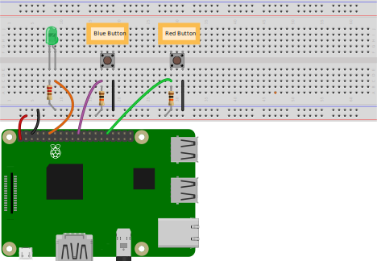
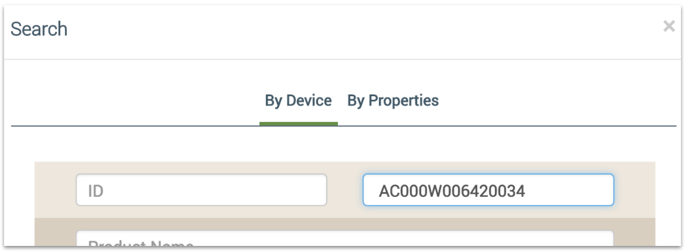

<aside id="pagebar" class="d-xl-block collapse">
  <ul>
    <li><a href="#core-title">Linux Device v1.7</a></li>
    <li><a href="#connect-the-device">Connect the device</a>
      <ul>
        <li><a href="#create-a-template">Create a template</a></li>
        <li><a href="#set-up-a-raspberry-pi">Set up a Raspberry Pi</a></li>
        <li><a href="#install-ayla">Install Ayla</a></li>
        <li><a href="#configure-your-device">Configure your device</a></li>
        <li><a href="#connect-register">Connect & Register</a></li>
        <li><a href="#test-the-device">Test the device</a></li>
      </ul>
    </li>
    <li><a href="#explore-the-example-app">Explore the example app</a>
      <ul>
        <li><a href="#about-ayla-daemons">About Ayla daemons</a></li>
        <li><a href="#modify-make-and-run">Modify, make, and run</a></li>
        <li><a href="#what-does-appd-do-">What does appd do?</a></li>
        <li><a href="#where-are-appd-files-">Where are appd files?</a></li>
      </ul>
    </li>
    <li><a href="#tutorials">Tutorials</a>
      <ul>
        <li><a href="#implement-green_led">Implement Green_LED</a></li>
        <li><a href="#implement-blue_button">Implement Blue_button</a></li>
        <li><a href="#add-metadata">Add Metadata</a></li>
        <li><a href="#add-red_button">Add Red_button</a></li>
        <li><a href="#add-a-trigger">Add a Trigger</a></li>
        <li><a href="#implement-blue_led">Implement Blue_LED</a></li>
        <li><a href="#add-a-schedule">Add a Schedule</a></li>
      </ul>
    </li>
    <li><a href="#explore-serial-i-o">Explore Serial I/O</a>
      <ul>
        <li><a href="#arduino-only">Arduino Only</a></li>
        <li><a href="#arduino-and-rpi">Arduino and RPi</a></li>
        <li><a href="#arduino-rpi-and-ayla">Arduino, RPi, and Ayla</a></li>
      </ul>
    </li>
    <li><a href="#perform-ota-updates">Perform OTA Updates</a>
      <ul>
        <li><a href="#how-ota-updates-work">How OTA updates work</a></li>
        <li><a href="#ota-implementation">OTA implementation</a></li>
        <li><a href="#perform-an-ota-update">Perform an OTA update</a></li>
        <li><a href="#check-results">Check results</a></li>
      </ul>
    </li>
    <li><a href="#debugging">Debugging</a>
      <ul>
        <li><a href="#decouple-appd">Decouple appd</a></li>
        <li><a href="#background-mode">Background mode</a></li>
        <li><a href="#foreground-mode">Foreground mode</a></li>
        <li><a href="#debug-mode">Debug mode</a></li>
      </ul>
    </li>
  </ul>
</aside>

<div class="dropdown mb-3">
  <button class="btn btn-warning btn-sm dropdown-toggle" type="button" id="versions" data-toggle="dropdown" aria-haspopup="true" aria-expanded="false">Choose a version</button>
  <div class="dropdown-menu" aria-labelledby="versions">
    <a class="dropdown-item" href="../v1-7">v1.7</a>
  </div>
</div>

This guide helps you experiment with the Ayla Linux Device Solution on a Raspberry Pi. In this particular edge solution, the Ayla Agent is named ```devd``` and the Ayla Example App is named ```appd```. Both are implemented as background processes. The video explains more:

<iframe 
  class="ml-sm-4"
  width="560" 
  height="315" 
  src="https://www.youtube.com/embed/aDdyFeo2A5E?rel=0&amp;showinfo=0" 
  frameborder="0" 
  allow="autoplay; 
  encrypted-media" 
  allowfullscreen>
</iframe>

You can connect a Raspberry Pi to the Ayla Public Account or, if it exists, to your company's Ayla Customer Account. For the former, you need to obtain a ```devd.conf``` file from Ayla. See [Set up your account](/#set-up-your-account).

# Connect the device

## Create a template

Browse to the [Ayla Developer Portal](/system-administration/ayla-developer-portal/), and create a template with the following details.

<table>
<tr><td>Visibility:</td><td>oem</td></tr>
<tr><td>Name:</td><td>Linux v1.7</td></tr>
<tr><td>Description:</td><td>Linux v1.7</td></tr>
<tr><td>Registration:</td><td>Dsn</td></tr>
<tr><td>Model:</td><td>linuxevb</td></tr>
<tr><td>Version:</td><td>linux-v1.7</td></tr>
<tr><td>Type:</td><td>Wifi</td></tr>
</table>

After creating the template, copy & paste the following properties into a text file, and import the file.

<pre>base_type,direction,name,scope
boolean,output,Blue_button,user
boolean,input,Blue_LED,user
string,input,cmd,user
decimal,input,decimal_in,user
decimal,output,decimal_out,user
boolean,input,Green_LED,user
integer,input,input,user
string,output,log,user
integer,output,output,user
string,output,version,user
file,input,file_down,user
file,output,file_up,user
boolean,input,file_up_test,user
boolean,input,batch_hold,user
message,input,large_message_down,user
message,output,large_message_up,user
string,input,large_message_up_test,user
</pre>

Finally, click the new ```version``` property, check ```Host SW Version```, and click ```OK```.

## Set up a Raspberry Pi

1. Obtain a Raspberry Pi. We used a [Raspberry Pi 3 Model B+](https://www.canakit.com/raspberry-pi-3-model-b-plus-ultimate-kit.html).
1. Download [Raspbian Lite](http://downloads.raspberrypi.org/raspbian_lite/images/). Do not unzip. We used raspbian_lite-2018-04-19.
1. Download <a href="https://www.balena.io/etcher" target="_blank">Etcher</a> to your computer, and install it.
1. Insert the MicroSD card into a card reader, and insert the reader into a USB port on your computer:

1. Run Etcher, and flash the Raspian image onto the MicroSD card.
1. In a terminal, access the <code>boot</code> directory (e.g. <code>cd /Volumes/boot</code> or <code>cd /media/matt/boot</code>).
1. Enable serial communication by appending <code>enable_uart=1</code> to config.txt.
1. Enable Secure Shell by creating an empty ssh text file with <code>touch ssh</code>.
1. Enable Wi-Fi by creating a <code>wpa_supplicant.conf</code> file with content similar to the following:
<pre>ctrl_interface=DIR=/var/run/wpa_supplicant GROUP=netdev
update_config=1
country=US
network={
     ssid="network"
     psk="password"
     key_mgmt=WPA-PSK
}</pre>
At boot time, Raspian copies this file to <code>/etc/wpa_supplicant/wpa_supplicant.conf</code>.
1. Unmount the card, remove it from the reader, insert it into the RPi (upside down), and power on.
1. Secure Shell to the RPi (or, optionally, <a href="https://learn.adafruit.com/adafruits-raspberry-pi-lesson-5-using-a-console-cable/enabling-serial-console" target="_blank">use a serial/console cable</a>):
1. Determine the RPi IP address. You can browse to the router manager page, or run <code>arp -a</code> in a shell.
1. Run <code>ssh pi&#64;192.168.1.9</code>. Normally, you will see a message similar to the following:
    <pre>The authenticity of host '192.168.1.9 (192.168.1.9)' can't be established.
ECDSA key fingerprint is SHA256:CcQtTqvRl5SLlAbCdEfG/UsK0/NN018UKnSRw.
Are you sure you want to continue connecting (yes/no)?</pre>
    Sometimes, however, you will see this message:
    <pre>@@@@@@@@@@@@@@@@@@@@@@@@@@@@@@@@@@@@@@@@@@@@@@@@@@@@@@@@@@@
@    WARNING: REMOTE HOST IDENTIFICATION HAS CHANGED!     @
@@@@@@@@@@@@@@@@@@@@@@@@@@@@@@@@@@@@@@@@@@@@@@@@@@@@@@@@@@@
IT IS POSSIBLE THAT SOMEONE IS DOING SOMETHING NASTY!
Someone could be eavesdropping on you right now (man-in-the-middle attack)!
It is also possible that a host key has just been changed.
The fingerprint for the ECDSA key sent by the remote host is
SHA256:r4Y+vxKp5N6tEsMJtc6za1v/Rujms4wfjMY51jH8wsw.
Please contact your system administrator.
Add correct host key in /Users/matt/.ssh/known_hosts to get rid of this message.
Offending ECDSA key in /Users/matt/.ssh/known_hosts:5
ECDSA host key for 192.168.1.8 has changed and you have requested strict checking.
Host key verification failed.</pre>
    To solve this, open <code>&#126;/.ssh/known_hosts</code> on your computer, delete the offending row (e.g. 5), save, and re-run ssh.
1. Type <code>yes</code>, and enter <code>raspberry</code> for password. (Your username is <code>pi</code>).
1. Determine whether ```git``` is installed. If not, install:
<pre>$ git --version
$ sudo apt-get update
$ sudo apt-get install git -y</pre>
1. Determine whether ```wiringpi``` is installed. If not, install:
<pre>$ gpio -v
$ sudo apt-get install wiringpi</pre>

## Install Ayla

### Clone the Ayla repository

1. In the secure shell, ensure that you are in your home directory (e.g. <code>/home/pi</code>).
1. Clone the Ayla [device-linux-public](https://github.com/AylaNetworks/device_linux_public) repository. You will be asked for your Github username and password.
<pre>
$ git clone https&#58;//github.com/AylaNetworks/device_linux_public.git
</pre>
1. View the release history, and, if the latest release is not ```adc-1.7```, get ```adc-1.7```:
<pre>
$ cd device_linux_public
$ git log
$ git checkout 5a4c0760b379a4c3cbbc698252d24e2b1286b51b
</pre>

### Edit ayla_install.sh

1. Copy ayla_install.sh to your home directory:
<pre>
$ cd ~
$ cp &#126;/device_linux_public/dev_kit/raspberry_pi/ayla_install.sh .
</pre>
1. Open the file for editing, and set ayla_src_dir:
<pre>
ayla_src_dir="/home/pi/device_linux_public"
</pre>
1. Search for <code>install_ayla_modules</code>, comment out the following code in the function, and save.
<pre>
# if echo "$ayla_package" | grep -q "\.tar$" || echo "$ayla_package" | grep -q "\.tar.gz$" || echo "$ayla_package" | grep -q "\.tgz$"; then
# &nbsp;&nbsp;install_tar "$ayla_package_path" "$ayla_src_dir"
# elif echo "$ayla_package" | grep -q "\.git$"; then
# &nbsp;&nbsp;git_clone_repo "$ayla_package" "$ayla_src_dir"
# else
# &nbsp;&nbsp;error_exit "unsupported package type: $ayla_package_path"
# fi
</pre>

### Edit appd.c

1. Open ```device_linux_public/app/appd/appd.c```.
1. Search for ```appd_template_version```.
1. Replace the current value with ```linux-v1.7``` to enable ```appd``` to identify your template.
1. Save the file.

### Install the Ayla Edge Solution

1. Create a dummy ```devd.conf``` file required by ```ayla_install.sh```:
<pre>$ touch devd.conf</pre>
1. View installation options:
<pre>$ ./ayla_install.sh -h</pre>
1. Start the installation. Wireless is the default mode. <span style="color:red;">Wireless requires the -z flag</span>.
<pre>
$ sudo ./ayla_install.sh -z
</pre>
<ul>
<li>Include <code>-z</code> to install BLE support.</li>
<li>Include <code>-n</code> to specify Ethernet (not Wi-Fi).</li>
<li>Include <code>-u</code> to install over a previous installation.</li>
</ul>
1. When the installation completes, do NOT reboot yet.

## Configure your device

<span style="color: red;">Important:</span> In order for an RPi to connect to the Ayla Cloud, it needs a valid ```devd.conf``` file in ```~/ayla/config/```. If you obtained one from Ayla, copy it from your computer to your RPi (e.g. ```scp devd.conf pi@192.168.1.8:```). Then, skip to Step 7 below. Otherwise, complete the following steps to create one.


### 1. Create a dsn.xml file

1. Browse to the [Ayla Dashboard Portal](/archive/ayla-dashboard-portal/), and log in.
1. Click Factory Actions in the sidebar.
1. Click the Reserve DSNs button.
1. For Model, select <code>AY001MRT1-Linux Software Agent</code>.
1. In the textbox on the right, select 1.
1. Click Submit. Ayla reserves for you a unique Device Serial Number (DSN) (e.g. AC000W123456789).
1. Download the archive file to your computer.
1. Unzip the archive file to extract the XML file.
1. Secure Copy the XML file from your computer to <code>/home/pi</code> on your RPi:
<pre>
$ scp AC000W123456789.xml pi&#64;192.168.1.9:
</pre>

### 2. Create on oem_info file

1. On your computer, create a text file called <code>oem_info</code>.
1. Copy and paste the content below. Each line is a space-delimited, key:value pair with no quotes.
<pre>
region myRegion
oem myOemId
oem_model myOemModel
oem_secret myOemSecret
mfg_model myMfgModel
mfg_serial myMfgSN
mfg_sw_version v1.2.3_A
odm myOdmName
</pre>
1. Replace <code>myRegion</code> with US, EU, or CN.
1. Replace <code>myOemId</code> with your oemId (see Ayla Dashboard Portal &gt; OEM Profile &gt; OEM ID).
1. Replace <code>myOemModel</code> with the <code>linuxevb</code>.
1. Replace <code>myOemSecret</code> with your oemSecret (see Ayla Dashboard Portal &gt; OEM Profile &gt; OEM Secret)
1. Leave the other values alone, and save. 
1. Secure Copy the file to <code>/home/pi</code> on your RPi:
<pre>
$ scp oem_info pi&#64;192.168.1.9:
</pre>

### 3. Make the config_gen utility

1. On your RPi, change directory to your Ayla source directory:
<pre>
$ cd &#126;/device_linux_public
</pre>
1. Build config_gen. 
<pre>
$ sudo make host_utils
</pre>
The newly built utility is in <code>&#126;/device_linux_public/build/native/utils</code>.

### 4. Run config_gen

1. View command-line options:
<pre>
$ cd ~
$ ./device_linux_public/build/native/utils/config_gen
</pre>
1. Run config_gen to generate a <code>.conf</code> file:
<pre>
$ ./device_linux_public/build/native/utils/config_gen -n -d ./AC000W123456789.xml -i ./oem_info
</pre>

### 5. Rename the file

Rename the resulting <code>AC000W123456789.conf</code> file to <code>devd.conf</code> (overwriting any existing <code>devd.conf</code> file):
<pre>
$ mv AC000W123456789.conf devd.conf
</pre>

### 6. Modify devd.conf

<ol>
<li>Open <code>devd.conf</code> for editing.</li>
<li>Add <code>,"server": {"default": 1}</code> to the <code>client</code> section as indicated in yellow below, and save. Don't forget the initial comma. This addition is important for initial prototyping, but must be removed when the device is deployed on your production platform.
<pre>
{
  "config": {
    "sys": {
      "factory": 1
    },
    "id": {
      "dsn": "AC000W123456789",
      "rsa_pub_key": "-----BEGIN RSA PUBLIC KEY-----\nMIIB...
    },
    "client": {
      "region": "US"<span style="color:yellow;">,
      "server": {
          "default": 1
      }</span>
    },
    "oem": {
      "oem": "0aaa111e",
      "model": "linuxevb",
      "key": "UT9...
    }
  }
}
</pre>
</li>
</ol>

### 7. Move devd.conf

Move <code>devd.conf</code> from <code>&#126;/</code> to <code>&#126;/ayla/config</code>:
<pre>
$ sudo mv devd.conf ~/ayla/config/devd.conf
</pre>

## Connect & Register

1. Reboot your RPi:
<pre>sudo reboot now</pre>
<p>After the RPi reboots, you will not be able to ssh to it immediately. This is normal. Here's what happens: During a reboot, Raspbian runs the Ayla Agent. The agent prevents Raspbian from re-connecting wirelessly to your LAN. Instead, the agent broadcasts the SSID of its own LAN, inviting you to connect via your mobile device. Once you do, you can use the Aura Mobile App to configure the agent to join your LAN which enables the agent to connect the RPi to the cloud.</p>
1. Tap Aura, and log into your Ayla account.
1. Exit Aura, and tap Settings > Wi-Fi. You should be connected to your LAN, and you should see another LAN with an <code>Ayla-</code> prefix:

1. Tap the Ayla LAN:

1. Exit Settings > Wi-Fi, and tap Aura.
1. On the Devices screen, tap the plus sign at top-right.

1. Tap Ayla EVB (Legacy):

1. Tap "I have the code", and, then, "I've powered the EVB":

1. Tap your network:

1. Enter the password, and tap Join:

1. After approx. 30 seconds, the following screen should appear:

(The image does not show a Raspberry Pi.)
1. Tap Done. The Devices screen appears with the new Raspberry Pi:


## Test the device

These directions show you how to use the [Aura Mobile App](/system-administration/aura-mobile-app) to change the device product name, and how to test the default properties. 

### Product Name

1. On the Devices screen, tap your new Raspberry Pi device.
1. Tap the pencil at the top of the screen.
1. Rename the device, and click Confirm.

### Integer properties

When you set the input property value to *n*, ```appd``` sets the output property value to *n x n*.

1. Scroll to the output property, and note the current value. It may be (null).
1. Scroll to the input property, tap the current value, set it to 3, and tap Update Value.
1. Scroll to the output property again, and note that it's new value is 9. 

### Boolean properties

When you set the Blue_LED and Green_LED property values to 1, ```appd``` sets the Blue_button property value to 1.

1. Set Blue_LED to 1.
1. Set Green_LED to 1.
1. Note that Blue_button changes to 1.

### String properties

When you set the cmd property value to "tree", ```appd``` sets the log property value to "tree".

1. Set cmd to "tree".
1. Note that log changes to "tree".

### Decimal properties

When you set decimal_in to "3.14", ```appd``` sets decimal_out to "3.14".

1. Set decimal_in to 3.14.
1. Note that decimal_out changes to 3.14.

### File properties

```appd``` has two file properties: file_up and file_down. Useful for large data blobs such as log files and images, file properties can be of any size. Of the two file properties, appd enables you to test file_up only. When you set the boolean property file_up_test to one, appd uploads a file to file_up, and resets file_up_test to 0.

1. Set file_up_test to 1.
1. Note that file_up changes to a link.

### Version property

```appd``` has a version property where it stores the current ```appd``` software version. The Ayla Cloud reads and display this version. A user who needs to initiate an OTA update may find the version property useful.

# Explore the example app

## About Ayla daemons

The Ayla Linux Device Solution runs a small number of Linux daemons including the Ayla Linux Agent (<code>devd</code>), the example app (<code>appd</code>), the Ayla Connection Manager (<code>cond</code>) if your Linux client is using Wi-Fi, and the Ayla Logging Client (<code>logd</code>) if you want Ayla-related messages to be written not only to syslog, but also to the Ayla Cloud. They reside in <code>/home/pi/ayla/bin</code>:

<pre>
$ ls -1 &#126;/ayla/bin/&#42;d
/home/pi/ayla/bin/appd
/home/pi/ayla/bin/cond
/home/pi/ayla/bin/devd
/home/pi/ayla/bin/logd
</pre>

Here is what they do:

|Daemon|Description|
|-|-|
|appd|The example app illustrates how any host app might maintain a prop table and interact with the agent.|
|cond|The Wi-Fi connection manager provides an abstraction layer between Ayla daemons and the native Wi-Fi driver.|
|devd|The Ayla Linux Agent provides secure connectivity to the Ayla Cloud.|
|logd|The Ayla Log Client parses <code>/var/log/syslog</code> for Ayla-tagged messages, and posts them to the Ayla Logging Service in the Ayla Cloud.|

Three of these daemons are managed by normal Linux scripts in <code>/etc/init.d</code>:

<pre>
$ ls -1 /etc/init.d/{cond,devd,logd}
/etc/init.d/cond
/etc/init.d/devd
/etc/init.d/logd
</pre>

```devd``` manages ```appd```. When you stop <code>devd</code>, it stops <code>appd</code>:

<pre>$ sudo systemctl stop devd</pre>

And, when you start <code>devd</code>, it starts <code>appd</code>:

<pre>sudo systemctl start devd</pre>

```devd``` also restarts <code>appd</code> if the latter fails.

## Modify, make, and run

This section shows you how to modify, make, and run the example app. Recall that the app includes two integer properties called input and output, and that when you set input to x, the app sets output to x * x. The following steps show you how to modify this behavior so that when you set input to x, the app sets output to x + x. 

<ol>
<li>Open <code>~/device_linux_public/app/appd/appd.c</code> for editing.</li>
<li>Search for the following function:
<pre>
static int appd_input_set(struct prop &#42;prop, const void &#42;val, size_t len, const struct op_args &#42;args) {
  ...
  if (input > 46340 || input < -46340) {
    output = -1;
  } else {
    output = input &#42; input;
  }
  metadata = prop_metadata_alloc();
  prop_metadata_addf(metadata, "source", "%d x %d", input, input);
  opts.metadata = metadata;
  ...
}
</pre>
</li>
<li>Change <code>input * input</code> to <code>input + input</code>.</li>
<li>Change <code>%d x %d</code> to <code>%d + %d</code>.</li>
<li>Save the file.</li>
<li>Build a new version of appd:
<pre>
$ cd &#126;/device_linux_public
$ sudo make app
</pre>
The new appd resides in <code>&#126;/device_linux_public/build/native/obj/app/appd</code>.
</li>
<li>Stop devd. (devd stops appd.)
<pre>
$ sudo systemctl stop devd
</pre>
</li>
<li>Make a copy of the original appd:
<pre>
$ sudo cp ~/ayla/bin/appd ~/ayla/bin/appd.original
</pre>
</li>
<li>Copy your newly built version of appd to the directory where devd expects to find it:
<pre>
$ sudo cp ~/device_linux_public/build/native/obj/app/appd/appd ~/ayla/bin/appd
</pre>
</li>
<li>Start devd. (devd starts appd.)
<pre>
$ sudo systemctl start devd  
</pre>
</li>
<li>Test the new functionality.</li>
</ol>

## What does appd do?

Consider the following diagram:

<a href="sync-tables.png"></a>

1. <code>appd</code> defines an array of properties (e.g. Green_LED) associated with the device.
1. The Ayla Cloud maintains an identical set of properties in the device's digital twin.
1. <code>appd</code> and the Ayla Cloud work together to keep the properties synchronized.
1. Each property includes a name, type, value, direction (<code>To Device</code> or <code>From Device</code>), etc.
1. <code>To Device</code> (from the cloud) property values are sometimes related to command and control (e.g. turn on LED).
1. <code>From Device</code> (to the cloud) property values are sometimes related to interrupts (e.g. the button was pressed).
1. Typically, <code>appd</code> interacts with two interfaces: Agent API and Hardware API.
1. The Agent API is <code>devd</code> which contributes secure connectivity to the cloud.
1. The Hardware API depends on your hardware. For Linux on RPi, it includes the GPIO header. 

## Where are appd files?

In essence, the host application (appd) is composed of two source files and three Ayla libraries (mostly <code>libapp.a</code>):

<pre>
&#126;/device_linux_public/app/appd/main.c
&#126;/device_linux_public/app/appd/appd.c
&#126;/device_linux_public/build/native/obj/lib/app/libapp.a
&#126;/device_linux_public/build/native/obj/lib/ayla/libayla.a
&#126;/device_linux_public/build/native/obj/lib/platform/libplatform.a
</pre>

The source files for the libraries are in the following directories:

<pre>
&#126;/device_linux_public/lib/app
&#126;/device_linux_public/lib/ayla
&#126;/device_linux_public/lib/platform
</pre>

The host application also includes third-party libraries. See the [Makefile](https://github.com/AylaNetworks/device_linux_public/blob/c102d2dd7fc31386ca2686099bb31fb4ddae8c38/app/appd/Makefile).

# Tutorials

## Implement Green_LED

This tutorial shows you how to implement a green LED for the existing Green_LED property.

### Wire a Green LED

1. Shutdown your RPi with ```sudo shutdown now```.
1. Wire the GPIO pins on your RPi to a breadboard, adding a green LED and a 220 Ω resister as seen in the diagram below.

1. Restart your RPi.

### Test with green_led.c

<ol>
<li>View GPIO pin schemes:
<pre>$ gpio readall</pre>
We are using the wPi scheme where wPi 1 == BCM 18.
</li>
<li>Create a <code>&#126;/ayla_tests</code> directory</li>
<li>Create a text file called <code>&#126;/ayla_tests/green_led.c</code> with the following code:
<pre>
#include &lt;stdio.h&gt;
#include &lt;wiringPi.h&gt;
#define GREEN_LED 1
int main(void) {
  printf("Starting program\n");
  wiringPiSetup();
  pinMode(GREEN_LED, OUTPUT);
  for(;;) {
    digitalWrite(GREEN_LED, HIGH);
    delay(500);
    printf("High\n");
    digitalWrite(GREEN_LED,  LOW);
    delay(500);
    printf("Low\n");
  }
  return 0;
}
</pre>
</li>
<li>Build the program:
<pre>
$ gcc -Wall -o green_led green_led.c -lwiringPi
</pre>
</li>
<li>Run the program to verify that you can control the LED from a program written in C. The LED should blink.
<pre>
./green_led
</pre>
</li>
<li>Press Ctrl-C to stop the program.</li>
</ol>

### Modify Makefile

<ol>
<li>Open <code>&#126;/device_linux_public/app/appd/Makefile</code> for editing.</li>
<li>Scroll to the section called "List of libraries to link."</li>
<li>Add wiringPi (with an uppercase 'P').
<pre>
LIBS = ssl crypto curl jansson wiringPi
</pre>
</li>
<li>Save the file.</li>
</ol>

### Modify appd.c

<ol>
<li>Open <code>&#126;/device_linux_public/app/appd/appd.c</code> for editing.</li>
<li>Include the wiringPi.h header file:
<pre>
#include &lt;wiringPi.h&gt;
</pre>
<li>Specify a GPIO pin for the green LED:
<pre>
#define GREEN_LED 1
</pre>
</li>
<li>Scroll to <code>app_prop_table</code>, find the entry for the Green_LED, and modify the set field:
<pre>
{
  .name = "Green_LED",
  .type = PROP_BOOLEAN,
  .set = appd_green_led_set,
  .send = prop_arg_send,
  .arg = &green_led,
  .len = sizeof(green_led),
  .ads_failure_cb = appd_prop_ads_failure_cb,
},
</pre>
</li>
<li>Add the following function to the file before <code>app_prop_table</code>:
<pre>
static int appd_green_led_set(struct prop \*prop, const void \*val, size_t len, const struct op_args \*args) {
  if (prop_arg_set(prop, val, len, args) != ERR_OK) {
    return -1;
  }
  digitalWrite(GREEN_LED, green_led);
  return 0;
}
</pre>
</li>
<li>Scroll to the <code>appd_start</code> function, and add the following:
<pre>
wiringPiSetup();
pinMode(GREEN_LED, OUTPUT);
</pre>
</li>
<li>Save the file.</li>
</ol>

### Make, run, and test appd

Make and run appd:

<pre>
$ cd ~/device_linux_public/
$ sudo make app
$ sudo systemctl stop devd
$ sudo cp ~/device_linux_public/build/native/obj/app/appd/appd ~/ayla/bin/appd
$ sudo systemctl start devd
</pre>

Test the new functionality by toggling the Green LED property on/off in Aura, and verifying that the actual LED on the breadboard turns on/off.

## Implement Blue_button

This tutorial shows you how to implement a blue button for the existing Blue_button property.

### Wire the Blue Button

1. Shutdown your RPi.
1. Wire the GPIO pins on your RPi to a breadboard, adding a button and a 10K Ω resister as seen in the diagram below.

1. Restart your RPi.

### Test with blue_button_poll.c

<ol>
<li>View GPIO pin schemes:
<pre>$ gpio readall</pre>
We are using the wPi scheme where wPi 6 == BCM 25.
</li>
<li>Create <code>&#126;/ayla_tests/blue_button_poll.c</code> with the following code:
<pre>
#include &lt;stdio.h&gt;
#include &lt;wiringPi.h&gt;
#define GREEN_LED 1
#define BLUE_BUTTON 6
int main(void) {
  printf("Starting program\n");
  wiringPiSetup();
  pinMode(GREEN_LED, OUTPUT);
  pinMode(BLUE_BUTTON, INPUT);
  for(;;) {
    if(digitalRead(BLUE_BUTTON) == LOW)
      digitalWrite(GREEN_LED, HIGH);
    else
      digitalWrite(GREEN_LED,  LOW);
  }
  return 0;
}
</pre>
</li>
<li>Build the program:
<pre>
$ gcc -Wall -o blue_button_poll blue_button_poll.c -lwiringPi
</pre>
</li>
<li>Run the program to verify that the button controls the LED.
<pre>
./blue_button_poll
</pre>
</li>
<li>Press Ctrl-C to stop the program.</li>
</ol>

### Test with blue_button_isr.c

Create and test ```blue_button_isr.c```.

<pre>
#include &lt;stdio.h&gt;
#include &lt;wiringPi.h&gt;
#define GREEN_LED 1
#define BLUE_BUTTON 6

void blue_button_isr(void) {
  if(digitalRead(BLUE_BUTTON) == LOW) {
    digitalWrite(GREEN_LED, HIGH);
  } else {
    digitalWrite(GREEN_LED, LOW);
  }
}

int main(void) {
  printf("Starting program\n");
  wiringPiSetup();
  pinMode(GREEN_LED, OUTPUT);
  pinMode(BLUE_BUTTON, INPUT);
  wiringPiISR(BLUE_BUTTON, INT_EDGE_BOTH, &blue_button_isr);
  for(;;) {
    delay(1000);
    printf("Awake\n");
  }
  return 0;
}
</pre>

### Modify appd.c

<ol>
<li>Open <code>&#126;/device_linux_public/app/appd/appd.c</code> for editing.</li>
<li>Specify a GPIO pin for the blue button:
<pre>
#define BLUE_BUTTON 6
</pre>
</li>
<li>Add the following function:
<pre>
void blue_button_isr(void) {
  if(digitalRead(BLUE_BUTTON) == LOW) {blue_button = 1;}
  else {blue_button = 0;}
  prop_send_by_name("Blue_button");
}
</pre>
</li>
<li>Scroll to the <code>appd_start</code> function, and add the following after <code>wiringPiSetup()</code>:
<pre>
pinMode(BLUE_BUTTON, INPUT);
wiringPiISR(BLUE_BUTTON, INT_EDGE_BOTH, &blue_button_isr);
</pre>
</li>
<li>Save the file.</li>
</ol>

### Make, run, and test appd

Make and run appd:

<pre>
$ cd ~/device_linux_public/
$ sudo make app
$ sudo systemctl stop devd
$ sudo cp ~/device_linux_public/build/native/obj/app/appd/appd ~/ayla/bin/appd
$ sudo systemctl start devd
</pre>

Test the new functionality. Look at the Blue_button property in Aura. Press and hold the blue button on the breadboard. See Blue_button change to true. Release the button. See the property value change to false.

## Add Metadata

This tutorial shows you how to associate metadata (```key:value``` pairs) with a property. Metadata limits include the following:

* PROP_METADATA_MAX_ENTRIES - The maximum number of key/value pairs is 10.
* PROP_METADATA_KEY_MAX_LEN - The maximum key length is 255 bytes.

See <code>&#126;/device_linux_public/lib/app/props_internal.h.</code>.

Below are directions for associating the following metadata with the Blue_button property:

|Key|Value|
|-|-|
|buttonSize|small|
|buttonDistributor|Elego|

<ol>
<li>Browse to the Developer Portal.</li>
<li>Click View My Devices &gt; Raspberry Pi &gt; Blue_button &gt; Datapoints, and note the absence of Metadata.

</li>
<li>Open <code>&#126;/device_linux_public/app/appd/appd.c</code> for editing.</li>
<li>Scroll to the <code>blue_button_isr</code> function, and modify it like this:
<pre>
void blue_button_isr(void) {
  struct op_options opts = {.confirm = 1};

  if(digitalRead(BLUE_BUTTON) == LOW) {blue_button = 1;}
  else {blue_button = 0;}

  struct prop_metadata \*metadata = prop_metadata_alloc();
  prop_metadata_add(metadata, "buttonSize", "small");
  prop_metadata_add(metadata, "buttonDistributer", "Elego");
  opts.metadata = metadata;

  struct prop \*prop = prop_lookup("Blue_button");
  prop->send(prop, 0, &opts);
  prop_metadata_free(metadata);
}
</pre>
</li>
<li>Make and run appd:
<pre>
$ cd ~/device_linux_public/
$ sudo make app
$ sudo systemctl stop devd
$ sudo cp ~/device_linux_public/build/native/obj/app/appd/appd ~/ayla/bin/appd
$ sudo systemctl start devd
</pre>
</li>
<li>Click the Blue Button on your breadboard.</li>
<li>View the Blue_button property in the Developer Portal:

</li>
<li>Tail ```syslog```:
<pre>$ tail -f /var/log/syslog</pre>
<p>Note <code>"metadata":{"buttonSize":"small","buttonDistributer":"Elego"}</code>:</p>
<pre>
Oct 11 14:03:12 raspberrypi appd: [debug-app] prop_val_send: Blue_button
Oct 11 14:03:12 raspberrypi appd: [debug-app] data_send_json: {"cmd":{"proto":"data","id":5,"op":"prop_send","opts":{"confirm":true},"args":[{"property":{"name":"Blue_button","base_type":"boolean","value":1,"metadata":{"buttonSize":"small","buttonDistributer":"Elego"},"dev_time_ms":1570802592534}}]}}
</pre>
</li>
</ol>

## Add Red_button
This tutorial shows you how to implement a red button for a new Red_button property.

### Wire a Red Button

1. Shutdown your RPi.
1. Wire the GPIO pins on your RPi to a breadboard, adding another button and another 10K Ω resister as seen in the diagram below. Whether or not the button is red, we will refer to it as the red button.

1. Restart your RPi.

### Test with red_button_isr.c

<ol>
<li>View GPIO pin schemes:
<pre>$ gpio readall</pre>
We are using the wPi scheme where wPi 26 == BCM 12.
</li>
<li>Create <code>&#126;/ayla_tests/red_button_isr.c</code> with the following code:
<pre>
#include &lt;stdio.h&gt;
#include &lt;wiringPi.h&gt;
#define GREEN_LED 1
#define RED_BUTTON 26

void isr(void) {
  if(digitalRead(RED_BUTTON) == LOW) {
    digitalWrite(GREEN_LED, HIGH);
  } else {
    digitalWrite(GREEN_LED, LOW);
  }
}

int main (void) {
  printf("Start of program\n");
  wiringPiSetup();
  pinMode(GREEN_LED, OUTPUT);
  pinMode(RED_BUTTON, INPUT);
  wiringPiISR(RED_BUTTON, INT_EDGE_BOTH, &isr);

  for(;;) {
    delay(1000);
    printf("Awake\n");
  }
  return 0 ;
}
</pre>
</li>
<li>Build the program:
<pre>
$ gcc -Wall -o red_button_isr red_button_isr.c -lwiringPi
</pre>
</li>
<li>Run the program to verify that the button can control the LED.
<pre>
./red_button_isr
</pre>
</li>
<li>Press Ctrl-C to stop the program.</li>
</ol>

### Modify appd.c

<ol>
<li>Open <code>&#126;/device_linux_public/app/appd/appd.c</code> for editing.</li>
<li>Specify a GPIO pin for the red button:
<pre>
#define RED_BUTTON 26
</pre>
</li>
<li>Add the following variable:
<pre>
static u8 red_button;
</pre>
</li>
<li>Scroll to <code>appd_prop_table</code>, and add the following prop struct after the Blue_button entry:
<pre>
{
  .name = "Red_button",
  .type = PROP_BOOLEAN,
  .send = prop_arg_send,
  .arg = &red_button,
  .len = sizeof(red_button),
  .ads_failure_cb = appd_prop_ads_failure_cb,
},
</pre>
</li>
<li>Add the following function:
<pre>
void red_button_isr(void) {
  if(digitalRead(RED_BUTTON) == LOW) {red_button = 1;}
  else {red_button = 0;}
  prop_send_by_name("Red_button");
}
</pre>
</li>
<li>Scroll to the <code>appd_start</code> function, and add the following after <code>wiringPiSetup()</code>:
<pre>
pinMode(RED_BUTTON, INPUT);
wiringPiISR(RED_BUTTON, INT_EDGE_BOTH, &red_button_isr);
</pre>
</li>
<li>Save the file.</li>
</ol>

### Make and run appd (see error)

<ol>
<li>Make and run appd:
<pre>
$ cd ~/device_linux_public/
$ sudo make app
$ sudo systemctl stop devd
$ sudo cp ~/device_linux_public/build/native/obj/app/appd/appd ~/ayla/bin/appd
$ sudo systemctl start devd
</pre>
</li>
<li>tail <code>syslog</code>:
<pre>$ tail -f /var/log/syslog</pre>
</li>
<li>Click the red button, and view the new output in syslog. The most important line is the following which indicates that the corresponding digital twin in the Ayla Cloud does not know about the new Red_button property.
<pre>
Sep  6 06:17:19 rpi appd: [debug-app] data_recv: {"cmd":{"proto":"data","id":9,"op":"nak","args":[{"err":"unknown_prop","name":"Red_button","dests":1,"op":"prop_send"}]}}
</pre>
</li>
</ol>

### Create the Red_button property in the cloud

<ol>
<li>Browse to the Developer Portal > View My Devices > Raspberry Pi</li>
<li>Click Add, define the new Red_property, and click Save:

</li>
<li>Click the Red Button on the breadboard. The new cloud-based property should now reflect the button state.</li>
</ol>

## Add a Trigger

This tutorial shows you how to add a trigger to the Red_button property.

1. Browse to the Developer Portal.
1. Click View My Devices &gt; Raspberry Pi &gt; Red_button &gt; Triggers.
1. Click Add, fill out the form, and click OK. Use this form as a guide:

1. Click Add to add an application to the trigger.
1. Add an email application.
1. With appd running, click the Red Button on your breadboard.
1. Check your email:


## Implement Blue_LED

In preparation for [Add a Schedule](#add-a-schedule) which controls both the green and blue LEDs, implement the Blue_LED in ```appd``` using BCM 16 which is wPi 27. See [Implement Green_LED](#implement-green_led) for reference. Here is the pinout:


## Add a Schedule

This tutorial shows you how to create a Schedule for your Raspberry Pi to control the dates, times, durations, and intervals of RPi activity. Note the following:

1. Creating a schedule requires <u>no</u> additional coding. Creating a schedule is a user activity.
1. A single schedule can control many actions on the device. For example, a single schedule can turn on/off several LEDs, start up a motor, and turn on/off various sensors.
1. You create schedules in the Developer Portal. When you save the Schedule, the Ayla Cloud downloads the schedule to the Ayla Linux Agent which is responsible for setting timers, waking up, and executing the scheduled actions.
1. Schedule configurations are saved on the device in <code>&#126;/ayla/config/appd.conf.startup</code>.

Here are directions for creating a schedule:

<ol>
<li>Browse to the Developer Portal.</li>
<li>Click View My Devices &gt; Raspberry Pi &gt; Schedules.</li>
<li>Click Add, fill out the form, and click OK. Use this form as a guide:

</li>
The 2-second interval means this schedule will wake up every 2 seconds. The 1-second duration means that actions (as yet unspecified) can take place during a 1 second window.
<li>Click the new schedule:

</li>
<li>Click the Actions tab:

</li>
<li>Create the following two actions:
<div class="row">
<div class="col-lg-4 col-md-6 col-sm-12">

</div>
<div class="col-lg-4 col-md-6 col-sm-12">

</div>
</div>
</li>
<li>Click the Settings tab, and click OK. If devd and appd are running, the Green LED on your RPi should begin to blink on/off every 1 second.</li>
<li>Run appd in debug mode to see on/off messages.</li>
<li>Verify datapoints in Aura, or in the Developer Portal.</li>
<li>Add the following two new actions to the RPI Activity Schedule.
<div class="row">
<div class="col-lg-4 col-md-6 col-sm-12">

</div>
<div class="col-lg-4 col-md-6 col-sm-12">

</div>
</div>
</li>
<li>Test the schedule. It should blink like this:
<iframe 
  width="560" 
  height="315" 
  src="https://www.youtube.com/embed/FbwP8tM3pgg?rel=0&amp;showinfo=0" 
  frameborder="0" 
  allow="autoplay; 
  encrypted-media" 
  allowfullscreen>
</iframe>
</li>
</ol>

# Explore Serial I/O

To demonstrates serial I/O between your host application (appd) running on your Raspberry Pi and a small program running on an Arduino board, this tutorial implements the following use case: When a user clicks either of the buttons on the breadboards, or toggles the <code>twin_led</code> property in the Ayla Cloud, both orange LEDs turn on or off in unison:

<a href="rpi-arduino-serial.png"></a>

The following video demonstrates:

<iframe 
  width="560"
  height="315" 
  src="https://www.youtube.com/embed/vhugySJ9kXA?rel=0&amp;showinfo=0" 
  frameborder="0" 
  allow="autoplay; encrypted-media" 
  allowfullscreen>
</iframe>

The tutorial builds the use case in three phases:

1. Build an Arduino program that turns the Arduino LED on/off.
1. Build an Arduino program and an RPi program that coordinate turning both LEDs on/off in unison.
1. Merge parts of the RPi program into appd to accomplish the full use case.

<a data-toggle="collapse" href="#install-arduino-ide">Click to learn how to install the Arduino IDE onto your RPi</a>.
<div id="install-arduino-ide" class="collapse">
<div class="card card-body" style="background:ghostwhite;">
<ol>
<li>Connect to your RPi via VNC Viewer.</li>
<li>In the terminal, run <code>sudo apt-get update</code>.</li>
<li>In the browser, browse to [Arduino Software](https://www.arduino.cc/en/Main/Software).</li>
<li>Download the Linux ARM version.</li>
<li>In File Manager, navigate to the Downloads folder.</li>
<li>Right-click on <code>arduino-1.8.8-linuxarm.tar.xz</code>, and click <code>Extract Here</code>.</li>
<li>Right-click on the extracted folder, and click <code>Open in Terminal</code>.</li>
<li>Run <code>sudo ./install.sh</code>.
Ignore the following error:
<pre>
$ sudo ./install.sh
Adding desktop shortcut, menu item and file associations for Arduino IDE...touch: cannot touch '/root/.local/share/applications/mimeapps.list': No such file or directory
/usr/bin/xdg-mime: 803: /usr/bin/xdg-mime: cannot create /root/.local/share/applications/mimeapps.list.new: Directory nonexistent
 done!
</pre>
Note that the installation process also creates the following work directory: <code>/home/pi/Arduino</code>. You can use this directory to store your Arduino sketches.
</li>
<li>From the Desktop, start the Arduino IDE:

</li>
</ol>
</div>
</div>

## Arduino Only

<ol>
<li>Wire the Arduino side of the diagram above. Click the image to enlarge.</li>
<li>Create an Arduino sketch called <code>arduino-only</code>:
<pre>
const int LED = 8;
const int BUTTON = 2;
volatile unsigned char led_val = LOW;
volatile bool led_changed = false; 

void setup() {
  pinMode(LED, OUTPUT);
  pinMode(BUTTON, INPUT);
  attachInterrupt(digitalPinToInterrupt(BUTTON), button_isr, CHANGE);
  Serial.begin(9600);
}

void loop() {  
  delay(1000);
}

void button_isr() {
  if(digitalRead(BUTTON) == HIGH) {
    led_val = (led_val == HIGH) ? (LOW) : (HIGH);
    digitalWrite(LED, led_val);
  }
}
</pre>
</li>
<li>Compile, load, and run the sketch:

</li>
<li>Test by pressing and releasing the button. The LED should turn on. Repeat. The LED should turn off:
<iframe 
  width="560" 
  height="315" 
  src="https://www.youtube.com/embed/ejlnBJJxWHg?rel=0&amp;showinfo=0" 
  frameborder="0" 
  allow="autoplay; 
  encrypted-media" 
  allowfullscreen>
</iframe>
</li>
</ol>

## Arduino and RPi

<ol>
<li>Wire the RPi side of the diagram at the top of the page. Click the image to enlarge.</li>
<li>Create an Arduino sketch called <code>arduino-side</code>:
<pre>
const int LED = 8;
const int BUTTON = 2;
volatile unsigned char led_val = LOW;
volatile bool led_changed = false; 

void setup() {
  pinMode(LED, OUTPUT);
  pinMode(BUTTON, INPUT);
  attachInterrupt(digitalPinToInterrupt(BUTTON), button_isr, CHANGE);
  Serial.begin(9600);
}

void loop() {
  
  if(led_changed) {
    led_changed = false;
    Serial.write(led_val);
    Serial.write("/n");
  }

  while (Serial.available() > 0) {
    int val = Serial.read();
    if(val == LOW || val == HIGH) {
      led_val = val;
      digitalWrite(LED, led_val);
    }
  }
}

void button_isr() {
  if(digitalRead(BUTTON) == HIGH) {
    led_val = (led_val == HIGH) ? (LOW) : (HIGH);
    digitalWrite(LED, led_val);
    led_changed = true;
  }
}
</pre>
</li>
<li>Compile, load, and run the sketch.</li>
<li>Create a C program for the RPi called <code>rpi-side</code>:
<pre>
#include <stdio.h>
#include <wiringPi.h>
#include <wiringSerial.h>
#include <stdbool.h>
#define LED 29
#define BUTTON 28

unsigned char led_val = LOW;
int serialFileDesc = 0;

void button_isr(void) {
  if(digitalRead(BUTTON) == HIGH) {
    led_val = (led_val == HIGH) ? (LOW) : (HIGH);
    digitalWrite(LED, led_val);
    serialPutchar(serialFileDesc, led_val);
  }
}

int main(void) {
  printf("Starting program\n");
  wiringPiSetup();
  pinMode(LED, OUTPUT);
  pinMode(BUTTON, INPUT);
  serialFileDesc = serialOpen("/dev/ttyACM0", 9600);
  wiringPiISR(BUTTON, INT_EDGE_BOTH, &button_isr);

  for(;;) {
    unsigned char val = serialGetchar(serialFileDesc);
    if(val == LOW || val == HIGH) {
      led_val = val;
      digitalWrite(LED, led_val);
    }
  }

  serialClose(serialFileDesc);
  return 0;
}
</pre>
</li>
<li>Compile and run:
<pre>
$ gcc -Wall -o rpi-side rpi-side.c -lwiringPi
$ ./rpi-side
</pre>
Alternately, you can run the program in the background with <code>./rpi-side & disown</code>, and stop it with <code>killall rpi-side</code>.
</li>
<li>Test by pressing and releasing either button. Both LEDs should turn on. Repeat. Both LEDs should turn off:
<iframe 
  width="560" 
  height="315" 
  src="https://www.youtube.com/embed/E8ZBXUGqDhA?rel=0&amp;showinfo=0" 
  frameborder="0" 
  allow="autoplay; 
  encrypted-media" 
  allowfullscreen>
</iframe>
</li>
<li>Use <code>Ctl-C</code> to exit <code>rpi-side</code>.</li>
</ol>

## Arduino, RPi, and Ayla

### Modify Makefile

<ol>
<li>Open <code>&#126;/device_linux_public/app/appd/Makefile</code> for editing.</li>
<li>Scroll to the section called "List of libraries to link."</li>
<li>Add wiringPi and pthread:
<pre>
LIBS = ssl crypto curl jansson wiringPi pthread
</pre>
</li>
<li>Save the file.</li>
</ol>

### Create the twin_led property

<ol>
<li>Browse to the [Ayla Devloper Portal](/archive/ayla-developer-portal/), and log in.</li>
<li>Click View My Devices.</li>
<li>Click the serial number of your device.</li>
<li>Click Add, and create a property with the following attributes:
<table>
<tr><th>Attribute</th><th>Value</th></tr>
<tr><td>Property Type</th><th>Property</td></tr>
<tr><td>Name</td><td>twin_led</td></tr>
<tr><td>Display Name</td><td>twin_led</td></tr>
<tr><td>Base Type</td><td>Boolean</td></tr>
<tr><td>Direction</td><td>To Device</td></tr>
<tr><td>Scope</td><td>user</td></tr>
</table>
The new property looks like this:

</li>
</ol>

### Modify appd.c

<ol>
<li>Open <code>&#126;/device_linux_public/app/appd/appd.c</code> for editing.</li>
<li>Include the following header files:
<pre>
#include &lt;wiringPi.h&gt;
#include &lt;wiringSerial.h&gt;
#include &lt;pthread.h&gt;
</pre>
<li>Add the following constants:
<pre>
#define TWIN_RPI_LED 29
#define TWIN_RPI_BUTTON 28
</pre>
</li>
<li>Add the following variables:
<pre>
static u8 twin_led_val;
int serialFileDesc = 0;
pthread_t twin_led_serial_rx_thread_id;
</pre>
</li>
<li>Scroll to <code>app_prop_table</code>, and add the following <code>prop</code> struct instance:
<pre>
{
  .name = "twin_led",
  .type = PROP_BOOLEAN,
  .set = appd_twin_led_set,
  .send = prop_arg_send,
  .arg = &twin_led_val,
  .len = sizeof(twin_led_val),
  .ads_failure_cb = appd_prop_ads_failure_cb,
},
</pre>
</li>
<li>Add an <code>appd_twin_led_set</code> function to the file <u>before</u> <code>app_prop_table</code>:
<pre>
static int appd_twin_led_set(struct prop &#42;prop, const void &#42;val, size_t len, const struct op_args &#42;args)
{
  if (prop_arg_set(prop, val, len, args) != ERR_OK) {
    return -1;
  }
  digitalWrite(TWIN_RPI_LED, twin_led_val);
  serialPutchar(serialFileDesc, twin_led_val);
  return 0;
}
</pre>
This function receives the new value for twin_led_val from the cloud, applies it to the LED, and sends it to the Arduino board.
</li>
<li>Add an <code>appd_twin_rpi_button_isr</code> function:
<pre>
void appd_twin_rpi_button_isr(void) {
  if(digitalRead(TWIN_RPI_BUTTON) == HIGH) {
    twin_led_val = (twin_led_val == HIGH) ? (LOW) : (HIGH);
    digitalWrite(TWIN_RPI_LED, twin_led_val);
    serialPutchar(serialFileDesc, twin_led_val);
    prop_send_by_name("twin_led");
  }
}
</pre>
This function receives the new value for twin_led_val from the button, applies it to the LED, sends it to the Arduino board and the cloud.
</li>
<li>Add an <code>appd_twin_led_serial_rx</code> function:
<pre>
void &#42;appd_twin_led_serial_rx(void &#42;ptr) {
  for(;;) {
    unsigned char val = serialGetchar(serialFileDesc);
    if(val == LOW || val == HIGH) {
      twin_led_val = val;
      digitalWrite(TWIN_RPI_LED, twin_led_val);
      prop_send_by_name("twin_led");
    }
  }
}
</pre>
This function receives the new value for twin_led_val from the Arduino board, applies it to the LED, and sends it to the cloud.
</li>
<li>Scroll to the <code>appd_start</code> function, and change as follows:
<pre>
int appd_start(void)
{
  log_info("application starting");

  app_set_template_version(appd_template_version);

  wiringPiSetup();
  pinMode(TWIN_RPI_LED, OUTPUT);
  pinMode(TWIN_RPI_BUTTON, INPUT);
  wiringPiISR(TWIN_RPI_BUTTON, INT_EDGE_BOTH, &appd_twin_rpi_button_isr);
  serialFileDesc = serialOpen("/dev/ttyACM0", 9600);
  pthread_create(&twin_led_serial_rx_thread_id, NULL, appd_twin_led_serial_rx, NULL);

  return 0;
}
</pre>
</li>
<li>Scroll to the <code>appd_exit</code> function, and change as follows:
<pre>
void appd_exit(int status)
{
  log_info("application exiting with status: %d", status);
  serialClose(serialFileDesc);
  pthread_cancel(twin_led_serial_rx_thread_id);
}
</pre>
</li>
<li>Save the file.</li>
<li>Make <code>appd</code>, and run <code>devd</code> and <code>appd</code>:</li>
<pre>
$ cd ~/device_linux_public/
$ sudo make
$ sudo systemctl stop devd
$ sudo cp ~/device_linux_public/build/native/obj/app/appd/appd ~/ayla/bin/appd
$ sudo systemctl start devd
</pre>
Your modified <code>appd</code> interacts with the <code>arduino-side</code> sketch you ran in the previous section on this page.
<li>Test the new functionality by toggling the twin_led property on/off in Aura, and verifying that the actual LEDs on the breadboards turns on/off. Clicking the buttons on either breadboard should do the same.
<iframe 
  width="560" 
  height="315" 
  src="https://www.youtube.com/embed/2pwZxI7TSJQ?rel=0&amp;showinfo=0" 
  frameborder="0" 
  allow="autoplay; 
  encrypted-media" 
  allowfullscreen>
</iframe>
</li>
</ol>

# Perform OTA Updates

Ayla provides a mechanism for performing over-the-air (OTA) updates in order to replace the Ayla Agent (devd) and/or the host application (appd) running on your Ayla device with different (often newer) versions. This page discusses OTA updates. See also [Versioning](../../guide/versioning).

## How OTA updates work

Ayla does not define a particular file format for OTA image files. The Ayla Cloud and all Ayla device components view the file as opaque. As the following diagram illustrates, and the steps explain, only platform-specific OTA Custom Code needs to understand both the file format and how to use the contents of the file to update software.

<a href="how-ota-updates-work.png"></a>

1. An admin creates an OTA image file.
1. Using Ayla Dashboard Portal, the admin uploads the file to the Ayla Cloud, associating it with a digital twin.
1. The admin initiates an OTA job, specifying the file.
1. The Ayla Cloud tells the Ayla Agent on the device to initiate an OTA update (see [serv_ota_exec](https://github.com/AylaNetworks/device_linux_public/blob/c102d2dd7fc31386ca2686099bb31fb4ddae8c38/daemon/devd/serv.c)).
1. The Ayla Agent launches the OTA Daemon (see [ota_update.c](https://github.com/AylaNetworks/device_linux_public/blob/c102d2dd7fc31386ca2686099bb31fb4ddae8c38/util/ota/ota_update.c)).
1. The OTA Daemon downloads the OTA file.
1. The OTA Daemon launches platform-specific OTA Custom Code (see [platform_ota_apply](https://github.com/AylaNetworks/device_linux_public/blob/c102d2dd7fc31386ca2686099bb31fb4ddae8c38/util/ota/ota_update.c)).
1. The OTA Custom Code opens the OTA image file, and applies the update.
1. The OTA Daemon resets the device (see [platform_reset](https://github.com/AylaNetworks/device_linux_public/blob/c102d2dd7fc31386ca2686099bb31fb4ddae8c38/util/ota/ota_update.c)).

## OTA implementation

The OTA image file for the Ayla Platform on RPi is a <code>.tar</code> file of the <code>&#126;/device_linux_public</code> directory including all source files, and excluding the <code>build</code> directory. The custom code untars the file in <code>/tmp</code>, builds and replaces all Ayla daemons, and restarts them. Custom code includes the following:

|&nbsp;|File|Function|Description|
|-|-|-|-|
|1.|[ota.c](https://github.com/AylaNetworks/device_linux_public/blob/c102d2dd7fc31386ca2686099bb31fb4ddae8c38/lib/platform/raspberry_pi/ota.c)|platform_ota_apply|Calls the <code>apply_ota.sh</code> script.|
|2.|[apply_ota.sh](https://github.com/AylaNetworks/device_linux_public/blob/c102d2dd7fc31386ca2686099bb31fb4ddae8c38/lib/platform/raspberry_pi/scripts/apply_ota.sh)|&nbsp;|Creates a temporary build directory.<br/>Unpacks <code>/tmp/ayla_ota.img</code> into the directory.<br/>Builds and replaces all daemons.<br/>Starts the daemons.|

Finally, the OTA Daemon resets the device.

## Perform an OTA update

### Change appd version

1. Open a Secure Shell to your Raspberry Pi.
1. Open <code>appd.c</code>:
<pre>
$ nano ~/device_linux_public/app/appd/appd.c 
</pre>
1. Change <code>appd_version</code> in [appd.c](https://github.com/AylaNetworks/device_linux_public/blob/c102d2dd7fc31386ca2686099bb31fb4ddae8c38/app/appd/appd.c) to a new version:
<pre>
const char &#42;appd_version = "appd_matts_linux_device_1_1";
</pre>
1. Modify <code>appd</code> source code, build, test, repeat. 

### Create the OTA image file

1. When you are ready to perform an OTA update, change directory to <code>&#126;/device_linux_public</code>.
1. Run <code>make clean</code> to delete the <code>build</code> directory.
1. Change directory to <code>&#126;/</code>.
1. Create an archive of the <code>device_linux_public</code> directory:
<pre>
$ cd &#126;/device_linux_public
$ tar -cf ../appd_matts_linux_device_1_1.tar .
</pre>
1. Exit <code>ssh</code>, <code>scp</code> the tar file to your computer, and open <code>ssh</code> again for later:
<pre>
$ scp pi@192.168.1.10:appd_matts_linux_device_1_1.tar .
</pre>

### Upload the OTA image file

1. Browse to the Ayla Dashboard Portal, and log in.
1. Click <code>Devices</code> in the sidebar. In order to perform an OTA update to a device, it must first be a member of a device group. 
1. Click <code>Search Devices</code>, fill in the form, and click Search.

1. Click <code>Create Group</code>, fill in the form, and click Create.

1. Click Groups in the top horizontal menu, and view your new group. Click Close.

1. Click <code>OTA</code> in the sidebar.
1. Click <code>Host MCU Images</code> in the top horizontal menu.
1. Click <code>Create</code>, fill in the form, and click Save:


### Perform the OTA update

Before you launch the OTA update, you may want to <code>ssh</code> to your RPi, and <code>tail -f /var/log/syslog</code> so that you can watch activity. See a sample syslog at the bottom of this page.

1. In Ayla Dashboard Portal, click the Create OTA Job icon for your new image on the Host MCU Images list:

1. Fill in the form, and click Create.

 The job appears in the <code>OTA Jobs</code> list:

1. Slide to find the right end of the job on the list, and click the Start icon:

At the end of the OTA process, your RPi will reboot.

## Check results

Once the OTA process completes, check the following:

1. Ayla Dashboard Portal &gt; OTA &gt; OTA Jobs.

1. Ayla Dashboard Portal &gt; Devices &gt; DSN.

1. Ayla Developer Portal &gt; Devices &gt; DSN &gt; Details.

1. <a data-toggle="collapse" href="#sample-syslog">Click to view sample syslog</a>.
<pre id="sample-syslog" class="collapse">
Feb  8 21:22:21 MattsLinuxDevice devd: [debug-client] ds_get_cmds_done: &#35;012{&#35;012    "cmds": [&#35;012        {&#35;012            "cmd": {&#35;012                "data": "{\"ota\":{\"url\":\"https&colon;//ais.aylanetworks.com/device/t_otas/16588.json?dsn=AC000W006420034\",\"type\":\"host_mcu\",\"ver\":\"appd_matts_linux_device_1_1\",\"size\":4505600,\"checksum\":\"640e42b7fd7685a3f32ec8a697fc3776\",\"source\":\"local\"}}",&#35;012                "id": 10303704,&#35;012                "method": "PUT",&#35;012                "resource": "ota.json",&#35;012                "uri": "/cmd_post_process.json"&#35;012            }&#35;012        }&#35;012    ],&#35;012    "properties": [],&#35;012    "schedules": []&#35;012}
Feb  8 21:22:21 MattsLinuxDevice devd: [debug-server] server_handle_req: PUT ota.json
Feb  8 21:22:21 MattsLinuxDevice devd: [info-server] serv_ota_exec: starting OTA download/apply of version appd_matts_linux_device_1_1
Feb  8 21:22:21 MattsLinuxDevice devd: [debug-server] serv_rev_put_end: status 200
Feb  8 21:22:21 MattsLinuxDevice devd: [debug2-client] ds_send: PUT https&colon;//ads-dev.aylanetworks.com/devices/5319141/cmd_post_process.json?cmd_id=10303704&status=200
Feb  8 21:22:21 MattsLinuxDevice devd: [debug-server] serv_ota_exec: Starting ota_update using args:
Feb  8 21:22:21 MattsLinuxDevice devd: [debug-server] serv_ota_exec: ota_update
Feb  8 21:22:21 MattsLinuxDevice devd: [debug-server] serv_ota_exec: -u
Feb  8 21:22:21 MattsLinuxDevice devd: [debug-server] serv_ota_exec: https&colon;//ais.aylanetworks.com/device/t_otas/16588.json?dsn=AC000W006420034
Feb  8 21:22:21 MattsLinuxDevice devd: [debug-server] serv_ota_exec: -l
Feb  8 21:22:21 MattsLinuxDevice devd: [debug-server] serv_ota_exec: 4505600
Feb  8 21:22:21 MattsLinuxDevice devd: [debug-server] serv_ota_exec: -c
Feb  8 21:22:21 MattsLinuxDevice devd: [debug-server] serv_ota_exec: 640e42b7fd7685a3f32ec8a697fc3776
Feb  8 21:22:21 MattsLinuxDevice devd: [debug-server] serv_ota_exec: -s
Feb  8 21:22:21 MattsLinuxDevice devd: [debug-server] serv_ota_exec: /var/run/devd/msg_sock
Feb  8 21:22:21 MattsLinuxDevice devd: [debug-server] serv_ota_exec: -ar
Feb  8 21:22:21 MattsLinuxDevice devd: [debug-client] http_client_send: Found bundle for host ads-dev.aylanetworks.com: 0xfa0110 [can pipeline]
Feb  8 21:22:21 MattsLinuxDevice devd: [debug-server] serv_ota_exec: -d
Feb  8 21:22:21 MattsLinuxDevice devd: [debug-server] serv_ota_exec: -H
Feb  8 21:22:21 MattsLinuxDevice devd: [debug-server] serv_ota_exec: x-Ayla-auth-key: Ayla1.0 N9TdYRwCml13W6ajl2H8fVovuVSs4D1cYW1V
Feb  8 21:22:21 MattsLinuxDevice devd: [debug-client] http_client_send: Re-using existing connection! (&#35;3) with host ads-dev.aylanetworks.com
Feb  8 21:22:21 MattsLinuxDevice devd: [debug-client] http_client_send: Connected to ads-dev.aylanetworks.com (18.235.138.13) port 443 (&#35;3)
Feb  8 21:22:21 MattsLinuxDevice ota_update: [debug-ota] platform_ota_flash_write_open: opened file /tmp/ayla_ota.img for writing
Feb  8 21:22:21 MattsLinuxDevice ota_update: [debug-ota] dl_download_with_retry: ota download 1 times, offset:0, total:4505600
Feb  8 21:22:21 MattsLinuxDevice ota_update: [info-ota] dl_curl: downloading https&colon;//ais.aylanetworks.com/device/t_otas/16588.json?dsn=AC000W006420034
Feb  8 21:22:21 MattsLinuxDevice devd: [warning-client] file_event_poll: poll failed: Interrupted system call
Feb  8 21:22:21 MattsLinuxDevice devd: [warning-client] ds_run: poll error: Interrupted system call
Feb  8 21:22:21 MattsLinuxDevice ota_update: [debug-ota] dl_curl_debug:   Trying 18.235.138.13...
Feb  8 21:22:21 MattsLinuxDevice ota_update: [debug-ota] dl_curl_debug: TCP_NODELAY set
Feb  8 21:22:21 MattsLinuxDevice ota_update: [debug-ota] dl_curl_debug: Connected to ais.aylanetworks.com (18.235.138.13) port 443 (&#35;0)
Feb  8 21:22:21 MattsLinuxDevice ota_update: [debug-ota] dl_curl_debug: ALPN, offering http/1.1
Feb  8 21:22:21 MattsLinuxDevice ota_update: [debug-ota] dl_curl_debug: Cipher selection: ALL:!EXPORT:!EXPORT40:!EXPORT56:!aNULL:!LOW:!RC4:@STRENGTH
Feb  8 21:22:21 MattsLinuxDevice ota_update: [debug-ota] dl_curl_debug: successfully set certificate verify locations:
Feb  8 21:22:21 MattsLinuxDevice ota_update: [debug-ota] dl_curl_debug:   CAfile: /etc/ssl/certs/ca-certificates.crt&#35;012  CApath: /etc/ssl/certs
Feb  8 21:22:21 MattsLinuxDevice ota_update: [debug-ota] dl_curl_debug: TLSv1.2 (OUT), TLS header, Certificate Status (22):
Feb  8 21:22:21 MattsLinuxDevice ota_update: [debug-ota] dl_curl_debug: TLSv1.2 (OUT), TLS handshake, Client hello (1):
Feb  8 21:22:21 MattsLinuxDevice ota_update: [debug-ota] dl_curl_debug: TLSv1.2 (IN), TLS handshake, Server hello (2):
Feb  8 21:22:21 MattsLinuxDevice ota_update: [debug-ota] dl_curl_debug: TLSv1.2 (IN), TLS handshake, Certificate (11):
Feb  8 21:22:21 MattsLinuxDevice ota_update: [debug-ota] dl_curl_debug: TLSv1.2 (IN), TLS handshake, Server key exchange (12):
Feb  8 21:22:21 MattsLinuxDevice ota_update: [debug-ota] dl_curl_debug: TLSv1.2 (IN), TLS handshake, Server finished (14):
Feb  8 21:22:21 MattsLinuxDevice ota_update: [debug-ota] dl_curl_debug: TLSv1.2 (OUT), TLS handshake, Client key exchange (16):
Feb  8 21:22:21 MattsLinuxDevice ota_update: [debug-ota] dl_curl_debug: TLSv1.2 (OUT), TLS change cipher, Client hello (1):
Feb  8 21:22:21 MattsLinuxDevice ota_update: [debug-ota] dl_curl_debug: TLSv1.2 (OUT), TLS handshake, Finished (20):
Feb  8 21:22:21 MattsLinuxDevice devd: [debug-client] ds_client_parse_auth_token: received Ayla auth token: 36 bytes
Feb  8 21:22:21 MattsLinuxDevice devd: [debug-client] http_client_send: Curl_http_done: called premature == 0
Feb  8 21:22:21 MattsLinuxDevice devd: [debug-client] http_client_send: Connection &#35;3 to host ads-dev.aylanetworks.com left intact
Feb  8 21:22:21 MattsLinuxDevice devd: [debug-client] ds_client_send_done: PUT complete, HTTP status 200, time 280ms, https&colon;//ads-dev.aylanetworks.com/devices/5319141/cmd_post_process.json?cmd_id=10303704&status=200
Feb  8 21:22:22 MattsLinuxDevice ota_update: [debug-ota] dl_curl_debug: TLSv1.2 (IN), TLS change cipher, Client hello (1):
Feb  8 21:22:22 MattsLinuxDevice ota_update: [debug-ota] dl_curl_debug: TLSv1.2 (IN), TLS handshake, Finished (20):
Feb  8 21:22:22 MattsLinuxDevice ota_update: [debug-ota] dl_curl_debug: SSL connection using TLSv1.2 / ECDHE-RSA-AES128-GCM-SHA256
Feb  8 21:22:22 MattsLinuxDevice ota_update: [debug-ota] dl_curl_debug: ALPN, server accepted to use http/1.1
Feb  8 21:22:22 MattsLinuxDevice ota_update: [debug-ota] dl_curl_debug: Server certificate:
Feb  8 21:22:22 MattsLinuxDevice ota_update: [debug-ota] dl_curl_debug:  subject: C=US; ST=California; L=Sunnyvale; O=Ayla Networks Inc; CN=&#42;.aylanetworks.com
Feb  8 21:22:22 MattsLinuxDevice ota_update: [debug-ota] dl_curl_debug:  start date: Aug  1 18:14:56 2018 GMT
Feb  8 21:22:22 MattsLinuxDevice ota_update: [debug-ota] dl_curl_debug:  expire date: Aug 31 18:44:55 2020 GMT
Feb  8 21:22:22 MattsLinuxDevice ota_update: [debug-ota] dl_curl_debug:  subjectAltName: host "ais.aylanetworks.com" matched cert's "&#42;.aylanetworks.com"
Feb  8 21:22:22 MattsLinuxDevice ota_update: [debug-ota] dl_curl_debug:  issuer: C=US; O=Entrust, Inc.; OU=See www.entrust.net/legal-terms; OU=(c) 2012 Entrust, Inc. - for authorized use only; CN=Entrust Certification Authority - L1K
Feb  8 21:22:22 MattsLinuxDevice ota_update: [debug-ota] dl_curl_debug:  SSL certificate verify ok.
Feb  8 21:22:22 MattsLinuxDevice ota_update: [debug-ota] dl_curl_debug: GET /device/t_otas/16588.json?dsn=AC000W006420034 HTTP/1.1&#35;015&#35;012Host: ais.aylanetworks.com&#35;015&#35;012Accept: */*&#35;015&#35;012x-Ayla-auth-key: Ayla1.0 N9TdYRwCml13W6ajl2H8fVovuVSs4D1cYW1V
Feb  8 21:22:22 MattsLinuxDevice ota_update: [debug-ota] dl_curl_debug: HTTP/1.1 200 OK
Feb  8 21:22:22 MattsLinuxDevice ota_update: [debug-ota] dl_curl_debug: Date: Fri, 08 Feb 2019 21:22:22 GMT
Feb  8 21:22:22 MattsLinuxDevice ota_update: [debug-ota] dl_curl_debug: Content-Type: application/octet-stream;charset=binary
Feb  8 21:22:22 MattsLinuxDevice ota_update: [debug-ota] dl_curl_debug: Transfer-Encoding: chunked
Feb  8 21:22:22 MattsLinuxDevice ota_update: [debug-ota] dl_curl_debug: Connection: keep-alive
Feb  8 21:22:22 MattsLinuxDevice ota_update: [debug-ota] dl_curl_debug: Server: Apache
Feb  8 21:22:22 MattsLinuxDevice ota_update: [debug-ota] dl_curl_debug: ETag: "640e42b7fd7685a3f32ec8a697fc3776"
Feb  8 21:22:22 MattsLinuxDevice ota_update: [debug-ota] dl_curl_debug: Last-Modified: Wed, 14 Dec 2050 18:43:58 GMT
Feb  8 21:22:22 MattsLinuxDevice ota_update: [debug-ota] dl_curl_debug: Range: bytes=0-4505599
Feb  8 21:22:22 MattsLinuxDevice ota_update: [debug-ota] dl_curl_debug: Status: 200 OK
Feb  8 21:22:22 MattsLinuxDevice ota_update: [debug-ota] dl_curl_debug: x-Ayla-auth-key: N9TdYRwCml13W6ajl2H8fVovuVSs4D1cYW1V
Feb  8 21:22:22 MattsLinuxDevice ota_update: [debug-ota] dl_curl_debug: X-Frame-Options: sameorigin
Feb  8 21:22:22 MattsLinuxDevice ota_update: [debug-ota] dl_curl_debug: X-Rack-Cache: miss
Feb  8 21:22:22 MattsLinuxDevice ota_update: [debug-ota] dl_curl_debug: X-Request-Id: 9f3919b02be711e987441963de067d41
Feb  8 21:22:22 MattsLinuxDevice ota_update: [debug-ota] dl_curl_debug: X-Runtime: 0.264316
Feb  8 21:22:22 MattsLinuxDevice ota_update: [debug-ota] dl_curl_debug: X-UA-Compatible: IE=Edge,chrome=1
Feb  8 21:22:22 MattsLinuxDevice ota_update: [debug-ota] dl_curl_debug: Content-Security-Policy: frame-ancestors dashboard-dev.aylanetworks.com
Feb  8 21:22:22 MattsLinuxDevice ota_update: [debug-ota] dl_curl_debug:
Feb  8 21:22:25 MattsLinuxDevice ota_update: [debug-ota] dl_curl_debug: Curl_http_done: called premature == 0
Feb  8 21:22:25 MattsLinuxDevice ota_update: [debug-ota] dl_curl_debug: Connection &#35;0 to host ais.aylanetworks.com left intact
Feb  8 21:22:25 MattsLinuxDevice ota_update: [info-ota] dl_curl: status 200
Feb  8 21:22:25 MattsLinuxDevice ota_update: [debug-ota] dl_curl: downloading from offset 0 finish, transfer len:4505600
Feb  8 21:22:25 MattsLinuxDevice ota_update: [debug-ota] dl_download_with_retry: download sucess, offset:0, total:4505600
Feb  8 21:22:25 MattsLinuxDevice ota_update: [info-ota] dl_verify: verified readback is correct
Feb  8 21:23:08 MattsLinuxDevice devd: [debug-client] msg_server_handle_client_event: connected: fd=11
Feb  8 21:23:08 MattsLinuxDevice devd: [debug-client] amsg_send_default_resp: msg.interface 7, msg.type 0, msg.err 0
Feb  8 21:23:08 MattsLinuxDevice ota_update: [debug-ota] ota_status: sent status 0 to /var/run/devd/msg_sock
Feb  8 21:23:08 MattsLinuxDevice ota_update: [info-ota] main: rebooting
</pre>

# Debugging

By default, ```devd``` starts/stops/restarts ```appd```. This section explains how to decouple this default behavior so that you can run ```appd``` in foreground and debug mode.

## Decouple appd

Here is how you decouple <code>devd</code> and <code>appd</code>:

1. Stop devd and appd:
<pre>
$ sudo systemctl stop devd
</pre>
1. Open /etc/init.d/devd for editing.
<pre>
$ sudo nano /etc/init.d/devd
</pre>
1. Add -n to OPTIONS, and save the file:
<pre>
OPTIONS="--debug -n -c /home/pi/ayla/config/devd.conf"
</pre>
1. Start devd:
<pre>
$ sudo systemctl start devd
Warning: devd.service changed on disk. Run 'systemctl daemon-reload' to reload units.
</pre>
Run <code>systemctl daemon-reload</code> as instructed:
<pre>
$ sudo systemctl daemon-reload
</pre>
1. Verify that devd is running:
<pre>
$ ps -A | grep -w devd
 3466 ?        00:00:00 devd
</pre>
1. Verify that appd is not running:
<pre>
$ ps -A | grep appd
</pre>

## Background mode

<ol>
<li>Decouple <code>devd</code> and <code>appd</code>.</li>
<li>Restart devd.
<pre>
$ sudo systemctl restart devd
</pre>
</li>
<li>View appd command-line options:
<pre>
$ sudo ~/device_linux_public/build/native/obj/app/appd/appd -h
/home/pi/device_linux_public/build/native/obj/app/appd/appd: invalid option -- 'h'
Usage: appd
  Options:
    -c --factory_config &lt;file&gt;   Specify factory config file
    -s --startup_dir &lt;dir&gt;       Specify startup config directory
    -d --debug                   Run in debug mode
    -f --foreground              Don't detach daemon process, run in foreground
    -o --sockdir  &lt;dir&gt;          Specify socket directory
</pre>
</li>
<li>Start appd:
<pre>
$ sudo &#126;/device_linux_public/build/native/obj/app/appd/appd -c /home/pi/ayla/config/appd.conf
</pre>
</li>
<li>Verify that appd is running:
<pre>
$ ps -A | grep appd
 3581 ?        00:00:00 appd
</pre>
</li>
<li>Stop devd:
<pre>
$ sudo systemctl stop devd
</pre>
</li>
<li>Stop appd:
<pre>
$ sudo killall appd
</pre>
</li>
</ol>

## Foreground mode

1. Decouple <code>devd</code> and <code>appd</code>.
1. Restart devd.
<pre>
$ sudo systemctl restart devd
</pre>
1. Run appd:
<pre>
$ sudo &#126;/device_linux_public/build/native/obj/app/appd/appd -f -c /home/pi/ayla/config/appd.conf
</pre>
Terminal output may look like this:
<pre>
[INF] appd::appd_init()  application initializing
[INF] appd::conf_read()  read configuration from file: /home/pi/ayla/config/appd.conf.startup
[INF] appd::msg_client_event_handler()  connected to cloud client
[INF] appd::appd_start()  application starting
[INF] appd::appd_connectivity_event()  Cloud connection UP
[INF] appd::appd_prop_confirm_cb()  output = 0 send at 1545320451361 to dests 1 succeeded
[INF] appd::appd_prop_confirm_cb()  output = 8 send at 1545320452132 to dests 1 succeeded
</pre>
1. Stop appd with <code>Ctrl-C</code>.
1. Stop devd:
<pre>
$ sudo systemctl stop devd
</pre>

## Debug mode

1. Decouple <code>devd</code> and <code>appd</code>.
1. Restart devd.
<pre>
$ sudo systemctl restart devd
</pre>
1. Run appd:
<pre>
$ sudo &#126;/device_linux_public/build/native/obj/app/appd/appd -f -d -c /home/pi/ayla/config/appd.conf
</pre>
Terminal output may look like this:
<pre>
2018-09-10T12:49:01.436 [DBG] appd::app_set_conf_file()  factory config: /home/pi/ayla/config/appd.conf, startup config dir: default
2018-09-10T12:49:01.437 [DBG] appd::app_set_socket_directory()  socket dir: /run
2018-09-10T12:49:01.473 [INF] appd::appd_init()  application initializing
2018-09-10T12:49:01.474 [DBG] appd::conf_load()  no valid startup config: /home/pi/ayla/config/appd.conf.startup
2018-09-10T12:49:01.474 [INF] appd::conf_read()  read configuration from file: /home/pi/ayla/config/appd.conf
2018-09-10T12:49:01.475 [INF] appd::msg_client_event_handler()  connected to cloud client
2018-09-10T12:49:01.476 [INF] appd::appd_start()  application starting
2018-09-10T12:49:01.477 [DBG] appd::prop_cloud_status_changed()  resending prop: oem_host_version
2018-09-10T12:49:01.478 [DBG] appd::prop_val_send()  oem_host_version
...
...
</pre>
1. Try changing some property values via Ayla Developer Portal or Aura Mobile App, and view the results in the terminal:
<pre>
2019-02-07T15:14:32.355 [DBG] appd::data_recv()  {"cmd":{"proto":"data","id":1,"op":"prop_update","args":[{"property":{"base_type":"boolean","name":"Blue_LED","value":0}}],"opts":{"source":1}}}
2019-02-07T15:14:32.355 [DBG] appd::data_cmd_parse()  {"proto":"data","id":1,"op":"prop_update","args":[{"property":{"base_type":"boolean","name":"Blue_LED","value":0}}],"opts":{"source":1}}, protocol data
2019-02-07T15:14:32.355 [DBG] appd::data_recv_data()  {"proto":"data","id":1,"op":"prop_update","args":[{"property":{"base_type":"boolean","name":"Blue_LED","value":0}}],"opts":{"source":1}}, recv_request_id 1
2019-02-07T15:14:32.355 [DBG] appd::prop_arg_set()  Blue_LED = 0
</pre>
1. Stop appd with <code>Ctrl-C</code>.
1. Stop devd:
<pre>
$ sudo systemctl stop devd
</pre>