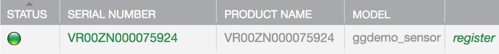
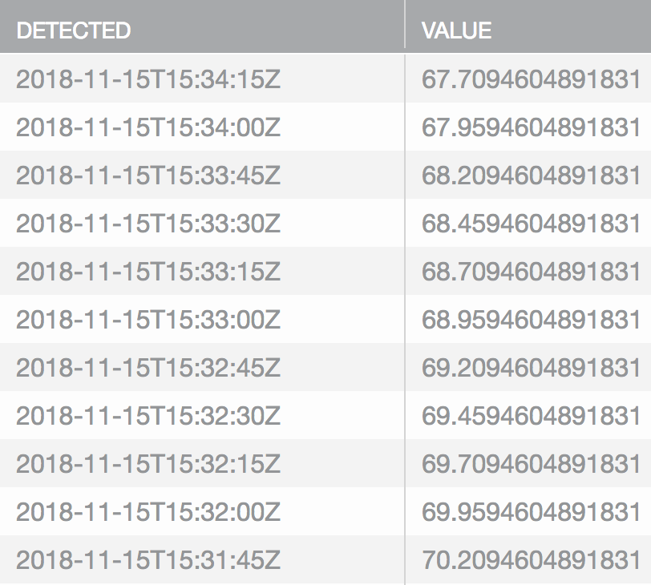
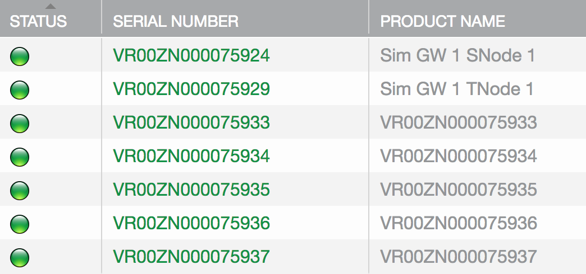
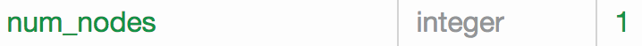
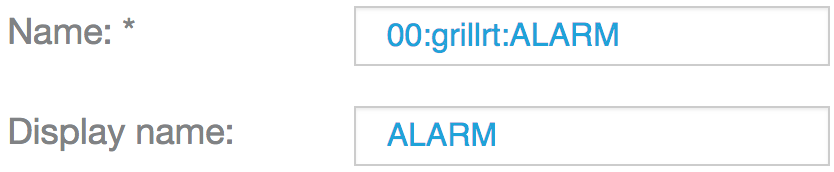
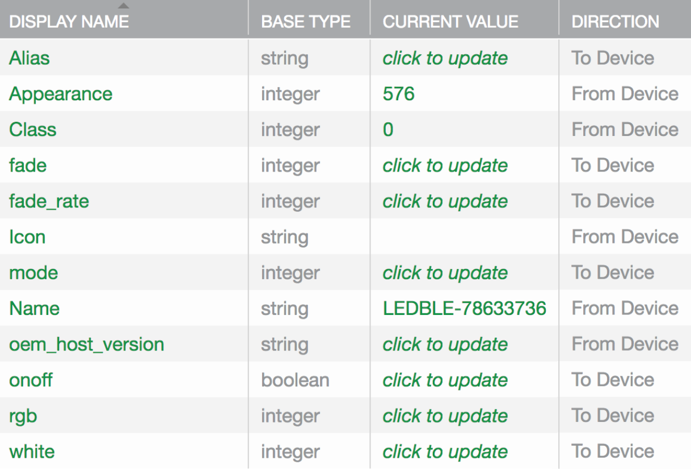
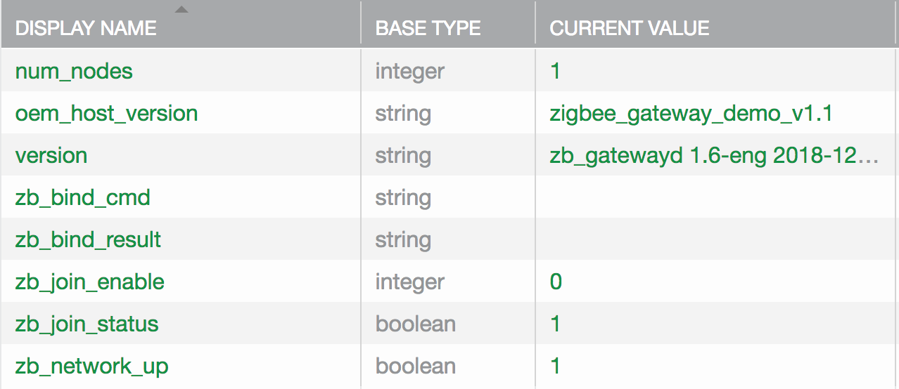

<aside id="pagebar" class="d-xl-block collapse">
  <ul>
    <li><a href="#core-title">Linux Gateway v1.7</a>
      <ul>
        <li><a href="#generic-setup">Generic setup</a>
      </ul>
    </li>
    <li><a href="#simulator-gateway">Simulator Gateway</a>
      <ul>
        <li><a href="#create-simulator-templates">Create templates</a>
        <li><a href="#install-the-ayla-simulator-gateway">Install Ayla gateway</a>
        <li><a href="#add-simulator-nodes">Add nodes</a>
      </ul>
    </li>
    <li><a href="#bluetooth-gateway">Bluetooth Gateway</a>
      <ul>
        <li><a href="#create-bluetooth-templates">Create templates</a>
        <li><a href="#install-the-ayla-bluetooth-gateway">Install Ayla gateway</a>
        <li><a href="#add-grillright-node">Add Grillright node</a>
        <li><a href="#add-magic-blue-node">Add Magic Blue node</a>
      </ul>
    </li>
    <li><a href="#zigbee-gateway">Zigbee Gateway</a>
      <ul>
        <li><a href="#install-zigbee-stack">Install stack</a>
        <li><a href="#create-zigbee-templates">Create templates</a>
        <li><a href="#install-the-ayla-zigbee-gateway">Install Ayla gateway</a>
        <li><a href="#add-zigbee-nodes">Add nodes</a>
      </ul>
    </li>
  </ul>
</aside>

<div class="dropdown mb-3">
  <button class="btn btn-warning btn-sm dropdown-toggle" type="button" id="versions" data-toggle="dropdown" aria-haspopup="true" aria-expanded="false">Choose a version</button>
  <div class="dropdown-menu" aria-labelledby="versions">
    <a class="dropdown-item" href="../v1-7">v1.7</a>
  </div>
</div>

This guide helps you experiment with the Ayla Linux Gateway Solution on a Raspberry Pi:


Note the following:

1. The Ayla Agent is named ```devd``` and the Ayla Example App is named ```appd```, both background processes.
1. The Raspberry Pi, agent, and app form the gateway which is represented by a digital twin in the cloud.
1. The lightbulbs, sensors, and smart plug are nodes with short-distance capability.
1. The nodes are also represented by digital twins in the cloud.

Ayla offers the following example gateways:

||Example Name|Github link|Description|
|-|-|-|-|
|1|[Simulator Gateway](#simulator-gateway)|[gatewayd](https://github.com/AylaNetworks/device_linux_gw_public/tree/master/app/gatewayd)|Resembles the other gateway apps, but requires no hardware.|
|2|[Bluetooth Gateway](#bluetooth-gateway)|[bt_gatewayd](https://github.com/AylaNetworks/device_linux_gw_public/tree/master/app/bt_gatewayd)|Manages Bluetooth devices.|
|3|[Zigbee Gateway](#zigbee-gateway)|[zp_gatewayd](https://github.com/AylaNetworks/device_linux_gw_public/tree/master/app/zb_gatewayd)|Manages Zigbee devices.|

You build and install one of these on your RPi at a time.

## Generic setup

### Set up a Raspberry pi

For help setting up your Raspberry Pi, see <a href="/edge-solutions/ayla-linux-device-solution/v1-7/#set-up-a-raspberry-pi" target="_blank">Set up a Raspberry Pi</a> in Ayla Linux Device Solution.

### Clone the Ayla repository

1. Secure shell to your RPi:
<pre>
$ ssh pi@192.168.1.3
</pre>
1. Ensure that you are in your home directory (e.g. ```/home/pi```).
1. Clone the repository. You will be asked for your Github username and password.
<pre>
$ git clone https&#58;//github.com/AylaNetworks/device_linux_gw_public.git
</pre>
1. View the new ```/home/pi/device_linux_gw_public``` source directory.

### Edit ayla_install.sh

1. Copy ayla_install.sh to your home directory:
<pre>
$ cp ~/device_linux_gw_public/dev_kit/raspberry_pi/ayla_install.sh ~/ 
</pre>
1. Open the file for editing, and find the following line:
<pre>
ayla_src_dir="$temp_dir/ayla/src"
</pre>
1. Change it to the following, and save.
<pre>
ayla_src_dir="/home/pi/device_linux_gw_public"
</pre>
1. Find the following:
<pre>
ayla_package="https&#58;//github.com/AylaNetworks/device_linux_public.git"
</pre>
1. Change it to this:
<pre>
ayla_package="https&#58;//github.com/AylaNetworks/device_linux_gw_public.git"
</pre>
1. Search for "OS is not the raspberrypi", and comment out the line:
<pre>
# error_exit "OS is not the raspberrypi"
</pre>

# Simulator Gateway

The Simulator Gateway simulates sensor and thermostat nodes producing datapoints (e.g. temperature) every 15 seconds:


Note the following:

1. The sensor and thermostat nodes exist only as simulations within the red box.
1. The black shapes in the cloud represent templates which consist of attributes, properties, etc.
1. The blue shapes are digital twins.

## Create Simulator templates

Browse to the [Ayla Developer Portal](/system-administration/ayla-developer-portal/), and create the following templates.

### Simulator Gateway template

<table>
<tr><td>Visibility:</td><td>oem</td></tr>
<tr><td>Name:</td><td>Sim GW</td></tr>
<tr><td>Description:</td><td>gatewayd</td></tr>
<tr><td>Registration:</td><td>Same-LAN</td></tr>
<tr><td>Model:</td><td>ggdemo</td></tr>
<tr><td>Version:</td><td>generic_gateway_demo 2.0</td></tr>
<tr><td>Type:</td><td>Gateway</td></tr>
<tr><td>Gateway Type:</td><td>Generic</td></tr>
</table>

After creating the template, copy & paste the following properties into a text file, and import the file.

<pre>base_type,direction,name,scope
integer,input,add_tstat_nodes,user
integer,input,add_sensor_nodes,user
integer,output,num_nodes,user
string,output,version,user
</pre>

Click the new ```version``` property, check ```Host SW Version```, and click ```OK```.

### Base Node template

<table>
<tr><td>Visibility:</td><td>oem</td></tr>
<tr><td>Name:</td><td>Sim GW BNode</td></tr>
<tr><td>Description:</td><td>Base Node</td></tr>
<tr><td>Registration:</td><td>None</td></tr>
<tr><td>Model:</td><td>ggdemo</td></tr>
<tr><td>Template Key:</td><td>gg_sim</td></tr>
<tr><td>Version:</td><td>*</td></tr>
<tr><td>Type:</td><td>Node</td></tr>
</table>

After creating the template, copy & paste the following properties into a text file, and import the file.

<pre>base_type,direction,name,scope
boolean,input,enable,user
boolean,input,battery_enable,user
integer,output,battery_charge,user
</pre>

### Sensor Node template

<table>
<tr><td>Visibility:</td><td>oem</td></tr>
<tr><td>Name:</td><td>Sim GW SNode</td></tr>
<tr><td>Description:</td><td>Sensor Node</td></tr>
<tr><td>Registration:</td><td>None</td></tr>
<tr><td>Model:</td><td>ggdemo</td></tr>
<tr><td>Template Key:</td><td>gg_sens</td></tr>
<tr><td>Version:</td><td>*</td></tr>
<tr><td>Type:</td><td>Node</td></tr>
</table>

After creating the template, copy & paste the following properties into a text file, and import the file.

<pre>base_type,direction,name,scope
decimal,output,temp,user
decimal,output,humidity,user
decimal,output,light_level,user
</pre>

### Thermostat Node template

<table>
<tr><td>Visibility:</td><td>oem</td></tr>
<tr><td>Name:</td><td>Sim GW TNode</td></tr>
<tr><td>Description:</td><td>Thermostat Node</td></tr>
<tr><td>Registration:</td><td>None</td></tr>
<tr><td>Model:</td><td>ggdemo</td></tr>
<tr><td>Template Key:</td><td>gg_tstat</td></tr>
<tr><td>Version:</td><td>*</td></tr>
<tr><td>Type:</td><td>Node</td></tr>
</table>

After creating the template, copy & paste the following properties into a text file, and import the file.

<pre>base_type,direction,name,scope
integer,input,temp_setpoint,user
boolean,input,vacation_mode,user
decimal,output,local_temp,user
boolean,output,heat_on,user
boolean,output,ac_on,user
</pre>

## Install the Ayla Simulator Gateway

1. Create a dummy ```devd.conf``` file required by ```ayla_install.sh```:
<pre>$ touch devd.conf</pre>
1. View installation options:
<pre>$ ./ayla_install.sh -h</pre>
1. Start the installation. Wireless is the default mode. <span style="color:red;">Wireless requires the -z flag</span>.
<pre>
$ sudo ./ayla_install.sh -z -a gatewayd
</pre>
<ul>
<li>Include <code>-z</code> to install BLE support.</li>
<li>Include <code>-n</code> to specify Ethernet (not Wi-Fi).</li>
<li>Include <code>-u</code> to install over a previous installation.</li>
</ul>
1. When the installation completes, do NOT reboot yet.
1. Complete <a href="/edge-solutions/ayla-linux-device-solution/v1-7/#configure-your-device" target="_blank">Configure your device</a> in Ayla Linux Device Solution.
1. Complete <a href="/edge-solutions/ayla-linux-device-solution/v1-7/#connect-register" target="_blank">Connect & Register</a> in Ayla Linux Device Solution.

## Add Simulator nodes

This section shows you how to add sensor and thermostat nodes to your Simulator Gateway. Note the following:

1. You add/delete nodes by setting the gateway "add_sensor_nodes" and "add_tstat_nodes" (Integer) properties.
1. If you set one of these properties to 3, the Simulator Gateway will add three candidate nodes of that type.
1. If you set one to -3, the gateway will delete three nodes of that type.
1. Candidate nodes appear in the (Devices) Candidates tab. This is where you register them.
1. The registration process associates a node with the appropriate template (that you made).
1. Once registered, a candidate becomes a node, appearing in the (Devices) Nodes tab and on the Devices list.

### Tail the messages log

Because, upon registration, sensor and thermostat nodes begin immediately to generate datapoints every 15 seconds, it makes sense to prepare to monitor node activity before adding nodes. Below are few ways to monitor node activity. To do so, secure shell to your RPi, and tail the messages log:
<pre>
$ tail -f /var/log/messages
</pre>
<div>Here is a sample:</div>
<pre>
Nov 15 10:39:49 rpi appd: [info-app] appd_node_prop_send_handler: batching node property: sensor_sim_01::s1:gg_sens:temp = 55.331
Nov 15 10:39:49 rpi appd: [info-app] appd_node_prop_send_handler: batching node property: sensor_sim_01::s1:gg_sens:humidity = 59.640
Nov 15 10:39:49 rpi appd: [info-app] appd_node_prop_send_handler: batching node property: sensor_sim_01::s1:gg_sens:light_level = 71.107
Nov 15 10:39:49 rpi appd: [info-app] appd_node_ops_confirm_handler: node prop sensor_sim_01::s1:gg_sens:temp sent successfully to dests 01
Nov 15 10:39:49 rpi appd: [info-app] appd_node_ops_confirm_handler: node prop sensor_sim_01::s1:gg_sens:humidity sent successfully to dests 01
Nov 15 10:39:49 rpi appd: [info-app] appd_node_ops_confirm_handler: node prop sensor_sim_01::s1:gg_sens:light_level sent successfully to dests 01
Nov 15 10:40:00 rpi appd: [info-app] appd_node_prop_send_handler: batching node property: thermostat_sim_02::s1:gg_tstat:local_temp = 65.709
Nov 15 10:40:00 rpi appd: [info-app] appd_node_ops_confirm_handler: node prop thermostat_sim_02::s1:gg_tstat:local_temp sent successfully to dests 01
</pre>

Also, in the Ayla Developer Portal, browse to View My Devices &gt; A Sim GW Node &gt; A Property &gt; Datapoints. Once registered, a node will generate data every 15 seconds.

### Add a sensor node

1. Browse to the Ayla Developer Portal.
1. Click View My Devices > Sim GW 1.
1. Click Add Sensor Nodes, change Current Value to 1, and click OK.
1. Pause for a few seconds. Current Value changes from 1 to 0.
1. Click OK. Note that Number of Nodes is set to 1.
1. Click (Devices) Nodes. The list is empty.
1. Click (Devices) Candidates. The list contains one new candidate sensor node:

The serial number begin with "V" indicating that the node is a "virtual" device.
1. Click the Register link.
1. Click (Devices) Nodes to view the new node on the list.

1. Click View My Devices. The node appears on this list, too.

1. Click the new sensor node. The node properties list appears:

<div>The <span style="color:red;">red</span> arrows indicate properties from the Sim GW Node template.</div>
<div>The <span style="color:blue;">blue</span> arrows indicate properties from the Sim GW SNode template.</div>
<div>The <span style="color:#cccc00;">yellow</span> arrow indicates the default oem_host_version property assigned to all devices.</div>
1. Click humidity &gt; Datapoints to view accumulating data.

1. Click Details, and set Product Name to "Sim GW 1 SNode 1".
1. See the periodic updates in <code>/var/log/messages</code>:
<pre>
Nov 15 09:22:03 rpi appd: [info-app] appd_node_prop_send_handler: batching node property: sensor_sim_01::s1:gg_sens:temp = 53.767
Nov 15 09:22:03 rpi appd: [info-app] appd_node_prop_send_handler: batching node property: sensor_sim_01::s1:gg_sens:humidity = 63.059
Nov 15 09:22:03 rpi appd: [info-app] appd_node_prop_send_handler: batching node property: sensor_sim_01::s1:gg_sens:light_level = 56.244
Nov 15 09:22:04 rpi appd: [info-app] appd_node_ops_confirm_handler: node prop sensor_sim_01::s1:gg_sens:temp sent successfully to dests 01
Nov 15 09:22:04 rpi appd: [info-app] appd_node_ops_confirm_handler: node prop sensor_sim_01::s1:gg_sens:humidity sent successfully to dests 01
Nov 15 09:22:04 rpi appd: [info-app] appd_node_ops_confirm_handler: node prop sensor_sim_01::s1:gg_sens:light_level sent successfully to dests 01
</pre>

### Add a thermostat node

1. Add a thermostat node in the same way you added a sensor node. Expect to find these properties.

<div>The <span style="color:red;">red</span> arrows indicate properties from the Sim GW Node template.</div>
<div>The <span style="color:blue;">blue</span> arrows indicate properties from the Sim GW TNode template.</div>
<div>The <span style="color:#cccc00;">yellow</span> arrow indicates the default oem_host_version property assigned to all devices.</div>
1. Set the temp_setpoint property to a value (e.g. 70). Watch for datapoints from local_temp.
1. Set vacation_mode to 1. heat_on changes to 0. Watch local_temp decrease:


### Add multiple nodes

1. In the Ayla Developer Portal, click View My Devices &gt; Sim GW 1.
1. Click the Add Sensor Nodes property.
1. Change the Current Value to 5, and click OK.
1. Click (Devices) Candidates. You may have to refresh because candidate creation takes a few seconds.

1. Click the register link for each candidate. Refresh the page (and click Candidates tab) between each registration.
1. Click (Devices) Nodes. See the new nodes. 


### Inspect startup files

For startup purposes, the gateway keeps track of nodes in two startup files: <code>devd.conf.startup</code> and <code>appd.conf.startup</code>. Both are located in <code>&sim;/ayla/config</code>. A node is composed of one or more subdevices identified by a key (e.g. s1). One or more templates contribute properties to a subdevice. See the diagram.


The <node>device ~ node ~ subdevice ~ template ~ property</node> hierarchy explains property names. Consider <code>s1:gg_sim:battery_charge</code>:

* <code>s1</code> is the subdomain name.
* <code>gg_sim</code> is the template key name.
* <code>battery_charge</code> is the property name as defined in the application.

To inspect the origin of <code>gg_sim</code>, <code>gg_sens</code>, and <code>gg_tstat</code> property names, browse to [node_sim.c](https://github.com/AylaNetworks/device_linux_gw_public/blob/master/app/gatewayd/node_sim.c), and search for the <code>sim_template_sim</code>, <code>sim_template_sensor</code>, and <code>sim_template_tstat</code> arrays:

<pre>
static const struct sim_node_prop_def const sim_template_sim[] = {
  {{"enable", PROP_BOOLEAN, PROP_TO_DEVICE}, sim_node_prop_init_enable},
  {{"battery_enable", PROP_BOOLEAN, PROP_TO_DEVICE}, NULL, sim_node_prop_battery_enable_set},
  {{"battery_charge", PROP_INTEGER, PROP_FROM_DEVICE}, sim_node_prop_init_battery_charge }
};

static const struct sim_node_prop_def const sim_template_tstat[] = {
  {{"temp_setpoint",  PROP_INTEGER, PROP_TO_DEVICE}, sim_node_prop_init_temp_setpoint, sim_node_prop_update_tstat},
  {{"vacation_mode",  PROP_BOOLEAN, PROP_TO_DEVICE}, NULL, sim_node_prop_update_tstat},
  {{"local_temp", PROP_DECIMAL, PROP_FROM_DEVICE}, sim_node_prop_init_local_temp},
  {{"heat_on",  PROP_BOOLEAN, PROP_FROM_DEVICE}},
  {{"ac_on",  PROP_BOOLEAN, PROP_FROM_DEVICE}}
};

static const struct sim_node_prop_def const sim_template_sensor[] = {
  {{"temp", PROP_DECIMAL, PROP_FROM_DEVICE}},
  {{"humidity", PROP_DECIMAL, PROP_FROM_DEVICE}},
  {{"light_level", PROP_DECIMAL, PROP_FROM_DEVICE}},
};
</pre>

# Bluetooth Gateway

The Bluetooth Gateway connects BLE devices to the Ayla Cloud:


Note the following:

1. The black shapes in the cloud represent templates which consist of attributes, properties, etc.
1. The blue shapes are digital twins.
1. bt_gatewayd supports the following devices out-of-the-box:
  1. [MovingTech 4.5W LED Bluetooth Bulb](https://www.amazon.com/gp/product/B01A5JX7BO)
  1. [Oregon Scientific AW133 Grill Right Bluetooth BBQ Thermometer](https://www.amazon.com/Oregon-Scientific-AW133-Bluetooth-%20Thermometer/dp/B00JFSW0AQ)
  1. [Nordic Semiconductor Multiprotocol Bluetooth LE Proprietary System-on-Chip](https://www.digikey.com/product-detail/en/nordic-semiconductor-asa/NRF52-%20DK/1490-1053-ND/5773879)

## Create Bluetooth templates

Browse to the [Ayla Developer Portal](/system-administration/ayla-developer-portal/), and create the following templates.

### Bluetooth Gateway template

<table>
<tr><td>Visibility:</td><td>oem</td></tr>
<tr><td>Name:</td><td>BT GW</td></tr>
<tr><td>Description:</td><td>bt_gatewayd</td></tr>
<tr><td>Registration:</td><td>Same-LAN</td></tr>
<tr><td>Model:</td><td>linuxevb</td></tr>
<tr><td>Version:</td><td>bluetooth_gateway_demo_v1.2</td></tr>
<tr><td>Type:</td><td>Gateway</td></tr>
<tr><td>Gateway Type:</td><td>Generic</td></tr>
</table>

After creating the template, copy & paste the following properties into a text file, and import the file.

<pre>base_type,direction,name,scope
integer,input,bt_scan_enable,user
boolean,output,bt_scan_status,user
string,input,bt_connect_id,user
string,output,bt_connect_result,user
string,input,bt_disconnect_id,user
string,output,bt_disconnect_result,user
integer,input,bt_connect_passkey,user
string,output,bt_connect_passkey_display,user
string,output,bt_scan_results,user
integer,output,num_nodes,user
string,output,version,user
</pre>

Click the new ```version``` property, check ```Host SW Version```, and click ```OK```.

### Generic Node template

<table>
<tr><td>Visibility:</td><td>oem</td></tr>
<tr><td>Name:</td><td>BT GW Generic</td></tr>
<tr><td>Description:</td><td>Generic Node</td></tr>
<tr><td>Registration:</td><td>None</td></tr>
<tr><td>Model:</td><td>linuxevb</td></tr>
<tr><td>Template Key:</td><td>generic</td></tr>
<tr><td>Version:</td><td>*</td></tr>
<tr><td>Type:</td><td>Node</td></tr>
</table>

After creating the template, copy & paste the following properties into a text file, and import the file.

<pre>base_type,direction,name,scope
string,output,Name,user
string,output,Icon,user
integer,output,Class,user
integer,output,Appearance,user
string,input,Alias,user
</pre>

### Info Node template

<table>
<tr><td>Visibility:</td><td>oem</td></tr>
<tr><td>Name:</td><td>BT GW Info</td></tr>
<tr><td>Description:</td><td>Info Node</td></tr>
<tr><td>Registration:</td><td>None</td></tr>
<tr><td>Model:</td><td>linuxevb</td></tr>
<tr><td>Template Key:</td><td>info</td></tr>
<tr><td>Version:</td><td>*</td></tr>
<tr><td>Type:</td><td>Node</td></tr>
</table>

After creating the template, copy & paste the following properties into a text file, and import the file.

<pre>base_type,direction,name,scope
string,output,mfg_name,user
string,output,model_num,user
string,output,serial_num,user
string,output,hw_revision,user
string,output,fw_revision,user
string,output,sw_revision,user
string,output,system_id,user
</pre>

### Grillright Node template

<table>
<tr><td>Visibility:</td><td>oem</td></tr>
<tr><td>Name:</td><td>BT GW Grillright</td></tr>
<tr><td>Description:</td><td>Grillright Node</td></tr>
<tr><td>Registration:</td><td>None</td></tr>
<tr><td>Model:</td><td>linuxevb</td></tr>
<tr><td>Template Key:</td><td>grillrt</td></tr>
<tr><td>Version:</td><td>1.2</td></tr>
<tr><td>Type:</td><td>Node</td></tr>
</table>

After creating the template, copy & paste the following properties into a text file, and import the file.

<pre>base_type,direction,name,scope
integer,output,ALARM,user
string,input,COMMAND,user
integer,output,CONTROL_MODE,user
boolean,output,COOKING,user
string,output,TIME,user
integer,output,DONENESS,user
integer,output,MEAT,user
integer,output,PCT_DONE,user
integer,output,TARGET_TEMP,user
string,output,TARGET_TIME,user
decimal,output,TEMP,user
</pre>

### Bulb RGB Node template

<table>
<tr><td>Visibility:</td><td>oem</td></tr>
<tr><td>Name:</td><td>BT GW Magic Blue</td></tr>
<tr><td>Description:</td><td>Magic Blue Node</td></tr>
<tr><td>Registration:</td><td>None</td></tr>
<tr><td>Model:</td><td>linuxevb</td></tr>
<tr><td>Template Key:</td><td>bulb_rgb</td></tr>
<tr><td>Version:</td><td>1.5</td></tr>
<tr><td>Type:</td><td>Node</td></tr>
</table>

After creating the template, copy & paste the following properties into a text file, and import the file.

<pre>base_type,direction,name,scope
integer,input,mode,user
boolean,input,onoff,user
integer,input,rgb,user
integer,input,white,user
integer,input,fade,user
integer,input,fade_rate,user
</pre>

## Install the Ayla Bluetooth Gateway

1. Create a dummy ```devd.conf``` file required by ```ayla_install.sh```:
<pre>$ touch devd.conf</pre>
1. View installation options:
<pre>$ ./ayla_install.sh -h</pre>
1. Start the installation. Wireless is the default mode.
<pre>
$ sudo ./ayla_install.sh -z -a bt_gatewayd
</pre>
<ul>
<li>Include <code>-z</code> to install BLE support.</li>
<li>Include <code>-n</code> to specify Ethernet (not Wi-Fi).</li>
<li>Include <code>-u</code> to install over a previous installation.</li>
</ul>
1. When the installation completes, do NOT reboot yet.
1. Complete <a href="/edge-solutions/ayla-linux-device-solution/v1-7/#configure-your-device" target="_blank">Configure your device</a> in Ayla Linux Device Solution.
1. Complete <a href="/edge-solutions/ayla-linux-device-solution/v1-7/#connect-register" target="_blank">Connect & Register</a> in Ayla Linux Device Solution.

## Add Grillright node

### Reset the Grillright

1. Remove the batteries.
1. Wait a minute. 
1. Reinstall the batteries. 
1. Use a paperclip to reset the device.

### Test RPi-to-device communication

1. In your RPi Secure Shell, run the following:
<pre>
$ sudo bluetoothctl
# help
Menu main:
Available commands:
advertise                                         Advertise Options Submenu
scan                                              Scan Options Submenu
gatt                                              Generic Attribute Submenu
list                                              List available controllers
show [ctrl]                                       Controller information
select &lt;ctrl&gt;                                     Select default controller
devices                                           List available devices
paired-devices                                    List paired devices
system-alias &lt;name&gt;                               Set controller alias
reset-alias                                       Reset controller alias
power &lt;on/off&gt;                                    Set controller power
pairable &lt;on/off&gt;                                 Set controller pairable mode
discoverable &lt;on/off&gt;                             Set controller discoverable mode
agent &lt;on/off/capability&gt;                         Enable/disable agent with given capability
default-agent                                     Set agent as the default one
advertise &lt;on/off/type&gt;                           Enable/disable advertising with given type
set-alias &lt;alias&gt;                                 Set device alias
scan &lt;on/off&gt;                                     Scan for devices
info [dev]                                        Device information
pair [dev]                                        Pair with device
trust [dev]                                       Trust device
untrust [dev]                                     Untrust device
block [dev]                                       Block device
unblock [dev]                                     Unblock device
remove &lt;dev&gt;                                      Remove device
connect &lt;dev&gt;                                     Connect device
disconnect [dev]                                  Disconnect device
menu &lt;name&gt;                                       Select submenu
version                                           Display version
quit                                              Quit program
exit                                              Quit program
help                                              Display help about this program
</pre>
1. Scan for nearby Bluetooth devices, and verify that the MAC address of your Grillright device is returned.
<pre>
&#x23; agent on
&#x23; default-agent
&#x23; scan on
Discovery started
[CHG] Controller B8:27:EB:80:7B:CC Discovering: yes
[CHG] Device E6:E5:C0:FA:A0:ED RSSI: -49
&#x23; scan off
</pre>
<p>In this case, <code>E6:E5:C0:FA:A0:ED</code> is a Grillright Mac address.</p>
1. Exit the utility.

### Add the node

1. In your RPi Secure Shell, prepare to monitor your progress by tailing the syslog file:
<pre>
$ sudo tail -f /var/log/syslog
</pre>
1. In the Ayla Developer Portal, click View My Devices. A list of devices appears.1. Click the Serial Number of your gateway. A list of properties appears.

1. Click the Current Value column of the bt_scan_enable property.1. Set New Value to 1, click OK:

<p>The bt_scan_results property value should return the MAC addresses of bluetooth devices near your Raspberry Pi. One of these MAC addresses represents your Grillright. Sometimes, the results display. Often then don't.</p>

<p>If the results do display, they disappear quickly as the bt_scan_results property value updates to an empty array:</p>

1. Identify the MAC address of your Grillright. There are two quick ways to do this: (1) Search for "bd_addr" in syslog, or (2) use the Ayla Dashboard Portal to view the Datapoints for the bt_scan_results property.1. In the Ayla Developer Portal, , click the Current Value column of the bt_connect_id property.1. Set New Value to the discovered MAC address, and click OK.

1. Verify that the num_nodes property value is 1:

1. Click the Candidates tab, verify that the Grillright candidate exists, and click Register:

1. Click the Nodes tab to see the new node on the list.

1. Click the Serial Number to display the Grillright node properties:

<p>Many of the properties appear to be duplicates (e.g. ALARM, CONTROL_MODE). This is not the case. The Grillright has two sensors, and each sensor requires its own set of properties. The property names on the list are Display Names. The actual Name of each property (e.g. <code>00:grillrt:ALARM</code>) is unique.</p>
1. Click one of the ALARM properties to see the actual name:

1. Change the Display Name, and save:

1. Rename the other properties as needed.

### Test node properties

1. In the Ayla Developer Portal, click View My Devices. A list of devices appears.1. Click the DSN of the Grillright node.1. Click the <code>Sensor 1: Temp</code> property, and click Datapoints.1. Connect the probe to the Grillright

1. Put the probe into cold/hot water, and observe the new datapoints.

1. Click the <code>Sensor 1: Control Mode</code> property, and click Datapoints.1. On the Grillright device, touch <code>Set</code>, and then touch <code>+</code> several times to rotate through the control modes.1. Observe the new datapoints.1. Click the <code>Sensor 1: Alarm</code> property, and click Datapoints.1. On the Grillright device, touch <code>Set</code>.1. Touch <code>+</code> until the control mode is <code>Timer</code>.1. Set the timer for a short duration, and start the timer.1. When the timer beeps, observe the new datapoints.

### Startup files

For startup purposes, the gateway keeps track of nodes in two startup files: <code>devd.conf.startup</code> and <code>appd.conf.startup</code>. Both are located in <code>&sim;/ayla/config</code>. A node is composed of one or more subdevices identified by a key (e.g. 00). One or more templates contribute properties to a subdevice. See the diagram.


The <node>device ~ node ~ subdevice ~ template ~ property</node> hierarchy explains property names. Consider <code>00:grillrt:ALARM</code>:

* <code>00</code> is the subdomain name.
* <code>grillrt</code> is the template key name.
* <code>ALARM</code> is the property name as defined in the application.

To inspect the origin of <code>grillrt</code> property names, browse to [bt_gatt.c](https://github.com/AylaNetworks/device_linux_gw_public/blob/master/app/bt_gatewayd/bt_gatt.c), and search for the <code>bt_gatt_init_grillright</code> function:

<pre>
static int bt_gatt_init_grillright(void)
{
  int rc = 0;

  struct bt_gatt_prop_table_entry sensor_props[] = {
    { "ALARM", PROP_INTEGER, PROP_FROM_DEVICE, NULL, bt_gatt_val_send_grillright_alarm },
    { "CONTROL_MODE", PROP_INTEGER, PROP_FROM_DEVICE, NULL, bt_gatt_val_send_grillright_control_mode },
    { "COOKING", PROP_BOOLEAN, PROP_FROM_DEVICE, NULL, bt_gatt_val_send_grillright_cooking },
    { "TIME", PROP_STRING, PROP_FROM_DEVICE, NULL, bt_gatt_val_send_grillright_time },
    { "DONENESS", PROP_INTEGER, PROP_FROM_DEVICE, NULL, bt_gatt_val_send_grillright_doneness },
    { "MEAT", PROP_INTEGER, PROP_FROM_DEVICE, NULL, bt_gatt_val_send_grillright_meat },
    { "PCT_DONE", PROP_INTEGER, PROP_FROM_DEVICE, NULL, bt_gatt_val_send_grillright_pct_done },
    { "TARGET_TEMP", PROP_INTEGER, PROP_FROM_DEVICE, NULL, bt_gatt_val_send_grillright_target_temp },
    { "TARGET_TIME", PROP_STRING, PROP_FROM_DEVICE, NULL, bt_gatt_val_send_grillright_target_time },
    { "TEMP", PROP_DECIMAL, PROP_FROM_DEVICE, NULL, bt_gatt_val_send_grillright_temp }
  };

  rc |= bt_gatt_db_add_template("2899fe00-c277-48a8-91cb-b29ab0f01ac4", "grillrt", "1.2");

  rc |= bt_gatt_db_add_prop("28998e03-c277-48a8-91cb-b29ab0f01ac4", "ctl", "COMMAND", PROP_STRING, PROP_TO_DEVICE, NULL, NULL);
  rc |= bt_gatt_add_prop_table("28998e10-c277-48a8-91cb-b29ab0f01ac4", "00", sensor_props, ARRAY_LEN(sensor_props));
  rc |= bt_gatt_add_prop_table("28998e11-c277-48a8-91cb-b29ab0f01ac4", "01", sensor_props, ARRAY_LEN(sensor_props));
  return rc;
}
</pre>

## Add Magic Blue node

### Turn on the bulb

Verify that the bulb is screwed into a lamp socket, and that the lamp is turned on.

### Test RPi-to-device communication

1. In your RPi Secure Shell, run the following:
<pre>
$ sudo bluetoothctl
# help
Menu main:
Available commands:
advertise                                         Advertise Options Submenu
scan                                              Scan Options Submenu
gatt                                              Generic Attribute Submenu
list                                              List available controllers
show [ctrl]                                       Controller information
select &lt;ctrl&gt;                                     Select default controller
devices                                           List available devices
paired-devices                                    List paired devices
system-alias &lt;name&gt;                               Set controller alias
reset-alias                                       Reset controller alias
power &lt;on/off&gt;                                    Set controller power
pairable &lt;on/off&gt;                                 Set controller pairable mode
discoverable &lt;on/off&gt;                             Set controller discoverable mode
agent &lt;on/off/capability&gt;                         Enable/disable agent with given capability
default-agent                                     Set agent as the default one
advertise &lt;on/off/type&gt;                           Enable/disable advertising with given type
set-alias &lt;alias&gt;                                 Set device alias
scan &lt;on/off&gt;                                     Scan for devices
info [dev]                                        Device information
pair [dev]                                        Pair with device
trust [dev]                                       Trust device
untrust [dev]                                     Untrust device
block [dev]                                       Block device
unblock [dev]                                     Unblock device
remove &lt;dev&gt;                                      Remove device
connect &lt;dev&gt;                                     Connect device
disconnect [dev]                                  Disconnect device
menu &lt;name&gt;                                       Select submenu
version                                           Display version
quit                                              Quit program
exit                                              Quit program
help                                              Display help about this program
</pre>
1. Scan for nearby Bluetooth devices, and verify that the MAC address of your Magic Blue device is returned.
<pre>
&#x23; agent on
&#x23; default-agent
&#x23; scan on
Discovery started
[CHG] Controller B8:27:EB:80:7B:CC Discovering: yes
[NEW] Device F8:1D:78:63:37:36 LEDBLE-78633736
[CHG] Device E6:E5:C0:FA:A0:ED RSSI: -42
&#35; scan off
</pre>
<div>In this case, <code>F8:1D:78:63:37:36</code> is a Magic Blue Mac address.</div>
1. Exit the utility.

### Add the node

1. In your RPi Secure Shell, prepare to monitor your progress by tailing the syslog file:
<pre>
$ sudo tail -f /var/log/syslog
</pre>
1. In the Ayla Developer Portal, click View My Devices. A list of devices appears.1. Click the Serial Number of your gateway. A list of properties appears.

1. Click the Current Value column of the bt_scan_enable property.1. Set New Value to 1, click OK:

<div>The bt_scan_results property value should return the MAC addresses of bluetooth devices near your Raspberry Pi. One of these MAC addresses represents your Magic Blue bulb. Sometimes, the results display. Often then don't.</div>

<div>If the results do display, they disappear quickly as the bt_scan_results property value updates to an empty array:</div>

1. Identify the MAC address of your Magic Blue bulb. There are two quick ways to do this: (1) Search for "bd_addr" in syslog, or (2) use the Ayla Dashboard Portal to view the Datapoints for the bt_scan_results property.1. In the Ayla Developer Portal, , click the Current Value column of the bt_connect_id property.1. Set New Value to the discovered MAC address, and click OK.

1. Verify that the num_nodes property value is 1:

1. Click the Candidates tab, verify that the Magic Blue candidate exists, and click Register:

1. Click the Nodes tab to see the new node on the list.

1. Click the Serial Number to display the Magic Blue node properties:


Note that although the digital twin Display Names are the same as the Display Names specified in the templates, the actual property names have been modified to specify the subdevice and template (e.g. <code>00:bulb_rgb:onoff</code>).

### Test node properties

1. In the Ayla Developer Portal, click View My Devices. A list of devices appears.
1. Click the DSN of the Magic Blue node.1. Click the <code>onoff</code> property, change the value to 1, and click OK. The bulb should go on.
1. Click the <code>mode</code> property, change the value to 3, and click OK. For definitions, see <code>bt_gatt_bulb_mode</code> in [bt_gatt.c](https://github.com/AylaNetworks/device_linux_gw_public/blob/master/app/bt_gatewayd/bt_gatt.c).
1. Click the <code>fade</code> property, change the value to 3, and click OK. For definitions, see <code>bt_gatt_bulb_fade</code> in [bt_gatt.c](https://github.com/AylaNetworks/device_linux_gw_public/blob/master/app/bt_gatewayd/bt_gatt.c).
1. Click the <code>fade_rate</code> property, change the value to 80, and click OK. For ranges, see <code>Magic blue bulb value range</code> in [bt_gatt.c](https://github.com/AylaNetworks/device_linux_gw_public/blob/master/app/bt_gatewayd/bt_gatt.c).

### Startup files

For startup purposes, the gateway keeps track of nodes in two startup files: <code>devd.conf.startup</code> and <code>appd.conf.startup</code>. Both are located in <code>&sim;/ayla/config</code>. A node is composed of one or more subdevices identified by a key (e.g. 00). One or more templates contribute properties to a subdevice. See the diagram.


The <node>device ~ node ~ subdevice ~ template ~ property</node> hierarchy explains property names. Consider <code>00:bulb_rgb:onoff</code>:

* <code>00</code> is the subdomain name.
* <code>bulb_rgb</code> is the template key name.
* <code>onoff</code> is the property name as defined in the application.

To inspect the origin of <code>bulb_rgb</code> property names, browse to [bt_gatt.c](https://github.com/AylaNetworks/device_linux_gw_public/blob/master/app/bt_gatewayd/bt_gatt.c), and search for the <code>bt_gatt_init_bulb_rgb</code> function:

<pre>
static int bt_gatt_init_bulb_rgb(void)
{
  int rc = 0;
  const char *subdevice = NULL;

  rc |= bt_gatt_db_add_template("ffe5", BT_GATT_BULB_TEMPLATE, "1.5");
  rc |= bt_gatt_db_add_prop("ffe9", subdevice, "mode", PROP_INTEGER, PROP_TO_DEVICE, bt_gatt_val_set_bulb_mode, NULL);
  rc |= bt_gatt_db_add_prop("ffe9", subdevice, "onoff", PROP_BOOLEAN, PROP_TO_DEVICE, bt_gatt_val_set_bulb_onoff, NULL);
  rc |= bt_gatt_db_add_prop("ffe9", subdevice, "rgb", PROP_INTEGER, PROP_TO_DEVICE, bt_gatt_val_set_bulb_rgb, NULL);
  rc |= bt_gatt_db_add_prop("ffe9", subdevice, "white", PROP_INTEGER, PROP_TO_DEVICE, bt_gatt_val_set_bulb_white, NULL);
  rc |= bt_gatt_db_add_prop("ffe9", subdevice, "fade", PROP_INTEGER, PROP_TO_DEVICE, bt_gatt_val_set_bulb_fade, NULL);
  rc |= bt_gatt_db_add_prop("ffe9", subdevice, "fade_rate", PROP_INTEGER, PROP_TO_DEVICE, bt_gatt_val_set_bulb_fade_rate, NULL);
  return rc;
}
</pre>

# Zigbee Gateway

The Zigbee Gateway connects Zigbee devices to the Ayla Cloud:


Note the following:

1. The black shapes in the cloud represent templates which consist of attributes, properties, etc.
1. The blue shapes are digital twins.
1. zb_gatewayd supports the following devices out-of-the-box:
  1. [GE Link Smart LED Light Bulb](https://www.amazon.com/gp/product/B00NOL16K0/ref=ox_sc_act_title_1?smid%20=ALZ3B3LU3WJHD&psc=1)
  1. [Samsung SmartThings Outlet](https://www.amazon.com/Samsung-SmartThings-Outlet-Works-%20Amazon/dp/B00MI5V5N6/ref=lp_14425685011_1_7?srs=14425685011&ie=UT%20F8&qid=1523423896&sr=8-7)
  1. [Samsung SmartThings Multipurpose Sensor](https://www.amazon.com/Samsung-SmartThings-F-MLT-US-2-Multipurpose-%20Sensor/dp/B0118RQW3W/ref=lp_14425685011_1_3?srs=14425685011&ie=UT%20F8&qid=1523423896&sr=8-3)
  1. [Samsung SmartThings Motion Sensor](https://www.amazon.com/Samsung-SmartThings-F-IRM-US-2-Motion-%20Sensor/dp/B01IE35PCC/ref=lp_14425685011_1_6?srs=14425685011&ie=UTF8%20&qid=1523423896&sr=8-6)
  1. [Centralite 3-Series Pearl Touch Thermostat](https://www.amazon.com/gp/product/B01G99KR94/ref=ox_sc_act_title_2?ie=UTF8&p%20sc=1&smid=A17T4L29EADQN5)

## Install Zigbee stack

While Raspberry Pi 3 supports Bluetooth natively, it does not support Zigbee out of the box. Adding support to an RPi for a Zigbee network means adding a USB stick and a software stack. Here is one approach:

<ol>
<li>Buy a [Cel MeshConnect EM358 USB Stick](https://www.digikey.com/en/product-highlight/c/cel/cortet-radio-em3588-usb-sticks), and install it in a USB recepticle on your RPi.1. Download [Simplicity Studio IDE v4](https://www.silabs.com/products/development-tools/software/simplicity-studio) onto your computer, and use it to register and download [EmberZNet Protocol Stack](https://www.silabs.com/products/development-tools/software/emberznet-pro-zigbee-protocol-stack-software). Export the Zigbee stack:
<pre >
app
  esf_common
hardware
  kit
  reference_design
platform
  CMSIS
  Device
  base
  emdrv
  emlib
  middleware
  radio
protocol
  zigbee_5.7
    app
    build
    documentation
    esf.properties
    ncp-images
    stack
    stack.properties
    tool
unins000.dat
unins000.exe
</pre>
</li>
<li>Copy the stack to <code>/home/pi/EmberZNet/v5.7.4.0</code> on your RPi:
<pre >
$ ls -1 ~/EmberZNet/v5.7.4.0/
app
hardware
platform
protocol
</pre>
</li>
</ol>

## Create Zigbee templates

Browse to the [Ayla Developer Portal](/system-administration/ayla-developer-portal/), and create the following templates.

### Zigbee Gateway template

<table>
<tr><td>Visibility:</td><td>oem</td></tr>
<tr><td>Name:</td><td>ZB GW</td></tr>
<tr><td>Description:</td><td>zb_gatewayd</td></tr>
<tr><td>Registration:</td><td>Same-LAN</td></tr>
<tr><td>Model:</td><td>linuxevb</td></tr>
<tr><td>Version:</td><td>zigbee_gateway_demo_v1.1</td></tr>
<tr><td>Type:</td><td>Gateway</td></tr>
<tr><td>Gateway Type:</td><td style="color:red;">Generic</td></tr>
</table>

After creating the template, copy & paste the following properties into a text file, and import the file.

<pre>base_type,direction,name,scope
integer,output,num_nodes,user
integer,input,zb_join_enable,user
boolean,output,zb_join_status,user
boolean,output,zb_network_up,user
string,input,zb_bind_cmd,user
string,output,zb_bind_result,user
string,output,version,user
</pre>

Click the new ```version``` property, check ```Host SW Version```, and click ```OK```.

### Sensor Node template

<table>
<tr><td>Visibility:</td><td>oem</td></tr>
<tr><td>Name:</td><td>ZB GW Sensor</td></tr>
<tr><td>Description:</td><td>Sensor Node</td></tr>
<tr><td>Registration:</td><td>None</td></tr>
<tr><td>Model:</td><td>linuxevb</td></tr>
<tr><td>Template Key:</td><td>iaszone</td></tr>
<tr><td>Version:</td><td>1.0</td></tr>
<tr><td>Type:</td><td>Node</td></tr>
</table>

After creating the template, copy & paste the following properties into a text file, and import the file.

<pre>base_type,direction,name,scope
string,output,alias,user
string,output,long_address,user
string,output,model_id,user
integer,output,power_level,user
string,output,power_source,user
string,output,short_address,user
boolean,output,status,user
</pre>

### Light Node template

<table>
<tr><td>Visibility:</td><td>oem</td></tr>
<tr><td>Name:</td><td>ZB GW Light</td></tr>
<tr><td>Description:</td><td>Light Node</td></tr>
<tr><td>Registration:</td><td>None</td></tr>
<tr><td>Model:</td><td>linuxevb</td></tr>
<tr><td>Template Key:</td><td>light</td></tr>
<tr><td>Version:</td><td>1.0</td></tr>
<tr><td>Type:</td><td>Node</td></tr>
</table>

After creating the template, copy & paste the following properties into a text file, and import the file.

<pre>base_type,direction,name,scope
string,output,alias,user
string,output,long_address,user
string,output,model_id,user
boolean,input,onoff,user
integer,output,power_level,user
string,output,power_source,user
string,output,short_address,user
</pre>

### Dimm Node template

<table>
<tr><td>Visibility:</td><td>oem</td></tr>
<tr><td>Name:</td><td>ZB GW Dimm Light</td></tr>
<tr><td>Description:</td><td>Dimm Light Node</td></tr>
<tr><td>Registration:</td><td>None</td></tr>
<tr><td>Model:</td><td>linuxevb</td></tr>
<tr><td>Template Key:</td><td>dimm</td></tr>
<tr><td>Version:</td><td>1.0</td></tr>
<tr><td>Type:</td><td>Node</td></tr>
</table>

After creating the template, copy & paste the following properties into a text file, and import the file.

<pre>base_type,direction,name,scope
string,output,alias,user
integer,input,level_control,user
string,output,long_address,user
string,output,model_id,user
boolean,input,onoff,user
integer,output,power_level,user
string,output,power_source,user
string,output,short_address,user
</pre>

### Plug Node template

<table>
<tr><td>Visibility:</td><td>oem</td></tr>
<tr><td>Name:</td><td>ZB GW Plug</td></tr>
<tr><td>Description:</td><td>Plug Node</td></tr>
<tr><td>Registration:</td><td>None</td></tr>
<tr><td>Model:</td><td>linuxevb</td></tr>
<tr><td>Template Key:</td><td>plug</td></tr>
<tr><td>Version:</td><td>1.0</td></tr>
<tr><td>Type:</td><td>Node</td></tr>
</table>

After creating the template, copy & paste the following properties into a text file, and import the file.

<pre>base_type,direction,name,scope
string,output,alias,user
string,output,long_address,user
string,output,model_id,user
boolean,input,onoff,user
integer,output,power_level,user
string,output,power_source,user
string,output,short_address,user
</pre>

## Install the Ayla Zigbee Gateway

1. Create a dummy ```devd.conf``` file required by ```ayla_install.sh```:
<pre>$ touch devd.conf</pre>
1. View installation options:
<pre>$ ./ayla_install.sh -h</pre>
1. Start the installation. Wireless is the default mode. <span style="color:red;">Wireless requires the -z flag</span>.
<pre>
$ sudo ./ayla_install.sh -z -e -a zb_gatewayd
</pre>
<ul>
<li>Include <code>-z</code> to install BLE support.</li>
<li>Include <code>-e</code> to install ZB support.</li>
<li>Include <code>-n</code> to specify Ethernet (not Wi-Fi).</li>
<li>Include <code>-u</code> to install over a previous installation.</li>
</ul>
1. When the installation completes, do NOT reboot yet.
1. Complete <a href="/edge-solutions/ayla-linux-device-solution/v1-7/#configure-your-device" target="_blank">Configure your device</a> in Ayla Linux Device Solution.
1. Complete <a href="/edge-solutions/ayla-linux-device-solution/v1-7/#connect-register" target="_blank">Connect & Register</a> in Ayla Linux Device Solution.

## Add Zigbee nodes

This section shows you how to add your devices as nodes to your Zigbee gateway. You will need to know how to put your devices into pairing mode. Below are some examples. Don't actually put your devices into pairing mode yet. 

1. For SmartThings Motion Sensors and Multipurpose Sensors, remove the cap, and hold down the small white button for about 5 seconds until the LED next to it blinks.
1. For SmartThings SmartPower Outlet, hold down the connect button on the top of the unit for about 5 seconds until the led blinks.
1. For GE Link Connected LED bulbs, if it is new, simply install it in a socket, and turn it on. If it has already paired with another device, [follow these directions](https://support.smartthings.com/hc/en-us/articles/204833550-GE-Link-LED-Bulb) to reset it.

To add your devices to your Zigbee gateway, follow these directions:

1. Browse to the Ayla Developer Portal.
1. Click View My Devices.
1. Click the serial number of your gateway.
1. Click the Current Value column of the <code>zb_join_enable</code> property.

1. Enter an integer representing the number of seconds the gateway will remain in pairing mode, and click OK. Common choices are 60, 90, and 120.
1. Put your Zigbee device into pairing mode.
1. Note that the <code>num_nodes</code> property value increments:

1. Click the Candidates tab to verify that your device appears as a candidate:

1. Click <code>Register</code>.
1. Click the Nodes tab to verify that your device appears as a node:

1. Click the serial number of your new node to inspect properties and details:

1. Interact with the device to cause property value changes. For example, create motion near a motion detector, and note that the <code>status</code> property value changes to <code>1</code>:
