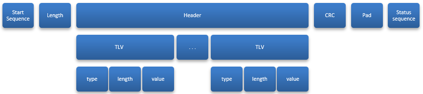
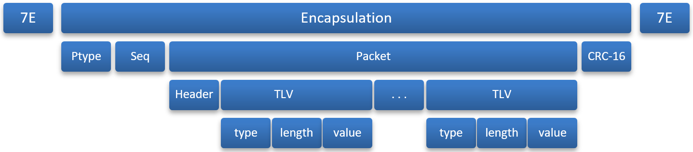
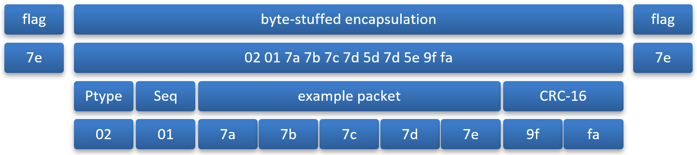
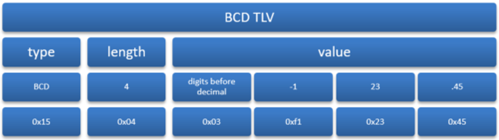

<aside id="pagebar" class="d-xl-block collapse">
  <ul>
    <li><a href="#core-title">Module / MCU Interface</a>
      <ul>
        <li><a href="#properties-and-datapoints">Properties and Datapoints</a></li>
        <li><a href="#protocols">Protocols</a></li>
      </ul>
    </li>
    <li><a href="#spi-protocol">SPI Protocol</a>
      <ul>
        <li><a href="#single-byte-commands">Single-Byte Commands</a></li>
        <li><a href="#packet-transfers">Packet Transfers</a></li>
        <li><a href="#error-cases-recovery">Error Cases/Recovery</a></li>
      </ul>
    </li>
    <li><a href="#uart-protocol">UART Protocol</a>
      <ul>
        <li><a href="#framing">Framing</a></li>
        <li><a href="#encapsulation">Encapsulation</a></li>
        <li><a href="#packet-types">Packet Types</a></li>
        <li><a href="#error-handling">Error Handling</a></li>
      </ul>
    </li>
    <li><a href="#tlv-format">TLV Format</a>
      <ul>
        <li><a href="#type-codes">Type Codes</a></li>
        <li><a href="#wi-fi-event-status-codes">Wi-Fi Event Status Codes</a></li>
      </ul>
    </li>
    <li><a href="#packets">Packets</a></li>
    <li><a href="#spi-ping-protocol">SPI Ping Protocol</a></li>
    <li><a href="#data-operations">Data Operations</a>
      <ul>
        <li><a href="#data-opcodes">Data Opcodes</a></li>
        <li><a href="#example-messages">Example Messages</a></li>
        <li><a href="#file-datapoints">File Datapoints</a></li>
        <li><a href="#message-datapoints">Message Datapoints</a></li>
        <li><a href="#batch-datapoints">Batch Datapoints</a></li>
      </ul>
    </li>
    <li><a href="#control-operations">Control Operations</a>
      <ul>
        <li><a href="#control-opcodes">Control Opcodes</a></li>
        <li><a href="#configuration-tokens">Configuration Tokens</a></li>
        <li><a href="#configuration-tree">Configuration Tree</a></li>
        <li><a href="#control-operations-log">Control Operations Log</a></li>
      </ul>
    </li>
    <li><a href="#hardware-interface">Hardware Interface</a></li>
  </ul>
</aside>

The Microcontroller Unit (MCU) connects to the Ayla Module using SPI (serial peripheral interface) or UART (universal asynchronous receiver/transmitter). Following provides overviews on the properties, datapoints, and protocols involved in the connection process.

## Properties and Datapoints

The Ayla Module sends and receives name/value pairs between the MCU and the Ayla Device Service (ADS). Names are called properties. Values are called datapoints.

A property and its datapoints can represent anything that the MCU defines. The property may represent the state of a light or switch, a temperature sensor reading, the desired thermostat temperature, a moisture sensor, a schedule for a sprinkler system, an input to a calculation, or just about anything.

Property names are ASCII strings (up to 27 characters):

* Upper and lower-case letters
* Numbers
* Hyphens (-)
* Underscores (_)
* Spaces or special characters are not allowed.
* First character must be alphabetic.

Properties have a value data type, such as integer, Boolean, string (UTF-8), or binary. Property datapoints are values associated with the property (usually the most recent datapoint).

Most of these documented capabilities are for module configuration and are optional. The MCU may also perform module configuration during datapoints have values are less than 255 bytes (maximum that can be passed in a single message). A datapoint can be up to 4 GB long.

## Protocols

A host MCU connects to an Ayla Module with SPI or UART. The interface is designed to work with variety of MCU sizes. Some modules may support only one of these modes. Most of the documented capabilities are for module configuration and are optional. The MCU may also perform module configuration during manufacturing.

Whether SPI or UART is used for communications, the three levels of protocols are:

* Single-byte simple commands to get status or start a transfer.
* Packet transfer command sequences.
* Data or control protocol packets with a header and optional TLVs (type / length / value items)

The following diagram of the protocal hierarchy for SPI shows phases of a packet transfer sequence.

The first row shows the sequence. The Start sequence, pad, and status sequence are different for SPI and serial, but Length, Packet and CRC (cyclic redundancy check) are similar. Every packet transfer includes:

* Start sequence (single-byte commands and status exchanges)
* Length field
* Packet being sent
* Cyclic redundancy check (CRC)

Note: Padding bytes may be required before the status sequence is performed.

The first row also shows the packet and its encapsulation. The second row shows the header and TLVs forming the packet. The third row shows TLV contents (type, length, value).

# SPI Protocol

The SPI (Serial Peripheral Interface) protocol has two roles called master and slave. The MCU is the SPI master and the module is the SPI slave.

With SPI, the MCU initiates all communications. When the module is initialized, the READY_N signal is asserted. It is recommended to wait for the READY_N signal before attempting to use SPI.

After initialization, every time the MCU sends a single-byte command to the module, the module returns a one-byte status in this format:

|Bit 7 (MSB)|6|5|4|3|2|1|0 (LSB)|
|-|
|Invalid||||ADS Busy|Error|Attention|Busy|

* Bit 7: Invalid (must be zero) - status values from message start byte. MCU checks this bit. If set, ignores the rest of the status. Helps detect bugs (for example, module sends all ones or MISO line is floating).
* Bits 6 - 4: Reserved - MCU ignores these bits.
* Bit 3: ADS Busy - if set, module cannot accept a data service operation.
* Bit 0: Busy - module sets this after a command is recognized, and clears it on completion. A new command must not be sent unless a non-Busy status is seen first. As soon as the new command starts, Busy status should be set.

Following are descriptions of single-byte commands, packet transfers, and error cases/recovery:

## Single-Byte Commands

Single-byte commands have the following format:

|Bit 7 (MSB)|6|5-0|
|-|
|Transfer|Direction|Payload Length|

* Bit 7: Transfer is set when command is a data transfer.
* Bit 6: Direction - 0 = MCU to module, 1 = module to MCU.
* Bits 5-0: Payload Length in 8-byte units.

With this format, these single-byte commands are defined:

* NUL (0) - used to poll status.
* Start Master Out: (0x80 thru 0xbf) - begin transfer from MCU to module.
* Start Master In: (0xf1) - begin transfer from module to MCU.
* Start Retry Master In: (0xf2) - (for error recovery) repeat of previous transfer from module to MCU.

All other commands are reserved.

Note: To form the Start Master Out command, round the packet length up to the next higher multiple of 8, then divide by 8 and add the constant 0x80. Length in the command allows module to start DMA before additional bytes are received. The packet length that forms the command does not include the command byte itself or the following two bytes of length, but does include the CRC.

## Packet Transfers

The MCU initiates all transfers. The module notifies the MCU of a transfer by setting the attention bit and asserting the INTR_N signal. The MCU controls the clock and, when the data transfer completes, stops the clock. The following describes transfer sequences.

### Packet Transfers from the MCU to the Module

Transfers from the MCU to module start with the Master Out command byte as follows:

1. Wait not busy - the MCU sends 0 bytes to the module and receives the status. This is repeated until it sees a valid Status (bit 7 clear) and Not Busy (bit 0 clear). For some commands, ADS Busy (bit 3) must also be clear.
1. Start - the MCU sends Start Master Out command. This contains the transfer length (8-byte multiples). Estimated length includes packet and CRC, rounded up to next multiple of 8. Opcode is 0x80 + (len + 7) / 8.
1. Wait busy - Each time MCU sends Start command, it receives the module Status byte. This repeats until it sees the busy status (indicates module sees the command and is ready for the next part of the transfer).
1. Length - MCU sends the length (in bytes, MSB first) of the packet and CRC. (Does not include command bytes or length.) Value may be 1 through 384, inclusive.
1. Packet - MCU sends packet followed by CRC-8. 
1. Padding bytes - MCU sends zero bytes to pad transfer to the rounded-up length that was used in the command byte.
1. Status - MCU sends zero bytes and waits for non-Busy status - and checks for Error status.

### Packet Transfers from the Module to the MCU

Transfers from the module to the MCU start at the MCU after it recognizes an interrupt from the module and/or an Attention status from the module. The transfer sequence is:

1. Wait not busy - the MCU sends 0 bytes to the module and receives the status. This is repeated until the MCU receives a valid Status (bit 7 clear) and Not Busy (bit 0 clear) and Attention (bit 1).
1. Start - the MCU sends the Start Master In command, 0xf1. The received byte from module is examined. The MCU repeats this until 0xf1 byte is received.
1. Module replies with Start - the module sends Start command byte to the MCU. This indicates the length bytes to follow.
1. Length - the module sends transfer length (in bytes, MSB first), of packet and CRC-8. Value may be 1 through 384, inclusive.
1. Payload - the MCU sends zero bytes to clock in the rest of the transfer. The module sends the packet and the CRC.

### Retry Packet Transfers from the Module to the MCU

If the MCU detects a CRC error, the last transfer from the module can be re-tried (uses same procedure as initial receive transfer- except the start byte is 0xf2).

The MCU sends the 0xf2 start byte until it recognizes the 0xf1 byte from the module. The procedure is the same as Steps 3 through 5 under "Packet Transfers from the Module to the MCU" above.

## Error Cases/Recovery

Possible error cases are as follows:

* Slave overrun in data - The MCU sends data faster than the module can get the data from data registers. The module indicates that the transfer is complete with the status ERROR flag – and immediately ready for another transfer. When this occurs frequently – if using programmed I/O, slow the MCU transfer rate. If using DMA, reduce the SPI clock rate.
* Slave overrun in length - same as above (Slave overrun in data). Slave unresponsive - If the module does not set Busy flag soon after the MCU sends the Start byte (indicates a failure in module firmware). Recovery action may involve a module reset.
* Master underrun - the does not send expected length to module. This can occur if the MCU firmware error or module overrun in length transmission. If this occurs, the MCU can send zeros until the module Busy flag clears.
* Slave underrun - On transfers (the module to the MCU), the MCU paces the transfer - and the module cannot supply data fast enough. Unlikely after length bytes are sent because module uses DMA. Problem is because data is still being transferred and MCU unable to determine a valid Status byte or just data. The MCU would detect this as a CRC error. When this occurs frequently – if using programmed I/O, slow the MCU transfer rate. If using DMA, reduce SPI clock rate.
* CRC error - should not occur with functional hardware and software. If occurs in either direction, retry message several times - and count in error statistics.

# UART Protocol

UART is an alternative to SPI. The module can be configured to use UART to communicate. For some MCUs, UART is more convenient. By default, UART operates at 115,200 bits/sec (the module can be configured with different speeds). UART uses 8-bit characters, odd parity, and 1 stop bit. The interface requires hardware flow control. Each side uses flow-control signals to send messages. The serial protocol has framed and encapsulated packets similar to SPI protocol packets. Following are descriptions of the framing, encapsulation, packet types, and error handling for UART.

## Framing

Each packet is framed using a scheme similar to that used by PPP, as described in RFC-1622 section 4. Ayla does not use the address and control bytes that PPP defines, however. It isn’t necessary to be familiar with that RFC or PPP to understand the framing.

Each frame, in both directions, begins and ends with a flag byte (0x7e).

Any flag byte occurrence in a packet is replaced by the two-byte sequence 0x7d 0x5e. 0x7d is the escape byte. Any 0x7d in packet is replaced by 0x7d 0x5d. The second byte of this escape sequence is the original byte XORed with 0x20.

Only one flag byte is necessary between frames (sometimes a flag byte is sent at the frame beginning, if not sent in a while). Two flag bytes in a row imply an empty frame (to be discarded).

## Encapsulation

Each packet is encapsulated with a packet type with a sequence number before the packet and a CRC-16 code after the packet. Then, the packet is framed. Following illustrates the protocol hierarchy for UART:

The encapsulation between flag bytes is shown in the following table:

|Byte(s)|Name|Meaning|
|-|
|0|Type|Packet type code|
|1|Seq|Sequence number|
|2 to n+1|Payload|Data or control packet|
|n+2 to n+3|CRC-6|Redundancy check for payload; MSB first|

The packet (header and TLVs) are same as in SPI protocol.

CRC-16 is computed over all bytes after the flag byte, before byte-stuffing for transmit. This is done with a CRC-generator using the CCITT polynomial. It is initialized to 0xffff and computed with the payload’s MSB. CRC is placed in network byte order after the payload. A CRC payload check and the transmitted CRC results in a return value of 0.

To prepare a packet for transmission, the following process takes place:

1. Start with the payload to be sent (for example, 7a 7b 7c 7d 7e).
1. Prepend the ptype (e.g., 0x02) and sequence number (e.g., 0x01).
1. Compute CRC-16 over the ptype, sequence number and payload and append it. (CRC in this case would be 0x9ffa). At this point, the frame is: 02 01 7a 7b 7c 7d 7e 9f fa. (5 bytes plus 4 bytes of overhead).
1. Perform octet stuffing and add flag bytes. At this point, the frame is: 7e 02 01 7a 7b 7c 7d 5d 7d 5e 12 34 7e. These 13 bytes are sent. 5 (data) + 4 (length and CRC) + 2 (byte stuffing) + 2 (flag bytes) = 13.

Following is an example packet:

## Packet Types

The table below lists the currently-defined packet types. All other packet types are reserved and should be ignored if received by the MCU.

|Ptype|Name|Meaning|
|-|
|0x01|Data|The packet is a data, control, or ping packet.|
|0x02|Ack|Acknowledges packet receipt as indicated by the sequence ID.|

## Error Handling

Errors detectable on the serial protocol include CRC mismatch, invalid frames, invalid Ptype, overruns, and parity errors. These should be counted, but otherwise ignored.

A missing ACK (timeout) causes retransmission (at least the first two times it happens) on a given sequence ID. The module drops packets after two retries. The MCU may reset the module after too many retries, or take other appropriate action. The sender should ensure that the packet was transmitted and not just unable to be sent due to flow-control.

A packet received with the same sequence number as the previous packet (but not zero) should generate an ACK, but otherwise be dropped. This is how lost ACKs are handled.

The special sequence number zero indicates that the sender has restarted. Both the MCU and the module start with a zero-sequence number (after starting, zero is never reused) - called a "lollipop" sequence number scheme.

# TLV Format

Most messages contain one or more Type-Length-Value items. The TLVs have the following format:

* Byte 0: type code
* Byte 1: length (N) of the value, not including type or length
* Bytes 2 through (N+1): value

The following tables provide descriptions of TLV type codes, schedule-related TLV type codes, and status values in the Wi-Fi status (0x35) event:

## Type Codes

|Type Code|Name|Description|
|-|
|0x01|Name|Property name, without NUL termination.|
|0x02|Integer|1-, 2-, 4-, or 8-byte signed integer value, in network byte order.|
|0x03|Unsigned Integer|1-, 2-, 4-, or 8-byte unsigned integer value in network byte order. Note that this type is never used in the protocol, only internally on the MCU. Unsigned integers greater than 231-1 are sent as 8-byte signed integers.|
|0x04|Binary|Unstructured data bytes.|
|0x05|Text|UTF-8 encoded text value, without NUL termination.|
|0x06|Configuration tokens|UTF-8 encoded configuration tokens.|
|0x07|Error|Error number, used in a NAK packet.|
|0x08|Format|(optional) Set of flags how the current named value should be formatted.|
|0x0f|Boolean|One-byte value of 1 or 0.|
|0x10|Continuation token|4-byte value used in stepping through tables or lists.|
|0x11|Offset|Byte offset of the start of the value TLV that follows. (For large datapoints.)|
|0x12|Length|Total length of a datapoint value.|
|0x13|Location|Location string identifying datapoint.|
|0x14|EOF|End-of-file for datapoint, e.g., length is always 0.|
|0x16|Cents|Fixed-point integer 100 times actual value. For example, 98.72 is 9872 decimal. Usually 4-bytes.|
|0x17|Nodes|One-byte bitmap of destinations or sources for property updates. Bit 0 is device service, other bits assigned for local destinations.|
|0x18|Echo|Indicates prop update is an echo. Length is always 0.|
|0x19|Feature Mask|One-byte bitmap of the supported features in the MCU.|
|0x1a|Factory Reset|Configuration name indices.|
|0x1b|Delete Configuration|UTF-8 encoded configuration tokens.|
|0x1c|Registration|1-byte value. 1 = device registered with a user; 0 = device de-registered.|
|0x1d|Event Mask|Module sends this to indicate an event. Supported event: - standby power mode: Module goes into standby mode. (To wake up, reset MCU.)|
|0x1e|Ack ID|When from module to MCU: contains acknowledgement (ack) ID received for an ack-enabled property. When from MCU to module: contains ack ID, ack status and ack message.|
|0x20|Schedule|Schedule property composed of Schedule-related TLVs.|
|0x21|UTC|Indicates date/time in schedules are UTC.|
|0x22|AND|ANDs the top two conditions in schedule.|
|0x23|Disable|Disables the schedule.|
|0x24|In_Range|Stack is true if current time is in range.|
|0x25|At_Start|Stack is true if current time is at start.|
|0x26|At_End|Stack is true if current time is at end.|
|0x27|Start Date|Date must be after value.|
|0x28|End Date|(Date must be before value.|
|0x29|Days of Month|32-bit mask indicating which day of month. Bit 0 is the first day, bit 31 represents the last day of the month, which may be day 28, 29, 30, or 31, depending on the month and year.|
|0x2a|Days of Week|7-bit mask indication which day of the week. Bit 0 is Sunday. Bit 7 is reserved.|
|0x2b|Day Occur In Month|Day Occurrence in Month. Bit 0 is the first occurrence.|
|0x2c|Months of Year|Months of Year, 1 through 12.|
|0x2d|Start Time Each Day|Start Time for each valid day of schedule.|
|0x2e|End Time Each Day|End Time for each valid day of schedule.|
|0x2f|Duration|Event duration.|
|0x30 (TBD)|Time Before End|Time must be &lt;value&gt; secs before end.|
|0x31|Interval|Start every &lt;value&gt; secs from start.|
|0x32|Set Prop|Value is a TLV pair of the action to take.|
|0x33|Version|The version of the schedule.|
|0x34|Datapoint Metadata|Key of the key-value pair metadata for a property datapoint update.|
|0x35|Wi-Fi Status|A Wi-Fi status event - success or failure to join a Wi-Fi network. This TLV contains one-byte value of the number of characters in the SSID; n bytes containing the SSID as a UTF8 value; and a status code (see Wi-Fi Event Status Codes).|
|0x36|Wi-Fi Status Final|Sends final Wi-Fi status to the MCU that the module is done trying to join a Wi-Fi. (Used for firmware version 2.8+.)|
|0x37|Binary message|The value for the datapoint of a binary message property.|
|0x38|UTF-8 message|The value for the datapoint of a string message property.|
|0x39|JSON message|The value for the datapoint of a JSON message property.|
|0x3a|Message type|The specific type of message datapoint to create.|
|0x3b|Back-off time|The specified time to wait before re-trying, in milliseconds.|
|0x3c|Batch ID|The Datapoint ID number of datapoint in batch. This is used to correlate the resulting status to an individual datapoint.|
|0x3d|Batch End|If present, this indicates the last datapoint of a batch.|
|0x3e|Time in milliseconds|The UTC time since 1970-01-01T00:00:00 in milliseconds. The value is 8 bytes long and in network byte order.|

Refer to the &lt;ayla_proto_mcu.h&gt; header file in the API for definitions of these type codes.

Note: BCD TLVs are not currently implemented. The BCD TLV is coded as a one-byte number of digits before the decimal point, followed by 4-bit coded digits. Negative numbers start with the digit code 0xf. For example, TLV for the value -123.45 is shown in the example of a TLV representation below.

Following is an example of a TLV representation:

## Wi-Fi Event Status Codes

|Status Code|Name|Description|
|-|
|0x00|Success|Module joined Wi-Fi network identified by SSID|
|0x01|Resource Unavailable|Resource unavailable to complete join operation (may be temporary).|
|0x02|Connection Timed Out|Connection to AP timed out. May indicate a few underlying causes – for example, inconsistent visibility of the AP due to range or noise; too many other APs in the vicinity; incorrect Wi-Fi password.|
|0x03|Invalid Key|Wi-Fi password supplied to module was not valid for configured security method on AP.|
|0x04|Network Not Found|The module could not find the network with the SSID specified. This can occur if there are many APs in the vicinity with strong signals and the scan failed to find the requested SSID.|
|0x05|Not Authenticated|Attempt to authenticate with the AP failed. May indicate connection to the AP was lost, or provided password was incorrect.|
|0x06|Wrong Key|Wi-Fi password was incorrect. Whether an AP indicates this error or a Not Authenticated error is specific to AP.|
|0x07|No IP Address|Failed to obtain IP address from AP with DHCP.|
|0x08|No Route|Failed to obtain default route from AP with DHCP.|
|0x09|No DNS Server|Failed to obtain DNS Server address from AP with DHCP.|
|0x0a|AP Disconnected|AP disconnected from module. May indicate AP cannot reliably receive data from module, or AP was restarted or powered off.|
|0x0b|Loss of Signal|Module failed to receive consecutive beacons from AP. Module cannot reliably receive data from AP, or AP was restarted or powered off.|
|0x0c|DNS lookup failed|OEM-based hostname used to reach the ADS was not resolved to an IP address.|
|0x0d|ADS Connection Redirect|Connection to ADS failed due to an HTTP redirect.|
|0x0e|ADS Connection Timeout|Connection to ADS timed out. May be a failure in network beyond Wi-Fi AP, or failure to communicate with AP.|
|0x0f|No Profile Available|Connection to the Wi-Fi network succeeded, but configuration was not saved, because too many configured Wi-Fi profiles.|
|0x10|Security Method Not Supported|Module or Access Point does not support security method specified in Wi-Fi join request.|
|0x11|Network Type Unsupported|Wi-Fi network type (e.g., Ad-Hoc, Enterprise) not supported by module.|
|0x12|Wi-Fi protocol error|Access Point protocol not supported. Error can occur on attempt to connect to a personal hotspot, or device in tethering mode.|
|0x13|ADS authentication error|Module failed to authenticate with ADS. Report error immediately to Ayla Customer Service (module code may need to be updated).|
|0x14|Operation In Progress|Wi-Fi join operation still in progress. Subsequent status event indicate success or failure when join operation completes.|
|0x15|Setup Unsupported|Module is in setup mode. Join Wi-Fi network only permitted in user mode.|

# Packets

The most common packet format for all protocols include messages in either direction that start with a one-byte protocol number: 

|Bit|Description|
|-|
|0x00|Reserved for Ayla Configuration and Control Operations.|
|0x01|Used for Ayla Data Operations.|
|0x02|Used for SPI Ping test.|

For most of these protocols, this is followed by a per-protocol opcode and payload data:

# SPI Ping Protocol

The ping protocol is a simple way to test the SPI interface from the MCU. Any packet sent to the module with Protocol 2 is returned to the MCU. The procedure is to send the packet, then poll for ATTN in the status, and finally receive the identical reply packet.

# Data Operations

The MCU or module can issue data operations. From the MCU, the request is sent to the Ayla Device Service (ADS) or the other server, as configured. From the module, requests can come from the ADS or from the module’s web server. The packet format is:

* Byte 0: Protocol for data operations is 1.
* Byte 1: Opcode
* Bytes 2 - 3: Request ID associated with some responses and negative acknowledgements.
* Bytes 4 - n: TLVs

Following are descriptions of data operations opcodes, examples of data messages from various operations, and an explanation of file datapoints (including how they are received and sent).

## Data Opcodes

This section provides a description of each data operations.

|Opcode|Direction|Description|
|-|
|0x01||Replaced by Opcode 0x09|
|0x02|**MCU** &#10230; Module|**Send me a property value**. The message can include a Name TLV to specify a particular property, or no Name TLV to specify all to-device properties. The module responds with Opcode 0x03.|
|0x03|MCU &#10229; **Module**|**Here is the property value**. The message contains a property value. If the message contains an Ack_ID TLV, the MCU must acknowledge receipt. A Nodes TLV in the message indicates the property value source. No Nodes TLV indicates the property value came from ADS. An EOF packet ends the message.|
|0x05|MCU &#10229; **Module**|**Here is a NAK**. The message contains an Error TLV. If the error is a failed property get or create, the message includes a property Name TLV. Node TLVs have a bitmask of failed destinations / sources. On some errors, especially AERR_BUSY_RETRY (0x19), a Back-off time TLV may be included, specifying the time to wait before retrying, in milliseconds.|
|0x06|MCU &#10229; **Module**|**Send me a property**. The message includes a Name TLV specifying the property. The MCU must respond with opcode 0x07. If the module does not provide a ATLV_NAME property, the MCU responds with a NAK and Feature Mask TLV (8-bit representation of MCU supported features). For the feature mask, use OR to put together the following values based on Host MCU-supported features: <ul><li>0x01 - LAN Mode</li><li>0x02 - Host MCU OTA</li><li>0x04 - Time Subscription</li><li>0x08 - Datapoint Confirmation</li></ul>|
|0x07|**MCU** &#10230; Module|**Here is the property**. The message contains the property name and value.|
|0x08|MCU &#10229; **Module**|**Send me the next property**. The message contains a Continuation Token TLV. 0 means first property. If there are more properties, the response contains a continuation token. The value gets the next property in an MCU-maintained sequence.|
|0x09|**MCU** &#10230; Module|**Here is the data service property value**. The message contains a Name TLV, an optional Format TLV, a Value TLV, and, if a to-device property, an Echo TLV. A Nodes TLV in the message indicates datapoint destinations. No Nodes TLV indicates that the value should be sent to all currently reachable destinations. While ADS_BUSY status is set, do not use this operation. ADS_BUSY is set by this and remains set until ADS receives the new datapoint. This opcode can also send acknowledgment (ack) status of an ack-enabled property back to the MCU. This returns the ack ID received from the module for the datapoint update, ack status (success or failure), ack message (a unique number that indicates device execution results), property name and value, source of the datapoint (ATLV_NODES), and Echo TLVs (appended in case of datapoint acks). Echoes are delayed until the datapoint has been executed. (MCU is required to initiate echoes.) The module sends echoes to all destinations except datapoint source. An acknowledgment is sent to the source.|
|0x0A|**MCU** &#10230; Module|**Send me a file/message datapoint**. The message contains a Location TLV. It may also include an Offset TLV, Length TLV to limit response length, and ATLV_MSG_TYPE TLV to indicate MIME type.|
|0x0B|MCU &#10229; **Module**|**Here is the file/message datapoint**. The message contains a file or message datapoint.|
|0x0C|**MCU** &#10230; Module|**Create a file/message datapoint**. The message contains a NAME TLV and, if a message datapoint, a ATLV_MSG_TYPE TLV to specify MIME type. This operation must be followed by 0x0F.|
|0x0D|**MCU** &#10230; Module|**Received file/message datapoint**. The message contains a Location TLV.|
|0x0E|**MCU** &#10230; Module|**Abort file/message datapoint operation**. The message is empty.|
|0x0F|**MCU** &#10230; Module|**Here is the file/message datapoint**. The message contains a Location TLV, Offset TLV, Length TLV on first packet if the message won't fit into one packet, Value TLV (ATLV_BIN for file datapoints, and ATLV_MSG_BIN, ATLV_MSG_UTF8, or ATLV_MSG_JSON for message datapoints), and EOF TLV for the final message of a multipart datapoint send.|
|0x11|MCU &#10229; **Module**|**Here is connectivity Status**. The message contains ATLV_NODES TLV with a bitmask of all available destinations.|
|0x12|MCU &#10229; **Module**|**Auto echo failed**. The message contains Name TLV of the failed property echo.|
|0x13|**MCU** &#10230; Module|**Ready to listen**. Incoming connectivity status messages (0x11 above) update MCU when module has established service connectivity. MCU sends out pending property echoes before this packet is sent.|
|0x14|MCU &#10229; **Module**|**Here are errors**. The message contains one or more Error TLVs. Opcode request ID is always 0. AERR_OVERFLOW is an example. The module sends AERR_OVERFLOW to the MCU when the MCU is too slow processing property value update. When the MCU receives AERR_OVERFLOW, Ayla recommends that the MCU request all to-device property values.|
|0x15|MCU &#10229; **Module**|**Property value was updated**. This is used only in UART mode. It confirms a successful property post to ADS and/or mobile app.|
|0x16|MCU &#10229; **Module**|**Property value update is pending**. When a property update is pending in ADS, module sends this to MCU.|
|0x17|MCU &#10229; **Module**|**Here are events**. The message contains one or more ordered TLVs with event information.|
|0x18|**MCU** &#10230; Module|**Batch this datapoint**. The message contains a Batch ID TLV, Property Name TLV, Time in milliseconds TLV, Property value TLV, and, optionally, Batch end TLV, indicating the final datapoint in the batch. ADS_BUSY is set by this opcode and remains set until the module is ready to receive the next datapoint. Do not use this Batch Send operation while ADS_BUSY status is set. A long string datapoint that is part of the batch is sent in multiple Batch Send operations, all with the same batch ID and Property Name, with a Length TLV in the first packet, an Offset TLV in the subsequent packets, and an EOF TLV in the final packet for that datapoint. Batch Send does not support metadata, echo flags, or message or file properties.|
|0x19|MCU &#10229; **Module**|**Here is batch status**. The message includes an Error TLV (may contain success), one or more Batch ID TLVs, and, optionally, Batch End TLV, indicating the final datapoint in the batch. The batch operation is complete when the batch status is received with the batch end TLV, or if a NAK is received after any Batch Send. Any datapoints for which status has not been received may not have been sent.|

## Example Messages

### Send a property (**MCU** &#10230; Module)

<table class="byte-table">
  <tr><th>Byte 0</th><th>1</th><th>2</th><th>3</th><th>4</th><th>5</th><th>6</th><th>7</th><th>8</th><th>9</th><th>10</th><th>11</th><th>12</th><th>13</th><th>14</th><th>15</th><th>16</th></tr>
  <tr><td>82</td><td>00</td><td>0e</td><td>01</td><td>09</td><td>12</td><td>34</td><td>01</td><td>04</td><td>6c</td><td>65</td><td>64</td><td>30</td><td>0f</td><td>01</td><td>01</td><td>CRC</td></tr>
  <tr><td>Start</td><td colspan="2">Length (14)</td><td>Protocol</td><td>Opcode</td><td colspan="2">Request ID</td><td colspan="6">Name TLV, Length 4,  Value "led0"</td><td colspan="3">Boolean TLV, Length 1, Value 1</td><td>&#160;</td></tr>
</table>

Start byte 0x82 indicates the packet is up to 16 bytes long. This may be repeated until Busy status is shown. Then, the length bytes, 0x000e, for 14 bytes of overall the payload length (includes the CRC, but not the start command or length bytes). Payload begins with protocol 1 (for Ayla Data protocol), followed by opcode 9, "Send TLV", and arbitrary request ID 0x1234. The Name and value TLVs follow:

* Name TLV are type 1 (name), length 4, followed by the 4 bytes of the name "led0".
* Value TLV (in this example) holds the one-byte Boolean value of 1, so the type is 15 and the length is 1.

Each TLV has only 1 byte for the "length". The maximum TLV length is 255 bytes (more than enough for most property types). If the application requires longer string values (ATLV_UTF8), refer to the Send Long Strings example.

### Send a property with metadata (**MCU** &#10230; Module)

<table class="byte-table">
  <tr><th>Byte 0</th><th>1</th><th>2</th><th>3</th><th>4</th><th>5</th><th>6</th><th>7</th><th>8</th><th>9</th><th>10</th><th>11</th><th>12</th><th>17</th><th>18</th><th>19</th><th>20</th><th>21</th><th>22</th><th>23</th><th>24</th></tr>
  <tr><td>82</td><td>00</td><td>0F</td><td>01</td><td>09</td><td>12</td><td>34</td><td>34</td><td>04</td><td>6b</td><td>65</td><td>79</td><td>31</td><td>05</td><td>06</td><td>76</td><td>61</td><td>6c</td><td>75</td><td>65</td><td>31</td></tr>
  <tr><td>Start</td><td colspan="2">Length (31)</td><td>Protocol</td><td>Opcode</td><td colspan="2">Request ID</td><td colspan="6">Name TLV, Length 4,  Value "led0"</td><td colspan="8">UTF8 TLV, Length 6, Value "value1"</td></tr>
</table>
<table class="byte-table">
  <tr><th>25</th><th>26</th><th>27</th><th>28</th><th>28</th><th>29</th><th>30</th><th>31</th><th>32</th><th>33</th></tr>
  <tr><td>01</td><td>04</td><td>6c</td><td>65</td><td>64</td><td>30</td><td>0f</td><td>01</td><td>01</td><td>CRC</td></tr>
  <tr><td colspan="6">Name TLV,  Length 4, Value "led0"</td><td colspan="3">Boolean TLV, Length 1,  Value 1</td><td>&#160;</td></tr>
</table>

Start byte 0x84 indicates that the packet is up to 32 bytes long. This may be repeated until the Busy status is shown. Length bytes, 0x001f, for 31 bytes of overall payload length (includes CRC, but not start command or length bytes. Payload begins with Protocol 1 (Ayla Data protocol), followed by opcode 9, "Send TLV", and arbitrary request ID 0x1234. Metadata TLV is next (must always precede name and value TLV). Datapoint metadata are key-value pairs. Metadata TLV contains the key and followed by UTF8 TLV with the value. Metadata TLV has type 52 (ATLV_DPMETA), length 4, followed by bytes of "key1". The UTF8 TLV of type 5, length 6, holds the bytes of "value1". The MCU can send up to four metadata key-value pairs. Maximum allowed length for Key is 16 bytes, and for Value is 32 bytes. Name and value TLVs:

* Name TLV are type 1 (name), length 4, followed by the 4 bytes of the name "led0".
* Value TLV (in this example) holds the one-byte Boolean value of 1, so the type is 15 and the length is 1.

### Send long strings (**MCU** &#10230; Module)

The maximum string length is module-dependent. Current modules (version bc-1.8 +) limit strings to 1024 bytes. To send a string >255 bytes, multiple sequential packets are sent. The first packet includes ATLV_LEN TLV with a value of the string total size. Subsequent packets contain an ATLV_OFF TLV with value of offset. The final packet contains ATLV_EOF TLV (end of sequence). The Request ID is the same throughout the entire sequence. EOF TLV can also truncate a value earlier than specified in the ATLV_LEN TLV (in first packet). Following (numbers 1 - 3) shows the packet sequence that sends a string length of 515.

**Packet 1**

<table class="byte-table">
  <tr><th>Byte 0</th><th>1</th><th>2</th><th>3</th><th>4</th><th>5</th><th>6</th><th>7</th><th>8</th><th>9</th><th>10</th><th>11</th><th>12</th><th>13</th><th>14</th><th>15</th><th>16</th></tr>
  <tr><td>A2</td><td>01</td><td>10</td><td>01</td><td>09</td><td>12</td><td>34</td><td>01</td><td>04</td><td>73</td><td>74</td><td>72</td><td>67</td><td>12</td><td>02</td><td>02</td><td>03</td></tr>
  <tr><td>Start</td><td colspan="2">Length (272)</td><td>Protocol</td><td>Opcode</td><td colspan="2">Request ID</td><td colspan="6">Name TLV,  Length 4,  Value "stg"</td><td colspan="5" >Length TLV,  Length 2,  Value 515</td></tr>
</table>
<table class="byte-table">
  <tr><th>17</th><th>18</th><th>19</th><th>20</th><th>21</th><th>22</th><th>23</th><th>24</th><th>25</th><th>26</th><th>27</th><th>28</th><th>29</th><th>..</th><th>..</th><th>..</th><th>274</th></tr>
  <tr><td>05</td><td>ff</td><td>61</td><td>62</td><td>63</td><td>64</td><td>65</td><td>66</td><td>67</td><td>68</td><td>69</td><td>70</td><td>71</td><td>&#160;</td><td>&#160;</td><td>&#160;</td><td>CRC</td></tr>
  <tr><td colspan="16">Text TLV, Length 255 Value "abcd……." </td><td>&#160;</td></tr>
</table>

**Packet 2**

<table class="byte-table">
  <tr><th>Byte 0</th><th>1</th><th>2</th><th>3</th><th>4</th><th>5</th><th>6</th><th>7</th><th>8</th><th>9</th><th>10</th><th>11</th><th>12</th><th>13</th><th>14</th><th>15</th><th>16</th></tr>
  <tr><td>A2</td><td>01</td><td>10</td><td>01</td><td>09</td><td>12</td><td>34</td><td>01</td><td>04</td><td>73</td><td>74</td><td>72</td><td>67</td><td>11</td><td>02</td><td>00</td><td>ff</td></tr>
  <tr><td>Start</td><td colspan="2">Length (272)</td><td>Protocol</td><td>Opcode</td><td colspan="2">Request ID</td><td colspan="6">Name TLV,  Length 4,  Value "stg"</td><td colspan="4">Offset TLV,  Length 2,  Value 255</td>
      </td></tr>
</table>
<table class="byte-table">
  <tr><th>17</th><th>18</th><th>19</th><th>20</th><th>21</th><th>22</th><th>23</th><th>24</th><th>25</th><th>26</th><th>27</th><th>28</th><th>29</th><th>..</th><th>..</th><th>..</th><th>274</th></tr>
  <tr><td>05</td><td>ff</td><td>61</td><td>62</td><td>63</td><td>64</td><td>65</td><td>66</td><td>67</td><td>68</td><td>69</td><td>70</td><td>71</td><td>&#160;</td><td>&#160;</td><td>&#160;</td><td>CRC</td></tr>
  <tr><td colspan="16">Text TLV, Length 255 Value "abcd……." </td><td>&#160;</td></tr>
</table>

**Packet 3**

<table class="byte-table">
  <tr><th>Byte 0</th><th>1</th><th>2</th><th>3</th><th>4</th><th>5</th><th>6</th><th>7</th><th>8</th><th>9</th><th>10</th><th>11</th><th>12</th><th>13</th><th>14</th><th>15</th><th>16</th></tr>
  <tr><td>83</td><td>00</td><td>18</td><td>01</td><td>09</td><td>12</td><td>34</td><td>01</td><td>04</td><td>73</td><td>74</td><td>72</td><td>67</td><td>11</td><td>02</td><td>00</td><td>ff</td></tr>
  <tr><td>Start</td><td colspan="2">Length (24)</td><td>Protocol</td><td>Opcode</td><td colspan="2">Request ID</td><td colspan="6">Name TLV,  Length 4,  Value "stg"</td><td colspan="4">Offset TLV,  Length 2,  Value 510</td>
      </td></tr>
</table>
<table class="byte-table">
  <tr><th>17</th><th>18</th><th>19</th><th>20</th><th>21</th><th>22</th><th>23</th><th>24</th><th>25</th><th>26</th></tr>
  <tr><td>05</td><td>05</td><td>61</td><td>62</td><td>63</td><td>64</td><td>65</td><td>14</td><td>0</td><td>CRC</td></tr>
  <tr><td colspan="7">Text TLV, Length 5, Value "abcde"</td><td colspan="2">EOF TLV, Length 0</td><td>&#160;</td></tr>
</table>

### Receive a property (MCU &#10229; **Module**)

<table class="byte-table">
  <tr><th>Byte 0</th><th>1</th><th>2</th><th>3</th><th>4</th><th>5</th><th>6</th><th>7</th><th>8</th><th>9</th><th>10</th><th>11</th><th>12</th><th>13</th><th>14</th><th>15</th><th>16</th><th>18</th></tr>
  <tr><td>f1</td><td>00</td><td>0f</td><td>01</td><td>03</td><td>34</td><td>56</td><td>01</td><td>02</td><td>67</td><td>6f</td><td>02</td><td>04</td><td>00</td><td>00</td><td>01</td><td>23</td><td>CRC</td></tr>
  <tr><td>Start</td><td colspan="2">Length (15) </td><td>Protocol</td><td>Opcode</td><td colspan="2">Request ID</td><td colspan="4">Name TLV, Length 2, Value "go"</td><td colspan="6">Integer TLV, Length 4, Value 0x0000123</td><td>&#160;</td></tr>
</table>

* Start byte is 0xf1 (packet comes from module to MCU).
* Payload length is 15 (0x0f) (does not include start byte and length).
* Protocol is 1 (Ayla Data protocol).
* Opcode 3, "Receive TLV" (request ID 0x3456).
* Name and value TLVs (Name "go" has no zero padding. Value is a signed integer (type 2) of 4 bytes).

### Receive a property with metadata (MCU &#10229; **Module**)

<table class="byte-table">
  <tr><th>Byte 0</th><th>1</th><th>2</th><th>3</th><th>4</th><th>5</th><th>6</th><th>7</th><th>8</th><th>9</th><th>10</th><th>11</th><th>12</th><th>17</th><th>18</th><th>19</th><th>20</th><th>21</th><th>22</th><th>23</th><th>24</th></tr>
  <tr><td>82</td><td>00</td><td>0F</td><td>01</td><td>09</td><td>12</td><td>34</td><td>34</td><td>04</td><td>6b</td><td>65</td><td>79</td><td>31</td><td>05</td><td>06</td><td>76</td><td>61</td><td>6c</td><td>75</td><td>65</td><td>31</td></tr>
  <tr><td>Start</td><td colspan="2">Length (31)</td><td>Protocol</td><td>Opcode</td><td colspan="2">Request ID</td><td colspan="6">Datapoint Metadata TLV,  length 4 key "key1"</td><td colspan="8">UTF8 TLV,  Length 6,  Value "value1"</td></tr>
</table>
<table class="byte-table">
  <tr><th>25</th><th>26</th><th>27</th><th>28</th><th>28</th><th>29</th><th>30</th><th>31</th><th>32</th><th>33</th></tr>
  <tr><td>01</td><td>04</td><td>6c</td><td>65</td><td>64</td><td>30</td><td>0f</td><td>01</td><td>01</td><td>CRC</td></tr>
  <tr><td colspan="6">Name TLV,  length 4, value "led0"</td><td colspan="3">Boolean TLV, length 1,  value 1</td><td>&#160;</td></tr>
</table>

Payload begins with Protocol 1 (Ayla Data protocol), followed by opcode 3 “receive TLV” and arbitrary request ID 0x1234. Next is the metadata TLV (always precedes name and value TLV). Datapoint metadata is sets of key-value pairs. Metadata TLV contains the key, followed by a UTF8 TLV (contains the value). 

Metadata TLV has:

* type 52 (ATLV_DPMETA)
* length 4
* "key1" bytes

UTF8 TLV is:

* Type 5
* Length 6
* "value1" bytes"

The MCU can receive up to four metadata key-value pairs. Maximum allowed length for key is 16 bytes, and for value is 32 bytes.

Name and Value TLVs follow. Name TLV is:

* Type 1 (name)
* Length 4
* Name "led0" (4 bytes)

The Value TLV (in this case) holds the one-byte Boolean value of 1:

* Type 15
* Length 1

### Explicit acknowledgment of the datapoint

If the property is marked ack_enabled (the datapoint originates from any source - ADS or LAN app), the module passes ack_id to the MCU. After the datapoint is executed, the MCU sends ack (nested TLV format) to the module of success or failure.

<table class="byte-table">
  <tr><th>Byte 0</th><th>1</th><th>2</th><th>3</th><th>4</th><th>5</th><th>6</th><th>7</th><th>8</th><th>9</th><th>10</th><th>11</th><th>12</th><th>13</th><th>14</th><th>15</th><th>16</th></tr>
  <tr><td>f1</td><td>00</td><td>0f</td><td>01</td><td>03</td><td>34</td><td>56</td><td>01</td><td>02</td><td>67</td><td>6f</td><td>02</td><td>04</td><td>00</td><td>00</td><td>01</td><td>23</td></tr>
  <tr><td>Start</td><td colspan="2">Length (15) </td><td>Protocol</td><td>Opcode</td><td colspan="2">Request ID</td><td colspan="4">Name TLV, Length 2, Value "go"</td><td colspan="6">Integer TLV, Length 4, Value 0x0000123</td></tr>
</table>
<table class="byte-table">
  <tr><th>17</th><th>18</th><th>19</th><th>20</th><th>21</th><th>22</th><th>23</th></tr>
  <tr><td>05</td><td>04</td><td>69</td><td>64</td><td>30</td><td>31</td><td>CRC</td></tr>
  <tr><td colspan="6">Ack_ID TLV, Length 4 Value "id01" (from ADS/LAN app) </td><td>&#160;</td></tr>
</table>

ATLV_ACK_ID contains:

* ack_id - associated with the datapoint
* ack_status in ATLV_ERR (0 = success 1 = failure)
* ack_message - integer format

The node TLV value identifies datapoint source. With this, the module marks the datapoint acknowledged on the source.

The property name/value and Echo TLV initiates echoes to all destinations except the datapoint source. Because the datapoint must be executed before echoed, the MCU initiates echoes.

## File Datapoints

A file datapoint is longer than 255 bytes and requires multiple packets. On a network connection loss, packets can be re-sent or re-fetched. The data type is binary, and up to 4 GB. The protocol handles transfer of large property values (datapoints) differently than other ones. By design, the MCU knows which properties support file datapoints. The following two subsections describe the sequences that the MCU uses to receive and send file datapoints.

### How the MCU Receives File Datapoints

1. A file property value sent to the MCU from the module contains a Location TLV (not the value TLV). The Location TLV is a byte string, saved by MCU and used to request the file datapoint value.
1. The MCU sends File Datapoint Request packet. The Location TLV is included. Optionally, an Offset TLV can be included.
1. The module responds with one or more File Datapoint Response packets.
  * The contents include the Location TLV followed by the Binary Data TLV. The Offset TLV is included.
  * If the overall length of the datapoint is known, the first packet contains a Length TLV.
  * The final data packet contains the EOF TLV.
1. The MCU receives the data values in a sequence. You cannot issue new requests while the transfer is in progress. If there are gaps in the sequence, this means that there is most likely an error.
1. On transfer complete, the MCU should send the File Datapoint Fetched command. The module informs the ADS that the file datapoint was fetched.
1. The MCU can abort a file download operation at any time through a File Datapoint Stop packet.

Note: No other property updates are sent to the MCU during an in-progress file download. The module notifies the MCU of the pending property updates with AD_PROP_NOTIFY opcode (in case the MCU wants to abort the file transfer to receive the update).

### How the MCU Sends the File Datapoints

1. The MCU sends File Datapoint Create command. This includes the property name TLV. If required, datapoint metadata is included.
1. The module responds with the File Datapoint Response packet. This contains the new datapoint Location TLV, or (if unsuccessful) the Error TLV.
1. The MCU sends the File Datapoint Send packet with the value’s initial bytes. This contains the following:
  * Location TLV
  * Offset TLV (for offset 0)
  * Length TLV (total length of value to be sent)
  * Binary data TLV
1. The MCU sends additional File Datapoint Send packets. The Length TLV is not included, and the final command must be EOF TLV.
1. At any time, the MCU can send File Datapoint Stop packet to abort the file upload operation.

Note: No other property updates are sent to the MCU during an in-progress file upload. The module notifies the MCU of the pending property updates with AD_PROP_NOTIFY opcode (in case the MCU wants to abort the file transfer to receive the update).

## Message Datapoints

A message datapoint is a string, binary, or JSON value with length up to 4GB, although the service limit is currently lower, at 512 KB. Message datapoints are similar to file properties, but have some differences in overhead and retention in the Cloud. Each message property has a MIME type describing the type of all datapoints for the property. The currently supported MIME types are “text/plain” for string, “application/octet-string” for binary, and “application/json” for JSON. The MCU represents these MIME types with the TLV types ATLV_MSG_UTF8, ATLV_MSG_BIN, and ATLV_MSG_JSON. Sending and receiving message datapoints require multiple packets, similar to file datapoints. The protocol handles the transfer of message datapoints differently than other ones. By design, the MCU host code must know which properties have message datapoints.

### How the MCU Receives Message Datapoints

1. A message property value sent to the MCU from the module contains a Location TLV (not the value TLV). The Location TLV is a byte string, saved by the MCU and used to request the file datapoint value.
1. The MCU sends File Datapoint Request packet. The Location TLV is included. The ATLV_MSG_TYPE TLV is included, specifying one of the supported MIME subtypes by the TLV type number. Optionally, an Offset TLV can be included.
1. The module responds with one or more File Datapoint Response packets.
  * The contents include the Location TLV followed by a value TLV of the specified type.
  * The Offset TLV is included after the first packet.
  * If the datapoint overall length is known, the first packet contains a Length TLV, unless the entire value fits in the first packet.
  * The final data packet contains EOF TLV, unless the entire value fits in the first packet.
1. The MCU receives the data values in a sequence. You cannot issue new requests while the transfer is in progress. If there are gaps in the sequence, this means that there is most likely an error.
1. On transfer complete, unlike file datapoints, the MCU does not send the File Datapoint Fetched command.
1. The MCU can abort a file download operation at any time through a File Datapoint Stop packet.

Note: No other property updates are sent to the MCU during an in-progress file download. The module notifies the MCU of the pending property updates with AD_PROP_NOTIFY opcode (in case the MCU wants to abort the file transfer to receive the update).

### How the MCU Sends Message Datapoints

1. The MCU sends File Datapoint Create command. This includes the property name TLV and an ATLV_MSG_TYPE TLV specifying the MIME type. If required, the datapoint metadata is included.
1. The module responds with the File Datapoint Response packet. This contains the new datapoint Location TLV, or (if unsuccessful) the Error TLV.
1. The MCU sends the File Datapoint Send packet with the value’s initial bytes. This contains the following:
  * Location TLV
  * Offset TLV (for offset 0)
  * Length TLV (the total length of the value to be sent)
  * Value data TLV of the appropriate datapoint type (e.g. ATLV_MSG_JSON)
1. The MCU sends additional File Datapoint Send packets. The Length TLV is not included, and the final command must be EOF TLV.
1. At any time, the MCU can send File Datapoint Stop packet to abort the message send operation.

Note: No other property updates are sent to the MCU during an in-progress message upload. The module notifies the MCU of the pending property updates with the AD_PROP_NOTIFY opcode (in case the MCU wants to abort the file transfer to receive the update). None of the message datapoint is saved in the cloud if the transfer is aborted.

## Batch Datapoints

The batch datapoint operations allow the host MCU to send multiple datapoints with much less API overhead to the Ayla cloud. The datapoints may be collected in the MCU over a time period while the module is off or disconnected, and then sent later. The datapoints are individually timestamped to indicate when they were sampled. The batch can consist of as many datapoints as the host processor can store or generate, although there may be limits imposed by the module or the Cloud Service. When the batch is ready to be sent, one or more Batch Send messages is sent for each datapoint. String datapoints longer than 255 bytes need multiple messages.

### Batch this datapoint (**MCU** &#10230; Module)

The integer value of 1000 is sent for the property "mv", with a timestamp.

<table class="byte-table">
  <tr><th>Byte 0</th><th>1</th><th>2</th><th>3</th><th>4</th><th>5</th><th>6</th><th>7</th><th>8</th><th>9</th><th>10</th><th>9</th><th>10</th><th>11</th><th>12</th></tr>
  <tr><td>84</td><td>00</td><td>1a</td><td>01</td><td>18</td><td>12</td><td>34</td><td>3c</td><td>02</td><td>10</td><td>00</td><td>01</td><td>02</td><td>6d</td><td>76</td></tr>
  <tr><td>Start</td><td colspan="2">Length (26)</td><td>Protocol</td><td>Opcode</td><td colspan="2">Request ID</td><td colspan="4">Batch ID 4096=0x1000</td><td colspan="4">Name "mv"</td></tr>
</table>
<table class="byte-table">
  <tr><th>13</th><th>14</th><th>15</th><th>16</th><th>17</th><th>18</th><th>19</th><th>20</th><th>21</th><th>22</th></tr>
  <tr><td>3e</td><td>08</td><td>00</td><td>00</td><td>01</td><td>6d</td><td>08</td><td>e9</td><td>57</td><td>48</td></tr>
  <tr><td colspan="10">Timestamp milliseconds TLV = 1567812573000 (2019-09-06 23:29:33.000 UTC)</td></tr>
</table>
<table class="byte-table">
  <tr><th>23</th><th>24</th><th>25</th><th>26</th><th>27</th><th>28</th><th>29</th></tr>
  <tr><td>02</td><td>04</td><td>00</td><td>00</td><td>03</td><td>e8</td><td>CRC</td></tr>
  <tr><td colspan="6">Integer, length 4, value 1000 = 0x3e8</td><td>&#160;</td></tr>
</table>

The start byte 0x82 indicates the packet is up to 16 bytes long. This may be repeated until the Busy status is shown. Then, the length bytes, 0x000e, for 14 bytes of overall the payload length (includes the CRC, but not the start command or length bytes). The payload begins with protocol 1 (for Ayla Data protocol), followed by opcode 0x18, "Batch Send", and arbitrary request ID 0x1234. The batch ID TLV indicates the ID of the datapoint, as assigned by the host, for the duration of this batch operation. This is to associate the response. The Name and value TLVs are as follows:

* Name TLV are type 1 (name), length 4, followed by the 4 bytes of the name "led0".
* Value TLV (in this example) holds the one-byte Boolean value of 1, so the type is 15 and the length is 1.

Each datapoint in the batch should use a different request ID, so that NAKs can be associated with the specific datapoint that caused them. When a long string datapoint is sent as part of the batch, multiple Batch Send operations are used, and the value TLV is preceded by a Length TLV in the first packet of the string. Each subsequent packet contains the Offset TLV, and the final one ends with an EOF TLV. Compare this to how long strings are sent normally. The only difference is the presence of the Batch ID TLV, and possible Batch EndTLV.

### Here is batch status (MCU &#10229; **Module**)

After all batch datapoints have been sent, the host MCU should expect one or more Batch Status messages. This message is shown below without the SPI or UART transport bytes.

<table class="byte-table">
  <tr><th>0</th><th>1</th><th>2</th><th>3</th><th>4</th><th>5</th><th>6</th><th>7</th><th>8</th><th>9</th><th>10</th></tr>
  <tr><td>01</td><td>19</td><td>98</td><td>76</td><td>07</td><td>01</td><td>00</td><td>3c</td><td>02</td><td>10</td><td>00</td></tr>
  <tr><td>Protocol</td><td>Opcode</td><td colspan="2">Request ID</td><td colspan="3">Error TLV (success)</td><td colspan="4">Batch ID 4096</td></tr>
</table>
<table class="byte-table">
  <tr><th>11</th><th>12</th><th>13</th><th>14</th><th>15</th><th>16</th><th>17</th><th>18</th><th>19</th><th>20</th><th>21</th><th>22</th><th>23</th><th>24</th><th>25</th><th>26</th><th>27</th></tr>
  <tr><td>3c</td><td>02</td><td>10</td><td>01</td><td>3c</td><td>02</td><td>10</td><td>02</td><td>07</td><td>01</td><td>17</td><td>3c</td><td>02</td><td>10</td><td>03</td><td>3d</td><td>00</td></tr>
  <tr><td colspan="4">Batch ID 4097</td><td colspan="4">Batch ID 4098</td><td colspan="3">Error TLV 0x17 (unknown property)</td><td colspan="4">Batch ID 4099</td><td colspan="2">Batch End TLV</td></tr>
</table>

This message shows that datapoints with batch IDs 4096, 4097, and 4098 were sent without error, but datapoint 4099 was identified as an unknown property by the service. The Batch End TLV indicates that this is the end of the status for the batch.

# Control Operations

Control operations are messages between the MCU and module that perform actions on the module’s configuration and status. The message format is similar to the data operation message format:

* Byte 0: Protocol for data operations is 0.
* Byte 1: Opcode
* Bytes 2 - 3: Request ID associated with some responses and negative acknowledgements.
* Bytes 4 - n: TLVs

## Control Opcodes

The control operations use protocol number 0 and the opcodes described in this section.

|Opcode|Direction|Description|
|-|
|0x01|MCU &#10229; **Module**|**Here is configuration**. The message contains Conf TLV + Value TLV pairs. This is a response to 0x02.|
|0x02|**MCU** &#10230; Module|**Send me configuration**.|
|0x03|**MCU** &#10230; Module|**Modify configuration items**. The message contains Conf TLV + Value TLV pairs.|
|0x04|**MCU** &#10230; Module|**Save running configuration to startup configuration**.|
|0x05||Reserved|
|0x06|**MCU** &#10230; Module|**Here is a NAK** meaning an error occurred on previous request.|
|0x07|**MCU** &#10230; Module|**Restart with startup configuration**.|
|0x08|**MCU** &#10230; Module|**Restart with factory configuration** which causes module to copy the factory configuration over the startup configuration, and restart.|
|0x09|MCU &#10229; **Module**|**An OTA is available**.|
|0x0A|**MCU** &#10230; Module|**Install the OTA**. The module de-asserts READY (and is unavailable for some time). After a time (at least 30 seconds), the module is reset. For battery-operated devices, the voltage must be appropriate for flash operations. |
|0x0B||Reserved|
|0x0C|MCU &#10229; **Module**|Log operation.|
|0x0D|MCU &#10229; **Module**|MCU OTA report or start.|
|0x0E|MCU &#10229; **Module**|**Here is a chunk of firmware**. The message contains an ATLV_OFF TLV and a ATLV_BIN TLV.|
|0x0F|**MCU** &#10230; Module|**Here is the status of received chunk of firmware**. To indicate an error, the message must contain a ATLV_ERR TLV with one of the following:<ul><li>0x02: AERR_LEN_ERR (TLV extends past end of received buffer).</li><li>0x0d: ERR_INTERNAL (Internal error).</li><li>0x0e: AERR_CHECKSUM (Checksum mismatch).</li><li>0x0f: AERR_ALREADY (Already running new version).</li><li>0x10: AERR_BOOT (MCU did not boot to new image).</li></ul>|
|0x10|MCU &#10229; **Module**|**Boot this image**. If the message contains a ATLV_UTF8 TLV specifying a version, the MCU should boot that version. If no TLV, the MCU should boot the most recently downloaded image.|
|0x11|MCU &#10229; **Module**|**Configuration has changed**.|
|0x12|**MCU** &#10230; Module|**Join this Wi-Fi network**. The message contains a ATLV_UTF8 TLV specifying SSID, ATLV_INT TLV specifying security level, and ATLV_BIN TLV specifying password.|
|0x13|**MCU** &#10230; Module|**Leave and forget this Wi-Fi network**. The message contains a ATLV_UTF8 TLV specifying SSID.|

## Configuration Tokens

The module uses the configuration variables with a hierarchical naming structure. The write configuration variable name is a set of names separated by slashes (similar to UNIX file names). For example, SSID for the first Wi-Fi prototype is /wifi/profile/0/ssid.

To save program space and time, each config token is encoded with one number. The above example is actually coded as 0x4, 0x25, 0, 0x26. The third token is the index of profile, 0.

The conf_tokens.h file has token numerical assignments in lines to invoke a CONF_TOKEN macro. That macro can be user-defined so that the token number and name is used as the programmer prefers. For example, the following line indicates the coding for the Wi-Fi token is 4: `CONF_TOKEN(4, wifi)`.

File conf_token.h defines an enum conf_token with values for each token. For example, CT_wifi is set to 4.

The table below lists configuration token codes:

|Code|Token Name|
|-|
|0x01|enable|
|0x02|ready|
|0x03|sys|
|0x04|wi-fi|
|0x05|server|
|0x06|client|
|0x07|ssl|
|0x08|status|
|0x09|start|
|0x0a|complete|
|0x0b|ip|
|0x0c|n|
|0x0d|time|
|0x0e|power|
|0x0f|user|
|0x10|version|
|0x11|file|
|0x12|name|
|0x13|type|
|0x14|model|
|0x15|serial|
|0x16|mfg_serial|
|0x17|hostname|
|0x18|timezone|
|0x19|timezone_valid|
|0x1a|mfg_mode|
|0x1b|dev_id|
|0x1c|setup_mode|
|0x1d|mfg_model|
|0x1e|sim|
|0x1f|reset|
|0x20|region|
|0x21|acc|
|0x22|char|
|0x25|profile|
|0x26|ssid|
|0x27|security|
|0x28|none|
|0x29|WEP|
|0x2a|WPA|
|0x2b|WPA2_Personal|
|0x2c|key|
|0x2d|pri|
|0x2e|scan|
|0x2f|time_limit|
|0x30|save_on_ap_connect|
|0x31|save_on_server_connect|
|0x32|max_perf|
|0x33|en_bind|
|0x34|ap_mode|
|0x35|rssi|
|0x36|bssid|
|0x37|bars|
|0x38|poll_interval|
|0x39|addr|
|0x3a|mac_addr|
|0x3b|ant|
|0x43|connected|
|0x44|cert|
|0x45|private_key|
|0x46|ca|
|0x47|GIF|
|0x48|OEM|
|0x49|log|
|0x4a|mod|
|0x4b|mask|
|0x4c|chan|
|0x4d|error|
|0x4e|link|
|0x4f|reg|
|0x50|default|
|0x51|min|
|0x52|standby|
|0x53|mode|
|0x54|dhcp|
|0x55|gw|
|0x56|snapshot|
|0x57|hist|
|0x58|source|
|0x59|WPS|
|0x5a|listen|
|0x5b|interval|
|0x5c|auto|
|0x5d|current|
|0x5e|awake_time|
|0x5f|standby_powered|
|0x60|unconf_powered|
|0x61|metric|
|0x62|http|
|0x63|tcp|
|0x64|count|
|0x65|locale|
|0x66|lan|
|0x67|setup_ios_app|
|0x68|motify|
|0x69|gpio|
|0x6a|intr|
|0x6b|data|
|0x6c|clock|
|0x6d|mfi|
|0x6e|hidden|
|0x70|value|
|0x71|prop|
|0x72|port|
|0x73|sched|
|0x74|dst_active|
|0x75|dst_change|
|0x76|dst_valid|
|0x77|dns|
|0x78|hw|
|0x79|rtc_src|
|0x7a|host|
|0x7b|uart|
|0x7c|spi|
|0x7d|speed|
|0x7e|eth|

## Configuration Tree

The configuration tree has the following components:

* [Configuration Sub-trees](#configuration-sub-trees)
* [Client Configuration Settings](#client-configuration-settings)
* [Client Module Registration](#client-module-registration)
* [Ethernet Configuration Settings](#ethernet-configuration-settings)
* [IP Configuration Settings](#ip-configuration-settings)
* [Log Configuration Settings](#log-configuration-settings)
* [OEM Configuration Settings](#oem-configuration-settings)
* [Power Configuration Settings and Status](#power-configuration-settings-and-status)
* [Module HTTP Server Configuration Settings](#module-http-server-configuration-settings)
* [System Configuration and Status Settings](#system-configuration-and-status-settings)
* [Wi-Fi Configuration Settings](#wi-fi-configuration-settings)
* [Wi-Fi Connection History](#wi-fi-connection-history)

### Configuration Sub-trees

The following table describes the top-level configuration sub-trees.

|Sub-tree|Description|
|-|
|client|Connection to the Ayla Device Service (ADS)|
|eth|Ethernet device|
|gpio|module I/O configuration|
|hw|module hardware features|
|ip|IP networking Wi-Fi|
|log|device logging|
|metric|module statistics|
|oem|OEM name and model|
|power|power management|
|server|module internal web server|
|sim|Internal simulation/testing|
|sys|overall system configuration|
|wifi|Wi-Fi settings|

### Client Configuration Settings

The following table describes the client configuration settings:

|Variable|Type|Access|Meaning|
|-|
|/client/enable|Boolean|r/w|Enable client subsystem|
|/client/poll_interval|Integer|r|Time (seconds) between polls if ANS not used|
|/client/hostname|UTF-8|r|Hostname of ADS server|
|/client/reg|UTF-8|r|Registration token|
|/client/reg/ready|Boolean|r|User registered status|
|/client/reg/start|Boolean|w|Request registration token|
|/client/reg/interval|Boolean|w|Open registration window|
|/client/reg/setup_mode|UTF-8|w|The setup-token passed by the mobile App for registration|
|/client/ssl/enable|Boolean|r|Use SSL|
|/client/server/region|UTF-8|r/w|Geographic region|
|/client/test|Boolean|r/w|Test connection to ADS|

### Client Module Registration

To register a module with the ADS, use a mobile application or the ADS web interface. As an alternative for MCUs with a user interface, complete the following steps to register the module (if it's already connected to the Internet and to the ADS):

1. On a button press or touch-screen or other user action, indicate to the ADS client that a new registration key should be generated (set /client/reg/start to 1).
1. On completion, a registration key is assigned to /client/reg. (This can be displayed to the user or sent to the ADS web server to register the device.
1. Set /client/reg/interval to 1 requests ADS to open a 2-minute device registration window. (Similar to WPS push-button registration.)
1. Get the Boolean value of /client/reg/ready. (1 = user registered, 0 = no registered user). The ADS must be accessible (see bit 0 in the available destinations mask as reported to the MCU via the Data Connectivity Status operation).
1. Confirm registration status and the reg key is not available unless ADS is accessible. When /client/test is set to 1, ADS is informed that connections are for OEM testing (does not count as end-user first connection of device. (Setting does not persist - lasts only until the next reboot).

### Ethernet Configuration Settings

The following table describes the Ethernet configuration settings:

|Variable|Type|Access|Meaning|
|-|
|/eth/enable|Boolean|r/w|Enable client subsystem |
|/eth/mac_addr|Binary|r/w|The MAC address for Ethernet device.|

Note: The variables are not writeable until the module firmware version 1.7.

### IP Configuration Settings

The following table describes the IP configuration settings:

|Variable|Type|Access|Meaning|
|-|
|/ip/n/&lt;n&gt;/addr|Integer|r/w|IP address|
|/ip/n/&lt;n&gt;/mask|Integer|r/w|Netmask|
|/ip/dhcp/enable|Boolean|r/w|Use DHCP|
|/ip/dns/n/&lt;n&gt;|Integer|r/w|DNS server addr|
||Integer|r/w|Default Gateway|

Note: DHCP must be disabled to write IP address, netmask, DNS addresses, and default gateway IP address..

### Log Configuration Settings

The following table describes the log configuration settings:

|Variable|Type|Access|Meaning|
|-|
|/log/mod/&lt;n&gt;/mask|Integer|r/w|Mask of enabled log severities|
|/log/snapshot/&lt;n&gt;/time|Integer|r|Time (UTC) of snapshot &lt;n&gt; where 1=Default, 2=Client, 3=Conf, 4=Dns, 5=Netsim, 6=Notify, 7=Server, 8=Wi-Fi, 9=SSL, 10 - Log-client, 12=Sched|

### OEM Configuration Settings

OEM configuration settings are accessed only in setup mode to allow product manufacturer to add the OEM name and model. This information is used by ADS. The key verifies to ADS that the OEM and model belong to the specified OEM. The key is used to encrypt or sign a string that includes the OEM and model. The key is not stored by the module and if read returns undefined results. Whenever the OEM or model are set, the key must be re-written with a base-64 UTF-8 string. Ayla recommends that the key not be stored in the host MCU as shipped to customers. After setup, erase the key. The following table describes the OEM configuration settings:

|Variable|Type|Access|Meaning|
|-|
|/oem/oem|UTF-8|r/w|Device manufacturer name|
|/oem/model|UTF-8|r/w|Device model name|
|/oem/key|File/UTF-8|w|OEM validation string|

### Power Configuration Settings and Status

The following table describes the power configuration settings:

|Variable|Type|Access|Meaning|
|-|
|/power/mode|Integer|r/w|Power management mode values are:<ul><li>CT_default</li><li>CT_min</li><li>CT_max_perf</li><li>CT_standby</li></ul>|
|/power/current|Integer|r/w|Active power management mode.|
|/power/awake_time|Integer|r/w|Time in seconds that the module should stay awake after activity.|
|/power/standby_powered|Integer|r/w|Time in seconds that the module waits before standby after boot.|
|/power/unconf_powered|Integer|r/w|Time (seconds) module waits before standby after boot when no Wi-Fi profiles are configured.|

### Module HTTP Server Configuration Settings

The following table describes the HTTP server configuration settings for the module:

|Variable|Type|Access|Meaning|
|-|
|/server/prop/time_limit|Integer|r/w|HTTP Server access to properties enable/disable. This variable enables a local HTTP client to access MCU properties (for a limited time) via the Wi-Fi module’s HTTP server. To take effect, Wi-Fi module must be in AP mode and not registered with a user. (Generally, this is used for device testing during manufacturing).|
|/server/security/enable|Boolean|r/w|HTTP clear-text access in AP mode. This variable enhances AP mode server security on module. (Supported version 2.6+):<ul><li>0 = disables feature - module allows wifi setup through clear-text server requests and wifi javascript page.</li><li>1 = enables feature - clear-text access is blocked, wifi javacript page not accessible.</li></ul>|

Note: Wi-Fi setup can be done only using an encrypted session via the mobile app. 

### System Configuration and Status Settings

The following table describes the System Configuration and Status settings:

|Variable|Type|Access|Meaning|
|-|
|/hw/rtc_src|Integer|r/w|RTC clock source selection: <ul><li>512 for LSI (low-speed internal oscillator).</li><li>256 for LSE (external oscillator). Only exists for certain module types and is writable in setup mode only.</li>|
|/sys/dev_id|UTF-8|r|Ayla DSN|
|/sys/mac_addr|Binary|r|MAC address|
|/sys/mfg_mode|Boolean|r|Manufacturing mode|
|/sys/mfg_mode/complete|Integer|r/w|Test completion time|
|/sys/mfg_model|UTF-8|r|Module mfg model name|
|/sys/mfg_serial|UTF-8|r|Model mfg serial number|
|/sys/model|UTF-8|r|Model name|
|/sys/serial|UTF-8|r|Serial number|
|/sys/setup_mode|Boolean|r/w|Setup mode (write value must be 0)|
|/sys/time|Integer|r/w|UTC time (in seconds since Jan 1st, 1970). If written by MCU, set with 0x1250 source.|
|/sys/time/pri|Integer|r/w|Same as /sys/time but with 0x1280 source|
|/sys/timezone|Integer|r/w|Minutes west of UTC|
|/sys/timezone_valid|Boolean|r/w|If the timezone settings are valid|
|/sys/dst_active|Boolean|r/w|If /sys/dst_change specifies the end of DST|
|/sys/dst_change|Integer|r/w|UTC time when daylight savings time ends or begins|
|/sys/dst_valid|Boolean|r/w|If DST settings are valid.|
|/sys/time/source|Integer|r|How time was set|
|/sys/version|UTF-8|r|Module software version|

Note: The MCU can set module time with sys/time or sys/time/pri. The only difference is the time source: The sys/time setting is subordinate to Ayla Cloud and can be overwritten by the cloud. The sys/time/pri setting cannot be overwritten by other sources.

The following table describes the different values of sys/time/source translation:

|Value|Meaning|
|-|
|0x0000|Clock has never been set|
|0x1130|Clock set to an arbitrary default|
|0x1140|Clock set by internal web server|
|0x1250|Clock set by MCU (Lower Priority to ADS)|
|0x1260|Clock set using ADS|
|0x1270|Clock set using NTP|
|0x1280|Clock set by MCU (Higher Priority to ADS)|

### Wi-Fi Configuration Settings

The following table describes the Wi-Fi configuration settings:

|Variable|Type|Access|Meaning|
|-|
|/wifi/power|Integer|r/w|Maximum TX power (db)|
|/wifi/profile/start|Integer|w|Profile to activate|
|/wifi/profile/&lt;n&gt;/ssid|UTF-8|r/w|SSID|
|/wifi/profile/&lt;n&gt;/security|Integer (token)|r/w|Type of security to use|
|/wifi/profile/&lt;n&gt;/key|Binary|w|Wi-Fi key|
|/wifi/profile/&lt;n&gt;/enable|Boolean|r/w|Enable the profile|
|/wifi/region|Integer|r/w|Regulatory region where Wi-Fi module operates|
|/wifi/scan/ready|Boolean|r|Scan results are ready|
|/wifi/scan/save_on_ap_connect|Boolean|r/w|Save profile when it connects to an AP|
|/wifi/scan/save_on_server_connect|Boolean|r/w|Save profile when it connects to ADS|
|/wifi/scan/start|Boolean|w|Start Wi-Fi scan|
|/wifi/scan/n|Integer|r|Take a snapshot of current scan results|
|/wifi/scan/n/&lt;n&gt;/ssid|UTF-8|r|Scan result SSID|
|/wifi/scan/n/&lt;n&gt;/bssid|Binary|r|Scan result BSSID|
|/wifi/scan/n/&lt;n&gt;/rssi|Integer|r|Signal (dbm)|
|/wifi/scan/n/&lt;n&gt;/bars|Integer|r|Signal strength in 0 to 5 "bars".|
|/wifi/scan/n/&lt;n&gt;/security|Integer|r|Security type token|
|/wifi/scan/n/&lt;n&gt;/chan|Integer|r|Scan result channel|
|/wifi/setup_ios_app|UTF-8|r/w|Custom URI for iOS setup app. Writable in setup mode only.|
|/wifi/setup_mode/enable|Integer|r/w|Start or stop setup mode. Set bit 0 (value 1) to start Airkiss setup. Set bit 0 (value 0) to stop. Wi-Fi must be in AP mode.|
|/wifi/setup_mode/key|Binary|w|Encryption key for setup mode. Airkiss uses an AES 128-bit key which must be exactly 16 bytes.|
|/wifi/status/profile|Integer|r|Profile of connected AP|
|/wifi/status/rssi|Integer|r|Signal strength in dbm|
|/wifi/status/bssid|Binary|r|BSSID of connected AP|
|/wifi/WPS|Boolean|r/w|WPS virtual button press|

Additional details on the Wi-Fi configuration settings in the table above:

* /wifi/enable is the master Wi-Fi enable:
  * If = 1, the Wi-Fi monitor tries to maintain a connection (or be in AP mode).
  * If= 0, Wi-Fi chip is powered off.
* Antenna selection varies by model. For 43362-based modules, antenna inputs can be 0 or 1 - or 3 to automatically use the best antenna. All other values are reserved.
* If /wifi/mac_addr is non-zero, it can be an alternative Wi-Fi mac address (primarily for testing). Otherwise, if zero, /sys/mac_addr is used.
* There are 11 profiles:
  * Profiles0-9 are for known networks.
  * In AP mode, the module uses profile 10.
* When /wifi/enable is set , the module tries to connect to configured profiles. The module then chooses an appropriate profile. To override the selection, set /wifi/profile/start to a value. The module drops the current connection and attempts to choose the profile with that index.
* To start module in AP mode, set /wifi/profile/start to the AP profile’s index. This setting persists until module is configured with a new profile or it does a Wi-Fi scan.
* There are up to 20 scan results, numbered 0 through 19. Some modules store fewer. When no scan is in progress, the results can be retrieved.
* Before the scan results are fetched, the MCU must read the variable /wifi/scan/n. This does a ‘snapshot’ of current results. The module keeps serving scan information from this snapshot. A new scan removes old snapshot data. Another read /wifi/scan/n is required.
* SSID in profiles and scan results are passed as a UTF-8 TLV. Any sequence up to 32 bytes is valid, even if some are not valid UTF-8 characters.
* The module must be in AP mode to start Wi-Fi Protected Setup(WPS). WPS Push Button Configuration is supported.
  * The MCU can press virtual Push Button by writing ‘1’ to /wifi/WPS.
  * The button stays pressed until module finds a suitable AP advertising WPS (or after 120 seconds).
  * When WPS is finished, the button is released.
* If the module finds a suitable AP, the module tries to join that network. The join progress is in Wi-Fi Connection History, if needed.
<li>During manufacturing or setup modes, set /wifi/region to restrict Wi-Fi behavior (of the attached module) to region requirements. These are valid /wifi/region values:
<table>
<tr><td>0</td><td>Default region for the module</td></tr>
<tr><td>1</td><td>United States</td></tr>
<tr><td>2</td><td>China</td></tr>
<tr><td>3</td><td>EU</td></tr>
<tr><td>4</td><td>Japan</td></tr>
<tr><td>5</td><td>Canada</td></tr>
<tr><td>6</td><td>Australia</td></tr>
</table>
</li>

### Wi-Fi Connection History

The following table describes the Wi-Fi connection history variables:

|Variable|Type|Access|Meaning|
|-|
|/wifi/power|Binary|r|First and last bytes of the SSID. Non-zero if the history entry exists.|
|/wifi/hist/n/&lt;n&gt;/bssid|Binary|r|BSSID|
|/wifi/hist/n/&lt;n&gt;/dns/n/&lt;n&gt;|Integer|r|DNS server IP address|
|/wifi/hist/n/&lt;n&gt;/error|Integer|r|error code|
|/wifi/hist/n/&lt;n&gt;/time|Integer|r|UTC of attempt|
|/wifi/hist/n/&lt;n&gt;/addr|Integer|r|IP address|
|/wifi/hist/n/&lt;n&gt;/mask|Integer|r|netmask assigned|
|/wifi/hist/n/&lt;n&gt;/gw|Integer|r|gateway assigned|

The Connection History saves the last three connection attempts. History index 0 is the latest entry. Connection error codes are:

|Code|Description|
|-|
|0|No error.|
|1|Resource problem, out of memory or buffers, perhaps temporary.|
|2|Connection timed out.|
|3|Invalid key.|
|4|SSID not found.|
|5|Not authenticated via 802.11 or failed to associate with the AP.|
|6|Incorrect key.|
|7|Failed to get IP address from DHCP.|
|8|Failed to get default gateway from DHCP.|
|9|Failed to get DNS server from DHCP.|
|10|Disconnected by AP.|
|11|Signal lost from AP (beacon miss).|
|12|Device service host lookup failed.|
|13|Device service GET was redirected.|
|14|Device service connection timed out.|
|15|No empty Wi-Fi profile slots.|
|16|The security method used by the AP is not supported.|
|17|The network type (e.g. ad-hoc) is not supported.|
|18|The server responded in an incompatible way. The AP may be a Wi-Fi hotspot.|
|19|Module failed to authenticate to device service.|
|20|Connection attempt currently in progress. Check later for connection status.|

## Control Operations Log

The log control operations (control opcode 0x0c) message includes an Integer TLV with the function number followed by optional argument TLVs. The following table describes the log control functions:

|Function|Name|Meaning|
|-|
|1|Append|Append message to the log. MCU appends messages to module’s log, and (f enabled) writes to the module’s serial port. Log level is specified by the message’s first character. Message is a UTF8 TLV and contains only printable ASCII characters 0x20 thru 0x7e. Message source is set to "mcu."|
|2|Save Snapshot|Saves the current log. The module saves the current log messages to the flash ROM for further diagnosis. Up to 8 log snapshots may be saved. If the save area is full, this command receives a NAK.|
|3|Clear Snapshot|Clear all saved snapshots. The module erases the saved snapshots.|
|4|Send|Send current log to ADS. The module sends the current log to the ADS.|
|5|Send Snapshot|Send specified snapshot to ADS. The module sends a snapshot to the ADS. The snapshot number is specified using an Integer TLV. If no snapshot number is specified, the most recently saved one is sent.|

# Hardware Interface

The module provides several signals used by the MCUs with the Serial Peripheral Interface (SPI) protocol or Asynchronous Serial protocol (UART). MCUs using either interface can use the following signals:

* RESET_N: This is both a module input and output and should be driven low by the MCU to reset the module. The module pulls up this signal.
* READY_N: This open-drain signal goes low after the module is initialized and ready for SPI communications.
* LINK_N: The output is low when the module connects to the Ayla Device Service (ADS). The output is high when the module cannot communicate with the ADS.
* INTR_N: The pin is an open-drain, active-low interrupt output from the module. This signal is active when the module has an SPI message pending for the MCU. It is possible to poll the status without this line. However, if this line is used, the pin should be pulled up to 3.3v (not 5v) on the MCU.
* WKUP: When the module’s current power-management level is standby, this signal can be driven low (which puts module into standby), and then brought high (wakes up module from low-power, standby state).

MCUs using the SPI protocol can use the following signals:

* SPI Clock
* SPI MOSI
* SPI MISO
* SPI SSN

The details of the SPI signals are specific to the particular module type. Following are typical configurations (variations may exist, but are rare):

* The MCU provides the SPI clock. Currently the interface is tested at 3.2 MHz; however, higher rates up to 16 MHz should be possible.
* The SPI interface is used in mode 1 (CPOL = 0, CPHA=1). The clock polarity is set so that it is normally low when idling, and the phase is set so that the receiver latches the data on the falling edge of the clock.
* Transfers are sent with the MSB first. 
* The hardware SSN is honored and should be used. This assists with synchronizing the data. If this is not implemented by the host MCU, this should be pulled down.
* On some modules, MISO output from the module is configured as an open-drain output. This permits a multi-slave configuration (so that the MCU can access other SPI peripherals on the same bus). The MCU should supply a pull-up resistor for MISO.