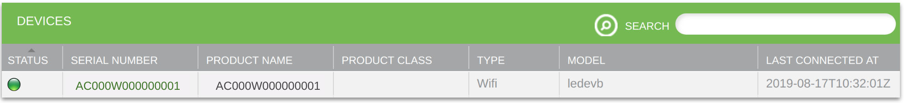

The Ayla Portable Solution consists of software libraries not tied to any specific communication module SDK or chipset. It enables OEMs to extend Ayla connectivity to communication modules not supported by Ayla Integrated Agents, and to pick and choose features to incorporate or omit (e.g. OTA, LAN mode, Wi-Fi setup). <a href="https://www.aylanetworks.com/edge-connectivity" target="_blank">Learn more about the Ayla Portable Agent</a>

# First steps

1. Create an Ayla user account. You will probably need to have your Ayla Customer Account admin or Ayla support create a user account for you with admin or developer access rights. 

1. Reserve a DSN. Browse to [Ayla Dashboard Portal](/system-administration/ayla-dashboard-portal). On the sidebar, navigate to Factory Actions. Click the Reserve DSN button. For Model, select AY008ESP1. Click Submit, and then download the associated XML file. You will need DSN value and the key from the file.

1. Browse to the [Ayla Developer Portal](/system-administration/ayla-developer-portal/), and create a template with the following details.
    <table>
    <tr><td>Visibility:</td><td>private</td></tr>
    <tr><td>Name:</td><td>PDA v2.3.1-beta</td></tr>
    <tr><td>Description:</td><td>PDA v2.3.1-beta</td></tr>
    <tr><td>Registration:</td><td>Dsn</td></tr>
    <tr><td>Model:</td><td>ledevb</td></tr>
    <tr><td>Version:</td><td>pda-http-src-2.3.1-beta</td></tr>
    <tr><td>Type:</td><td>Wifi</td></tr>
    </table>
    After creating the template, copy & paste the following properties into a text file, and import the file.
    <pre>base_type,direction,name,scope
boolean,output,Blue_button,user
boolean,input,Blue_LED,user
string,input,cmd,user
decimal,input,decimal_in,user
decimal,output,decimal_out,user
boolean,input,Green_LED,user
integer,input,input,user
string,output,log,user
integer,output,output,user
string,output,version,user</pre>
    Finally, click the new ```version``` property, check ```Host SW Version```, and click ```OK```.

# Build and Run

## GCC/Ubuntu/Docker

This section provides directions for building an Ayla Portable Solution v2.3.1-beta using a Ubuntu/Docker development environment.

1. Download [Ayla source code](https://connection.aylanetworks.com/s/article/Ayla-Portable-Device-Agent-Source-Code) (pda-http-src-2.3.1-beta.tgz).

1. Install a [Docker Engine](https://docs.docker.com/get-started/) on your computer.

1. Create a Docker [ubuntu](https://hub.docker.com/_/ubuntu) container:

    ```
  $ docker run --net=host --name=pda -w /root -it ubuntu bash
    ```

    You are root, and the current working directory is ```/root```.

1. Prepare your development environment:

    1. Enable multiarch environment (needed to compile Ayla executables):

        ```
# dpkg --add-architecture i386
        ```

    1. Update package list:

        ```
# apt update
        ```

    1. Install packages:

        ```
# apt install nano git build-essential python2.7 python-pip \
iproute2 net-tools wireless-tools iputils-ping rfkill psmisc \
libssl-dev libssl-dev:i386 libavahi-client-dev libavahi-client-dev:i386 libc6-dev-i386
        ```

1. Install Ayla source code:

    1. <span style="color:red;">In a host terminal</span>, copy ```pda-http-src-2.3.1-beta.tgz``` to your Docker container:

        ```
      $ docker cp /home/matt/Downloads/pda-http-src-2.3.1-beta.tgz pda:/root
        ```

    1. In your Docker terminal, extract the archive file, and, optionally, rename the resulting directory:

        ```
      # tar zxvf pda-http-src-2.3.1-beta.tgz
        ```
    
    1. Change directory:

        ```
      # cd pda-http-src-2.3.1-beta
        ```

1. <span style="color:red;">Fix Ayla source code issues</span>:

    1. Fix ```ayla/src/libada/client.c```. Modify ```snprintf``` invocations to check for negative return values:

        ```
      if(snprintf(...) < 0) {
         ;
      }
        ```

        Do this in the following three function definitions:

        * client_close_dp_put
        * client_get_dp_loc_req
        * client_cmd_put_rsp

    1. Fix ```platform/linux/al_net_dns.c```. Add ```#include <signal.h>```.

    1. Fix ```platform/linux/al_net_if.c```. Add the following to the ```al_net_if_get_kind``` function:

        ```
      else if (!memcmp(name, "wlp3s0", 6)) {
         return AL_IF_K_WLAN;
      }
        ```

    1. Fix ```examples/common/demo_cli_client.c```. Change ```if (lr.uri == '\0')``` to ```if (*lr.uri == '\0')```.

1. Configure ```ledevb``` to use your template:

    1. Edit ```examples/ledevb/demo_ledevb.c```.

    1. Search for ```demo_host_version```, and set the template version:

        ```
      static char demo_host_version[] = "pda-http-src-2.3.1-beta";
        ```
    
    1. Save the file.

1. Build the Ayla executables:

    ```
  # make
  # ls -1 ./ayla/bin/native  
  altest
  apptest
  ledevb
  wifisetup
    ```

1. Create a configuration file for ```ledevb```:

    1. <span style="color:red;">In a host terminal</span>, copy the DSN XML file to your Docker container:

        ```
      $ docker cp /home/matt/Downloads/Reserve_JobId_123456/AC000W000000001.xml pda:/root
        ```

    1. In your Docker terminal, generate a configuration file:

        ```
      # pip install rsa
      # python2.7 ./platform/linux/utils/conf-gen.py -k 0123456789abcdef0123456789abcdef -r US ../AC000W000000001.xml 1234abcd ledevb
        ```

        Note the parameters. The last three are positional:
        ```
      -k is the OEM Key/Secret.
      -r is the region (e.g. US, CN, EU).
      AC000W000000001.xml is the DSN file downloaded from Ayla Dashboard Portal.
      1234abcd is the OEM ID.
      ledevb is the OEM Model.
        ```

    1. View the encrypted configuration file:
        
        ```
      # cat /root/.pda/persist.conf
      {
         "factory": {
         "device_dsn": "QUMwMDBXMDA3MTI2ODEx", 
         "device_key": "MIIBC...", 
         "oem_id": "MGJiYjExMmU=", 
         "oem_key": "i/AJ+I7...", 
         "oem_model": "bGVkZXZi", 
         "service_region": "VVM="
      }, 
         "startup": {}
      }
        ```

1. Run ```ledevb```:

    ```
  # ./ayla/bin/native/ledevb
    ```

1. Configure the program for developer mode:

    ```
  PWB ledevb> conf set client/server/default 1
    ```

1. Activate the Ayla Agent which connects ```ledevb``` to an Ayla Cloud account:

    ```
  PWB ledevb> up
    ```

    Output should be similar to the following:

    ```
  [pda] 20:02:59.936 i c client: ada_client_up: IP 192.168.1.6
  PWB ledevb> [pda] 20:02:59.936 i c client: get DSN AC000W000000001
  [pda] 20:03:00.017 i c client: DNS: host ads-dev.aylanetworks.com at 100.25.244.184
  [pda] 20:03:00.424 i c client: module name "AC000W000000001" key 1234567.
  [pda] 20:03:00.424 i c client: listen enabled
  [pda] 20:03:00.504 i c notify: ANS server ans.aylanetworks.com at 54.210.207.229
  [pda] 20:03:00.570 i c client: ANS check event
    ```

    The Ayla Cloud should create a digital twin (in the cloud) with all the properties defined in the template you specified, and it should pair ```ledevb``` with the new digital twin. As indicated in the output above, the unique id of this particular digital twin is ```1234567```, and both the DSN and the default name are ```AC000W000000001```.

## GCC/Windows

Not written yet.

# Register your device

1. Browse to the [Ayla Dashboard Portal](/system-administration/ayla-dashboard-portal), click OEM Users in the sidebar, click your account, and copy your UUID (e.g. ```a0000000-0000-0000-0000-000000000000```). 

1. Click Devices in the sidebar, and find the new device on the list:

    

1. Click the device row. Then, in the Device > Settings table, paste your UUID, and click Register:

    

1. View the device on the Devices list again. Note that the device is registered to you.

    

1. View the device in the Ayla Developer Portal:

    

1. View the device in the Aura Mobile App:
