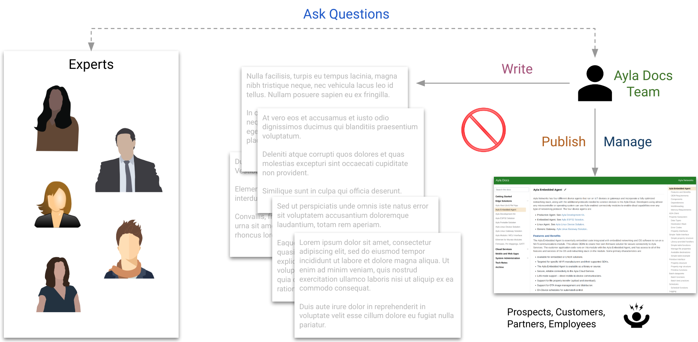
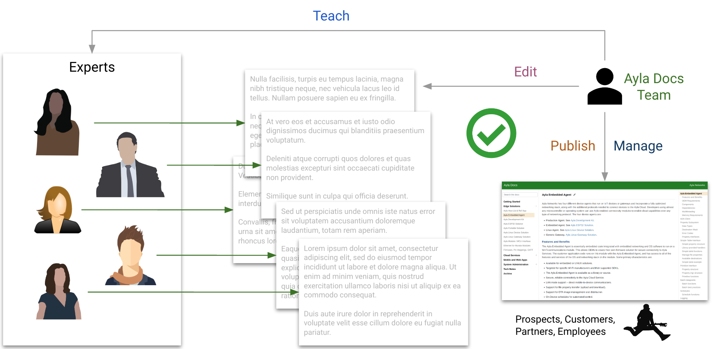

## Enabling SMEs

### Wrong Way

1. Accurate content trickles from SMEs.
1. The Ayla Docs Team writes grammatically correct, less-accurate content slowly, and publishes.
1. Site visitors are frustrated.

### Right Way

1. SMEs write accurate, grammatically marginal, somewhat-disorganized content.
1. The Ayla Docs Team teaches, edits, organizes, publishes, and manages.
1. Site visitors are happy.

