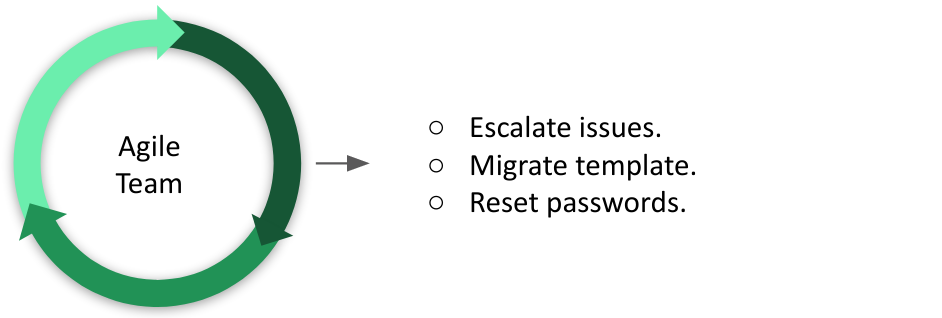
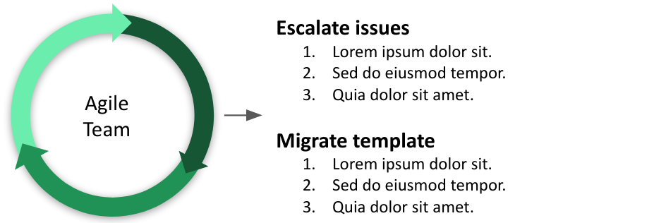
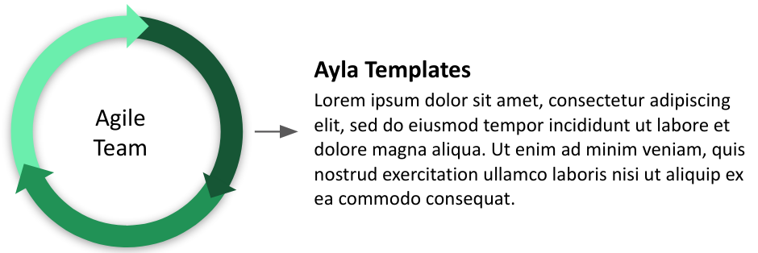
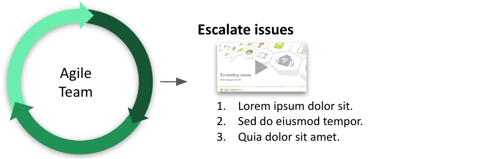
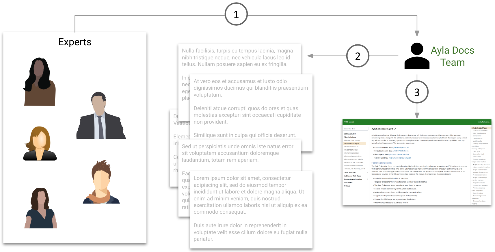
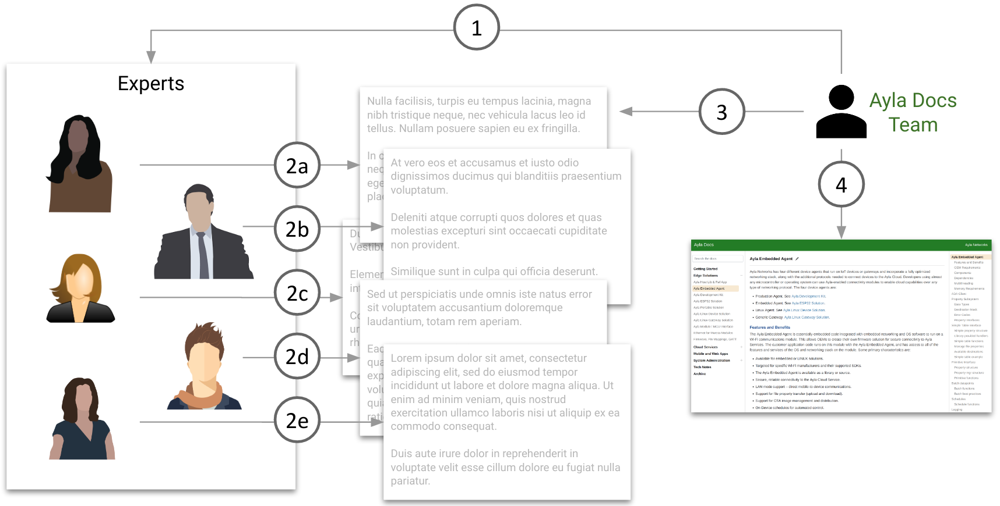

## Creating enablement

In general, [enablement](https://www.lexico.com/en/definition/enablement) is the action of giving someone the means to do something. For Ayla Docs, **someone** refers to Ayla users (prospects, customers, partners, and employees), and **something** refers, in way or another, to leveraging the Ayla Platform. 

Creating Enablement is an agile process that produces focused, maintainable enablement material rapidly:

1. Identify and describe (using [Bloom verbs](https://en.wikipedia.org/wiki/Bloom%27s_taxonomy)) what a user should be **able to do** as a result of enablement:
    

1. Write steps for each task on the provided [Ayla Docs page](https://docs.aylanetworks.com/tech-notes/00000007/). Start each step with a verb or a preposition.
    

1. Identify (using [Bloom verbs](https://en.wikipedia.org/wiki/Bloom%27s_taxonomy)) what a user should **know** in order to perform these tasks, and add definitions, explanations, and links to the page.  Send the page link to the customer, request feedback, and update. The page is useful at this point.
    

1. Repeat Steps 1 through 3 as needed.
1. Optionally, create short videos (1-2 min) for some tasks, and add them to the page:
    

## Direct SME contribution

### Docs Team as bottleneck

1. Information flows from SME to Docs Team.
1. Ayla Docs Team writes and edits.
1. Ayla Docs Team publishes.

### Docs Team as facilitator

1. Guidance flows from technical writer to SME.
1. Information flows from SME to index.md file in Github.
1. Docs Team edits.
1. Docs Team publishes.

