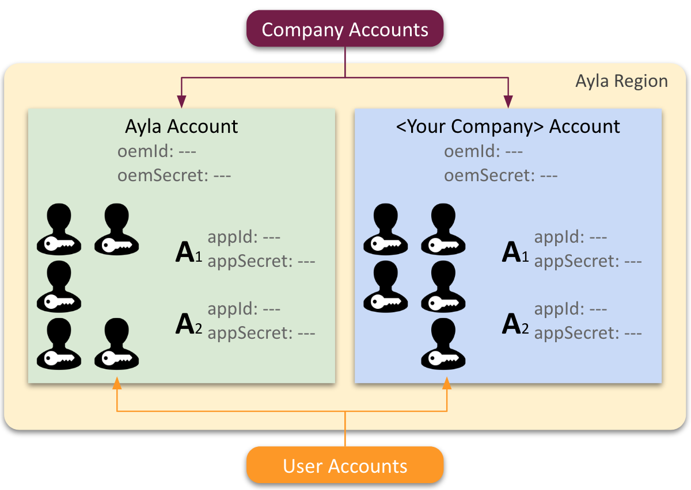

The term "Ayla Account" can refer to a company account or a user account.

### Ayla Account

The Ayla Account is special. Anyone can create a user account in the Ayla Account via the [Ayla Developer Portal](https://docs.aylanetworks.com/apps/ayla-developer-portal/) or the Aura Mobile App for the purpose of experimenting with the [Ayla Developer Kit](../ayla-developer-kit).

### &lt;Your Company&gt; Account

A company account provides full access to Ayla tools and features. 