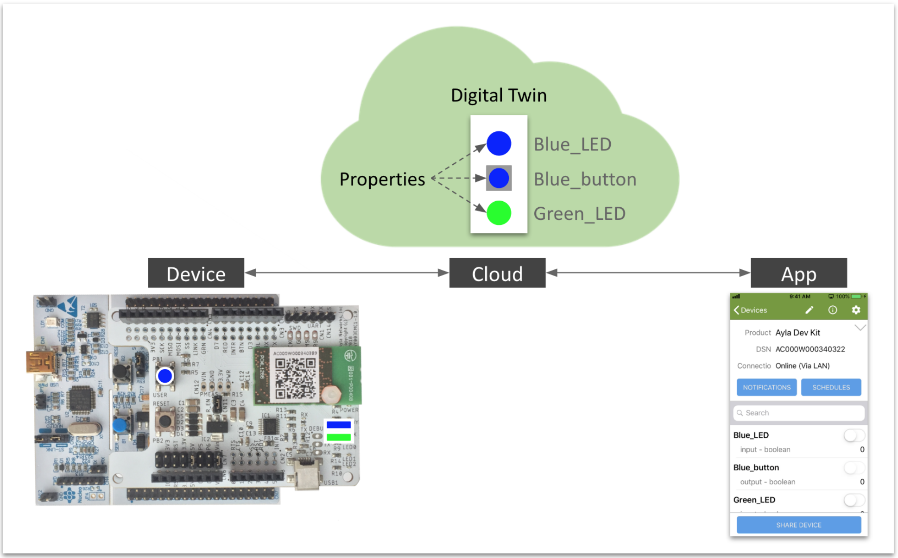

1. When you connect your device to an Ayla Cloud account, Ayla builds a model of your device called a *Digital Twin* composed of properties that capture the essential nature of your device:

The digital twin above includes three properties (Blue_LED, Blue_button, and Green_LED) also noticeable on the device and in the app.
1. A property has, among other attributes, a name, type, and direction:
