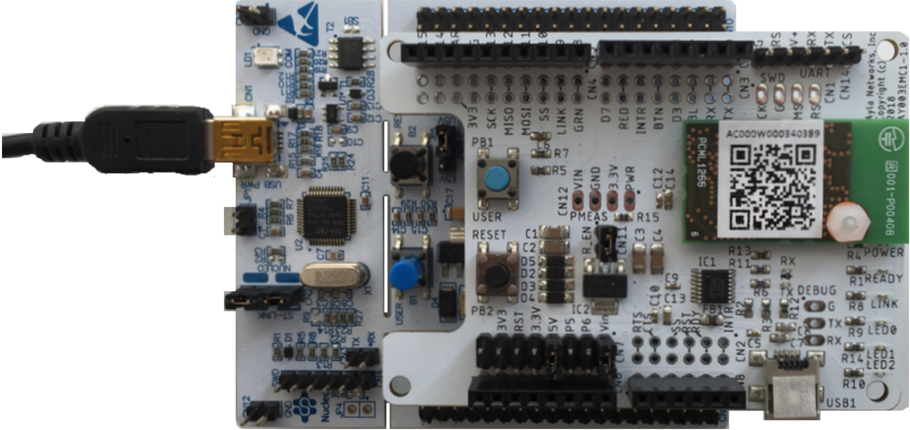
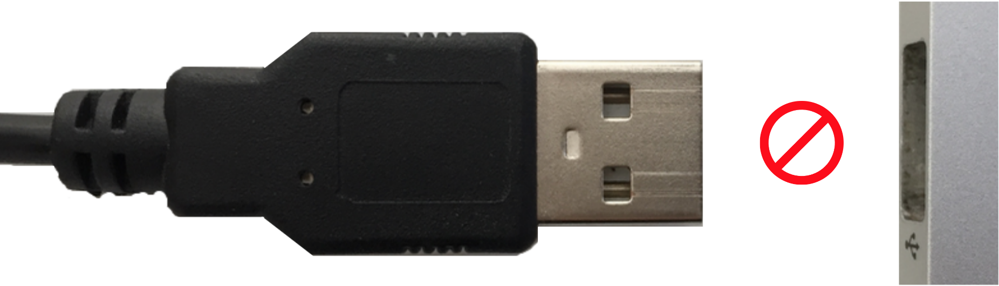
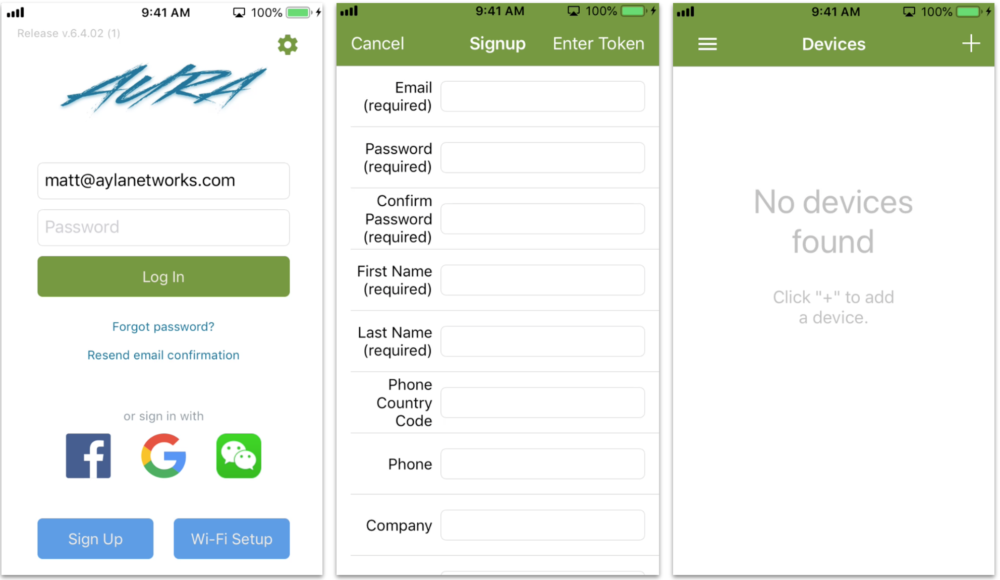
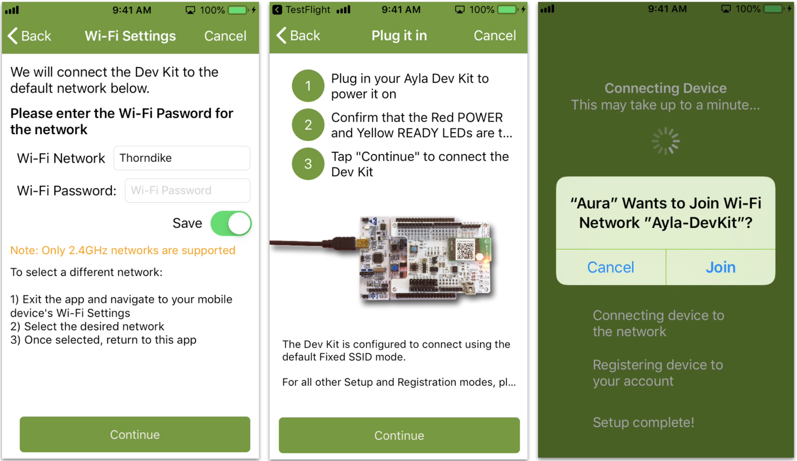
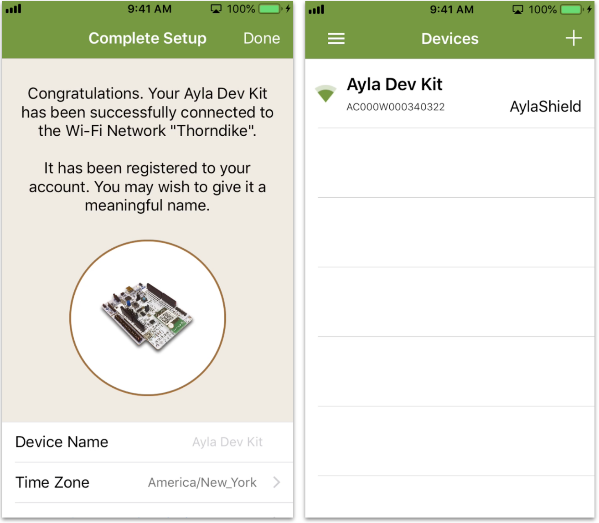

This page helps you connect your Ayla Developer Kit to the Ayla Cloud.

1. Take your Ayla Developer Kit out of the box.
1. Plug the small end of the cable into the kit:

1. Do not power on yet.

1. Download and install the Ayla Aura app from App Store or Google Play onto your mobile device.
1. Tap <code>Sign Up</code>, fill in the form, receive the verification email, and confirm:

1. Tap "+" to add a device, choose Ayla Dev Kit, enter Wi-Fi credentials, and follow directions:

1. Tap Done to see your new device on the Devices list.

1. Click [Explore](../explore).
