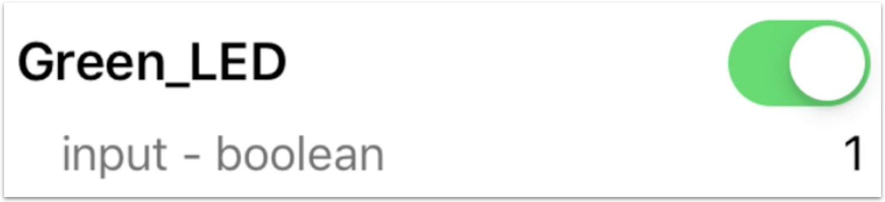
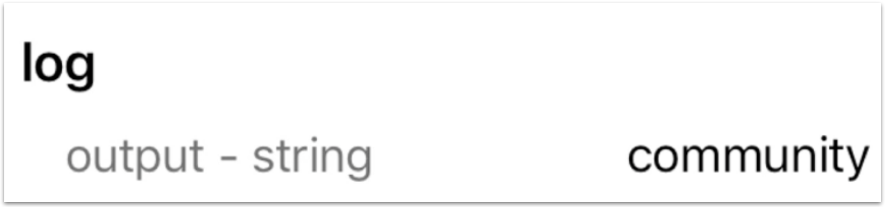
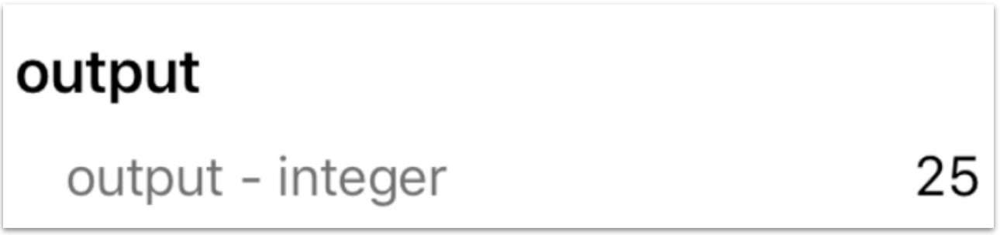

The host app running on the Ayla Dev Kit (the app you will modify in [Customize](../../customize)) defines ...

## Boolean properties

1. Click Ayla Dev Kit on the Aura Devices list:

1. Tap the Blue_LED property slider:

The Blue LED on the dev kit illuminates. Tapping the slider sends an update *to the device*.

1. Tap the Green_LED property slider:

The Green LED on the dev kit illuminates. Tapping this slider also sends an update *to the device*.

1. Press the light-blue button on the Ayla Shield of the dev kit:

The Blue_button property slider slides on.

So, pressing the button on the kit sends an update *from the device*.

## String properties

1. Tap the white space to the right of the cmd property:

1. Enter a string like <code>community</code>, and tap Update Value.

Setting the cmd property sends a string value *to the device*.
1. View the log property:

The host app (on the device) sets <code>log = cmd</code>, and sends the string *from the device*.

## Integer properties

1. Tap the value to the right of the input property:

A dialog box appears.
1. Enter an integer like <code>5</code>, and tap Update Value.

Setting the input property sends an integer value *to the device*.
1. View the output property:

The host app (on the device) sets <code>output = input &#42; input</code>, and sends the integer *from the device*.

## Decimal properties

1. Tap the value to the right of the decimal_in property:

A dialog box appears.
1. Enter a decimal like <code>2.71</code>, and tap Update Value.

Setting the decimal_in property sends a decimal value *to the device*.
1. View the decimal_out property:

The host app (on the device) sets <code>decimal_out = decimal_in</code>, and sends the decimal *from the device*.

## Version property

1. Tap the version property name:

Property details appear:

## File properties

File properties are minimally implemented in the example host application. You set the stream_up_length integer property (To Device) to a value, and the host app sets the stream_up file property (From Device) to a url string.

1. Tap the value to the right of the stream_up_length property:

1. Enter an integer value like <code>10</code>, and tap Update Value.

Setting the stream-up-len property sends an integer value *to the device*.
1. View the stream_up property:

1. Tap the property name to see details:

