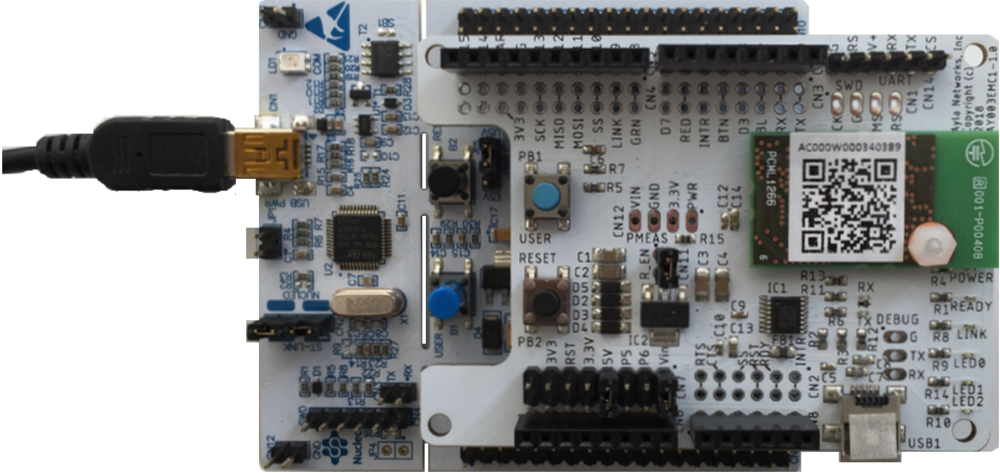
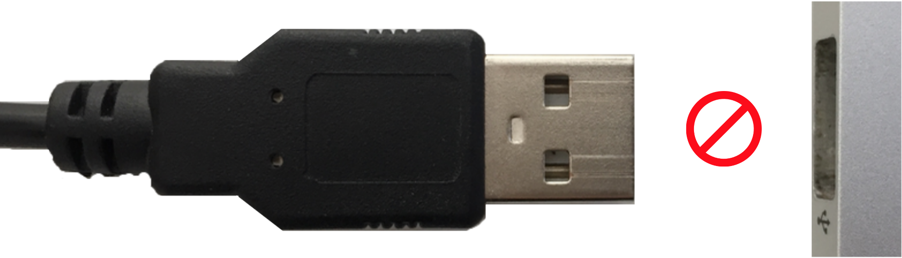
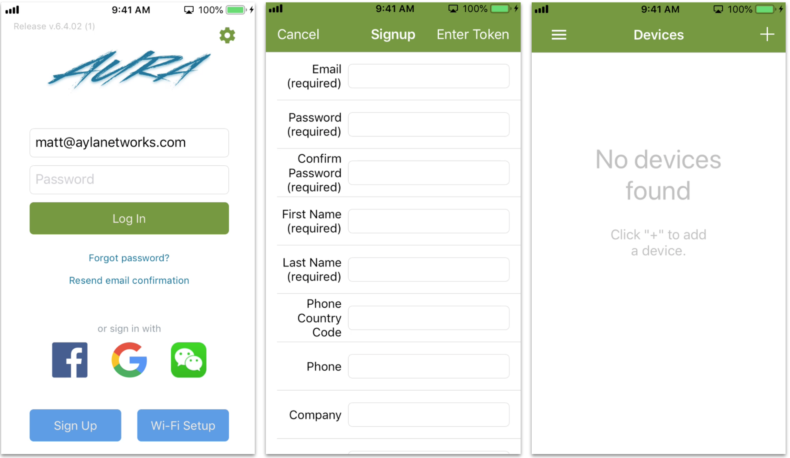
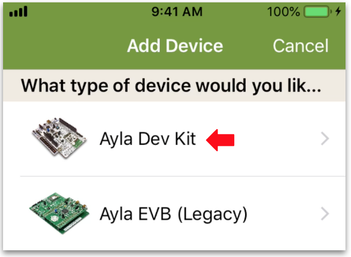
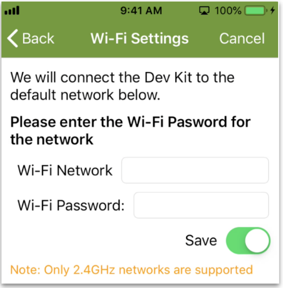
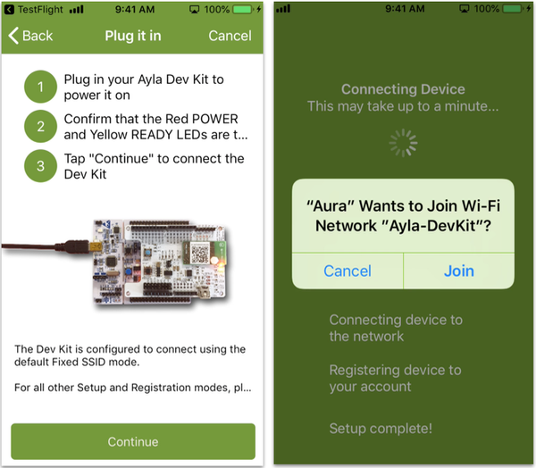
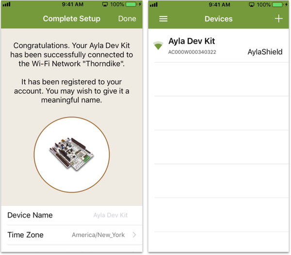

The Ayla Developer Kit enables you to quickly explore the [Ayla IoT Cloud](https://www.aylanetworks.com/) as a user and developer. You can order an [Ayla Developer Kit](https://www.amazon.com/) and a [USB 2.0 A-Male to Mini-B Cable](https://www.amazon.com/AmazonBasics-USB-2-0-Cable-Male/dp/B00NH13S44/ref=sxts_kp?keywords=usb+type+b&pd_rd_i=B00NH13S44&pd_rd_r=d7322804-b9d2-4e0d-84f0-07e0f04b1b5d&pd_rd_w=nNpl4&pd_rd_wg=M7eIi&pf_rd_p=9e1f8218-b1c6-41ee-b8db-ab27d6c0f6de&pf_rd_r=DAD4Q395EY2EZ1QS1D1F&qid=1551889936&s=gateway) from Amazon. The directions below apply to new dev kits only. If you are reconfiguring a dev kit for use on a different LAN, see [Change LANs](user-guide/change-lans). If you are moving a dev kit from one Ayla account to another, see [Change Accounts](user-guide/change-accounts).

Connecting your Ayla Developer Kit to the Ayla Cloud requires only a few steps:

1. Take your Ayla Developer Kit out of the box.
1. Plug the small end of the cable into the kit:

1. Do not power on yet.

1. Connect your mobile app to a LAN.
1. Download and install the Ayla Aura Mobile App from App Store or Google Play onto your mobile device.
1. Tap <code>Sign Up</code>, fill in the form, receive the verification email, and confirm:

1. Tap "+" to add a device:

1. Tap Ayla Dev Kit:

1. Enter the same Wi-Fi credentials as those used by your mobile device:

1. Tap Continue.

1. Plug in your dev kit, tap continue, and then tap Join:

Aura will find your device, connect it to the network, and register it.
1. Tap Done to see your new device on the Devices list.

1. Click User Guide &gt; [Introduction](user-guide/introduction).
