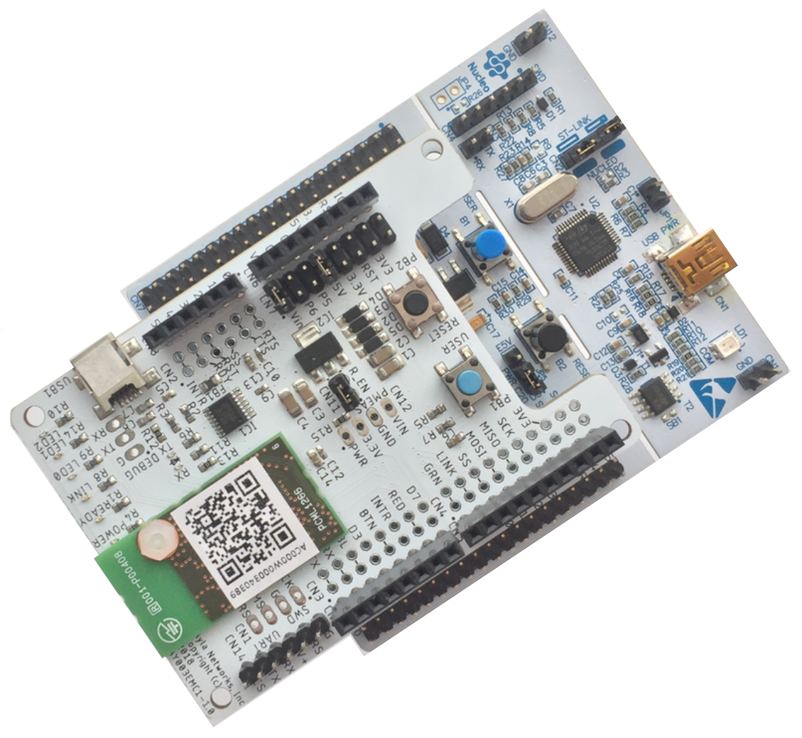

The Ayla Developer Kit enables you to quickly explore the [Ayla IoT Cloud](https://www.aylanetworks.com/) as a user and developer.

You can order an [Ayla Developer Kit](https://www.amazon.com/) and a [USB 2.0 A-Male to Mini-B Cable](https://www.amazon.com/AmazonBasics-USB-2-0-Cable-Male/dp/B00NH13S44/ref=sxts_kp?keywords=usb+type+b&pd_rd_i=B00NH13S44&pd_rd_r=d7322804-b9d2-4e0d-84f0-07e0f04b1b5d&pd_rd_w=nNpl4&pd_rd_wg=M7eIi&pf_rd_p=9e1f8218-b1c6-41ee-b8db-ab27d6c0f6de&pf_rd_r=DAD4Q395EY2EZ1QS1D1F&qid=1551889936&s=gateway) from Amazon. Then, click [Connect](connect).
