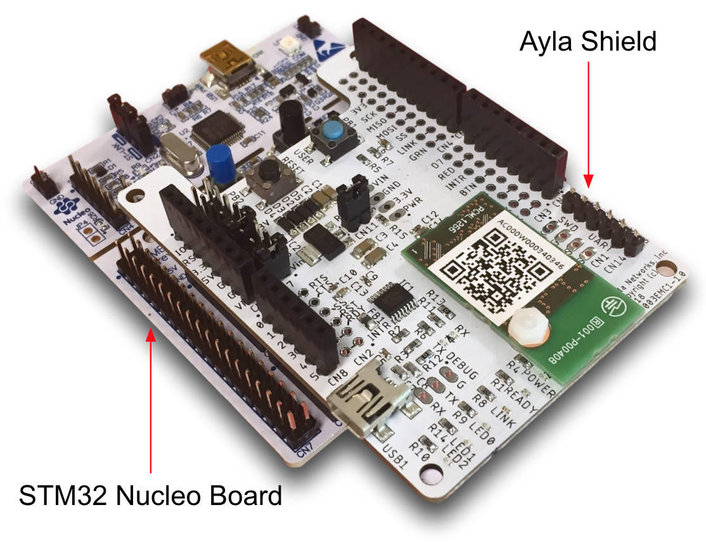
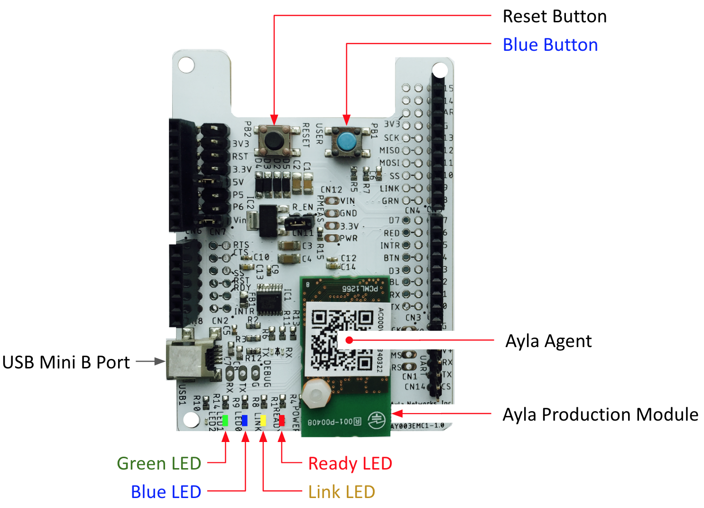

The Ayla Design Kit consists of a [STM32 Nucleo Board](https://www.digikey.com/product-detail/en/stmicro/NUCLEO-F303RE/497-15105-ND/5052640&?gclid=EAIaIQobChMI8OT89a6E4QIVQtbACh3BJQLNEAkYBCABEgLKl_D_BwE) with an Ayla Shield on top:

The Ayla Shield includes the following landmarks:

1. The Reset Button ...
1. The Blue Button ...
1. The Ayla Production Module ...
1. The Ayla Agent ...
1. The USB Mini B Female Port ...
1. The Ready LED ...
1. The Link LED ...
1. The Blue LED ...
1. The Green LED ...

For details about the host board, click [STM32 Nucleo-64 Evaluation Board User Manual](https://www.st.com/content/ccc/resource/technical/document/user_manual/98/2e/fa/4b/e0/82/43/b7/DM00105823.pdf/files/DM00105823.pdf/jcr:content/translations/en.DM00105823.pdf).