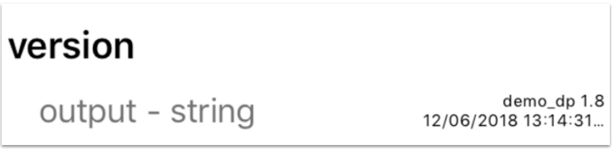

This page introduces you to Ayla properties, schedules, and notifications. First, tap *Ayla Dev Kit* on the Devices screen.  

## Properties

Note the list of properties (e.g. Blue_LED, Blue_button) at the bottom of the screen. Ayla sees any device (including your dev kit) as a set of boolean, string, integer, decimal, and/or file properties. Specific to the dev kit, these particular properties help demonstrate Ayla functionality.

### Boolean properties

1. Tap the Blue_LED property slider:

The Blue LED on the dev kit illuminates. Tapping the slider sends an update *to the device*.

1. Tap the Green_LED property slider:

The Green LED on the dev kit illuminates. Tapping this slider also sends an update *to the device*.

1. Press the light-blue button on the Ayla Shield of the dev kit:

The Blue_button property slider slides on.

So, pressing the button on the kit sends an update *from the device*.

### String properties

1. Tap the white space to the right of the cmd property:

1. Enter a string like <code>community</code>, and tap Update Value.

Setting the cmd property sends a string value *to the device*.
1. View the log property:

The host app (on the device) sets <code>log = cmd</code>, and sends the string *from the device*.
1. Tap the version property name:

The Property Details screen displays three property attributes:

The *Current Value* attribute represents the host (application) software version because another attribute (not seen on this screen), <code>host_sw_version</code>, is set to <code>true</code>. The name <code>version</code> is non-essential.

### Integer properties

1. Tap the value to the right of the input property:

A dialog box appears.
1. Enter an integer like <code>5</code>, and tap Update Value.

Setting the input property sends an integer value *to the device*.
1. View the output property:

The host app (on the device) sets <code>output = input &#42; input</code>, and sends the integer *from the device*.

### Decimal properties

1. Tap the value to the right of the decimal_in property:

A dialog box appears.
1. Enter a decimal like <code>2.71</code>, and tap Update Value.

Setting the decimal_in property sends a decimal value *to the device*.
1. View the decimal_out property:

The host app (on the device) sets <code>decimal_out = decimal_in</code>, and sends the decimal *from the device*.

### File properties

The *stream_up* and *stream_down* properties are of type *file*. The following steps demonstrate their use with the aid of three integer properties: *stream_up_len*, *stream_down_len*, and *stream_down_len_match*.

1. Set *stream_up_len* to 100000:

## Schedules

1. Ensure that the Blue_LED property is off.
1. Tap the Schedules button on the Device screen.

The Schedules screen appears with one pre-made schedule:

1. Tap the pre-made schedule, and configure the following fields:
<table>
<tr><th>Field</th><th>Value</th></tr>
<tr><td>Start Time</td><td>A time within minutes of now.</td></tr>
<tr><td>End Time</td><td>A time one minute after the start time.</td></tr>
</table>
1. Note that the Schedule Actions are already set. 
1. Tap *Save Schedule* at the bottom of the screen
1. Observe the scheduled event between the start and end times.

## Notifications

A notification is a user-defined trigger associated with the condition of a device or property, the mode of notification (text, email, push notification), and the message itself. Tap the *Notifications* button to get started:

### Property Notifications

1. Tap "+".
1. Tap "Property notification".
1. Configure the following fields:
<table>
<tr><th>Field</th><th>Value</th></tr>
<tr><td>Notification Name</td><td>Green LED Changed</td></tr>
<tr><td>Notification Message</td><td>The Green LED changed.</td></tr>
<tr><td>Condition</td><td>When Green_LED has Changed.</td></tr>
<tr><td>Send push notification to this device</td><td>&#10003;</td></tr>
</table>
1. Tap *Save Notifications*.
1. Turn on/off Green_LED. See a push notification similar to the following:

1. Uncheck *Send push ...*, and save again.

### Device Notifications

Note: I need to verify this section.

1. Tap "+".
1. Tap "Device notification".
1. Configure the following fields:
<table>
<tr><th>Field</th><th>Value</th></tr>
<tr><td>Notification Name</td><td>Ayla Dev Kit A Lost Connection</td></tr>
<tr><td>Event</td><td>on_connection_lost</td></tr>
<tr><td>Threshhold</td><td>30 (seconds)</td></tr>
<tr><td>Notification Message</td><td>Ayla Dev Kit A Lost Connection</td></tr>
<tr><td>Send push notification to this device</td><td>&#10003;</td></tr>
</table>
1. Tap *Save Notifications*.
1. Disconnect the Ayla Dev Kit, and wait for .... See a push notification similar to the following:
<!--  -->
1. Uncheck *Send push ...*, and save again.
