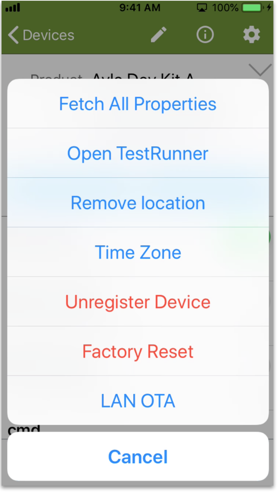

## How to reconfigure your device after moving it from one LAN to another

1. Tap the device name to select it on the Devices screen:

1. Tap the Gear. The Device Actions screen appears:

1. Tap *Factory Reset*. The following message appears. Click OK.

1. Unplug your device.
1. Return to the Devices screen.
1. Tap "+" to add a device.
1. Tap *Ayla Dev Kit*.
1. Enter the Wi-Fi information, and tap Continue.
1. Follow directions. Your device will appear as active. 

