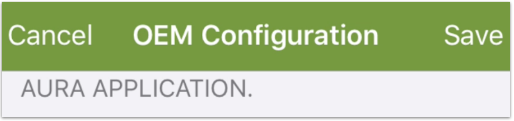

When you move your user account and devices from the Ayla Public Account to an Ayla Customer Account, you need to configure Aura to access the new account:

Here are the steps for iOS users:

<ol>
<li>Log into your Ayla Customer Account via the [Ayla Dashboard Portal](/apps/ayla-dashboard-portal/).</li>
<li>Click OEM Profile in the sidebar.</li>
<li>Click Apps in the horizontal menu.</li>
<li>Create an app configuration named Aura.</li>

The configuration will be assigned an Application ID and an Application Secret:

<li>In a text editor, create a file called <code>&lt;mycompany&gt;.auraconfig</code>, and copy & paste the following into the file:
<pre>
{
  "appId": "",
  "appSecret": "",
  "name": "My Company Name",
  "serviceLocation": "USA",
  "serviceType": "Development"
}
</pre>
</li>
<li>Copy & paste your Application ID and Application Secret into the file, customize the other fields, and save.</li>
<li>Email the file as an attachment to yourself.</li>
<li>Open the email on your mobile device.</li>

<li>Tap to Download.</li>
<li>Hard-press the <code>Tab to Download</code> window to reveal share options:</li>

<li>Click <code>Copy to Aura</code>. Aura should indicate success:</li>

<li>Click <code>Save</code> in Aura:</li>

<li>Log into Aura with the email address and password associated with your Ayla Customer account.</li>
</ol>