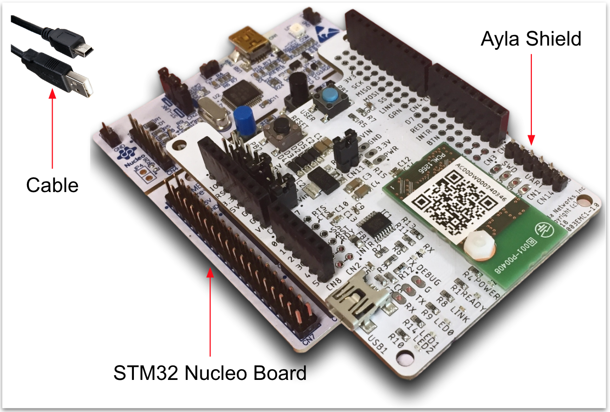

The Ayla Development Kit helps you explore the [Ayla IoT Cloud](https://www.aylanetworks.com/) as a user and developer. 

To obtain a kit, email <code>support&#64;aylanetworks.com</code> with the subject <code>Ayla Development Kit</code>.

The kit consists of a [STM32 Nucleo Board](https://www.digikey.com/product-detail/en/stmicro/NUCLEO-F303RE/497-15105-ND/5052640&?gclid=EAIaIQobChMI8OT89a6E4QIVQtbACh3BJQLNEAkYBCABEgLKl_D_BwE) with an Ayla Shield, and a USB 2.0 A-Male to Mini-B Cable.

The kit runs a host application on the Nucleo board MCU, and an Ayla agent on the [Ayla Production Module](/devices/ayla-production-modules) on the Ayla Shield:

The host app is a reference implementation that you can download, modify, flash, run, and port. See [Developer Guide](developer-guide) and [Porting Guide](porting-guide).

The Ayla Shield includes the following features:

The host app and the Ayla agent expose properties via the Ayla Cloud to authenticated clients such as [Aura Mobile App](/apps/aura-mobile-app), an Ayla tool used by developers to test connected devices:

See the sidebar for the following:

* [User Guide](user-guide) shows you how to connect the kit to the Ayla Cloud, and use the kit to explore Ayla. It also defines account, region, device, gateway, digital twin, template, property, datapoint, schedule, and several other Ayla terms.
* [Programmer Guide](programmer-guide) helps you download and modify host application source code.
* [Porting Guide](porting-guide) provides instructions for porting the host application to different chipsets.
* [Reference](reference) contains API docs. 