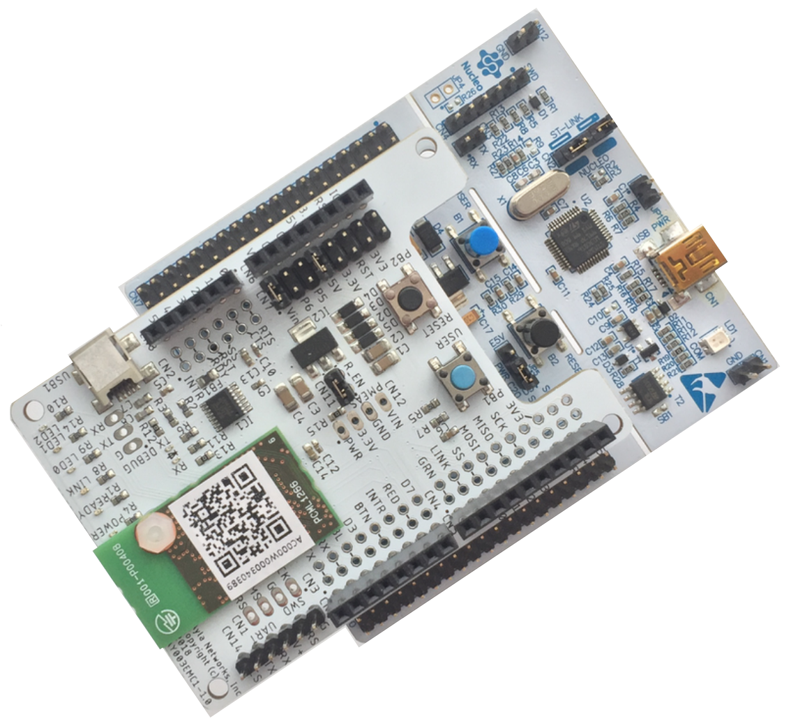

This page provides instructions for manufacturing the Ayla Shield-based Developer Kit (model number AY003EMK1)

The page includes the following sections:

1. Introduction
1. Workstation Setup
1. Final Assembly

# Introduction

The Ayla Shield-based Developer Kit consists of a fully assembled Ayla Shield circuit board attached to a [STM32 Nucleo-64 development board with STM32F303RE MCU](https://www.st.com/en/evaluation-tools/nucleo-f303re.html):

<figure style="margin-left:24px;">
  
  <figcaption style="font-size:90%;color:#404040;">Figure 1: Ayla Shield-based Developer Kit</figcaption>
</figure>

# Workstation Setup

# Final Assembly