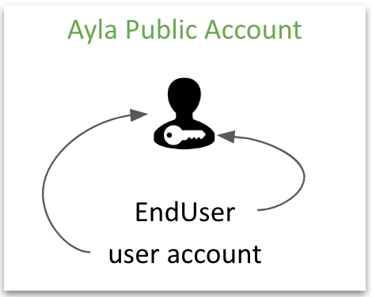
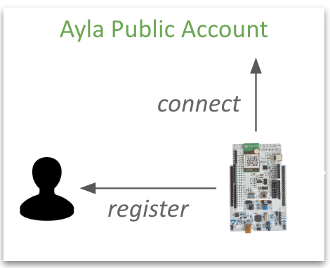
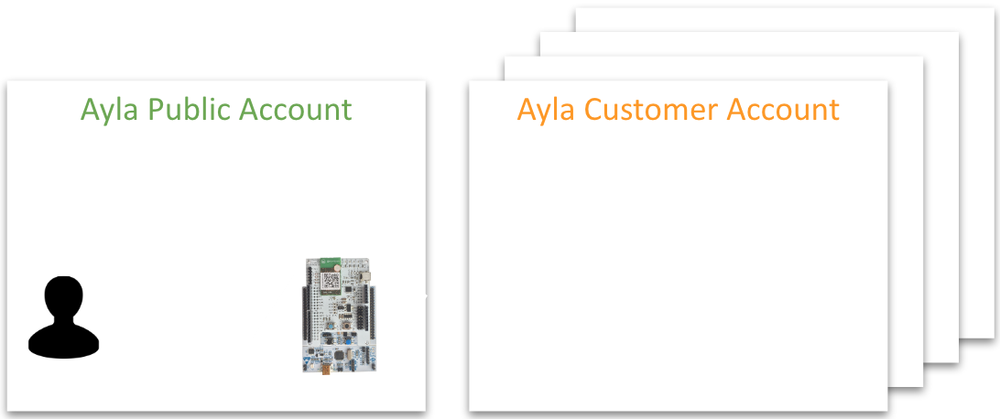
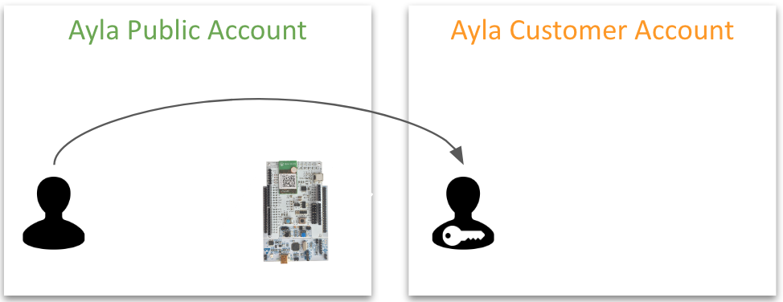
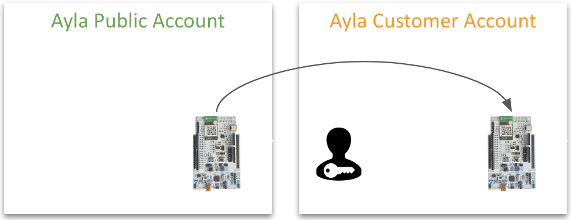
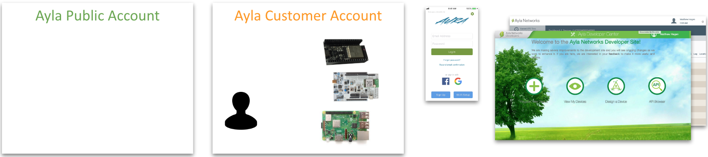
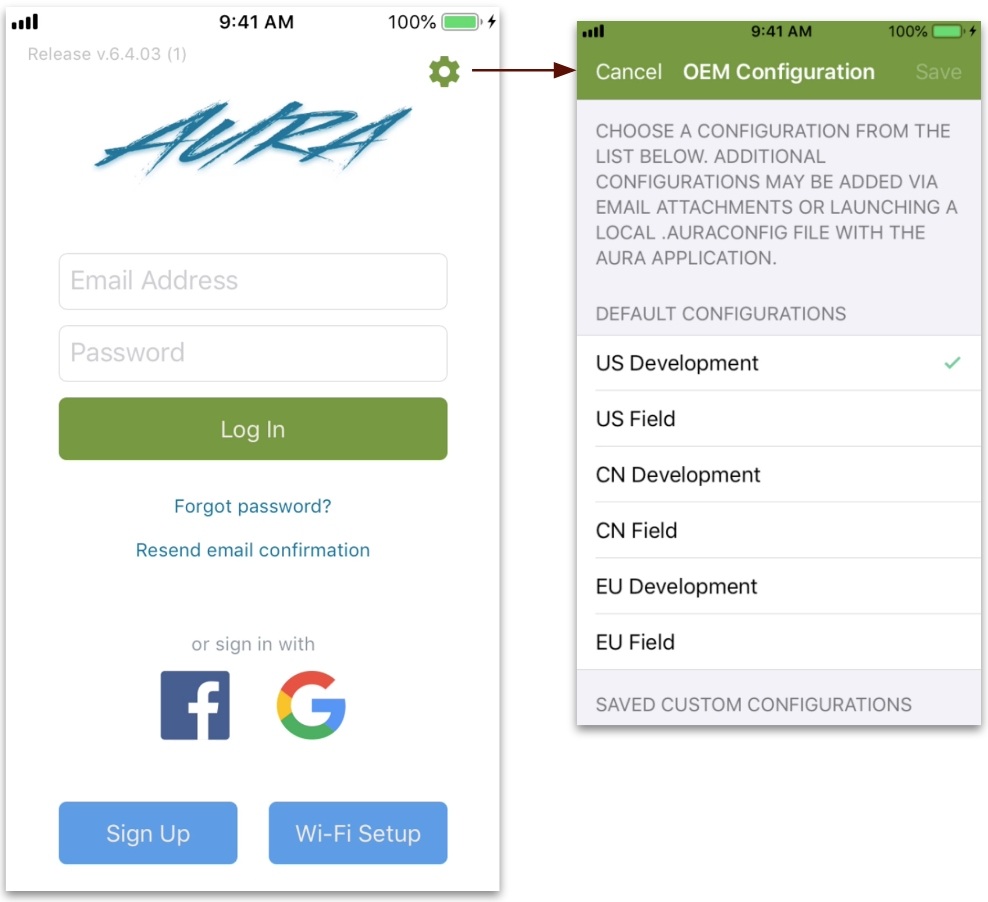
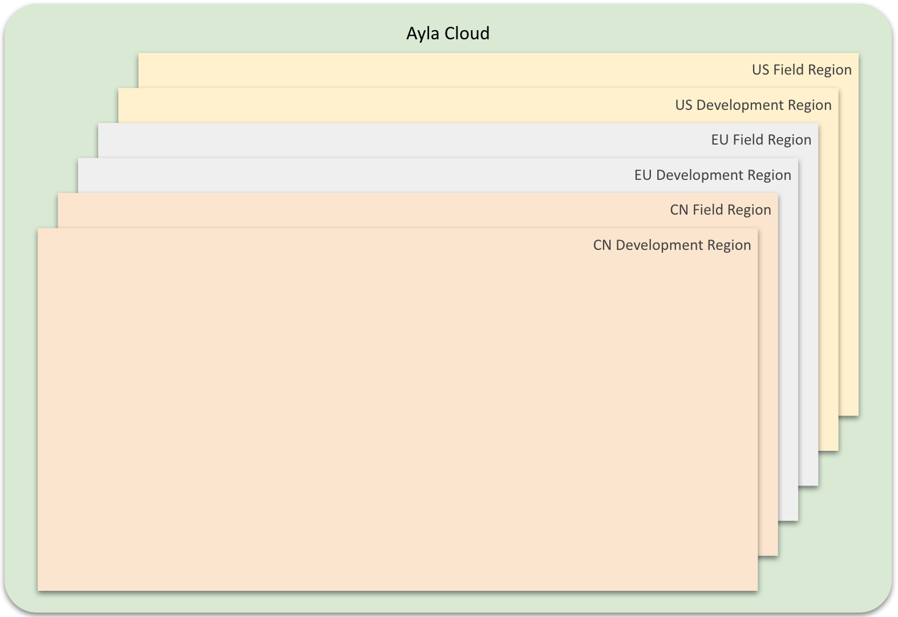
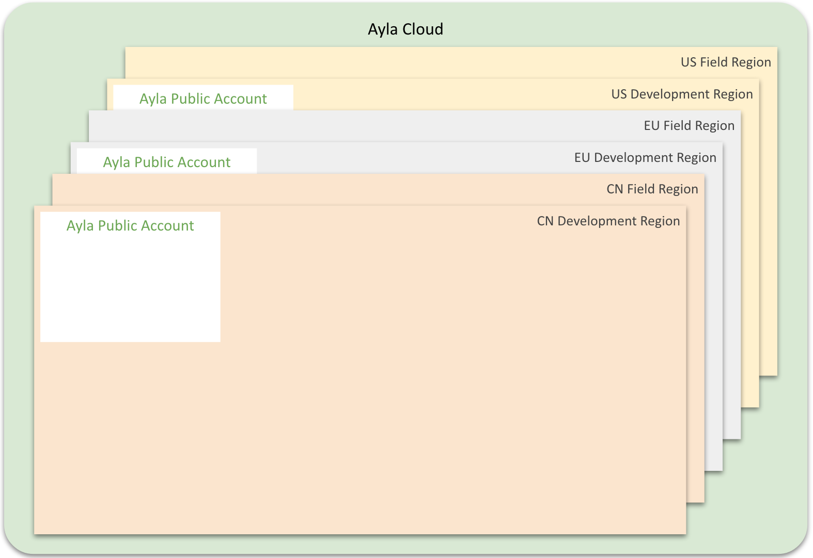
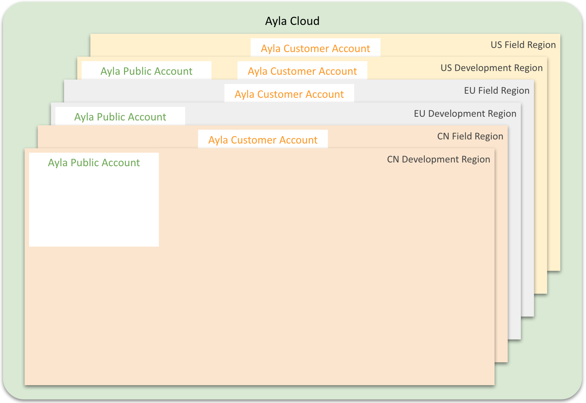

This page explains Ayla accounts and regions.

## Accounts

The [Connect](../connect) page describes how to use the [Aura Mobile App](../aura-mobile-app) to create a user account in the Ayla Public Account.

It also describes how to connect your Ayla Dev Kit to the Ayla Public Account, and how to register the kit to your user account:

The Ayla Public Account enables you to experiment (to a certain extent) with your Ayla Dev Kit. 

Ayla actually has two types of cloud accounts: The Ayla Public Account and a set of Ayla Customer Accounts:

When you want to do more with your Ayla Dev Kit, or you want to connect other types of devices, the Ayla Professional Services team can create a customer account for your company, migrate your user account, and grant you additional access rights:

(Contact pro.services&#64;aylanetworks.com).

Then, you can migrate your dev kit:

Ayla Customer Accounts unlock additional Ayla functionality and device variety:

## Regions

The [Aura Mobile App](../aura-mobile-app) login screen includes a Gear icon leading to a Configuration screen listing default configurations:

Ayla divides the world into the US, CN, and EU centers as seen on the list (i.e. United States, China, and Europe) for reasons of proximity and security. It further divides each of these centers into regions: development and field. 

The Ayla Public Account is available in development regions:

An Ayla Customer Account might span several regions:

