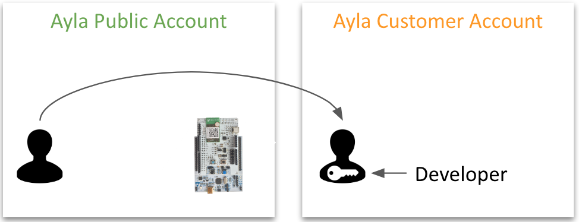
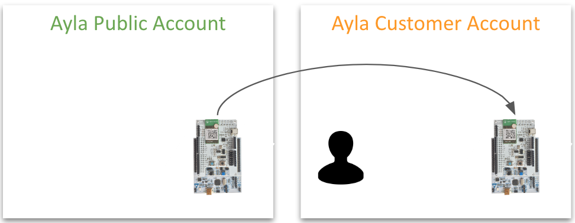

## Accounts

1. Before connecting a device to the Ayla Cloud, you create an Ayla *user* account in an Ayla *cloud* account:

1. Typically, you start by creating a [user account](https://developer.aylanetworks.com/registrations/new) with *EndUser* access rights in the Ayla Public Account:

1. The Ayla Public Account is available to everyone. In it, you can experiment with an [Ayla Development Kit](/getting-started/ayla-development-kit), [Ayla on an ESP32 Dev Kit](/getting-started/ayla-on-an-esp32-dev-kit), [Ayla on a Raspberry Pi](/getting-started/ayla-on-a-raspberry-pi), and/or other device. You *connect* your device to the cloud account, and you *register* the device to your user account:

1. You use the [Aura Mobile App](/apps/aura-mobile-app) and the [Ayla Developer Portal](/apps/ayla-developer-portal) to work with your device(s):

1. When you are ready, Ayla creates a dedicated cloud account for your company, migrates your user account, and increases your user rights:

1. Then, you migrate your device(s):

1. And, you start using the Ayla Dashboard Portal to manage your company account:

## Regions

1. Ayla divides the world into three centers: China, Europe, and the United States. Centers are further divided into development and field regions:

1. The Ayla Public Account is available in development regions:

1. An Ayla Customer Account might span several regions:

