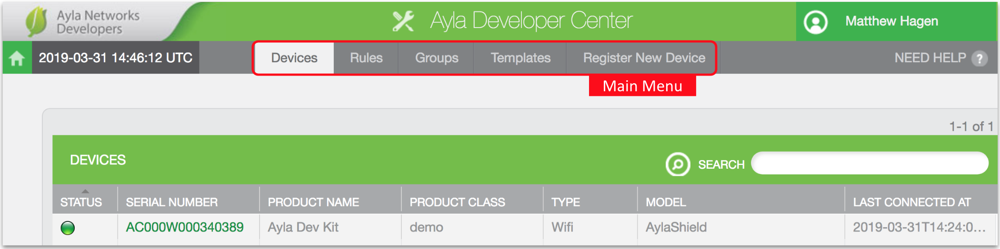
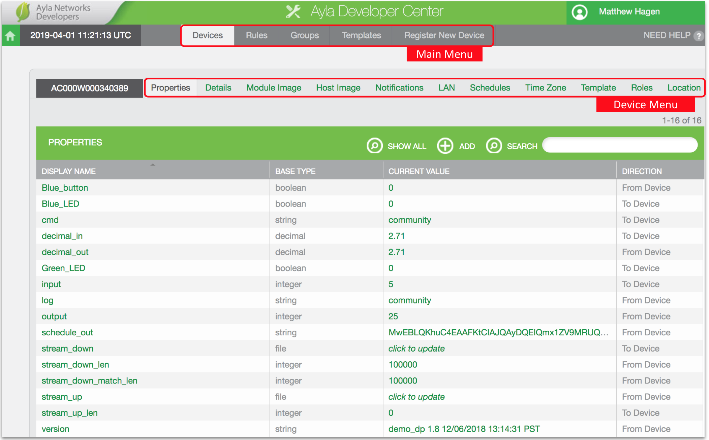

In addition to the [Aura Mobile App](/apps/aura-mobile-app), Ayla provides two web portals for device management, [Ayla Developer Portal](/apps/ayla-developer-portal) and [Ayla Dashboard Portal](/apps/ayla-dashboard-portal), illustrated in the diagram below:

The diagram also shows two other <u>device</u> options for exploring the Ayla Cloud: [Ayla on an ESP32 Dev Kit](/getting-started/ayla-on-an-esp32-dev-kit) and [Ayla on a Raspberry Pi](/getting-started/ayla-on-a-raspberry-pi). 

**Important**: Access rights associated with Ayla user accounts govern the availability of portal features. The sign-up procedure on the [Connect](../connect) page, for example, yields a user account with limited (EndUser) access rights. See [Accounts and Regions](../accounts-and-regions) to learn more.

## Ayla Developer Portal

This section provides a brief tour of relevant [Ayla Developer Portal](/apps/ayla-developer-portal) capabilities.

1. Browse to the [Ayla Developer Portal](/apps/ayla-developer-portal), log in, and click View My Devices. The Main Menu appears with the Devices tab active:

1. Click the Serial Number of your dev kit. The Device Menu appears with the Properties tab active:

You can click on any property's Current Value to change it.
1. Click Blue_LED. The Property Menu appears with the Details tab active:

1. Click the Datapoints tab. A datapoints list appears similar to the Aura screen seen [here](../properties). A datapoint is a time-stamped property value.

1. Note the Notifications and Triggers tabs:

Notifications are synonymous with Aura Device Notifications. Triggers are the same as Aura Property Notifications.
1. Click the Device Details tab:

The SW Version refers to the version of the Ayla Agent software running on the [Ayla Production Module](/devices/ayla-production-modules) on the Ayla Shield of the dev kit. The Host SW Version refers to the version of the host application running on the Nucleo board MCU of the dev kit. 

## Ayla Dashboard Portal

This section provides a brief tour of relevant [Ayla Dashboard Portal](/apps/ayla-dashboard-portal) capabilities.
